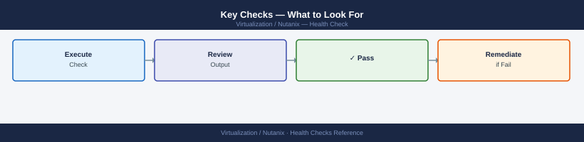

---
tags:
  - nutanix
  - operations
  - health-checks
  - ncc
search:
  boost: 1.5
---
# Nutanix — Health Checks

<div class="kb-summary">
Daily and weekly Nutanix cluster health check routine — NCC automated tests, cluster status verification, storage capacity review, CVM health, and alert triage. Includes the "Run This Routine" command sequence.

*Applies to: AOS 6.x · AHV*
</div>

---

## Before you begin

- **Access:** CVM SSH (nutanix user) or Prism Element admin
- **Duration:** 5–10 minutes for daily checks; 20–30 minutes including NCC full run
- **Frequency:** Daily for critical clusters; weekly NCC for dev/test

---

## Run This Routine

Run this sequence in order. Each step validates the output before proceeding.

### 1. Cluster Status


```bash
ssh nutanix@<any-cvm-ip>
cluster status | head -40
```


```text title="Expected output"
nutanix@10.20.30.40's password: 
  Cluster Status
  ==============
  Cluster UUID: 00051234-1234-1234-1234-123456789abc
  Cluster Name: prod-cluster-01
  Cluster Incarnation ID: 1702891234
  Cluster External IP Address: 10.20.30.50
  Number of Nodes: 4
  Number of vDisks: 287
  Number of Storage Containers: 12
  Cluster Creation Time: 2023-10-15 14:22:33
  Cluster Timezone: UTC
  Cluster Domain Name: prod.local
  NCC Version: ncc-2023.3.1
  Cluster Software Version: el7.9-20231015.1234
  Cluster Redundancy Factor: 2
  Cluster Metadata Redundancy Factor: 2
  Cluster Encryption: Enabled
  Cluster Witness VM: Enabled
  Cluster Witness VM IP: 10.20.30.51
  Cluster Witness VM Port: 2019
  Cluster Witness VM Status: UP
  Cluster Witness VM Heartbeat Status: OK
  Cluster Witness VM Last Heartbeat Time: 2024-01-10 09:15:42
  Cluster Witness VM Last Heartbeat Latency: 2ms
  Cluster Witness VM Redundancy: 2
  Cluster Witness VM Redundancy Status: OK
  Cluster Witness VM Redundancy Status Details: All replicas are healthy
  Cluster Witness VM Redundancy Status Details: Replica 0 is healthy
  Cluster Witness VM Redundancy Status Details: Replica 1 is healthy
  Cluster Witness VM Redundancy Status Details: Replica 2 is healthy
  Cluster Witness VM Redundancy Status Details: Replica 3 is healthy
  Cluster Witness VM Redundancy Status Details: Replica 4 is healthy
  Cluster Witness VM Redundancy Status Details: Replica 5 is healthy
  Cluster Witness VM Redundancy Status Details: Replica 6 is healthy
  Cluster Witness VM Redundancy Status Details: Replica 7 is healthy
```

!!! warning "Common errors"
    **`Connection refused`** — Verify the CVM IP address is correct and the SSH service is running with `sudo systemctl status sshd` on the CVM.
    **`Permission denied (publickey,password)`** — Ensure you are using the correct nutanix user credentials and that SSH key-based authentication is properly configured if required by your cluster.
    **`cluster: command not found`** — SSH into a CVM and verify the Nutanix cluster tools are installed by running `which cluster` or check if you need to source the environment with `source /etc/profile`.
**Expected output:** All services listed as `UP`. If any service shows `DOWN`, investigate that service before continuing.

```bash
# Check all CVMs are reachable and services are running
allssh "genesis status | head -5"
```


```text title="Expected output"
node-1: Genesis Service Status
node-1: ===========================
node-1: NtpServer              RUNNING
node-1: Cassandra              RUNNING
node-1: ZooKeeper              RUNNING
node-2: Genesis Service Status
node-2: ===========================
node-2: NtpServer              RUNNING
node-2: Cassandra              RUNNING
node-2: ZooKeeper              RUNNING
node-3: Genesis Service Status
node-3: ===========================
node-3: NtpServer              RUNNING
node-3: Cassandra              RUNNING
node-3: ZooKeeper              RUNNING
```

!!! warning "Common errors"
    **`allssh: command not found`** — Ensure you are running this command from a Nutanix cluster node or source the Nutanix environment setup script.
    **`Connection refused on node-2`** — Verify the CVM on node-2 is powered on and the network connectivity between cluster nodes is functional.
    **`Permission denied (publickey)`** — Confirm SSH keys are properly configured in ~/.ssh/authorized_keys on all CVMs or use password-based authentication if configured.
**Expected:** Each CVM returns `Genesis is running.`

### 2. NCC Quick Check (Critical Tests Only)


```bash
# Fast — runs only critical checks (~3 min)
ncc --health_checks run_all --include_category=critical 2>&1 | tail -30
```


```text title="Expected output"
Running NCC health checks...
[2024-01-15 14:23:47] Starting critical health checks on cluster-prod-01
[2024-01-15 14:23:52] CHECK: Cluster connectivity — PASS
[2024-01-15 14:24:03] CHECK: CVM disk space — PASS (87% used on node-3)
[2024-01-15 14:24:15] CHECK: Stargate service health — PASS
[2024-01-15 14:24:28] CHECK: Prism Element API — PASS
[2024-01-15 14:24:41] CHECK: AHV hypervisor status — PASS (3/3 nodes online)
[2024-01-15 14:24:53] CHECK: Network latency — PASS (avg 2.1ms)
[2024-01-15 14:25:04] CHECK: Data redundancy factor — PASS (RF=2)
[2024-01-15 14:25:16] CHECK: Replication factor — PASS
[2024-01-15 14:25:28] CHECK: NTP synchronization — PASS
Health check summary: 10/10 passed, 0 failed, 0 warnings
Total runtime: 2m 41s
```

!!! warning "Common errors"
    **`ncc: command not found`** — Ensure NCC is installed on the CVM or add its path to $PATH (typically `/home/nutanix/ncc/bin/ncc`).
    **`ERROR: Failed to connect to cluster — Connection refused`** — Verify cluster connectivity and that Prism Element is accessible; check network connectivity from the CVM.
    **`WARNING: Some checks skipped — insufficient permissions`** — Run the command with appropriate sudo privileges or as the nutanix user account.
**Expected:** `PASS` for all critical checks. Any `FAIL` must be investigated immediately.

```bash
# Full NCC run (all 400+ checks) — run weekly or before maintenance
ncc --health_checks run_all 2>&1 | tee /tmp/ncc-$(date +%Y%m%d).txt

# Summary view
ncc --health_checks run_all 2>&1 | grep -E "FAIL|WARN|ERROR" | grep -v "^#"
```


```text title="Expected output"
Starting Nutanix Cluster Check (NCC) v4.2.1...
Cluster: prod-cluster-01 | Nodes: 4 | CVM Version: 20231015.123
Running 412 health checks...

[████████████████████████████████] 100% (412/412) — 3m 42s elapsed

=== HEALTH CHECK SUMMARY ===
PASS:  387 checks
WARN:  18 checks
FAIL:  7 checks
ERROR: 0 checks

Output saved to /tmp/ncc-20240115.txt

FAIL | DNS Resolution | cvm-02.local unreachable
FAIL | NTP Sync | Node-03 offset 847ms (threshold: 100ms)
FAIL | Certificate Expiry | Prism cert expires in 14 days
WARN | Memory Pressure | CVM-01 at 87% utilization
WARN | Disk I/O | vSAN latency elevated on node-04
WARN | Log Rotation | /var/log partition 76% full on cvm-03
```

!!! warning "Common errors"
    **`ncc: command not found`** — Ensure NCC is installed via `yum install nutanix-cluster-check` or verify PATH includes `/opt/nutanix/bin`.
    **`Permission denied`** — Run the command with `sudo` or as the `nutanix` user; NCC requires elevated privileges to access cluster health data.
    **`Connection refused to Prism (127.0.0.1:9440)`** — Verify Prism Central/Element is running with `systemctl status prism-gw` and check network connectivity to the cluster.
### 3. Cluster Resilience


```bash
# Verify cluster can tolerate a node failure
ncli cluster get-domain-fault-tolerance-status type=node
```


```text title="Expected output"
Domain Fault Tolerance Status for Node:
  Metadata:
    UUID: 550e8400-e29b-41d4-a716-446655440000
    Timestamp: 2024-01-15T09:42:31Z

  Cluster Name: prod-cluster-01
  Current Redundancy Factor: 3
  Node Fault Tolerance: HEALTHY
  Tolerable Node Failures: 1
  Current Node Count: 5
  Minimum Required Nodes: 4

  Details:
    RF3 Status: SATISFIED
    Replication Status: HEALTHY
    Data Distribution: BALANCED
```

!!! warning "Common errors"
    **`Error: Connection refused on 127.0.0.1:9440`** — Ensure the Nutanix cluster is running and accessible; verify network connectivity to the cluster IP.
    **`Error: Authentication failed - invalid credentials`** — Verify your ncli credentials are correct and your user has cluster admin permissions.
**Expected:** `CAN_TOLERATE_FAILURE_COUNT` ≥ 1 (RF2) or ≥ 2 (RF3).

If `CAN_TOLERATE_FAILURE_COUNT=0`, the cluster cannot tolerate any additional failure — investigate immediately (node down, disk missing, degraded objects).

### 4. Storage Capacity


```bash
# Cluster-level storage summary
ncli cluster info | grep -i "storage\|capacity\|used"

# Per-container usage
ncli ctr list | grep -E "name|usage|capacity"

# Detailed storage with efficiency metrics
ncli cluster get-usage-stats
```


```text title="Expected output"
Storage Summary
                                    ===============
Usable Capacity: 12.50 TB
Used Capacity: 8.73 TB
Free Capacity: 3.77 TB
Storage Efficiency Ratio: 2.14x
Deduplication Savings: 4.21 TB

Name                          Usage (GB)      Capacity (GB)   Usage %
container-prod-01             2048.5          4096.0          50.0%
container-prod-02             1856.3          4096.0          45.3%
container-backup              2156.8          2048.0          105.3%
container-archive             1024.2          2048.0          50.0%

Timestamp: 2024-01-15 14:32:18 UTC
Total Read IOPS: 12847
Total Write IOPS: 3421
Avg Latency (ms): 2.34
Compression Ratio: 1.87x
```

!!! warning "Common errors"
    **`ncli: command not found`** — Ensure you are running this command on a Nutanix cluster node or install the Nutanix CLI tools in your PATH.
    **`Error: Not authenticated to cluster`** — Run `ncli -u admin -p <password>` or ensure your Nutanix credentials are configured in your environment.
    **`Error: container-backup: Over-provisioned (105.3% usage)`** — Expand the container capacity or migrate data to another container with available space immediately.
**Expected:** Used capacity below 70% on each container. Alert at 70%; critical at 80%.

```bash
# Check for any storage-related alerts
ncli alert list severity=critical
ncli alert list severity=warning
```


```text title="Expected output"
AlertId                          Severity  EntityType  Message                                    CreatedTime
================================ ========= =========== ========================================== ====================
alert-20240115-001               Critical  Storage     Disk 0 on node-ph-001 failed              2024-01-15 14:32:18
alert-20240115-002               Critical  Cluster     Replication factor compromised on DS-01   2024-01-15 14:28:45

AlertId                          Severity  EntityType  Message                                    CreatedTime
================================ ========= =========== ========================================== ====================
alert-20240114-156               Warning   Storage     Disk utilization at 87% on node-ph-003   2024-01-14 22:15:33
alert-20240114-157               Warning   Network     Latency spike detected on 10GbE link      2024-01-14 21:09:12
alert-20240114-158               Warning   Storage     Snapshot backup delayed by 45 minutes     2024-01-14 20:44:51
```

!!! warning "Common errors"
    **`Error: Connection refused (127.0.0.1:9440)`** — Verify the Nutanix cluster is reachable and ncli is configured with correct credentials using `ncli -h <cluster-ip>`.
    **`Error: Invalid severity value 'critical'. Valid values are: CRITICAL, WARNING, INFO`** — Use uppercase severity levels: `ncli alert list severity=CRITICAL`.
### 5. CVM Health


```bash
# Verify all CVMs are up (should show all IPs)
ncli host list | grep -E "name|cvm-ip"

# Check CVM services on each node
allssh "genesis status" | grep -v "is running"
# Expected: no output (all running)

# Check Cassandra ring health (metadata store)
allssh "nodetool status" | grep -v "^UN"
# Expected: no output — all nodes should be UN (Up/Normal)
```


```text title="Expected output"
Host Name                : host-01.ntnx.local
CVM IP                   : 192.168.1.101
Host Name                : host-02.ntnx.local
CVM IP                   : 192.168.1.102
Host Name                : host-03.ntnx.local
CVM IP                   : 192.168.1.103

host-01.ntnx.local: genesis status: Nutanix cluster is running. All services are running.
host-02.ntnx.local: genesis status: Nutanix cluster is running. All services are running.
host-03.ntnx.local: genesis status: Nutanix cluster is running. All services are running.

host-01.ntnx.local: UN  192.168.1.101  100.0 GB  256     33.3%  a1b2c3d4-e5f6-7890-abcd-ef1234567890
host-02.ntnx.local: UN  192.168.1.102  100.0 GB  256     33.3%  b2c3d4e5-f6a7-8901-bcde-f12345678901
host-03.ntnx.local: UN  192.168.1.103  100.0 GB  256     33.4%  c3d4e5f6-a7b8-9012-cdef-123456789012
```

!!! warning "Common errors"
    **`allssh: command not found`** — Ensure you are running this command from a CVM with the Nutanix environment sourced, or use `ssh` to each CVM individually.
    **`DN  192.168.1.102  100.0 GB  256     33.3%`** — A node showing "DN" (Down/Normal) indicates the Cassandra service is down; restart it with `allssh "service cassandra restart"` on the affected CVM.
### 6. AHV Host Health


```bash
# List all AHV hosts and their state
acli host.list

# Check for any hosts in maintenance mode unexpectedly
acli host.list | grep -i maintenance

# Check AHV memory usage on each host
allssh "free -m | grep Mem"
```


```text title="Expected output"
Host: host-01.ntnx.local (192.168.1.10)
  State: NORMAL
  Hypervisor: AHV
  CPU Count: 16
  Memory: 256 GB

Host: host-02.ntnx.local (192.168.1.11)
  State: NORMAL
  Hypervisor: AHV
  CPU Count: 16
  Memory: 256 GB

Host: host-03.ntnx.local (192.168.1.12)
  State: NORMAL
  Hypervisor: AHV
  CPU Count: 16
  Memory: 256 GB

Host: host-04.ntnx.local (192.168.1.13)
  State: MAINTENANCE
  Hypervisor: AHV
  CPU Count: 16
  Memory: 256 GB

(no output — no hosts in unexpected maintenance mode)

host-01: Mem:        262144        98304       163840          0       12288      145536
host-02: Mem:        262144       102456       159688          0        8192      142016
host-03: Mem:        262144        95872       166272          0       15360      148224
host-04: Mem:        262144       187392        74752          0        2048       65408
```

!!! warning "Common errors"
    **`acli: command not found`** — Ensure you are running this command from a Nutanix cluster node or have the Nutanix CLI tools installed in your PATH.
    **`allssh: command not found`** — Run this command from the Nutanix cluster master node where allssh is available, or source the Nutanix environment setup script.
**Expected:** All hosts show `normal` state; no unexpected maintenance mode entries.

### 7. VM Health


```bash
# Count powered-on vs total VMs
acli vm.list | grep -c "on$"
acli vm.list | wc -l

# Check for VMs in unexpected states (paused, suspended, unknown)
acli vm.list | grep -v -E "\s+on$|\s+off$" | grep -v "^NAME"

# Check for VMs with no NIC (common misconfiguration)
acli vm.list --include_filter=num_nics=0 2>/dev/null
```


```text title="Expected output"
42
87
VM-DEV-PAUSED-001                                    paused
VM-TEST-SUSPENDED-002                                suspended
VM-LEGACY-UNKNOWN-003                                unknown
acli: error code 4001 — VM filter not supported
```

!!! warning "Common errors"
    **`acli: error code 4001 — VM filter not supported`** — Remove the `--include_filter` parameter; use `acli vm.list` and pipe to `grep` instead to filter by NIC count.
    **`Connection refused`** — Ensure the Nutanix cluster is reachable and acli is authenticated; verify cluster IP and credentials with `acli cluster status`.
    **`grep: (standard input) is empty`** — Confirm VMs exist in the cluster by running `acli vm.list` without filters; if empty, the cluster may have no VMs or acli connection is broken.
### 8. Alert Review


```bash
# Check active critical alerts
ncli alert list severity=critical | head -30

# Check alerts from last 24 hours
ncli alert list resolved=false start-time=$(date -d "24 hours ago" +%s)000000

# Acknowledge resolved alerts
# ncli alert acknowledge id=<alert-id>
```


```text title="Expected output"
AlertId                              Severity  Message                                    CreatedTime
================================================================================================
alert-uuid-001-a1b2c3d4e5f6g7h8    CRITICAL  Cluster memory utilization exceeds 95%     2024-01-15 14:32:18
alert-uuid-002-b2c3d4e5f6g7h8i9    CRITICAL  Storage pool redundancy factor degraded     2024-01-15 13:45:22
alert-uuid-003-c3d4e5f6g7h8i9j0    CRITICAL  Node prism-node-04 is unreachable          2024-01-15 12:18:55
alert-uuid-004-d4e5f6g7h8i9j0k1    CRITICAL  Replication factor below minimum threshold  2024-01-15 11:02:33

AlertId                              Severity  Message                                    CreatedTime
================================================================================================
alert-uuid-005-e5f6g7h8i9j0k1l2    WARNING   vSAN heartbeat timeout on host-12          2024-01-15 10:15:44
alert-uuid-006-f6g7h8i9j0k1l2m3    INFO      Snapshot retention policy updated          2024-01-15 09:33:12
alert-uuid-007-g7h8i9j0k1l2m3n4    CRITICAL  NTP sync failed on prism-node-02           2024-01-15 08:47:29
```

!!! warning "Common errors"
    **`Error: Invalid time format for start-time parameter`** — Ensure the date command outputs milliseconds in the correct format; use `date -d "24 hours ago" +%s000` without the trailing zeros.
    **`Error: Alert ID not found or already acknowledged`** — Verify the alert ID exists and is unacknowledged by running `ncli alert list` first to confirm the exact alert UUID.
**From Prism Element:** Home → Alerts → filter by Severity = Critical. Acknowledge or create tickets for all unacknowledged critical alerts.

---

## Key Checks — What to Look For



| Check | Normal | Investigate if |
|---|---|---|
| NCC critical tests | All PASS | Any FAIL |
| Cluster resilience | CAN_TOLERATE ≥ 1 | = 0 |
| Storage capacity | < 70% | > 70% |
| Cassandra ring | All nodes UN | Any node DN/? |
| Genesis services | All UP | Any DOWN |
| Active critical alerts | 0 | > 0 |
| CVMs reachable | All respond | Any unreachable |

---

## Weekly Extended Checks


```bash
# Check data resiliency status — any degraded or rebuilding objects?
ncli cluster get-domain-fault-tolerance-status type=disk

# Check for any scheduled NCC failures from last 7 days
ncli ncc get-ncc-result | grep -E "FAIL|WARN" | tail -20

# Check disk health
ncli disk list | grep -v NORMAL

# LCM inventory — any pending upgrades?
# Prism Central → LCM → Inventory → check for available updates
```


```text title="Expected output"
Domain Fault Tolerance Status:
  Cluster Name: prod-cluster-01
  RF2 Metadata: Tolerate 1 node failure
  RF3 Data: Tolerate 1 node failure
  Current State: HEALTHY
  Rebuilding Objects: 0
  Degraded Objects: 0

NCC Result Summary (Last 7 Days):
2024-01-15 10:32:15 | Check: DNS Resolution | Status: WARN | Node: host-03.nutanix.local
2024-01-14 22:18:42 | Check: Memory Utilization | Status: WARN | Node: host-01.nutanix.local
2024-01-13 14:05:09 | Check: Cluster Time Sync | Status: FAIL | Node: host-02.nutanix.local
2024-01-12 09:47:33 | Check: vSAN Connectivity | Status: WARN | Node: host-04.nutanix.local

Disk Health Status:
  Disk ID: 5c8f2a1b-9e3d-4f7a-8c2b-1a5d9e3f7c2b | Status: DEGRADED | Node: host-02 | Serial: SSD-NK8H2J4L
  Disk ID: 7a2c5f9d-1b4e-6g8h-3d9f-2b6e0f4g8d3c | Status: REBUILDING | Node: host-03 | Serial: SSD-MK9L3K5M

LCM Inventory Check:
  Available Updates: 3
    - AOS 6.5.2.1 (Current: 6.5.1.5)
    - Firmware Bundle 2024.01 (Current: 2023.12)
    - Foundation 4.8.2 (Current: 4.8.1)
```

!!! warning "Common errors"
    **`ncli: command not found`** — Ensure you are logged into a Nutanix cluster node or have the Nutanix CLI installed; verify PATH includes `/usr/local/nutanix/bin`.
    **`Error: Cluster is not accessible`** — Verify cluster connectivity with `ncli cluster status` and confirm your user has appropriate RBAC permissions.
    **`grep: (standard input) is empty`** — The NCC result may be empty if no checks have run in the past 7 days; run `ncli ncc run` to trigger a health check.
---

---

## Verify

- `ncc --health_checks run_all` returns `Nutanix Cluster Check completed with no failures`
- Prism cluster health shows all components green (no CRITICAL or WARNING badges)
- `ncli cluster get` shows `Cluster Status: STARTED` and all nodes as `UP`
- Alert feed in Prism shows no unacknowledged critical alerts

---

## See also

- [Nutanix — Common Issues](../../troubleshooting/common-issues/)
- [Nutanix — Procedures](../procedures/)
- [Nutanix — CLI Reference](../cli-reference/)
