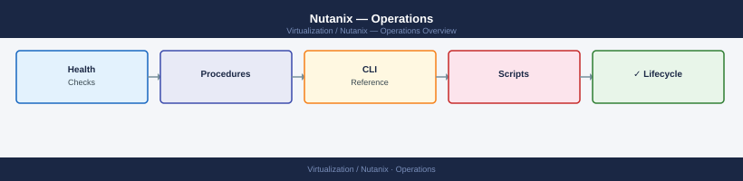

# Nutanix — Operations

Day-to-day operations for Nutanix HCI — health monitoring, administrative procedures, backup and restore, CLI reference, and automation scripts. Covers both Prism Element and CLI-based operations.

*Applies to: AOS 6.x · AHV*

  <a class="kb-card" href="health-checks/">
    <strong>Health Checks</strong>
    Daily and weekly cluster health routine — NCC checks, resilience, storage capacity, CVM and AHV host health.
  </a>
  <a class="kb-card" href="procedures/">
    <strong>Procedures</strong>
    Maintenance mode, LCM upgrades, adding/removing nodes, cloning VMs, snapshot management, protection domains.
  </a>
  <a class="kb-card" href="cli-reference/">
    <strong>CLI Reference</strong>
    Complete ncli, acli, ncc, allssh, genesis, nodetool, and curator_cli command reference.
  </a>
  <a class="kb-card" href="backup-restore/">
    <strong>Backup & Restore</strong>
    Native snapshots, Protection Domain replication, Nutanix DR policies, Veeam, and HYCU integration.
  </a>
  <a class="kb-card" href="scripts/">
    <strong>Scripts</strong>
    Reusable scripts for health snapshots, NCC automation, storage reports, VM inventory, and maintenance helpers.
  </a>

