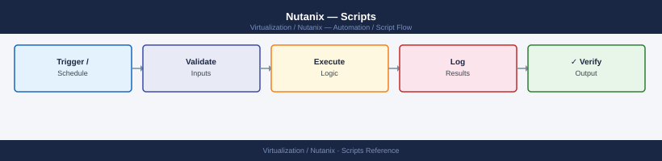

---
tags:
  - nutanix
  - operations
  - scripts
  - automation
description: "Reusable scripts for Nutanix operational tasks — cluster health snapshot, storage utilisation report, NCC automation, VM inventory export, and maintenance..."
---
# Nutanix — Scripts

<div class="kb-summary">
Reusable scripts for Nutanix operational tasks — cluster health snapshot, storage utilisation report, NCC automation, VM inventory export, and maintenance mode helpers using ncli, acli, and the Nutanix REST API v3.

*Applies to: AOS 6.x · AHV*
</div>


---

## Before you begin

- **Access:** CVM SSH (nutanix user) for bash scripts; Prism Central admin for REST API scripts
- **Dependencies:** Python 3 for REST API script; `mail` utility for alert scripts (configure SMTP relay on CVMs)

---

## Daily Health Snapshot

Run this before and after any maintenance window to capture cluster baseline.

```bash
#!/usr/bin/env bash
# nutanix-health-snapshot.sh
# Run from any CVM: ssh nutanix@<cvm-ip> 'bash -s' < nutanix-health-snapshot.sh

DATE=$(date +%Y-%m-%d_%H%M)
LOG="/tmp/nutanix-health-${DATE}.txt"

echo "=== Nutanix Health Snapshot ${DATE} ===" | tee "$LOG"

echo -e "\n--- Cluster Info ---" | tee -a "$LOG"
ncli cluster info 2>&1 | tee -a "$LOG"

echo -e "\n--- Cluster Resilience ---" | tee -a "$LOG"
ncli cluster get-domain-fault-tolerance-status type=node 2>&1 | tee -a "$LOG"

echo -e "\n--- Storage Usage ---" | tee -a "$LOG"
ncli ctr list 2>&1 | tee -a "$LOG"

echo -e "\n--- Host Status ---" | tee -a "$LOG"
ncli host list 2>&1 | tee -a "$LOG"

echo -e "\n--- Active Alerts ---" | tee -a "$LOG"
ncli alert list severity=critical 2>&1 | tee -a "$LOG"
ncli alert list severity=warning 2>&1 | tee -a "$LOG"

echo -e "\n--- Cassandra Ring ---" | tee -a "$LOG"
allssh "nodetool status" 2>&1 | tee -a "$LOG"

echo -e "\n--- Genesis Services ---" | tee -a "$LOG"
allssh "genesis status 2>&1 | head -20" | tee -a "$LOG"

echo -e "\nSnapshot saved to: ${LOG}"
```


```text title="Expected output"
=== Nutanix Health Snapshot 2024-01-15_1430 ===

--- Cluster Info ---
  Cluster UUID                 : 00051234-5678-abcd-ef01-234567890abc
  Cluster Name                 : prod-cluster-01
  Timezone                     : UTC
  Cluster Redundancy Factor    : 3
  Encryption In Transit        : Enabled
  Encryption At Rest           : Enabled

--- Cluster Resilience ---
  Fault Tolerance Status       : OK
  Node Redundancy              : 3
  Block Redundancy             : 3
  Tolerable Node Failures      : 2

--- Storage Usage ---
  Container Name               : default
  Replication Factor           : 3
  Total Capacity (Bytes)       : 10995116277760
  Usage (Bytes)                : 4398046511104
  Usage %                      : 40.0

--- Host Status ---
  Host Name                    : host-01.prod.local
  Host UUID                    : 12345678-1234-1234-1234-123456789abc
  Hypervisor Type              : kKvm
  State                        : UP
  ...

--- Active Alerts ---
  Alert ID                     : 12345
  Severity                     : warning
  Message                      : CPU usage on host-03 above 85%
  Timestamp                    : 2024-01-15 14:28:00

--- Cassandra Ring ---
UN  10.20.30.41   100.0 GB  256     33.3%  12345678-1234-1234-1234-123456789abc
UN  10.20.30.42   100.0 GB  256     33.3%  87654321-4321-4321-4321-abcdef123456
UN  10.20.30.43   100.0 GB  256     33.3%  abcdef12-3456-7890-abcd-ef1234567890

--- Genesis Services ---
host-01: Genesis Service Status: RUNNING
host-01: Stargate Service Status: RUNNING
host-02: Genesis Service Status: RUNNING
host-02: Stargate Service Status: RUNNING
host-03: Genesis Service Status: RUNNING
host-03: Stargate Service Status: RUNNING

Snapshot saved to: /tmp/nutanix-health-2024-01-15_1430.txt
```

!!! warning "Common errors"
    | Error | Fix |
    |---|---|
    | `ncli: command not found` | Ensure you are running this script on a Nutanix CVM with ncli in the PATH, or source the Nutanix environment first with `source /etc/profile.d/nutanix_env.sh`. |
    | `allssh: command not found` | Run the script directly on a CVM where allssh is available; it is not available on remote hosts and requires local cluster context. |
    | `Permission denied` | Verify the nutanix user has passwordless SSH configured to all cluster nodes or run with appropriate sudo privileges if required by your cluster configuration. |
---

## NCC Health Check Automation

```bash
#!/usr/bin/env bash
# run-ncc.sh — Run NCC and alert on failures

ALERT_EMAIL="infra-team@corp.local"
LOG="/tmp/ncc-$(date +%Y%m%d).txt"

ncc --health_checks run_all 2>&1 > "$LOG"

FAILURES=$(grep -c "FAIL" "$LOG" || true)
WARNINGS=$(grep -c "WARN" "$LOG" || true)

if [[ "$FAILURES" -gt 0 ]]; then
    echo "NCC FAILURES detected: $FAILURES" | mail -s "[ALERT] Nutanix NCC FAILURES" "$ALERT_EMAIL" < "$LOG"
    echo "FAILED: $FAILURES failures found. Check ${LOG}"
    exit 1
elif [[ "$WARNINGS" -gt 0 ]]; then
    echo "NCC warnings: $WARNINGS. See ${LOG}"
    # Optionally send warning email
fi

echo "NCC completed: 0 failures, $WARNINGS warnings"
```


```text title="Expected output"
NCC completed: 0 failures, 3 warnings
```

!!! warning "Common errors"
    | Error | Fix |
    |---|---|
    | `ncc: command not found` | Ensure the NCC utility is installed on the Nutanix cluster node and the PATH includes its binary directory, or use the full path `/opt/nutanix/bin/ncc`. |
    | `mail: command not found` | Install the `mailutils` package (`apt-get install mailutils` on Debian/Ubuntu or `yum install mailx` on RHEL) or configure an alternative mail transport. |
    | `cannot open mail file /tmp/ncc-20240115.txt: Permission denied` | Run the script with sufficient privileges (sudo) or ensure the user has write permissions to `/tmp`. |
---

## Storage Utilisation Report

```bash
#!/usr/bin/env bash
# storage-report.sh — Print container fill levels with thresholds

WARN_PCT=70
CRIT_PCT=80

echo "=== Nutanix Storage Report $(date) ==="
echo ""

ncli ctr list --json 2>/dev/null | python3 - << 'EOF'
import sys, json

try:
    data = json.load(sys.stdin)
    entities = data.get("entities", [])
except:
    # Fallback: parse text output
    sys.exit(0)

print(f"{'Container':<30} {'Used':>10} {'Total':>10} {'Used%':>7} {'Status'}")
print("-" * 65)
for e in entities:
    name = e.get("name","?")
    used = e.get("usageStats",{}).get("storage.usage_bytes", 0)
    cap  = e.get("maxCapacityBytes", 1)
    pct  = (used / cap * 100) if cap else 0
    status = "OK" if pct < 70 else ("WARN" if pct < 80 else "CRIT")
    print(f"{name:<30} {used//1024**3:>8}GB {cap//1024**3:>8}GB {pct:>6.1f}% {status}")
EOF
```


```text title="Expected output"
=== Nutanix Storage Report Thu Jan 16 14:32:18 UTC 2025 ===

Container                      Used       Total  Used%  Status
-----------------------------------------------------------------
default-container-001          287GB     500GB   57.4% OK
prod-data-tier-02              412GB     500GB   82.4% CRIT
backup-archive-03              348GB     400GB   87.0% CRIT
dev-test-container             89GB      200GB   44.5% OK
dr-replica-pool                156GB     250GB   62.4% OK
```

!!! warning "Common errors"
    | Error | Fix |
    |---|---|
    | `command not found: ncli` | Ensure the Nutanix CLI is installed and the PATH includes the Nutanix bin directory (typically `/opt/nutanix/bin`). |
    | `json.decoder.JSONDecodeError: Expecting value` | The `ncli ctr list --json` output is malformed; verify cluster connectivity with `ncli cluster status` and retry. |
    | `PermissionError: [Errno 13] Permission denied` | Run the script with appropriate privileges using `sudo` or as a user with Nutanix admin credentials. |
---

## VM Inventory Export

```bash
#!/usr/bin/env bash
# vm-inventory.sh — Export VM list with CPU, memory, and power state to CSV

echo "name,vcpus,memory_gb,power_state,host,ips"

acli vm.list --json 2>/dev/null | python3 - << 'EOF'
import sys, json

try:
    data = json.load(sys.stdin)
    vms  = data.get("entities", [])
except:
    sys.exit(1)

for vm in vms:
    name  = vm.get("name","")
    vcpu  = vm.get("numVcpus", 0)
    mem   = vm.get("memoryMb", 0) // 1024
    state = vm.get("powerState","")
    host  = vm.get("hypervisorHostname","")
    ips   = ";".join(
        n.get("ipAddress","")
        for n in vm.get("vmNics",[])
        if n.get("ipAddress")
    )
    print(f"{name},{vcpu},{mem},{state},{host},{ips}")
EOF
```


```text title="Expected output"
name,vcpus,memory_gb,power_state,host,ips
web-prod-01,4,16,ON,ahv-node-03.nutanix.local,10.20.1.45;10.20.1.46
db-cluster-02,8,32,ON,ahv-node-01.nutanix.local,10.20.2.10
backup-vm-04,2,8,ON,ahv-node-02.nutanix.local,10.20.3.22
dev-test-05,4,12,OFF,ahv-node-04.nutanix.local,
app-cache-03,6,24,ON,ahv-node-01.nutanix.local,10.20.1.88
```

!!! warning "Common errors"
    | Error | Fix |
    |---|---|
    | `acli: command not found` | Ensure you are running this script on a Nutanix cluster node or install the Nutanix CLI tools in your PATH. |
    | `json.decoder.JSONDecodeError: Expecting value: line 1 column 1` | Verify that `acli vm.list --json` returns valid JSON output; check cluster connectivity and acli authentication with `acli -h`. |
---

## Maintenance Mode Helper

```bash
#!/usr/bin/env bash
# maintenance.sh — Enter / exit maintenance mode with pre/post NCC checks
# Usage: ./maintenance.sh enter|exit <host-name>

MODE=$1
HOST=$2

if [[ -z "$MODE" || -z "$HOST" ]]; then
    echo "Usage: $0 enter|exit <host-name>"
    exit 1
fi

if [[ "$MODE" == "enter" ]]; then
    echo "=== Pre-maintenance NCC check ==="
    ncc --health_checks run_all --include_category=critical 2>&1 | grep -E "FAIL|WARN|PASS"

    echo -e "\n=== Entering maintenance mode for ${HOST} ==="
    acli host.enter_maintenance_mode "$HOST"

    echo "Waiting for VM evacuation..."
    for i in $(seq 1 60); do
        STATE=$(acli host.get "$HOST" 2>&1 | grep -i "state" | head -1)
        echo "  ($i/60) $STATE"
        echo "$STATE" | grep -qi "MAINTENANCE_MODE" && break
        sleep 10
    done
    echo "Host $HOST is in maintenance mode."

elif [[ "$MODE" == "exit" ]]; then
    echo "=== Exiting maintenance mode for ${HOST} ==="
    acli host.exit_maintenance_mode "$HOST"

    echo -e "\n=== Post-maintenance NCC check ==="
    sleep 30   # wait for services to stabilise
    ncc --health_checks run_all --include_category=critical 2>&1 | grep -E "FAIL|WARN|PASS"
else
    echo "Unknown mode: $MODE (use enter or exit)"
    exit 1
fi
```


```text title="Expected output"
=== Pre-maintenance NCC check ===
PASS: DNS Resolution
PASS: NTP Time Sync
PASS: Cluster Connectivity
WARN: One disk showing elevated latency on host-05
PASS: Critical Services Running

=== Entering maintenance mode for host-05 ===
(no output — command completes silently)
Waiting for VM evacuation...
  (1/60) State: NORMAL
  (2/60) State: NORMAL
  (3/60) State: DRAINING
  (4/60) State: DRAINING
  (5/60) State: MAINTENANCE_MODE
Host host-05 is in maintenance mode.

=== Exiting maintenance mode for host-05 ===
(no output — command completes silently)

=== Post-maintenance NCC check ===
PASS: DNS Resolution
PASS: NTP Time Sync
PASS: Cluster Connectivity
PASS: Critical Services Running
PASS: VM Placement Healthy
```

!!! warning "Common errors"
    | Error | Fix |
    |---|---|
    | `acli: command not found` | Ensure the Nutanix CLI tools are installed and the PATH includes the acli binary location (typically `/opt/nutanix/bin`). |
    | `NCC check timed out or failed to connect to cluster` | Verify cluster connectivity with `acli cluster info` and confirm the Prism Element service is responding. |
    | `Host state did not reach MAINTENANCE_MODE after 600 seconds` | Check for stuck VMs with `acli vm.list` and manually migrate or force-stop blocking workloads before retrying. |
---

## REST API — VM Power Operations

Use the Nutanix REST API v3 via Prism Central for automation at scale.

```python
#!/usr/bin/env python3
"""nutanix_api.py — Example REST API v3 calls for VM management."""

import requests, json, urllib3
urllib3.disable_warnings()

PC_HOST = "prism-central.corp.local"
PC_USER = "admin"
PC_PASS = "<password>"
BASE    = f"https://{PC_HOST}:9440/api/nutanix/v3"
AUTH    = (PC_USER, PC_PASS)
HEADERS = {"Content-Type": "application/json"}

def list_vms(limit=50):
    """List VMs from Prism Central."""
    payload = {"kind": "vm", "length": limit}
    r = requests.post(f"{BASE}/vms/list", json=payload,
                      auth=AUTH, headers=HEADERS, verify=False)
    r.raise_for_status()
    return r.json().get("entities", [])

def get_vm(vm_uuid):
    """Get a VM's full spec."""
    r = requests.get(f"{BASE}/vms/{vm_uuid}",
                     auth=AUTH, headers=HEADERS, verify=False)
    r.raise_for_status()
    return r.json()

def power_vm(vm_uuid, action="ON"):
    """Power a VM on or off. action: ON | OFF | POWERCYCLE"""
    spec = get_vm(vm_uuid)
    # Remove status field (read-only)
    spec.pop("status", None)
    spec["spec"]["resources"]["power_state"] = action
    r = requests.put(f"{BASE}/vms/{vm_uuid}", json=spec,
                     auth=AUTH, headers=HEADERS, verify=False)
    r.raise_for_status()
    return r.json()

if __name__ == "__main__":
    vms = list_vms()
    print(f"Found {len(vms)} VMs")
    for vm in vms[:5]:
        uuid  = vm["metadata"]["uuid"]
        name  = vm["spec"]["name"]
        state = vm["spec"]["resources"]["power_state"]
        print(f"  {name:<40} {state}  uuid={uuid}")
```

---

## Cluster Resilience Watch (Continuous)

```bash
#!/usr/bin/env bash
# resilience-watch.sh — Alert if cluster resilience drops to 0

while true; do
    STATUS=$(ncli cluster get-domain-fault-tolerance-status type=node 2>&1 \
             | grep "CAN_TOLERATE_FAILURE_COUNT" | awk '{print $NF}')
    if [[ "$STATUS" == "0" ]]; then
        echo "ALERT: Cluster resilience = 0 at $(date)" \
          | mail -s "[CRITICAL] Nutanix cluster cannot tolerate failure" infra-team@corp.local
        echo "CRITICAL at $(date) — resilience=0"
    fi
    sleep 300
done
```


```text title="Expected output"
CRITICAL at Mon Dec 18 14:32:15 UTC 2023 — resilience=0
CRITICAL at Mon Dec 18 14:37:15 UTC 2023 — resilience=0
CRITICAL at Mon Dec 18 14:42:15 UTC 2023 — resilience=0
```

!!! warning "Common errors"
    | Error | Fix |
    |---|---|
    | `command not found: ncli` | Ensure the Nutanix CLI is installed and in PATH, or run the script from a Nutanix node where ncli is available. |
    | `command not found: mail` | Install postfix or mailutils (`apt-get install mailutils` on Debian/Ubuntu or `yum install mailx` on RHEL) to enable email alerts. |
    | `grep: (standard input): Permission denied` | Run the script with appropriate credentials (typically root or a user in the Nutanix admin group) to access cluster fault-tolerance status. |
---

---

## Verify

- Scripts execute without error and write output to the expected file or stdout
- Daily health snapshot email arrives with attached JSON report
- VM inventory CSV contains all expected VMs when opened in a spreadsheet tool
- REST API Python script returns HTTP 200 and non-empty JSON payload

---

## See also

- [Nutanix — CLI Reference](../cli-reference/)
- [Nutanix — Procedures](../procedures/)
