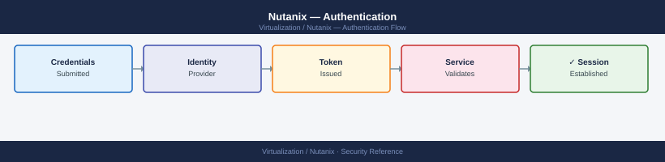

---
tags:
  - nutanix
  - security
  - authentication
  - ldap
  - active-directory
description: "Active Directory and LDAP integration for Prism Element and Prism Central, local account management, multi-factor authentication (MFA) via SAML/SSO, and..."
---
# Nutanix — Authentication

<div class="kb-summary">
Active Directory and LDAP integration for Prism Element and Prism Central, local account management, multi-factor authentication (MFA) via SAML/SSO, and session timeout configuration.

*Applies to: AOS 6.x · AHV*
</div>


---

## Before you begin

- **Access:** Prism Element admin or Prism Central admin
- **Requirements for AD/LDAP:** LDAP service reachable from CVMs on port 389 (LDAP) or 636 (LDAPS); service account with read access to the directory

---

## Local Accounts

### Manage Local Users (Prism Element)

```text
Prism Element → Settings → Users → Local Users
  Create, reset password, enable/disable, assign role
```

```bash
# Via ncli:
ncli user list                             # list all local users
ncli user create name=<username> password=<pass>
ncli user change-password username=<user> current-password=<old> new-password=<new>
ncli user delete name=<username>

# Role assignment is done via Prism Element UI (not ncli)
```


```text title="Expected output"
User Information
================================================================================
                    Username                              Role
================================================================================
                    admin                          Cluster Admin
                    backup_svc                     Viewer
                    monitoring                     Cluster Admin
                    readonly_user                  Viewer
================================================================================

(no output — command completes silently)
(no output — command completes silently)
(no output — command completes silently)
```

!!! warning "Common errors"
    | Error | Fix |
    |---|---|
    | `Error: User 'admin' already exists` | Choose a different username or delete the existing user first with `ncli user delete name=admin`. |
    | `Error: Current password is incorrect` | Verify the current password is correct and try the change-password command again. |
### Default Local Accounts

| Account | Default state | Notes |
|---|---|---|
| `admin` | Enabled | Change password immediately after cluster creation |
| `nutanix` | CVM SSH only | OS-level user, not a Prism account |

---

## Active Directory / LDAP Integration

=== "Prism Element"

    ```text
    Prism Element → Settings → Authentication → Directory List → Add New Directory
      Type: Active Directory
      Name: corp-ad (label only)
      Domain: corp.local
      Directory URL: ldaps://dc1.corp.local:636
      Username: svc-nutanix@corp.local
      Password: <service account password>
    ```

    After saving, verify connectivity:
    ```text
    Test Directory → enter test user credentials → should return "User found"
    ```

=== "CLI (ncli)"

    ```bash
    ncli authconfig get-directory-services   # list configured directories
    ncli authconfig add-directory-config \
      directory-type=ACTIVE_DIRECTORY \
      connection-type=LDAP \
      directory-url=ldap://dc1.corp.local:389 \
      domain=corp.local \
      service-account-username=svc-nutanix \
      service-account-password=<pass>
    ```

    ```text title="Expected output"
    Directory Services Configuration
    =================================

    Directory Type       : ACTIVE_DIRECTORY
    Connection Type      : LDAP
    Directory URL        : ldap://dc1.corp.local:389
    Domain               : corp.local
    Service Account      : svc-nutanix
    Status               : CONFIGURED
    Last Sync            : 2024-01-15 14:32:18
    Sync Interval        : 3600 seconds

    Adding directory configuration...
    Directory configuration added successfully.
    Config ID: 550e8400-e29b-41d4-a716-446655440000
    ```

    !!! warning "Common errors"
        | Error | Fix |
        |---|---|
        | `Error: Connection refused (111)` | Verify the LDAP server is reachable and listening on port 389 with `nc -zv dc1.corp.local 389`. |
        | `Error: Invalid credentials for service account 'svc-nutanix'` | Confirm the service account password is correct and the account has directory query permissions in Active Directory. |
        | `Error: Domain 'corp.local' not found or unreachable` | Ensure DNS resolution works for the domain with `nslookup corp.local` and that the domain name matches your Active Directory configuration. |

=== "Prism Central"

    Prism Central manages authentication for multi-cluster environments. Configure once in PC to apply across all registered clusters.

    ```text
    Prism Central → Settings → Authentication
      Click "+" → Add Directory
      Type: Active Directory or OpenLDAP
      Domain: corp.local
      URL: ldaps://dc1.corp.local:636
      Service account: svc-pc@corp.local
    ```

---

## Role Mapping (AD Groups → Prism Roles)

After configuring the directory, map AD security groups to Prism roles:

```text
Prism Element → Settings → Role Mapping → Add Mapping
  Directory: corp-ad
  Role: Cluster Admin / Viewer / User Admin
  Type: Group
  Values: infra-nutanix-admins (AD group name)
```

```text
Prism Central → Settings → Role Mapping → New Role Mapping
  Directory: corp-ad
  Role: Prism Admin / Viewer / Self Service
  Groups: infra-pc-admins
```

### Available Roles (Prism Element)

| Role | Permissions |
|---|---|
| Cluster Admin | Full cluster administration |
| User Admin | Manage users and roles only |
| Viewer | Read-only — no changes |

### Available Roles (Prism Central)

| Role | Permissions |
|---|---|
| Prism Admin | Full cross-cluster admin |
| Prism Operator | Operations but no config changes |
| Viewer | Read-only |
| Self Service | Manage own project resources |
| Custom Role | Fine-grained RBAC (see Access Control) |

---

## OpenLDAP Integration

```text
Prism Element → Settings → Authentication → Add New Directory
  Type: OpenLDAP
  Directory URL: ldap://ldap.corp.local:389
  Username attribute: uid
  Group member attribute: memberUid
  Base DN: dc=corp,dc=local
  Service account DN: cn=svc-nutanix,ou=service,dc=corp,dc=local
```

---

## SAML / SSO (Prism Central)

Prism Central supports SAML 2.0 for integration with identity providers (Okta, Azure AD, ADFS, PingFederate).

```text
Prism Central → Settings → Authentication → SAML Service Providers
  Add SP → configure IdP metadata URL or upload XML
  Map SAML attributes to Prism Central roles
  Test SSO login before enabling for all users
```

**Okta setup outline:**
1. Create new SAML 2.0 app in Okta Admin → Applications
2. Set ACS URL: `https://<prism-central-ip>:9440/api/nutanix/v3/idps/saml/callback`
3. Set Entity ID: `https://<prism-central-ip>:9440`
4. Map Okta attribute `groups` to Prism Central role
5. Download Okta IdP metadata XML and upload to Prism Central

---

## Session and Timeout Settings

```text
Prism Element → Settings → Security → Session Timeout
  Timeout: 15 minutes (recommended for high-security environments)
  
Prism Central → Settings → Security → Session Timeout
  Same setting, applies to PC UI
```

---

## Verify Authentication

```bash
# Test AD auth from CVM (requires ldapsearch)
ldapsearch -x -H ldap://dc1.corp.local:389 \
  -D "svc-nutanix@corp.local" -w <password> \
  -b "dc=corp,dc=local" "(sAMAccountName=testuser)" cn mail

# NCC auth check
ncc --health_checks ldap_check
```


```text title="Expected output"
# LDAP search results
dn: CN=testuser,OU=Users,DC=corp,DC=local
cn: Test User
mail: testuser@corp.local

# NCC health check output
Starting health checks...
[2024-01-15 14:32:18] LDAP Configuration Check
  Status: PASS
  Details: LDAP server reachable at dc1.corp.local:389
  Response Time: 142ms
  Bind Status: SUCCESS
  User Search: Successful (1 result found)

Health check completed successfully.
```

!!! warning "Common errors"
    | Error | Fix |
    |---|---|
    | `ldap_bind: Invalid credentials (49)` | Verify the service account password is correct and the account has not been locked out in Active Directory. |
    | `Can't contact LDAP server (-1)` | Confirm the LDAP server hostname/IP and port are correct, and that network connectivity exists from the CVM to the domain controller. |
    | `ncc: command not found` | Ensure you are running the command from a Nutanix CVM with NCC installed, or source the appropriate environment setup script. |
**From Prism:**
- Settings → Authentication → Test Directory → login with an AD user
- Confirm role mapping applies: log in with an AD group member and verify their role

---

## See also

- [Nutanix — Access Control](../access-control/)
- [Nutanix — Hardening](../hardening/)
