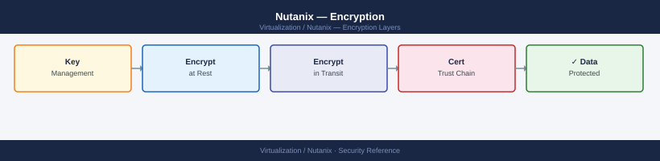

---
tags:
  - nutanix
  - security
  - encryption
  - data-at-rest
  - sed
---
# Nutanix — Encryption

<div class="kb-summary">
Nutanix data-at-rest encryption (software and SED-based), key management (native key manager and external KMS), in-transit encryption, and encryption lifecycle operations (enable, re-key, disable).

*Applies to: AOS 6.x · AHV*
</div>


---

## Before you begin

- **Licence:** Data-at-rest encryption requires a Nutanix Pro or Ultimate licence
- **Hardware:** SED encryption requires Self-Encrypting Drives in each node
- **Key manager:** Choose before enabling — you cannot switch between native and external KMS without re-encryption
- **Impact:** Software encryption adds CPU overhead (~5–10% on non-AES-NI hardware, negligible on modern CPUs with AES-NI)

---

## Encryption Options

| Type | How it works | Requires |
|---|---|---|
| Software encryption | AES-256 in AOS Stargate | AOS Pro/Ultimate + any disk |
| SED (Hardware) | Self-Encrypting Drive with AOS KMS control | SED disks + Pro/Ultimate |
| In-transit (CVM-CVM) | TLS for replication traffic | Included, configurable |

---

## Key Manager Options

| KMS | Use case |
|---|---|
| Nutanix Native KMS | Simpler; keys stored distributed across CVMs |
| External KMS (KMIP) | Regulatory compliance (FIPS); integrates with Thales/SafeNet, Vormetric, IBM SKLM |

---

## Enable Software Data-at-Rest Encryption

!!! danger "Encryption causes background re-encryption of all existing data"
    Once enabled on a container, AOS re-encrypts all objects on that datastore. This is a long-running background operation (hours to days on large clusters) with significant I/O overhead. **It cannot be cancelled once started.** Ensure cluster capacity is below 70%, KMS is redundant, and a maintenance window is scheduled.

### Step 1 — Configure Native Key Manager

```text
Prism Element → Settings → Data Encryption → Key Management
  Key Management Mode: Native
  Passphrase: <strong passphrase — record securely>
  Confirm passphrase
  Save
```

The passphrase protects the master encryption key. **If lost, encrypted data cannot be recovered.** Store the passphrase in a password vault (CyberArk, HashiCorp Vault, or similar).

### Step 2 — Enable Encryption on a Container

```text
Prism Element → Storage → Storage Containers → select container
  Actions → Enable Encryption
  Confirm: Yes, I understand this will re-encrypt existing data
```

### Monitor Re-Encryption Progress

```bash
# Check Curator tasks — re-encryption shows as a Curator scan
curator_cli get_last_successful_scans | tail -20
curator_cli display_curator_tasks | grep -i encrypt

# NCC check for encryption status
ncc --health_checks data_encryption_check
```


```text title="Expected output"
Last 20 successful scans:
Scan ID: scan_20240115_093847, Type: MetadataCorruption, Duration: 2m34s, Status: SUCCESS
Scan ID: scan_20240115_081203, Type: DataIntegrity, Duration: 5m12s, Status: SUCCESS
Scan ID: scan_20240115_065521, Type: MetadataCorruption, Duration: 2m28s, Status: SUCCESS
Scan ID: scan_20240114_235847, Type: DataIntegrity, Duration: 4m59s, Status: SUCCESS
Scan ID: scan_20240114_224156, Type: MetadataCorruption, Duration: 2m31s, Status: SUCCESS
...

Curator Tasks (Encryption-related):
Task ID: curator_task_8f2e4c91, Type: ReEncryption, Status: RUNNING, Progress: 67%, Containers: 3
Task ID: curator_task_7d1a3b5e, Type: ReEncryption, Status: COMPLETED, Progress: 100%, Containers: 5
Task ID: curator_task_6c0a2d7f, Type: EncryptionScan, Status: COMPLETED, Progress: 100%, Containers: 8

NCC Health Check: data_encryption_check
Cluster: PHX-PROD-001
Check Status: PASSED
Encrypted Containers: 12/12
Encrypted vDisks: 847/847
Encryption Algorithm: AES-256
Key Rotation Status: ENABLED (Last rotation: 2024-01-10 14:32:15 UTC)
Overall Health: GOOD
```

!!! warning "Common errors"
    **`curator_cli: command not found`** — Verify Nutanix cluster SSH access and ensure you're running the command on a Nutanix node with curator tools in PATH.
    **`NCC check failed: Unable to connect to cluster`** — Confirm cluster connectivity and that NCC is properly installed; run `ncc --version` to verify installation.
---

## Enable SED-Based Hardware Encryption

Requires all nodes to have SED disks (verified during Foundation imaging).

```text
Prism Element → Settings → Data Encryption → Key Management
  Key Management Mode: Native (or KMIP external)
  Enable Hardware Encryption (SEDs): Yes
```

SED encryption is performed by the drive itself — no CPU overhead. Data on a failed/removed drive is unreadable without the encryption key, enabling secure drive disposal.

---

## External KMS (KMIP) Integration

For regulatory compliance (FIPS 140-2), use an external key manager.

```text
Prism Element → Settings → Data Encryption → Key Management
  Key Management Mode: External (KMIP)
  KMIP Server: <kmip-server-ip>:<port>   (default port 5696)
  TLS Certificate: upload client cert for mTLS
  CA Certificate: upload KMS CA cert
  Test Connectivity: click Test
```

Supported KMIP servers:
- Thales CipherTrust (SafeNet KeySecure)
- IBM Security Key Lifecycle Manager (SKLM)
- Gemalto/Thales Luna
- HashiCorp Vault Enterprise (KMIP secrets engine)

---

## In-Transit Encryption (CVM to CVM)

AOS encrypts replication traffic between remote sites by default for Nutanix DR policies. For Protection Domain replication, enable encryption explicitly:

```bash
ncli pd edit name=<pd-name> \
  enable-replication-ssl=true
```


```text title="Expected output"
(no output — command completes silently)
```

!!! warning "Common errors"
    **`Error: PD '<pd-name>' not found`** — Verify the exact protection domain name with `ncli pd list` and use the correct spelling.
    **`Error: Invalid value for enable-replication-ssl: must be true or false`** — Ensure the parameter value is lowercase `true` or `false`, not `True` or `FALSE`.
For CVM-to-CVM within a cluster, inter-node traffic on the internal network is not encrypted by default (relies on network-level isolation). For cross-cluster or WAN replication, SSL is strongly recommended.

---

## Key Rotation (Re-Key)

Periodic key rotation is a compliance requirement (e.g., annually).

```text
Prism Element → Settings → Data Encryption → Key Management
  Rotate Key → confirm passphrase → New Passphrase → Confirm
```

```bash
# Monitor re-key (same Curator task monitoring as initial encryption)
curator_cli display_curator_tasks | grep -i encrypt
```


```text title="Expected output"
Task ID                          | Task Type        | Status    | Progress | Start Time          | End Time
-------------------------------- | ---------------- | --------- | -------- | ------------------- | -------------------
task-2024-01-15-encrypt-001      | Data Encryption  | Running   | 87%      | 2024-01-15 14:32:10 | In Progress
task-2024-01-15-encrypt-002      | Re-key Operation | Completed | 100%     | 2024-01-15 10:15:45 | 2024-01-15 13:22:33
task-2024-01-14-encrypt-003      | Data Encryption  | Completed | 100%     | 2024-01-14 22:45:20 | 2024-01-15 02:18:55
task-2024-01-14-encrypt-004      | Re-key Operation | Failed    | 45%      | 2024-01-14 18:30:00 | 2024-01-14 19:05:22
```

!!! warning "Common errors"
    **`curator_cli: command not found`** — Verify curator_cli is installed and in your PATH, or run from the Nutanix cluster node with curator services enabled.
    **`grep: (standard input) is empty`** — No encryption tasks exist yet; run an encryption or re-key operation first before monitoring.
Re-key triggers a background re-encryption of all data with the new key. Same I/O impact as initial encryption — schedule during low-traffic windows.

---

## Verify Encryption Status

```bash
# Check if encryption is enabled per container
ncli ctr list | grep -i encrypt

# NCC encryption health check
ncc --health_checks data_encryption_check

# Check native KMS status
ncli cluster get-data-encryption-status
```

```text
Prism Element → Settings → Data Encryption
  Should show: "Encryption is enabled" for each protected container
  Key manager: status "Connected" (for external KMS)
```

---

## Disable Encryption

!!! warning "Disabling encryption triggers full re-decryption"
    Same I/O impact as enabling. Ensure capacity headroom and a maintenance window.

```text
Prism Element → Settings → Data Encryption → select container
  Actions → Disable Encryption → Confirm
```

---

## See also

- [Nutanix — Hardening](../hardening/)
- [Nutanix — Health Checks](../../operations/health-checks/)
