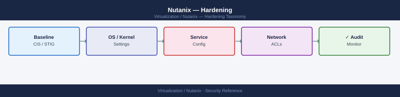

---
tags:
  - nutanix
  - security
  - hardening
  - cis
---
# Nutanix — Hardening

<div class="kb-summary">
CVM OS hardening, AHV hypervisor hardening, Prism Element/Central security configuration, port lockdown, SSL/TLS settings, and Nutanix Security Configuration Guide alignment (CIS Nutanix benchmark).

*Applies to: AOS 6.x · AHV*
</div>


---

## Before you begin

- **Access:** CVM SSH (nutanix), Prism Element admin
- **Reference:** Nutanix Security Configuration Guide (available from Nutanix Portal — search "SCG") — aligns with STIG/CIS benchmarks
- **Snapshot first:** Take a Prism snapshot of CVMs before making security config changes

---

## CVM Password Policy

```bash
# Check current password policy (Prism Element → Settings → Security → Cluster Lockdown not for password policy)
# Password policy is configured via ncli:
ncli cluster get-password-complexity-policy

# Enforce password complexity
ncli cluster edit-password-complexity-policy \
  enabled=true \
  min-length=14 \
  min-uppercase=1 \
  min-lowercase=1 \
  min-numeric=1 \
  min-special-chars=1 \
  history=6

# Set max password age (days)
ncli cluster edit-password-aging-policy enabled=true max-age=90

# Lock account after failed logins
ncli cluster edit-lockout-policy \
  enabled=true \
  failed-login-attempts=5 \
  lockout-period=30
```

---

## SSH Hardening

### Restrict SSH Access (Cluster Lockdown)

Nutanix Cluster Lockdown disables SSH root access and allows key-only login per approved IP/key list.

```text
Prism Element → Settings → Security → Cluster Lockdown
  Enable Cluster Lockdown: Yes
  Add SSH public keys for each admin user
  Optionally restrict to specific source IPs
```

```bash
# Verify lockdown is enabled via CLI
ncli cluster get-security-config | grep -i lockdown
```

### CVM SSH Key Management

```bash
# Add an authorized key to all CVMs
allssh "echo 'ssh-rsa AAAA... user@host' >> ~/.ssh/authorized_keys"

# Remove a key (find and delete the specific line)
allssh "sed -i '/user@host/d' ~/.ssh/authorized_keys"

# List current authorized keys
allssh "cat ~/.ssh/authorized_keys"
```

### SSH Server Config (AHV Hypervisor)

Apply on each AHV host (requires root access — only via Prism Element → Hardware → host console):

```bash
# /etc/ssh/sshd_config recommended settings:
PermitRootLogin no
PasswordAuthentication no
Protocol 2
MaxAuthTries 4
ClientAliveInterval 300
ClientAliveCountMax 2
AllowUsers nutanix
```

---

## TLS / SSL Configuration

```bash
# Check current cipher suite policy
ncli cluster get-ssl-key-config

# Enforce TLS 1.2+ (disable TLS 1.0/1.1)
ncli cluster edit-ssl-key-config \
  key-type=RSA_2048 \
  cluster-certification-chain-key=""  # leave blank to use Nutanix self-signed

# For custom SSL cert (recommended — avoids browser warnings):
# Prism Element → Settings → SSL Certificate → Import Certificate
# Upload your PEM-encoded cert, intermediate chain, and private key
```

---

## Port Exposure Lockdown

Nutanix uses a firewall (iptables on CVM, firewalld on AHV). The key principle is: **only ports listed in the Nutanix Port Reference should be open**.

Key ports that must remain open:

| Port | Protocol | Purpose |
|---|---|---|
| 9440 | TCP | Prism UI (HTTPS) |
| 2009 | TCP | CVM to CVM (inter-cluster replication) |
| 2100 | TCP | CVM to hypervisor |
| 9443 | TCP | Prism Central HTTPS |
| 5988, 5989 | TCP | CIM provider (vCenter) |
| 443 | TCP | HTTPS (outbound to LCM, Insights) |
| 80 | TCP | HTTP (redirect to 443 only) |

```bash
# Review iptables rules on a CVM
sudo iptables -L -n

# Verify AHV firewall
allssh "sudo iptables -L -n -v | grep -E 'DROP|REJECT' | head -20"
```

---

## Prism Element Security Settings

```text
Prism Element → Settings → Security:

1. HTTP Strict Transport Security (HSTS)
   Enable HSTS for Prism Web Console

2. Cluster Lockdown (SSH management — see above)

3. Data-at-Rest Encryption
   Enable per-container or cluster-wide (see Encryption page)

4. Authentication
   Configure LDAP/AD (see Authentication page)
```

---

## Network Segmentation

- Place **CVM management traffic** on a dedicated management VLAN (IPMI, CVM, AHV management IPs)
- Place **VM traffic** on separate VLANs — never mix VM and CVM management traffic
- Restrict **Prism port 9440** to admin jump hosts only via firewall rules upstream
- Disable **IPMI default credentials** before deploying (change BMC/IPMI password immediately after imaging)

---

## Nutanix Security Dashboard

```text
Prism Central → Security → Security Planning
  Shows STIG/CIS compliance status per cluster
  Identifies deviations from the Security Configuration Guide
  Generates compliance reports

Prism Central → Alerts → Security Alerts
  Monitors for brute force, unusual API access, failed auth, etc.
```

---

## Nutanix Insights (Call-Home)

Nutanix Insights sends cluster health telemetry to Nutanix for proactive support. Review what data is sent before disabling:

```text
Prism Element → Settings → Pulse → Disable Pulse
```

For air-gapped clusters, disable Pulse and LCM dark site mode:

```bash
# Configure LCM dark site (local LCM repository)
# Prism Central → LCM → Settings → Use Dark Site
# Point to your internal LCM mirror URL
```

---

## Hardening Verification Checklist

| Check | Command / Path |
|---|---|
| Cluster Lockdown enabled | Prism → Settings → Security → Cluster Lockdown = On |
| Password complexity policy | `ncli cluster get-password-complexity-policy` |
| Account lockout policy | `ncli cluster edit-lockout-policy` |
| TLS 1.0/1.1 disabled | `ncli cluster get-ssl-key-config` |
| Custom SSL cert installed | Prism → Settings → SSL Certificate |
| Default admin password changed | `ncli user change-password username=admin` |
| IPMI/BMC default password changed | Via each node's IPMI console |
| NCC security checks | `ncc --health_checks run_all` → filter security category |

---

## See also

- [Nutanix — Access Control](access-control/)
- [Nutanix — Authentication](authentication/)
- [Nutanix — Health Checks](../operations/health-checks/)
