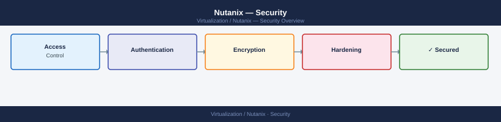

# Nutanix — Security

Security configuration for Nutanix HCI — OS hardening, SSH lockdown, Active Directory integration, RBAC access control, and data-at-rest encryption. Aligned with the Nutanix Security Configuration Guide.

*Applies to: AOS 6.x · AHV*

  <a class="kb-card" href="hardening/">
    <strong>Hardening</strong>
    CVM OS hardening, SSH lockdown, password policy, TLS configuration, port exposure, and Nutanix SCG alignment.
  </a>
  <a class="kb-card" href="authentication/">
    <strong>Authentication</strong>
    AD/LDAP integration, SAML/SSO for Prism Central, local account management, and session timeout settings.
  </a>
  <a class="kb-card" href="access-control/">
    <strong>Access Control</strong>
    Prism Element built-in roles, Prism Central custom RBAC, categories-based VM access, and projects.
  </a>
  <a class="kb-card" href="encryption/">
    <strong>Encryption</strong>
    Data-at-rest encryption (software and SED), native key manager, KMIP external KMS, and key rotation.
  </a>

