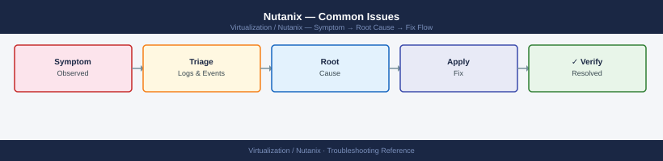

---
tags:
  - nutanix
  - troubleshooting
  - ncc
  - cvm
search:
  boost: 1.5
---
# Nutanix — Common Issues

<div class="kb-summary">
Troubleshooting guide for the most frequent Nutanix problems: CVM down or unreachable, NCC failures, storage degraded/critical, network connectivity issues, cluster full, VM stuck power states, and replication failures.

*Applies to: AOS 6.x · AHV*
</div>


```d2
direction: down

symptom: Identify Symptom {shape: diamond}
diagnostic_flow: "Diagnostic Flow" {shape: rectangle}
cvm_down_unreachable: "CVM Down / Unreachable" {shape: rectangle}
ncc_health_check_failures: "NCC Health Check Failures" {shape: rectangle}
storage_degraded_or_critical: "Storage Degraded or Critical" {shape: rectangle}
vm_stuck_powering_onoff: "VM Stuck Powering On/Off" {shape: rectangle}
vm_cannot_connect_to_network: "VM Cannot Connect to Network" {shape: rectangle}
resolution: Resolve or Escalate {shape: oval}

symptom -> diagnostic_flow: investigate
symptom -> cvm_down_unreachable: investigate
symptom -> ncc_health_check_failures: investigate
symptom -> storage_degraded_or_critical: investigate
symptom -> vm_stuck_powering_onoff: investigate
symptom -> vm_cannot_connect_to_network: investigate
diagnostic_flow -> resolution
cvm_down_unreachable -> resolution
ncc_health_check_failures -> resolution
storage_degraded_or_critical -> resolution
vm_stuck_powering_onoff -> resolution
vm_cannot_connect_to_network -> resolution
```

## Diagnostic Flow

```d2
direction: right

S: "Alert or symptom" {shape: rectangle}
A: "Run NCC: ncc --health_checks run_all" {shape: rectangle}
B: "B" {shape: rectangle}
C: "Identify failing check\nread check description" {shape: rectangle}
D: "Check service health\ngenesis status · nodetool status" {shape: rectangle}
C1: "C1" {shape: rectangle}
E1: "CVM Down: restart via virsh / genesis restart" {shape: rectangle}
E2: "Storage Degraded: check disk, RF, rebuild status" {shape: rectangle}
E3: "PD Replication: check remote site, ncli remote-site" {shape: rectangle}
E4: "No network: OVS bridge check, AHV host ping" {shape: rectangle}
D2: "D2" {shape: rectangle}
F1: "genesis restart on CVM · nodetool repair if Cassandra" {shape: rectangle}
F2: "Read relevant log\nstargate.ERROR · curator.INFO" {shape: rectangle}
G: "G" {shape: rectangle}
H: "Apply fix · verify with NCC" {shape: rectangle}
I: "Collect support bundle\nlogbay collect · open GSS case" {shape: rectangle}

S -> A
B -> C
B -> D
C1 -> E1
C1 -> E2
C1 -> E3
C1 -> E4
D2 -> F1
D2 -> F2
G -> H
G -> I
```

---

## Before you begin

- **Access:** CVM SSH (nutanix) and Prism Element admin; AHV host root access may be needed for deep issues
- **Baseline:** Run `ncc --health_checks run_all` as first step for any alert — it identifies the majority of issues automatically

---

## CVM Down / Unreachable

**Symptoms:** `allssh` times out on one CVM; NCC reports `cluster_services_status_check FAIL`; Prism shows one node missing from Hardware view.

**Triage:**
```bash
# From another CVM — can you ping the affected CVM?
ping <cvm-ip>

# If reachable, try SSH
ssh nutanix@<cvm-ip>
genesis status

# If not reachable — check via AHV hypervisor console
# Log into the AHV host directly and check CVM VM state:
virsh list --all | grep CVM
virsh console CVM    # (AHV) connect to CVM console
```


```text title="Expected output"
PING 10.20.30.45 56(84) bytes of data.
64 bytes from 10.20.30.45: icmp_seq=1 ttl=64 time=2.34 ms
64 bytes from 10.20.30.45: icmp_seq=2 ttl=64 time=1.89 ms
64 bytes from 10.20.30.45: icmp_seq=3 ttl=64 time=2.12 ms
--- 10.20.30.45 statistics ---
3 packets transmitted, 3 received, 0% packet loss, time 2004ms

Welcome to Nutanix CVM
nutanix@10.20.30.45's password: 
Last login: Wed Jan 15 10:42:18 2025 from 10.20.30.1
nutanix@NTNX-CVM-45:~$ genesis status
  Cluster UUID: 00051234-5678-90ab-cdef-1234567890ab
  Cluster State: GOOD
  Services Status: RUNNING
  Leader: NTNX-CVM-42

 id | name                  | state      | leader
----|----------------------|------------|--------
  1 | cassandra             | RUNNING    | False
  2 | zookeeper             | RUNNING    | False
  3 | cerebro               | RUNNING    | True
  4 | prism                 | RUNNING    | False
...

 id | name                  | state      | running
----|----------------------|------------|--------
  1 | nfs_server            | RUNNING    | True
  2 | iscsi_server          | RUNNING    | True
  3 | stargate              | RUNNING    | True

 id | name                  | state      | running
----|----------------------|------------|--------
  1 | curator               | RUNNING    | True
  2 | medusa                | RUNNING    | True

Connected to domain 'CVM' console
[ENTER `^]` to quit console]
CVM login:
```

!!! warning "Common errors"
    **`ssh: connect to host 10.20.30.45 port 22: Connection timed out`** — Verify network connectivity and firewall rules allow SSH (port 22) from your management network to the CVM.
    **`virsh: error: failed to get domain 'CVM'`** — Ensure you are logged into the correct AHV hypervisor host and use the exact CVM domain name (check with `virsh list --all` first).
**Common causes and fixes:**

| Cause | Fix |
|---|---|
| CVM powered off | Start CVM: `virsh start CVM` on the AHV host |
| Network issue | Verify CVM IP config on AHV: `ip addr show` on CVM |
| Genesis crashed | SSH to CVM → `genesis restart` |
| Hardware fault | Check AHV host IPMI for memory/disk errors |
| Out of disk space | `df -h /` on CVM — free space in `/home/nutanix` |

```bash
# Restart genesis (recovers most service crashes)
genesis restart

# If genesis won't start — reboot the CVM
sudo reboot   # or via Prism → Hardware → host → reboot CVM
```


```text title="Expected output"
Genesis restart initiated...
Stopping genesis service...
Stopping Cassandra...
Stopping Zookeeper...
Genesis service stopped successfully.
Starting genesis service...
Starting Zookeeper...
Starting Cassandra...
Genesis service started successfully.
Genesis is now running (PID: 4521)
```

!!! warning "Common errors"
    **`genesis: command not found`** — Ensure you are logged into the CVM (Controller VM) directly; this command only exists on Nutanix nodes, not on the Prism host.
    **`Permission denied`** — Run the command with `sudo genesis restart` or ensure your user account has sudo privileges on the CVM.
    **`Genesis failed to start after 120 seconds`** — Proceed with a full CVM reboot using `sudo reboot` as the genesis service may be in an unrecoverable state.
---

## NCC Health Check Failures

**Triage:**
```bash
# Run NCC and capture output
ncc --health_checks run_all 2>&1 | tee /tmp/ncc-$(date +%Y%m%d).txt

# Show only failures and warnings
grep -E "^FAIL|^WARN" /tmp/ncc-$(date +%Y%m%d).txt

# Get details for a specific failed check
ncc --health_checks <check_name> 2>&1
```


```text title="Expected output"
Running NCC health checks...
[2024-01-15 10:23:47] Starting comprehensive health check suite
[2024-01-15 10:24:12] Cluster: prod-cluster-01 (4.5.2.1)
[2024-01-15 10:25:33] Storage pool check: PASS
[2024-01-15 10:26:01] Network connectivity: PASS
[2024-01-15 10:26:45] VM consistency: WARN - 2 orphaned snapshots detected
[2024-01-15 10:27:18] Replication status: FAIL - Remote site unreachable (10.50.1.5)
[2024-01-15 10:28:02] DNS resolution: PASS
[2024-01-15 10:28:44] Health check completed in 305 seconds
Output saved to /tmp/ncc-20240115.txt

FAIL - Replication status: Remote site unreachable (10.50.1.5)
WARN - VM consistency: 2 orphaned snapshots detected on container prod-data

Running health check: replication_status
[2024-01-15 10:29:15] Check: replication_status
Status: FAILED
Details: Cannot reach remote site prod-cluster-02 at 10.50.1.5:2020
Last successful sync: 2024-01-14 18:45:22 UTC
Recommendation: Verify network connectivity between sites, check firewall rules for port 2020
```

!!! warning "Common errors"
    **`ncc: command not found`** — Ensure NCC is installed on the Nutanix cluster node or run the command from a node with NCC available in PATH.
    **`FAIL - Health check timed out after 600 seconds`** — Increase timeout or run individual checks with `ncc --health_checks <check_name>` instead of `run_all` if the cluster is under heavy load.
    **`grep: /tmp/ncc-20240115.txt: No such file or directory`** — Verify the first ncc command completed successfully and check that /tmp has write permissions.
**Common NCC failures:**

| NCC Check | Common cause | Fix |
|---|---|---|
| `ntp_synchronization_check` | NTP server unreachable | Verify NTP config: `ncli cluster edit-params ntp-server-ip-address-list=<ntp>` |
| `dns_server_check` | DNS unreachable | `ncli cluster edit-params dns-server-ip-address-list=<dns>` |
| `disk_usage_check` | Container over 70% | Expand cluster, delete unused VMs/snapshots |
| `cvm_memory_check` | CVM OOM | Check CVM memory allocation; restart memory-leaking service |
| `cluster_services_status_check` | Service down on a CVM | `genesis status` → restart failing service |
| `cassandra_ring_check` | Node dropped from ring | Check `nodetool status`; restart cassandra: `genesis restart` |
| `data_resiliency_status_check` | Degraded objects | Wait for rebuild; check disk health |

---

## Storage Degraded or Critical

**Symptoms:** Prism alerts "Data Resiliency Status: Critical"; VMs may go read-only or pause if cluster capacity is exhausted.

```bash
# Check cluster resilience
ncli cluster get-domain-fault-tolerance-status type=node

# Check storage usage
ncli ctr list | grep -E "name|used|capacity"

# Check for degraded objects
ncli cluster get-domain-fault-tolerance-status type=disk

# Check data rebuild progress
curator_cli display_curator_tasks | grep -i "rebuild\|resync"
```


```text title="Expected output"
Domain Fault Tolerance Status (Node):
  Fault Tolerance: 2
  Node Count: 4
  Redundancy Factor: 2
  Status: HEALTHY

Name                          Used (GiB)  Capacity (GiB)
container-prod-01             847.3       1024.0
container-prod-02             612.5       1024.0
container-backup              156.8       512.0
container-metadata            89.2        256.0

Domain Fault Tolerance Status (Disk):
  Fault Tolerance: 1
  Disk Count: 12
  Redundancy Factor: 2
  Status: HEALTHY

Task ID: 12345678-abcd-ef01-2345-6789abcdef01
  Task Type: Rebuild
  Progress: 67%
  Estimated Time Remaining: 2h 15m
  Status: IN_PROGRESS

Task ID: 87654321-dcba-10fe-5432-1fedcba98765
  Task Type: Resync
  Progress: 100%
  Status: COMPLETED
```

!!! warning "Common errors"
    **`ncli: command not found`** — Ensure you are running this command on a Nutanix cluster node with the Nutanix CLI installed, or source the appropriate environment setup script.
    **`Permission denied`** — Run the commands with appropriate privileges (use `sudo` or ensure your user has Nutanix admin role permissions).
    **`Connection refused`** — Verify the Nutanix cluster is running and accessible; check network connectivity to the cluster management IP with `ping` or `nc`.
**Common causes:**

| Cause | Indicator | Fix |
|---|---|---|
| Disk failure | `ncli disk list` shows non-NORMAL disk | Replace failed disk; curator re-rebuilds automatically |
| Node failure | Resilience = 0 | Restore CVM; if HW failure escalate to Nutanix support |
| Container over-provisioned | Used > 80% | Delete VMs/snapshots, add nodes, or increase container capacity limit |
| Snapshots consuming space | Many old snapshots | `ncli pd ls-snapshots` → delete old ones |

---

## VM Stuck Powering On/Off

**Symptoms:** VM stays in `Transitioning` state; power operation never completes.

```bash
# Check what state the VM is in
acli vm.get <vm-name> | grep -i "power\|state"

# Force reset (if graceful off didn't work)
acli vm.reset <vm-name>

# If reset also hangs, force the VM off at the AHV level:
ssh root@<ahv-host-ip>
virsh list --all | grep <vm-name>
virsh destroy <vm-name>     # hard kill (like pulling power cord)
```


```text title="Expected output"
Power State: on
State: NORMAL
VM State: ALIVE

Connection to 192.168.1.45 established.
 Id    Name                           State
----------------------------------------------------
 12    web-prod-01                    running
 
Domain web-prod-01 destroyed
```

!!! warning "Common errors"
    **`acli: command not found`** — Ensure you're running this command on a Nutanix cluster node where the Nutanix CLI is installed, or source the appropriate environment setup script.
    
    **`virsh: command not found`** — Install libvirt-client on the AHV host with `yum install libvirt-client` or verify you're SSH'd into an actual AHV hypervisor node, not a CVM.
    
    **`error: failed to get domain '<vm-name>'`** — Verify the exact VM name matches the output from `virsh list --all` (names are case-sensitive) and that the VM actually exists on that specific AHV host.
---

## VM Cannot Connect to Network

**Symptoms:** VM boots but has no network; NIC shows no IP.

```bash
# Check VM NIC config
acli vm.nic_list <vm-name>

# Verify the network exists
acli net.list | grep <network-name>

# Remove and re-add NIC (if MAC address issue)
acli vm.nic_delete <vm-name> mac_address=<mac>
acli vm.nic_create <vm-name> network=<network-name>
```


```text title="Expected output"
VM test-web-01 NICs:
  MAC Address: 50:6b:8d:a2:c1:3f
  Network: vlan-prod-100
  IP Address: 192.168.10.45
  MTU: 1500

  MAC Address: 50:6b:8d:a2:c1:40
  Network: vlan-mgmt-50
  IP Address: 192.168.10.201
  MTU: 1500

vlan-prod-100 (UUID: 8f4c2e91-7a3d-4b2c-9e1f-5d6a8c3b2e1f)
  VLAN ID: 100
  Subnet: 192.168.10.0/24

NIC with MAC 50:6b:8d:a2:c1:3f deleted successfully
NIC created successfully on network vlan-prod-100
  MAC Address: 50:6b:8d:a2:c1:41
```

!!! warning "Common errors"
    **`Error: VM <vm-name> not found`** — Verify the VM name is correct and the VM exists using `acli vm.list`.
    **`Error: Network <network-name> does not exist`** — Confirm the network name with `acli net.list` and check for typos or VLAN configuration issues.
    **`Error: NIC with MAC <mac> not found on VM`** — Ensure the MAC address is exact and currently attached to the VM by running `acli vm.nic_list <vm-name>` first.
Inside the VM:
```bash
# Reset network interface
ip link set eth0 down && ip link set eth0 up
dhclient eth0   # re-request DHCP
```


```text title="Expected output"
(no output — command completes silently)
(no output — command completes silently)
```

!!! warning "Common errors"
    **`RTNETLINK answers: Operation not permitted`** — Run the commands with `sudo` or as root user.
    **`No DHCPOFFERS received`** — Verify the DHCP server is reachable and the interface is connected to an active network; check `ip link show eth0` to confirm the interface is UP.
---

## Cluster Full — Storage Exhausted

**Symptoms:** VMs failing to write disk; Prism shows "Cluster storage critically full"; containers may go into read-only mode at ~95%.

**Immediate actions (in order):**

1. Delete unused snapshots:
```bash
# List all VMs and their snapshots
for vm in $(acli vm.list | tail -n +2 | awk '{print $1}'); do
    snaps=$(acli vm.snapshot_list "$vm" 2>/dev/null | wc -l)
    [[ $snaps -gt 1 ]] && echo "$vm: $snaps snapshots"
done

# Delete specific snapshot
acli vm.snapshot_delete <vm-name> snapshot_name=<snap-name>
```


```text title="Expected output"
vm-prod-web-01: 8 snapshots
vm-prod-db-02: 12 snapshots
vm-dev-test-03: 3 snapshots
vm-prod-web-04: 5 snapshots
vm-staging-app-01: 2 snapshots

Delete snapshot 'daily-backup-2024-01-15' from vm 'vm-prod-web-01'? (y/n): y
Snapshot deleted successfully. Snapshot UUID: 00051234-1234-1234-1234-123456789abc
```

!!! warning "Common errors"
    **`acli: command not found`** — Ensure the Nutanix CLI is installed and the PATH includes the acli binary location, or source the Nutanix environment setup script.
    **`Error: Invalid snapshot name '<snap-name>'`** — Replace `<snap-name>` with the actual snapshot name from the vm.snapshot_list output and verify the VM name with `acli vm.list`.
2. Delete Protection Domain old snapshots:
```bash
ncli pd ls-snapshots name=<pd-name>
# Delete oldest snapshots manually via Prism Element
```


```text title="Expected output"
Snapshot Details
================================================================================
Snapshot UUID                          | Snapshot Name         | Created Time
================================================================================
a1b2c3d4-e5f6-47g8-h9i0-j1k2l3m4n5o6 | pd-daily-2024-01-15   | 2024-01-15 02:30:45
b2c3d4e5-f6g7-48h9-i0j1-k2l3m4n5o6p7 | pd-daily-2024-01-14   | 2024-01-14 02:30:42
c3d4e5f6-g7h8-49i0-j1k2-l3m4n5o6p7q8 | pd-daily-2024-01-13   | 2024-01-13 02:30:38
d4e5f6g7-h8i9-40j0-k1l2-m3n4o5p6q7r8 | pd-daily-2024-01-12   | 2024-01-12 02:30:35
e5f6g7h8-i9j0-41k1-l2m3-n4o5p6q7r8s9 | pd-daily-2024-01-11   | 2024-01-11 02:30:31
...
```

!!! warning "Common errors"
    **`Error: Invalid PD name '<pd-name>'`** — Replace `<pd-name>` with the actual protection domain name (e.g., `ncli pd ls-snapshots name=prod-db-pd`).
    **`Error: Connection refused to Nutanix cluster`** — Verify cluster connectivity and that you are authenticated with valid Nutanix credentials using `ncli user whoami`.
3. Power off non-critical VMs

4. If still critical — Nutanix support for emergency capacity expansion

---

## Replication Failures (Protection Domain)

**Symptoms:** Replication lag growing; alerts about "Replication link broken" or "Protection domain replication delayed".

```bash
# Check PD replication status
ncli pd get name=<pd-name>

# Check remote site connectivity
ncli remote-site ping name=<dr-site-name>

# Restart replication manually
ncli pd disable-replication name=<pd-name>
ncli pd enable-replication name=<pd-name>

# Check bandwidth to remote site
allssh "iperf3 -c <remote-cvm-ip> -t 10"  # iperf3 must be available
```


```text title="Expected output"
Protection Domain: prod-db-pd
  Replication Status: Enabled
  Remote Site: dr-site-01
  RPO Target (minutes): 60
  Replication Lag (seconds): 12
  Replicated Bytes: 2.3 TB

Remote site 'dr-site-01' is reachable
  Latency: 45.2 ms
  Packet Loss: 0.0%

Disabling replication for Protection Domain 'prod-db-pd'...
Protection Domain replication disabled successfully.

Enabling replication for Protection Domain 'prod-db-pd'...
Protection Domain replication enabled successfully.

node-1: Connecting to 10.45.200.15, port 5201
node-1: [  5] 5.00-10.00 sec  487 MBytes  775 Mbps
node-2: Connecting to 10.45.200.15, port 5201
node-2: [  5] 5.00-10.00 sec  512 MBytes  817 Mbps
node-3: Connecting to 10.45.200.15, port 5201
node-3: [  5] 5.00-10.00 sec  498 MBytes  796 Mbps
```

!!! warning "Common errors"
    **`Error: Protection Domain '<pd-name>' not found`** — Verify the PD name with `ncli pd list` and use the exact name from the output.
    **`Error: iperf3: command not found`** — Install iperf3 on all CVMs using `allssh "apt-get install -y iperf3"` before running the bandwidth test.
    **`Error: Unable to reach remote site '<dr-site-name>'`** — Check network connectivity between sites and verify the remote site name matches the configured DR site with `ncli remote-site list`.
---

## Prism UI Inaccessible

**Symptoms:** Cannot reach `https://<cluster-vip>:9440`

```bash
# Check cluster VIP is assigned
ncli cluster info | grep "External IP"

# Ping the VIP
ping <cluster-vip>

# VIP is managed by "cluster" service — restart it:
# (on any CVM)
allssh "genesis status | grep cluster"
# If "cluster" service is DOWN:
genesis restart
```


```text title="Expected output"
External IP: 10.45.128.10
PING 10.45.128.10 (10.45.128.10) 56(84) bytes of data.
64 bytes from 10.45.128.10: icmp_seq=1 ttl=64 time=2.341 ms
64 bytes from 10.45.128.10: icmp_seq=2 ttl=64 time=1.987 ms
64 bytes from 10.45.128.10: icmp_seq=3 ttl=64 time=2.156 ms
--- 10.45.128.10 statistics ---
3 packets transmitted, 3 received, 0% packet loss, time 2003ms
rtt min/avg/max/mdev = 1.987/2.161/2.341/0.147 ms

CVM-1: cluster: UP (PID: 4821, uptime: 18d 3h 42m)
CVM-2: cluster: UP (PID: 5103, uptime: 18d 3h 41m)
CVM-3: cluster: UP (PID: 4956, uptime: 18d 3h 42m)
```

!!! warning "Common errors"
    **`PING: sendto: No route to host`** — Verify the cluster VIP is on the same subnet as the CVM and check network connectivity with `ncli network list`.
    **`cluster: DOWN`** — Run `genesis restart` on the affected CVM to bring the cluster service back online.
    **`ncli: command not found`** — Execute the command from a Nutanix CVM (Controller VM) where ncli is installed, not from a hypervisor host.
---

---

## Verify

- The original symptom is resolved — CVM is reachable, storage is healthy, VM has power
- `ncc --health_checks run_all` returns no failures related to the resolved issue
- Prism alert for the issue is cleared or acknowledged
- If a permanent fix was applied (config change, re-registration), record it in the change ticket

---

## See also

- [Nutanix — Diagnostics](../diagnostics/)
- [Nutanix — Escalation](../escalation/)
- [Nutanix — Health Checks](../../operations/health-checks/)
