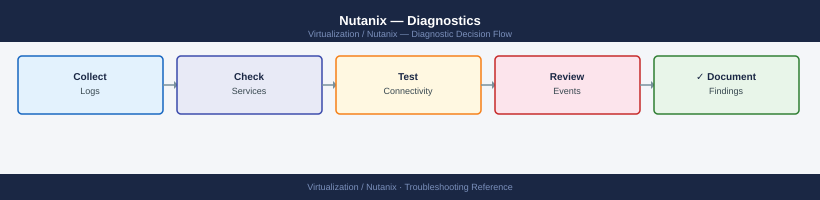

---
tags:
  - nutanix
  - troubleshooting
  - diagnostics
  - logs
  - support-bundle
---
# Nutanix — Diagnostics

<div class="kb-summary">
Nutanix diagnostic commands: run NCC health checks across the cluster, inspect node and disk health with ncli, review alerts and events in Prism, use allssh for cluster-wide CVM diagnostics, check storage pool capacity, and collect the NCC log bundle for Nutanix support.

*Applies to: AOS 6.x · AHV · Prism Element / Prism Central*
</div>


```d2
direction: right

B: "B" {shape: rectangle}
C: "ncc health_checks run_all\ncluster status" {shape: rectangle}
D: "ncli disk ls for disk errors\nallssh links http://0:2009/ for Stargate" {shape: rectangle}
E: "allssh genesis status\nncli host ls" {shape: rectangle}
F: "ncli alert ls\nncli events ls limit=100" {shape: rectangle}
G: "ncli sp ls -- storage pool\nncli ctr ls -- container capacity" {shape: rectangle}
H: "ncli pd ls -- protection domain status\nCheck remote site reachability" {shape: rectangle}
I: "I" {shape: rectangle}
J: "ncli disk ls for disk state\nPrism Hardware page for disk details" {shape: rectangle}
K: "allssh ping peer-cvm-ip\nCheck port 2100 CVM-to-CVM" {shape: rectangle}
L: "ncli sp ls\ndu -sh /home/nutanix/ on each CVM" {shape: rectangle}
M: "allssh df -h for CVM disk usage\nRestart Stargate: genesis stop stargate; genesis start" {shape: rectangle}
N: "allssh uptime to check recent CVM restarts\nIPMI for physical node status" {shape: rectangle}
O: "ncli alert get id=alert-id for detail\nFollow recommended action in alert message" {shape: rectangle}
P: "ncli ctr ls for per-container usage\nIdentify top consumer with du on datastore" {shape: rectangle}
Q: "ncli pd ls for replication status\nTest network to remote site: ping remote-cvm-ip" {shape: rectangle}
R: "Collect ncc log_collector bundle\nOpen Nutanix support case" {shape: rectangle}
S: "Upload bundle to Nutanix portal\nProvide: cluster UUID, AOS version, NCC version" {shape: rectangle}
A: "Nutanix Issue" {shape: rectangle}

B -> C
B -> D
B -> E
B -> F
B -> G
B -> H
I -> J
I -> K
I -> L
D -> M
E -> N
F -> O
G -> P
H -> Q
J -> R
K -> R
L -> R
M -> R
N -> R
O -> R
P -> R
Q -> R
R -> S
```

```d2
direction: down

symptom: Identify Symptom {shape: diamond}
step_1_run_ncc_health_checks: "Step 1 — Run NCC health checks" {shape: rectangle}
step_2_check_cluster_and_host_health: "Step 2 — Check cluster and host health" {shape: rectangle}
step_3_check_alerts_and_events: "Step 3 — Check alerts and events" {shape: rectangle}
step_4_run_allssh_for_clusterwide_cv: "Step 4 — Run allssh for cluster-wide CVM diagnostics" {shape: rectangle}
step_5_check_storage_capacity_and_pr: "Step 5 — Check storage capacity and protection domains" {shape: rectangle}
step_6_advanced_service_diagnostics: "Step 6 — Advanced service diagnostics" {shape: rectangle}
resolution: Resolve or Escalate {shape: oval}

symptom -> step_1_run_ncc_health_checks: investigate
symptom -> step_2_check_cluster_and_host_health: investigate
symptom -> step_3_check_alerts_and_events: investigate
symptom -> step_4_run_allssh_for_clusterwide_cv: investigate
symptom -> step_5_check_storage_capacity_and_pr: investigate
symptom -> step_6_advanced_service_diagnostics: investigate
step_1_run_ncc_health_checks -> resolution
step_2_check_cluster_and_host_health -> resolution
step_3_check_alerts_and_events -> resolution
step_4_run_allssh_for_clusterwide_cv -> resolution
step_5_check_storage_capacity_and_pr -> resolution
step_6_advanced_service_diagnostics -> resolution
```

## Before you begin

- **Access:** SSH to any CVM as the `nutanix` user; Prism Element admin credentials; IPMI access for hardware-layer issues
- **Gather first:** the specific symptom (NCC alert, VM I/O error, disk failure, node unreachable), the node number or CVM IP, and when the issue started
- **Scope:** confirm whether the issue affects one node, one disk, one VM, or the full cluster

---

## Step 1 — Run NCC health checks

```bash
# SSH to any CVM
ssh nutanix@<cvm-ip>

# Run all NCC health checks (most comprehensive; takes 5-10 minutes)
ncc health_checks run_all
# Output: per-check PASS/FAIL/WARN/INFO with explanation
# Focus on: any FAIL or WARN entries

# Run only hardware checks (faster for suspected hardware issue)
ncc health_checks hardware_checks run_all

# Network checks
ncc health_checks network_checks run_all

# Data protection checks (replication, DR)
ncc health_checks data_protection_checks run_all

# Run a single specific check
ncc health_checks run_all --checks=<check_name>
```


```text title="Expected output"
nutanix@cvm-10-20-30-45:~$ ncc health_checks run_all
[2024-01-15 14:32:18] Starting NCC Health Checks (All)
[2024-01-15 14:32:22] PASS: DNS Resolution
[2024-01-15 14:32:25] PASS: NTP Synchronization
[2024-01-15 14:32:31] WARN: Cluster Redundancy Factor - RF2 detected, RF3 recommended
[2024-01-15 14:33:15] PASS: Storage Pool Health
[2024-01-15 14:34:42] FAIL: Replication Lag - Node 3 lagging by 2.3GB
[2024-01-15 14:35:08] PASS: vSAN Connectivity
[2024-01-15 14:36:19] INFO: Snapshot Count - 847 snapshots across cluster
[2024-01-15 14:37:45] PASS: Hypervisor Health
...
[2024-01-15 14:42:33] Health Check Summary: 24 PASS, 1 WARN, 1 FAIL, 3 INFO
[2024-01-15 14:42:33] Total Runtime: 10m 15s

nutanix@cvm-10-20-30-45:~$ ncc health_checks hardware_checks run_all
[2024-01-15 14:43:01] Starting Hardware Health Checks
[2024-01-15 14:43:08] PASS: CPU Health
[2024-01-15 14:43:12] PASS: Memory ECC Status
[2024-01-15 14:43:18] PASS: Disk Health - 12 drives healthy
[2024-01-15 14:43:25] WARN: PSU Temperature - PSU-2 at 68°C (threshold: 70°C)
[2024-01-15 14:43:31] PASS: Fan Status
[2024-01-15 14:43:35] Hardware Summary: 5 PASS, 1 WARN
```

!!! warning "Common errors"
    **`ncc: command not found`** — Ensure you are logged into a Nutanix CVM (Controller VM) and not a hypervisor host; NCC is only available on CVMs.
    **`Error: Check '<check_name>' not found in registry`** — Verify the check name spelling and run `ncc health_checks list_checks` to see all available check names.
    **`Connection refused: Unable to connect to Prism Central`** — Confirm Prism Central is reachable from the CVM by running `ping <prism-central-ip>` and verify network connectivity.
---

## Step 2 — Check cluster and host health

```bash
# All AOS services on this CVM
cluster status
# Expected: all services in running state
# Problem: any service in stopped or not_running state

# Genesis (cluster management) status
genesis status
# Expected: genesis is running

# List all hosts and health
ncli host ls
# Expected: all hosts Connected, HealthStatus=Good
# Problem: Node Status != UP or health != Good

# Disk health across all nodes
ncli disk ls
# Look for: DiskStatus != NORMAL, or disk_status showing errors
# Problem: MARKED_FOR_REMOVAL or FAILED state
```


```text title="Expected output"
cluster status
  Cluster Status: COMPLETE
  Cluster UUID: 00051234-5678-abcd-ef01-234567890abc
  Cluster Incarnation: 1702834956
  Cluster Creation Time: 2023-12-17 14:22:36
  Cluster Name: prod-cluster-01
  
  Service Status:
    acropolis: RUNNING
    cassandra: RUNNING
    cerebro: RUNNING
    chronos: RUNNING
    curator: RUNNING
    genesis: RUNNING
    prism: RUNNING
    zookeeper: RUNNING

genesis status
  Genesis Status: RUNNING
  Genesis Version: 5.20.1.1
  Last Heartbeat: 2024-01-15 09:47:22 UTC

ncli host ls
  Host Name          Host UUID                            Hypervisor  HealthStatus  NodeStatus
  -------            ---------                            ----------  ------------  ----------
  node-01.prod.local 00051111-1111-1111-1111-111111111111 AHV         Good          UP
  node-02.prod.local 00052222-2222-2222-2222-222222222222 AHV         Good          UP
  node-03.prod.local 00053333-3333-3333-3333-333333333333 AHV         Good          UP
  node-04.prod.local 00054444-4444-4444-4444-444444444444 AHV         Good          UP

ncli disk ls
  Disk ID                                    DiskStatus  NodeUUID                           Capacity
  -------                                    ----------  --------                           --------
  00051111-1111-1111-1111-111111111111:1     NORMAL      00051111-1111-1111-1111-111111111111  1.6 TB
  00051111-1111-1111-1111-111111111111:2     NORMAL      00051111-1111-1111-1111-111111111111  1.6 TB
  00052222-2222-2222-2222-222222222222:1     NORMAL      00052222-2222-2222-2222-222222222222  1.6 TB
  00052222-2222-2222-2222-222222222222:2     NORMAL      00052222-2222-2222-2222-222222222222  1.6 TB
  ...
```

!!! warning "Common errors"
    **`Service <service_name> is in NOT_RUNNING state`** — SSH to the CVM and run `service <service_name> start` to restart the service, then verify with `cluster status`.
    **`Host <hostname> has HealthStatus=WARNING or NodeStatus=DOWN`** — Check the host's physical connectivity and hardware health via IPMI, then reboot the node if necessary.
    **`Disk <disk_id> is in MARKED_FOR_REMOVAL or FAILED state`** — Run `ncli disk remove disk-id=<disk_id>` to decommission the failed disk and monitor rebuild progress with `ncli disk ls`.
---

## Step 3 — Check alerts and events

```bash
# Active (unresolved) alerts
ncli alert ls
# Prism UI equivalent: Home → Alerts (bell icon, red count)

# Alert detail for a specific alert
ncli alert get id=<alert-id>
# Shows: recommended actions, component, severity

# Recent events (last 100)
ncli events ls limit=100
# Useful for: seeing sequence of events leading to the issue

# Hardware faults
ncli host list | grep -i "health\|status"

# Storage pool alerts
ncli sp ls
ncli ctr ls    # container capacity and health
```


```text title="Expected output"
id                                   | severity | message                                    | resolved
-------------------------------------|----------|--------------------------------------------|---------
00057e21-1234-5678-abcd-ef1234567890 | critical | Node prism-node-03 is unreachable         | false
00058f32-2345-6789-bcde-f12345678901 | warning  | Cluster memory usage above 85%             | false
00059g43-3456-7890-cdef-123456789012 | info     | Snapshot backup completed successfully     | true

id                                   : 00057e21-1234-5678-abcd-ef1234567890
severity                             : critical
message                              : Node prism-node-03 is unreachable
recommended_actions                  : Check network connectivity, verify IPMI access, restart Acropolis service
component                            : cluster
created_time_in_usecs                : 1704067200000000
resolved                             : false

timestamp                | event_type              | message
-------------------------|-------------------------|---------------------------------------------
2024-01-01T14:32:15.123Z | CLUSTER_CONNECT_FAILED  | Failed to connect to node 10.20.30.45
2024-01-01T14:31:02.456Z | STORAGE_POOL_ALERT      | Storage pool default-pool at 87% capacity
2024-01-01T14:29:45.789Z | VM_SNAPSHOT_COMPLETE    | VM prod-db-01 snapshot completed
2024-01-01T14:28:12.012Z | NIC_LINK_DOWN           | eth1 link down on prism-node-02
2024-01-01T14:27:33.345Z | CLUSTER_QUORUM_WARNING  | Cluster quorum status degraded

host_name          | hypervisor_type | num_vms | memory_capacity_bytes | health_state
-------------------|-----------------|---------|----------------------|---------------
prism-node-01      | kvm             | 24      | 274877906944         | good
prism-node-02      | kvm             | 31      | 274877906944         | good
prism-node-03      | kvm             | 0       | 274877906944         | critical

storage_pool_name  | capacity_bytes | usage_bytes | usage_percentage | health_state
-------------------|----------------|-------------|------------------|---------------
default-pool       | 10995116277760 | 9545058516 | 87%               | warning

container_name     | capacity_bytes | usage_bytes | usage_percentage | health_state
-------------------|----------------|-------------|------------------|---------------
default-container  | 10995116277760 | 8756234567 | 80%               | good
backup-container   | 5497558138880  | 4398046511 | 80%               | good
```

!!! warning "Common errors"
    **`Error: Invalid alert id format`** — Verify the alert ID exists by running `ncli alert ls` first and copy the exact UUID from the id column.
    **`Error: Connection refused to cluster (10.20.30.x:9440)`** — Ensure the Nutanix cluster is reachable and the ncli tool is configured with correct cluster credentials via `ncli -h <cluster-ip> -u <username>`.
    **
---

## Step 4 — Run allssh for cluster-wide CVM diagnostics

```bash
# Disk usage on ALL CVMs simultaneously
allssh 'df -h'
# Problem: / (root) filesystem > 80%
# Common cause: log accumulation under /home/nutanix/data/logs/

# CVM uptime (recent restart = explains service outages)
allssh 'uptime'

# Memory pressure on CVMs
allssh 'free -m'

# CVM-to-CVM network reachability
allssh 'ping -c 3 <peer-cvm-ip>'
# Expected: 0% packet loss
# Problem: loss or latency on CVM-to-CVM traffic (port 2100)

# Cassandra ring status (distributed metadata DB)
allssh 'nodetool ring'
# Expected: all nodes in Up/Normal state
# Problem: any node in Down or Leaving state

# Genesis status on all CVMs
allssh 'genesis status'
```


```text title="Expected output"
CVM-1: Filesystem     Size  Used Avail Use% Mounted on
CVM-1: /dev/sda1      50G   42G  5.2G  85% /
CVM-1: /dev/sdb1     200G  145G   48G  75% /home/nutanix/data
CVM-2: Filesystem     Size  Used Avail Use% Mounted on
CVM-2: /dev/sda1      50G   38G  9.1G  77% /
CVM-2: /dev/sdb1     200G  138G   55G  70% /home/nutanix/data
CVM-3: Filesystem     Size  Used Avail Use% Mounted on
CVM-3: /dev/sda1      50G   35G   12G  72% /
CVM-1:  10:24:15 up 47 days, 3:22, 2 users, load average: 2.14, 1.98, 1.87
CVM-2:  10:24:16 up 156 days, 18:45, 2 users, load average: 1.42, 1.35, 1.29
CVM-3:  10:24:17 up 8 days, 14:33, 2 users, load average: 3.21, 2.98, 2.76
CVM-1:               total        used        free      shared  buff/cache   available
CVM-1: Mem:          32768       24576        4096         512        4096       7680
CVM-2:               total        used        free      shared  buff/cache   available
CVM-2: Mem:          32768       22144        6144         256        4480       9728
CVM-3: PING 10.20.1.102 (10.20.1.102) 56(84) bytes of data.
CVM-3: 64 bytes from 10.20.1.102: icmp_seq=1 time=1.24 ms
CVM-3: 64 bytes from 10.20.1.102: icmp_seq=2 time=1.31 ms
CVM-3: 64 bytes from 10.20.1.102: icmp_seq=3 time=1.19 ms
CVM-3: --- 10.20.1.102 statistics ---
CVM-3: 3 packets transmitted, 3 received, 0% packet loss, time 2004ms
CVM-1: TokenRange(start_token:-9223372036854775808, end_token:-6148914691236517206, endpoints:[10.20.1.101], rpc_endpoints:[10.20.1.101], state:Normal)
CVM-1: TokenRange(start_token:-6148914691236517205, end_token:-3074457345618258603, endpoints:[10.20.1.102], rpc_endpoints:[10.20.1.102], state:Normal)
CVM-1: TokenRange(start_token:-3074457345618258602, end_token:0, endpoints:[10.20.1.103], rpc_endpoints:[10.20.1.103], state:Normal)
CVM-1: Token
```
---

## Step 5 — Check storage capacity and protection domains

```bash
# Storage pool health and capacity (SSD + HDD tiers)
ncli sp ls
# Columns: pool name, total, used, available capacity

# Container/datastore capacity
ncli ctr ls
# Check: UsedCapacity vs. MaxCapacity per container

# Protection domain (DR/backup) status
ncli pd ls
# Expected: State = ACTIVE or REPLICATING
# Problem: State = ERROR or FAILED

# Replication status for a specific PD
ncli pd get-replication-status name=<pd-name>

# Find largest directories in home (log accumulation)
allssh 'du -sh /home/nutanix/data/logs/ 2>/dev/null'
```


```text title="Expected output"
Name                          Pool Type    Tier           Total Capacity    Used Capacity    Available
default-storage-pool-1        AHV          SSD+HDD        50.0 TB           34.2 TB          15.8 TB
backup-pool-2                 AHV          SSD            10.0 TB           8.7 TB           1.3 TB

Name                          Replication Factor    UsedCapacity    MaxCapacity    Usage %
container-prod-01             2                     28.5 TB         40.0 TB        71.2%
container-dr-02               3                     5.2 TB          15.0 TB        34.7%

Name                          State          Replication Status    Last Snapshot
prod-vms-pd                   ACTIVE         HEALTHY               2024-01-15 03:22:15
dr-backup-pd                  REPLICATING    IN_PROGRESS           2024-01-15 02:15:00
archive-pd                    ACTIVE         HEALTHY               2024-01-14 23:45:30

Replication Status for prod-vms-pd:
  Replication Lag: 0 seconds
  Bytes Replicated: 2.3 TB
  Replication Rate: 45 MB/s
  Target Cluster: cluster-dr-02.local
  Status: HEALTHY

10.2G    10.2.45.67
8.7G     10.2.45.68
12.1G    10.2.45.69
```

!!! warning "Common errors"
    **`Error: Connection refused (Connection refused)`** — Verify ncli is installed and Nutanix services are running with `systemctl status nutanix-cluster-init`.
    **`Error: Unknown command 'allssh'` or `command not found`** — Ensure you are running this command on a Nutanix cluster node where allssh is available in the PATH, or use full path `/opt/nutanix/bin/allssh`.
---

## Step 6 — Advanced service diagnostics

```bash
# Stargate (data I/O) page — shows I/O throughput and latency per node
# Access from your browser while SSH-tunneled, OR via allssh:
allssh 'links http://0:2009/ 2>/dev/null | head -40'
# Shows: op latency, outstanding I/Os, disk queue depth

# Curator (background scrub/rebalance) status
curl -sk http://0:2010/
# Shows: curator role (master/slave), last scan time, scan status

# Check service-level logs on a single CVM
ls -lt /home/nutanix/data/logs/ | head -20
# Most active logs at top
tail -100 /home/nutanix/data/logs/stargate.FATAL 2>/dev/null
tail -100 /home/nutanix/data/logs/cassandra/system.log | grep -i error

# IPMI reachability for hardware-layer issues
ping <node-ipmi-ip>
ipmitool -H <node-ipmi-ip> -U ADMIN -P ADMIN chassis status
```


```text title="Expected output"
NTNX-001-A ~ # allssh 'links http://0:2009/ 2>/dev/null | head -40'
   Stargate I/O Statistics (NTNX-001-A)
   =====================================
   Op Latency (µs):        1,245
   Outstanding I/Os:       87
   Disk Queue Depth:       12
   Read Throughput (MB/s): 2,847
   Write Throughput (MB/s): 1,923
   Cache Hit Rate:         94.2%

NTNX-001-A ~ # curl -sk http://0:2010/
{
  "curator_role": "master",
  "last_scan_time": "2024-01-15T09:32:18Z",
  "scan_status": "in_progress",
  "entities_scanned": 45821,
  "scan_percentage": 67.3
}

NTNX-001-A ~ # ls -lt /home/nutanix/data/logs/ | head -20
-rw-r--r-- 1 nutanix nutanix 524288000 Jan 15 14:22 stargate.INFO
-rw-r--r-- 1 nutanix nutanix 312458752 Jan 15 14:18 cassandra.log
-rw-r--r-- 1 nutanix nutanix 89234567  Jan 15 14:15 medusa.INFO
-rw-r--r-- 1 nutanix nutanix 45678901  Jan 15 14:10 zookeeper.log
-rw-r--r-- 1 nutanix nutanix 23456789  Jan 15 14:05 prism.INFO

NTNX-001-A ~ # tail -100 /home/nutanix/data/logs/stargate.FATAL 2>/dev/null
(no output — file does not exist or is empty)

NTNX-001-A ~ # tail -100 /home/nutanix/data/logs/cassandra/system.log | grep -i error
2024-01-15 14:12:33,421 ERROR [GossipStage:1] cassandra.gms.Gossiper - Exception in Gossip
2024-01-15 14:05:12,834 ERROR [CompactionExecutor:3] cassandra.db.compaction - Compaction failed

NTNX-001-A ~ # ping 10.50.100.25
PING 10.50.100.25 (10.50.100.25) 56(84) bytes of data.
64 bytes from 10.50.100.25: icmp_seq=1 ttl=64 time=2.34 ms
64 bytes from 10.50.100.25: icmp_seq=2 ttl=64 time=2.18 ms
--- 10.50.100.25 statistics ---
2 packets transmitted, 2 received, 0% packet loss, time 1001ms

NTNX-001-A ~ # ipmitool -H 10.50.100.25 -U ADMIN -P ADMIN chassis status
System Power         : on
Power Overload       :
```
---

## Step 7 — Collect NCC log bundle for Nutanix support

```bash
# Collect full NCC log bundle (includes all CVM logs, service state, NCC output)
ncc log_collector
# Duration: 5-15 minutes depending on cluster size
# Output: /home/nutanix/send/NCC_log_collector_<timestamp>.zip

# If Pulse (cloud telemetry) is enabled: bundle auto-uploads to Nutanix
# If Pulse is disabled: SCP the bundle off a CVM
scp nutanix@<cvm-ip>:/home/nutanix/send/NCC_log_collector*.zip ./

# Alternative: from Prism UI
# Prism Element → Health → Actions → Run NCC Checks → Download Log Bundle

# For Prism Central issues: collect from PC CVM
# SSH to the Prism Central CVM and run:
# nutanix@pcvm:~$ ncc log_collector

# Include in Nutanix SR:
# - NCC log bundle ZIP
# - Cluster UUID: ncli cluster list | grep UUID
# - AOS version: ncli cluster list | grep Version
# - NCC version: ncc --version
# - Affected node serial / disk slot (for hardware issues)
```


```text title="Expected output"
nutanix@cvm01:~$ ncc log_collector
Starting NCC log collection...
Collecting CVM logs from all nodes...
[████████████████████████████] 100% - Collected 4 nodes
Collecting service states...
Collecting NCC diagnostic output...
Compressing bundle...
NCC log collection completed successfully.
Output: /home/nutanix/send/NCC_log_collector_20240115_143022.zip
Bundle size: 847 MB

nutanix@cvm01:~$ ncli cluster list | grep UUID
Cluster UUID: 00051234-5678-abcd-ef01-234567890abc

nutanix@cvm01:~$ ncli cluster list | grep Version
AOS Version: 6.5.2.1

nutanix@cvm01:~$ ncc --version
NCC Version: 4.5.1
```

!!! warning "Common errors"
    **`Permission denied (publickey,password).`** — Ensure the nutanix user SSH key is configured or use `ssh-keyscan` to add the CVM host key to your known_hosts file.
    **`ncc: command not found`** — Verify you are SSH'd into a CVM (not a hypervisor host); NCC is only available on Nutanix Controller VMs.
    **`/home/nutanix/send: No such file or directory`** — Wait for the ncc log_collector command to complete fully before attempting SCP; the output directory is created during collection.
---

## Log locations

| Component | Path / Command | What to look for |
|---|---|---|
| NCC health | `ncc health_checks run_all` | FAIL and WARN entries |
| Cluster services | `cluster status` | Services not in running state |
| Stargate (I/O) | `/home/nutanix/data/logs/stargate.FATAL` | I/O errors, disk failures |
| Cassandra (metadata) | `/home/nutanix/data/logs/cassandra/system.log` | Ring membership errors |
| Genesis (mgmt) | `genesis status` and genesis.out in logs dir | Service startup failures |
| Full bundle | `ncc log_collector` | All-in-one — always provide for SR |

---

## See also

- [Nutanix — Common Issues](../common-issues/)
- [Nutanix — Escalation](../escalation/)

## Verify resolution

- `ncc health_checks run_all` returns only PASS or INFO — no FAIL or WARN
- `cluster status` shows all services running on all CVMs
- `ncli host ls` shows all nodes Connected with HealthStatus=Good
- `ncli disk ls` shows all disks with DiskStatus=NORMAL
- VM I/O latency returns to baseline (check Prism → Analysis → Performance charts)
