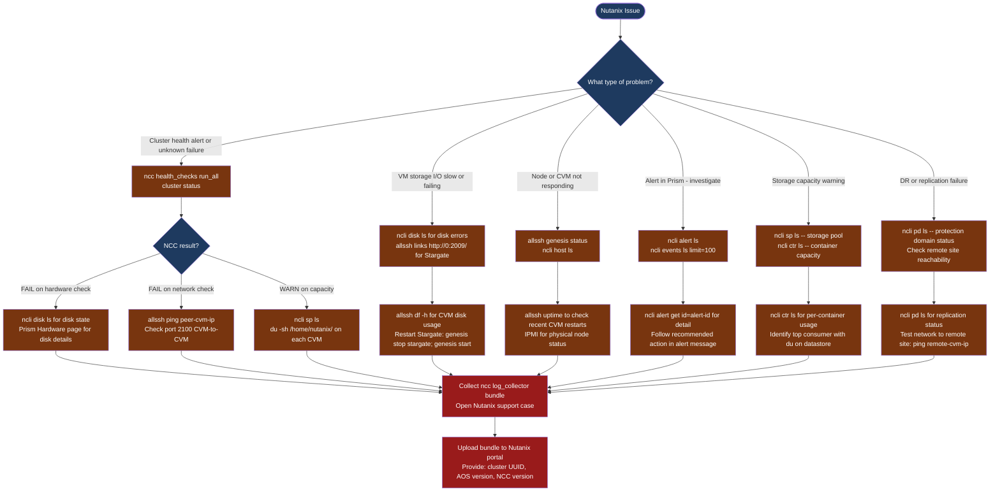

---
tags:
  - nutanix
  - troubleshooting
  - diagnostics
  - logs
  - support-bundle
---
# Nutanix — Diagnostics

<div class="kb-summary">
Nutanix diagnostic commands: run NCC health checks across the cluster, inspect node and disk health with ncli, review alerts and events in Prism, use allssh for cluster-wide CVM diagnostics, check storage pool capacity, and collect the NCC log bundle for Nutanix support.

*Applies to: AOS 6.x · AHV · Prism Element / Prism Central*
</div>

```text
┌─────────────────────────────── Nutanix — Diagnostics ─────────────────────────────────────────────────┐
│                                                                                                       │
│   ┌───────────────────────────────────────────────────────────────────────────────────────────────┐   │
│   │   Start here: ncc health_checks run_all → cluster status → ncli host ls                      │    │
│   │   CVM not joining: allssh 'genesis status' → check network between CVMs (port 2100)          │    │
│   │   Disk failure: ncli disk ls → Prism → Hardware → Disk marked for removal                    │    │
│   └───────────────────────────────────────────────────────────────────────────────────────────────┘   │
│                                                                                                       │
│   ┌──────────────────────────────────────────────┐  ┌─────────────────────────────────────────────┐   │
│   │           NCC and Cluster Health             │  │           Alerts and Event Review           │   │
│   │   ncc health_checks run_all (all tests)      │  │   ncli alert ls (active alerts)             │   │
│   │   cluster status (all CVM services)          │  │   ncli events ls limit=100                  │   │
│   │   genesis status (cluster mgmt daemon)       │  │   Prism UI: Home → Alerts (red bell)        │   │
│   │   ncli host ls (node connectivity)           │  │   ncli disk ls (disk health per node)       │   │
│   └──────────────────────────────────────────────┘  └─────────────────────────────────────────────┘   │
│                                                                                                       │
│  Run NCC first → then narrow to host/disk/network layer                                               │
│                                                                                                       │
│                          ▼                                                 ▼                          │
│                                                                                                       │
│   ┌──────────────────────────────────────────────┐  ┌─────────────────────────────────────────────┐   │
│   │          allssh Cluster-wide Checks          │  │           Support Bundle Collection         │   │
│   │   allssh 'df -h' — CVM disk usage           │  │   ncc log_collector (full bundle)           │    │
│   │   allssh 'uptime' — CVM restart history     │  │   Sent via Pulse or downloaded from Prism   │    │
│   │   allssh 'nodetool ring' — Cassandra ring   │  │   SCP from /home/nutanix/send/              │    │
│   │   allssh 'genesis status' — service state   │  │   Upload to Nutanix Portal for support      │    │
│   └──────────────────────────────────────────────┘  └─────────────────────────────────────────────┘   │
│                                                                                                       │
│  Physical Infrastructure:                                                                             │
│  Nutanix nodes (hybrid or all-flash) · per-node CVM (Controller VM, AOS services) · AHV hypervisor    │
│  Prism Element (per-cluster UI) · Prism Central (multi-cluster management) · IPMI for hardware access │
│                                                                                                       │
│  Key terms:                                                                                           │
│  NCC           = Nutanix Cluster Check; automated test suite; run_all performs all health checks      │
│  CVM           = Controller VM; runs AOS storage stack per node; manages disk I/O                     │
│  Genesis       = cluster management daemon; runs on each CVM; coordinates service startup             │
│  Cassandra     = distributed metadata DB; stores vDisk metadata, extent group location                │
│  Stargate      = data I/O service; handles VM read/write operations through the CVM                   │
│  Curator       = background cluster maintenance service; handles scrubbing and rebalancing            │
│  allssh        = wrapper that runs a command on all CVMs simultaneously                               │
│  nodetool ring = Cassandra CLI; shows ring membership and replication state of all nodes              │
│  Pulse         = Nutanix cloud telemetry; auto-uploads logs and health data to Nutanix                │
│  Protection domain = DR/backup boundary; contains VMs or files replicated to a remote site            │
│  ncli          = Nutanix CLI; available from any CVM; equivalent to Prism UI operations               │
│  log_collector = ncc subcommand that collects all CVM logs into a support bundle                      │
│                                                                                                       │
└───────────────────────────────────────────────────────────────────────────────────────────────────────┘
```



## Before you begin

- **Access:** SSH to any CVM as the `nutanix` user; Prism Element admin credentials; IPMI access for hardware-layer issues
- **Gather first:** the specific symptom (NCC alert, VM I/O error, disk failure, node unreachable), the node number or CVM IP, and when the issue started
- **Scope:** confirm whether the issue affects one node, one disk, one VM, or the full cluster

---

## Step 1 — Run NCC health checks

```bash
# SSH to any CVM
ssh nutanix@<cvm-ip>

# Run all NCC health checks (most comprehensive; takes 5-10 minutes)
ncc health_checks run_all
# Output: per-check PASS/FAIL/WARN/INFO with explanation
# Focus on: any FAIL or WARN entries

# Run only hardware checks (faster for suspected hardware issue)
ncc health_checks hardware_checks run_all

# Network checks
ncc health_checks network_checks run_all

# Data protection checks (replication, DR)
ncc health_checks data_protection_checks run_all

# Run a single specific check
ncc health_checks run_all --checks=<check_name>
```

---

## Step 2 — Check cluster and host health

```bash
# All AOS services on this CVM
cluster status
# Expected: all services in running state
# Problem: any service in stopped or not_running state

# Genesis (cluster management) status
genesis status
# Expected: genesis is running

# List all hosts and health
ncli host ls
# Expected: all hosts Connected, HealthStatus=Good
# Problem: Node Status != UP or health != Good

# Disk health across all nodes
ncli disk ls
# Look for: DiskStatus != NORMAL, or disk_status showing errors
# Problem: MARKED_FOR_REMOVAL or FAILED state
```

---

## Step 3 — Check alerts and events

```bash
# Active (unresolved) alerts
ncli alert ls
# Prism UI equivalent: Home → Alerts (bell icon, red count)

# Alert detail for a specific alert
ncli alert get id=<alert-id>
# Shows: recommended actions, component, severity

# Recent events (last 100)
ncli events ls limit=100
# Useful for: seeing sequence of events leading to the issue

# Hardware faults
ncli host list | grep -i "health\|status"

# Storage pool alerts
ncli sp ls
ncli ctr ls    # container capacity and health
```

---

## Step 4 — Run allssh for cluster-wide CVM diagnostics

```bash
# Disk usage on ALL CVMs simultaneously
allssh 'df -h'
# Problem: / (root) filesystem > 80%
# Common cause: log accumulation under /home/nutanix/data/logs/

# CVM uptime (recent restart = explains service outages)
allssh 'uptime'

# Memory pressure on CVMs
allssh 'free -m'

# CVM-to-CVM network reachability
allssh 'ping -c 3 <peer-cvm-ip>'
# Expected: 0% packet loss
# Problem: loss or latency on CVM-to-CVM traffic (port 2100)

# Cassandra ring status (distributed metadata DB)
allssh 'nodetool ring'
# Expected: all nodes in Up/Normal state
# Problem: any node in Down or Leaving state

# Genesis status on all CVMs
allssh 'genesis status'
```

---

## Step 5 — Check storage capacity and protection domains

```bash
# Storage pool health and capacity (SSD + HDD tiers)
ncli sp ls
# Columns: pool name, total, used, available capacity

# Container/datastore capacity
ncli ctr ls
# Check: UsedCapacity vs. MaxCapacity per container

# Protection domain (DR/backup) status
ncli pd ls
# Expected: State = ACTIVE or REPLICATING
# Problem: State = ERROR or FAILED

# Replication status for a specific PD
ncli pd get-replication-status name=<pd-name>

# Find largest directories in home (log accumulation)
allssh 'du -sh /home/nutanix/data/logs/ 2>/dev/null'
```

---

## Step 6 — Advanced service diagnostics

```bash
# Stargate (data I/O) page — shows I/O throughput and latency per node
# Access from your browser while SSH-tunneled, OR via allssh:
allssh 'links http://0:2009/ 2>/dev/null | head -40'
# Shows: op latency, outstanding I/Os, disk queue depth

# Curator (background scrub/rebalance) status
curl -sk http://0:2010/
# Shows: curator role (master/slave), last scan time, scan status

# Check service-level logs on a single CVM
ls -lt /home/nutanix/data/logs/ | head -20
# Most active logs at top
tail -100 /home/nutanix/data/logs/stargate.FATAL 2>/dev/null
tail -100 /home/nutanix/data/logs/cassandra/system.log | grep -i error

# IPMI reachability for hardware-layer issues
ping <node-ipmi-ip>
ipmitool -H <node-ipmi-ip> -U ADMIN -P ADMIN chassis status
```

---

## Step 7 — Collect NCC log bundle for Nutanix support

```bash
# Collect full NCC log bundle (includes all CVM logs, service state, NCC output)
ncc log_collector
# Duration: 5-15 minutes depending on cluster size
# Output: /home/nutanix/send/NCC_log_collector_<timestamp>.zip

# If Pulse (cloud telemetry) is enabled: bundle auto-uploads to Nutanix
# If Pulse is disabled: SCP the bundle off a CVM
scp nutanix@<cvm-ip>:/home/nutanix/send/NCC_log_collector*.zip ./

# Alternative: from Prism UI
# Prism Element → Health → Actions → Run NCC Checks → Download Log Bundle

# For Prism Central issues: collect from PC CVM
# SSH to the Prism Central CVM and run:
# nutanix@pcvm:~$ ncc log_collector

# Include in Nutanix SR:
# - NCC log bundle ZIP
# - Cluster UUID: ncli cluster list | grep UUID
# - AOS version: ncli cluster list | grep Version
# - NCC version: ncc --version
# - Affected node serial / disk slot (for hardware issues)
```

---

## Log locations

| Component | Path / Command | What to look for |
|---|---|---|
| NCC health | `ncc health_checks run_all` | FAIL and WARN entries |
| Cluster services | `cluster status` | Services not in running state |
| Stargate (I/O) | `/home/nutanix/data/logs/stargate.FATAL` | I/O errors, disk failures |
| Cassandra (metadata) | `/home/nutanix/data/logs/cassandra/system.log` | Ring membership errors |
| Genesis (mgmt) | `genesis status` and genesis.out in logs dir | Service startup failures |
| Full bundle | `ncc log_collector` | All-in-one — always provide for SR |

---

## See also

- [Nutanix — Common Issues](common-issues/)
- [Nutanix — Escalation](escalation/)

## Verify resolution

- `ncc health_checks run_all` returns only PASS or INFO — no FAIL or WARN
- `cluster status` shows all services running on all CVMs
- `ncli host ls` shows all nodes Connected with HealthStatus=Good
- `ncli disk ls` shows all disks with DiskStatus=NORMAL
- VM I/O latency returns to baseline (check Prism → Analysis → Performance charts)
