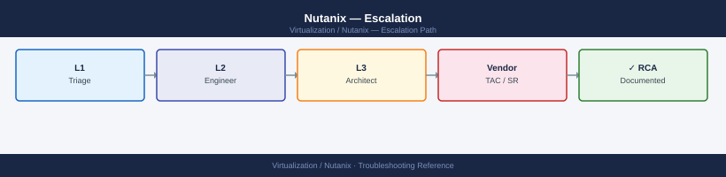
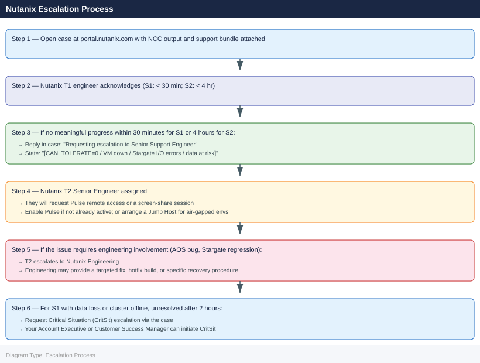

---
tags:
  - nutanix
  - troubleshooting
  - escalation
  - support
  - gss
search:
  boost: 1.5
description: "How to escalate Nutanix cluster issues to Nutanix Global Support Services (GSS): what data to collect, how to generate the NCC health report and support..."
---
# Nutanix — Escalation

<div class="kb-summary">
How to escalate Nutanix cluster issues to Nutanix Global Support Services (GSS): what data to collect, how to generate the NCC health report and support bundle, step-by-step case creation on portal.nutanix.com, and the escalation path when progress stalls.

*Applies to: AOS 6.x · AHV*
</div>



---

```d2
direction: down

symptom: Identify Symptom {shape: diamond}
when_to_escalate_immediately: "When to Escalate Immediately" {shape: rectangle}
preescalation_selfcheck: "Pre-Escalation Self-Check" {shape: rectangle}
stepbystep_data_collection: "Step-by-Step Data Collection" {shape: rectangle}
how_to_open_the_case_on_portalnutani: "How to Open the Case on portal.nutanix.com" {shape: rectangle}
escalation_path: "Escalation Path" {shape: rectangle}
enabling_remote_access_for_gss_pulse: "Enabling Remote Access for GSS (Pulse)" {shape: rectangle}
resolution: Resolve or Escalate {shape: oval}

symptom -> when_to_escalate_immediately: investigate
symptom -> preescalation_selfcheck: investigate
symptom -> stepbystep_data_collection: investigate
symptom -> how_to_open_the_case_on_portalnutani: investigate
symptom -> escalation_path: investigate
symptom -> enabling_remote_access_for_gss_pulse: investigate
when_to_escalate_immediately -> resolution
preescalation_selfcheck -> resolution
stepbystep_data_collection -> resolution
how_to_open_the_case_on_portalnutani -> resolution
escalation_path -> resolution
enabling_remote_access_for_gss_pulse -> resolution
```

## Before you begin

- **Access required:** Nutanix Portal account linked to your support contract (portal.nutanix.com); SSH access to any CVM in the cluster (default user: `nutanix`); Prism Element admin access
- **Do NOT restart multiple CVMs simultaneously** — each CVM is the storage controller for its node; taking multiple CVMs offline at once can reduce the cluster below RF threshold and cause data loss
- **NCC and support bundle first** — GSS will request these immediately; having them ready before calling significantly reduces time to resolution
- **Enable Pulse before calling** — Pulse (call-home) allows GSS engineers to remotely access the cluster via a secure tunnel, which accelerates diagnosis for complex issues

---

## When to Escalate Immediately

Escalate to Nutanix GSS without delay for any of these:

- **`CAN_TOLERATE_FAILURE_COUNT=0`** — the cluster cannot tolerate any further failure; one more disk or node failure = data loss
- **Production VMs are down** and cannot be restored by standard procedures
- **Data loss suspected** — Stargate returning I/O errors to VMs; VMs crashing on disk write
- **CVM unresponsive** — SSH to CVM fails; IPMI console shows hardware faults
- **Multiple disks failed on the same node** — beyond RF tolerance
- **Cluster will not accept writes** — storage full with no quick way to free space
- **Cluster upgrade failure** — AOS/AHV upgrade stuck or failed mid-way

For all other issues: attempt NCC triage and log review first (see [Diagnostics](../diagnostics/)), then open a lower-severity case.

---

## Pre-Escalation Self-Check

Run these before opening the case.

| Check | Command | Expected result |
|---|---|---|
| AOS version | `ncli cluster info \| grep -i version` | Note full version (e.g. 6.7.2) |
| Cluster UUID | `ncli cluster info \| grep -i uuid` | Note UUID for the case |
| RF and tolerance | `ncli cluster info \| grep -i "tolerate\|replication"` | CAN_TOLERATE_FAILURE_COUNT > 0 |
| Node health | `ncli host list` | All nodes show UP |
| Disk health | `ncli disk list \| grep -v NORMAL` | Empty output (all disks NORMAL) |
| CVM reachability | `ping <cvm-ip>` from another CVM | CVM responds |
| Genesis status | `genesis status` (on CVM) | All services Running |
| NCC quick check | `ncc --health_checks run_all 2>&1 \| tail -30` | PASS (or note which checks FAIL) |

---

## Step-by-Step Data Collection

### 1. Get the cluster info and version

```bash
# SSH to any CVM as nutanix
ssh nutanix@<cvm-ip>

# Cluster name, AOS version, RF, UUID
ncli cluster info

# Node serial numbers and IPs (required for case registration)
ncli host list

# Any disk not in NORMAL state
ncli disk list | grep -v NORMAL
```


```text title="Expected output"
nutanix@192.168.1.45's password: 
Last login: Wed Jan 15 14:32:18 2025 from 10.0.0.88

nutanix@cvm-45:~$ ncli cluster info
Cluster Name                : prod-cluster-01
Cluster UUID                : 00058e6e-8888-4d2f-a1b2-3c4d5e6f7g8h
AOS Version                 : 6.5.2.1
Replication Factor          : 3
Redundancy Factor           : 2
Encrypted                   : false
Cluster Redundancy State    : REDUNDANT

nutanix@cvm-45:~$ ncli host list
  Host ID                           Serial Number      IP Address      Hypervisor
  ========================================================================
  00058e6e-1111-4d2f-a1b2-3c4d5e6f : NTNX-ABC123XYZ01 : 192.168.1.41  : AHV
  00058e6e-2222-4d2f-a1b2-3c4d5e6f : NTNX-ABC123XYZ02 : 192.168.1.42  : AHV
  00058e6e-3333-4d2f-a1b2-3c4d5e6f : NTNX-ABC123XYZ03 : 192.168.1.43  : AHV
  00058e6e-4444-4d2f-a1b2-3c4d5e6f : NTNX-ABC123XYZ04 : 192.168.1.45  : AHV

nutanix@cvm-45:~$ ncli disk list | grep -v NORMAL
  Disk ID                           State       Host IP         Capacity
  ========================================================================
  00058e6e-disk-5555-4d2f-a1b2     : DEGRADED   : 192.168.1.42  : 1.6 TB
  00058e6e-disk-6666-4d2f-a1b2     : DEGRADED   : 192.168.1.42  : 1.6 TB
```

!!! warning "Common errors"
    **`Connection refused`** — Verify the CVM IP is correct and SSH service is running; check firewall rules allow port 22 from your source IP.
    **`ncli: command not found`** — Ensure you are logged in as the nutanix user and the PATH includes /usr/local/nutanix/bin; run `source /etc/profile` if needed.
    **`Permission denied (publickey,password)`** — Confirm the nutanix user credentials are correct and the CVM's SSH key-based authentication is configured if required by your environment.
### 2. Run NCC health checks

```bash
# Full NCC run — attach the full output to the case
ncc --health_checks run_all 2>&1 | tee /tmp/ncc-$(date +%Y%m%d%H%M).txt

# Quick check of critical checks only
ncc --health_checks run_all --ncc_critical_only=true 2>&1 | tail -100
```


```text title="Expected output"
Running NCC health checks on cluster...
[2024-01-15 14:32:18] Starting NCC v4.8.2 health check suite
[2024-01-15 14:32:19] Cluster: prod-cluster-01 | Nodes: 4 | AOS: 6.5.2.1
[2024-01-15 14:32:22] CHECK: DNS Resolution — PASS
[2024-01-15 14:32:25] CHECK: NTP Synchronization — PASS
[2024-01-15 14:32:31] CHECK: Disk Space — WARNING (node-3: 78% used)
[2024-01-15 14:32:45] CHECK: Network Connectivity — PASS
[2024-01-15 14:32:52] CHECK: Hypervisor Health — PASS
[2024-01-15 14:33:18] CHECK: Storage Pool Status — PASS
[2024-01-15 14:33:42] CHECK: Replication Factor — PASS
[2024-01-15 14:34:05] Health check complete. Results saved to /tmp/ncc-202401151432.txt
Summary: 7 PASS, 1 WARNING, 0 FAIL

Running critical checks only...
[2024-01-15 14:34:12] CHECK: Cluster Quorum — PASS
[2024-01-15 14:34:18] CHECK: Storage Redundancy — PASS
[2024-01-15 14:34:25] CHECK: Network Heartbeat — PASS
[2024-01-15 14:34:31] Critical checks complete: 3 PASS, 0 FAIL
```

!!! warning "Common errors"
    **`ncc: command not found`** — Ensure NCC is installed on the Prism Central or CVM by running `yum install ncc` or verify it is in your PATH.
    **`ERROR: Unable to connect to cluster — Connection refused`** — Verify cluster connectivity and that you are running the command from a node with network access to the cluster management interface.
    **`ERROR: Permission denied — ncc requires root or sudoer privileges`** — Run the command with `sudo` or ensure your user account has appropriate sudo permissions for NCC execution.
GSS will ask for the full NCC output as the first diagnostic step. A fresh NCC run captures the current cluster health state.

### 3. Collect the support bundle

**Via Prism Element UI:**

1. Prism Element → click the **Settings** gear → **Log Collector**.
2. Set the time range to cover the failure period (minimum last 4 hours).
3. Click **Collect Logs**.
4. Wait for the bundle to be generated (5–20 minutes).
5. Download and attach to the case.

**Via CLI:**

```bash
# SSH to any CVM as nutanix
# Generate support bundle (saves to /home/nutanix/support-bundle/)
logbay collect --case_id="<case-number>"

# Without case ID:
logbay collect --output_dir="/tmp/logbay-$(date +%Y%m%d)"

# List generated bundles
ls -lh ~/support-bundle/
```


```text title="Expected output"
Collecting diagnostic data...
Gathering cluster information...
Collecting logs from all nodes...
Processing support bundle...
Support bundle generated successfully.
Bundle location: /home/nutanix/support-bundle/logbay_bundle_20240115_143022.tar.gz
Bundle size: 2.3G
Compression completed in 47 seconds.

total 9.2G
-rw-r--r-- 1 nutanix nutanix 2.3G Jan 15 14:30 logbay_bundle_20240115_143022.tar.gz
-rw-r--r-- 1 nutanix nutanix 1.8G Jan 14 09:15 logbay_bundle_20240114_091547.tar.gz
-rw-r--r-- 1 nutanix nutanix 3.1G Jan 13 16:42 logbay_bundle_20240113_164201.tar.gz
```

!!! warning "Common errors"
    **`logbay: command not found`** — Ensure you are SSH'd to a Nutanix CVM and have the correct PATH set, or source the Nutanix environment setup script.
    **`Permission denied`** — Run the command as the nutanix user or with sudo; verify your user has write access to /home/nutanix/support-bundle/.
    **`Disk space low: insufficient space for bundle`** — Free up disk space on the CVM or specify an alternate output directory with `--output_dir` pointing to a partition with adequate free space.
### 4. Collect targeted logs for specific issues

| Issue Type | Additional Collection |
|---|---|
| CVM not responding | `ncli host list`; IPMI/iDRAC console; `genesis status` on affected CVM |
| Stargate I/O errors | `allssh grep -i "stargate\|iof\|I/O error" /home/nutanix/data/logs/stargate.INFO` |
| Genesis failure | `cat /home/nutanix/data/logs/genesis.out` on affected CVM |
| Disk failure | `ncli disk list`; `smartctl -a /dev/<disk>` on the AHV host |
| Upgrade failure | Upgrade log: `/home/nutanix/data/logs/upgrade.out` |
| Network issue | `ping <all cvm IPs>` from each CVM; `ncli network switch-interfaces list` |

### 5. Write the timeline

```text
AOS version: 6.7.2
Cluster UUID: xxxxxxxx-xxxx-xxxx-xxxx-xxxxxxxxxxxx
Cluster: prod-nutanix-01 (4 nodes, RF2)
CAN_TOLERATE_FAILURE_COUNT: 0 (1 disk failed on node 3)
Issue first observed: 2026-06-14 10:00 UTC
Last NCC clean run: 2026-06-13 22:00 UTC
Changes in 24h before the issue:
  - 09:30: Node 3 NCC alert: "Disk [SSD-01] marked as to_remove"
  - 10:00: Stargate I/O errors observed on VMs hosted on node 3
  - 10:05: VM "db-prod-01" on node 3 shows kernel panic (disk I/O failure)
Steps already taken:
  - ncli disk list: 1 disk on node 3 shows state "DEAD"
  - ncc run: "disk_health_check" FAIL on node 3
  - Did NOT remove the disk or restart the CVM
  - Did NOT initiate disk repair
Blast radius: 1 production VM down (db-prod-01); cluster at RF minimum; 1 more failure = data loss
```

---

## How to Open the Case on portal.nutanix.com

1. Go to **portal.nutanix.com** and log in with your Nutanix Portal account (linked to your support contract).

2. Click **Support** → **Cases** → **Open New Case**.

3. Under **Cluster**, select the affected cluster from the registered clusters list. This auto-populates the cluster serial numbers and AOS version.

4. Under **Severity**, select:
   - **S1 — Critical**: Cluster down or cannot tolerate failure (CAN_TOLERATE_FAILURE_COUNT=0); production VMs down; data loss suspected; no workaround
   - **S2 — Major**: Significant degradation; partial outage; cluster is running but at elevated risk; workaround exists but incomplete
   - **S3 — Moderate**: Non-critical cluster impact; single non-critical VM affected; workaround available
   - **S4 — Low**: General questions, how-to, feature requests, pre-upgrade planning

5. In the **Summary** field: symptom + scope. Example: `Nutanix prod-01 — disk DEAD on node 3, CAN_TOLERATE_FAILURE=0, Stargate I/O errors on db-prod-01`.

6. In the **Description** field, paste:
   - AOS version and cluster UUID from Step 1
   - Failed disk state from Step 1
   - NCC check results summary from Step 2
   - The timeline from Step 5

7. Under **Attachments**, upload:
   - The NCC output from Step 2
   - The support bundle from Step 3

8. Click **Submit**. You receive a case number immediately.

9. **S1/S2 only:** also call the Nutanix phone support number:
   - The current phone numbers are listed at **portal.nutanix.com → Support → Phone Support** after login (numbers change; do not rely on hardcoded numbers)
   - State "Severity 1 — cluster cannot tolerate failure, production VM down, case number XXXXXXXX" at the start of the call

---

## Escalation Path



---

## Enabling Remote Access for GSS (Pulse)

Nutanix support engineers access clusters via Pulse (call-home tunnelling).

```text
Prism Element → Settings gear → Pulse
  Enable Pulse: On
  Test Connection: confirm Pulse shows "Connected"
```

If Pulse is disabled (air-gapped environments):
- GSS will use WebEx/Teams screen share
- Or you provide Jump Host access under GSS supervision
- Let GSS know Pulse is disabled in the case description

---

## What NOT to Do

| Do NOT do this | Why | What to do instead |
|---|---|---|
| Restart multiple CVMs simultaneously | Each CVM is the storage controller for its node; restarting multiple at once reduces cluster RF below safe threshold and risks data loss | Only restart one CVM at a time, and only when GSS explicitly instructs |
| Remove a failed disk without GSS direction | A disk marked DEAD or FAILED may still hold component data that is part of an in-progress rebuild; removing it can cause permanent data loss | Let GSS confirm the rebuild state (ncli disk list + logbay) before any disk removal |
| Shut down a degraded cluster node | Takes node capacity and storage components offline; in a degraded cluster this may push below RF | Leave all nodes powered on; contact GSS before any node power operation |
| Run disk repair or scrub without GSS | Triggers background I/O that competes with recovery; changes the storage state GSS is analysing | Let GSS direct the exact repair procedure after reviewing the NCC and logbay data |
| Apply AOS or AHV upgrade during an active incident | Upgrades change the codebase and cluster state mid-incident; upgrade may fail on the degraded cluster | Freeze all upgrades until the incident is fully resolved and GSS clears it |
| Generate a fresh support bundle without noting the filename | Old bundles overwrite the incident state | Note the filename and timestamp before generating a new bundle; keep the incident-time bundle |

---

## Useful Commands for Case Updates

```bash
# SSH to any CVM as nutanix — paste these into every case update

# Cluster state
ncli cluster info

# Node health (looking for any DOWN nodes)
ncli host list

# Disk health (looking for non-NORMAL disks)
ncli disk list | grep -v NORMAL

# CVM service status on this node
genesis status

# Stargate I/O error check (last 100 lines)
tail -100 /home/nutanix/data/logs/stargate.INFO | grep -i "error\|FATAL\|I/O"

# Quick NCC summary
ncc --health_checks run_all --ncc_critical_only=true 2>&1 | tail -30

# Cluster storage usage
ncli cluster info | grep -i "storage\|usage\|capacity"
```


```text title="Expected output"
nutanix@NTNX-CVM-001:~$ ncli cluster info
  Cluster UUID                 : 0005b48f-1234-5678-abcd-ef0123456789
  Cluster Name                 : prod-cluster-01
  Redundancy Factor            : 2
  Fingerprint                  : a1b2c3d4e5f6
  External Subnet              : 10.20.0.0/24
  Cluster Incarnation Number   : 1234567890

nutanix@NTNX-CVM-001:~$ ncli host list
  Host ID | Host Name        | Host Address | State  | Cluster
  --------|------------------|--------------|--------|----------
  1       | NTNX-PHY-001     | 10.20.1.10   | UP     | prod-cluster-01
  2       | NTNX-PHY-002     | 10.20.1.11   | UP     | prod-cluster-01
  3       | NTNX-PHY-003     | 10.20.1.12   | UP     | prod-cluster-01

nutanix@NTNX-CVM-001:~$ ncli disk list | grep -v NORMAL
  (no output — all disks are NORMAL)

nutanix@NTNX-CVM-001:~$ genesis status
  Nutanix Cluster Manager (NCM)          : UP
  Cassandra                              : UP
  Zookeeper                              : UP
  Stargate                               : UP
  Prism                                  : UP
  Curator                                : UP

nutanix@NTNX-CVM-001:~$ tail -100 /home/nutanix/data/logs/stargate.INFO | grep -i "error\|FATAL\|I/O"
  (no output — no errors in last 100 lines)

nutanix@NTNX-CVM-001:~$ ncc --health_checks run_all --ncc_critical_only=true 2>&1 | tail -30
  ============= NCC Health Check Summary =============
  Total Checks Run        : 47
  Passed                  : 46
  Failed                  : 0
  Warnings                : 1
  Skipped                 : 0
  
  WARNING: Cluster time drift detected on NTNX-PHY-002 (offset: 2.3s)
  
  Overall Status          : PASS

nutanix@NTNX-CVM-001:~$ ncli cluster info | grep -i "storage\|usage\|capacity"
  Usable Capacity          : 45.6 TB
  Used Capacity            : 23.4 TB
  Free Capacity            : 22.2 TB
  Usage Percentage         : 51.3%
```

!!! warning "Common errors"
    **`Connection refused`** — Verify the CVM is running and SSH is enabled; check firewall rules allowing port 22 to the CVM IP.
    **`ncli: command not found`** — Confirm you are logged in as the nutanix user and the PATH includes /home/nutanix/bin; source the environment if needed.
    **`Permission denied`** — Ensure your SSH key is authorized in /home/nut
---

## Support SLA Reference

| Severity | Definition | Initial Response SLA |
|---|---|---|
| S1 — Critical | Cluster down; cannot tolerate failure; data loss; production VMs down | < 30 min (24×7) |
| S2 — Major | Significant degradation; partial outage; cluster running at risk | < 4 hours (24×7) |
| S3 — Moderate | Non-critical impact; single non-critical VM; workaround available | Next business day |
| S4 — Low | General questions, how-to, feature requests, planning | Next business day |

---

## Post-Incident

After issue resolution:

- Request a Root Cause Analysis (RCA) from GSS if the issue caused production impact (S1 cases: GSS provides RCA within 5 business days)
- Run NCC 24 hours after resolution to confirm clean state: `ncc --health_checks run_all 2>&1 | tail -30`
- Update your internal incident record with the KB article reference and resolution steps
- Verify cluster tolerance is restored: `ncli cluster info | grep -i tolerate` should show CAN_TOLERATE_FAILURE_COUNT > 0

---

## See also

- [Nutanix — Diagnostics](../diagnostics/)
- [Nutanix — Common Issues](../common-issues/)

---

## Verify resolution

- Run `ncli cluster info | grep -i tolerate` and confirm CAN_TOLERATE_FAILURE_COUNT > 0
- Run `ncli host list` and confirm all nodes are UP
- Run `ncli disk list | grep -v NORMAL` and confirm empty output (all disks NORMAL)
- Run `ncc --health_checks run_all 2>&1 | tail -50` and confirm no FAIL results
- Check that the previously affected VMs are running and serving I/O without errors
- Confirm Stargate I/O error log is no longer growing: `tail -f /home/nutanix/data/logs/stargate.INFO | grep -i "error\|FATAL"`
- Run NCC again at 24 hours post-resolution to confirm sustained clean state
