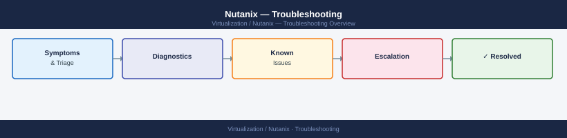

# Nutanix — Troubleshooting

Nutanix troubleshooting guide — common operational problems, diagnostic tools and log locations, NCC health check interpretation, and Nutanix GSS escalation procedures.

*Applies to: AOS 6.x · AHV*

  <a class="kb-card" href="common-issues/">
    <strong>Common Issues</strong>
    CVM down, NCC failures, storage degraded, VM stuck power states, cluster full, and replication failures.
  </a>
  <a class="kb-card" href="diagnostics/">
    <strong>Diagnostics</strong>
    Key log locations, NCC check details, Stargate/Cassandra/Curator diagnostics, and support bundle collection.
  </a>
  <a class="kb-card" href="escalation/">
    <strong>Escalation</strong>
    When to call Nutanix GSS, severity classification, case opening procedure, and what to collect beforehand.
  </a>

