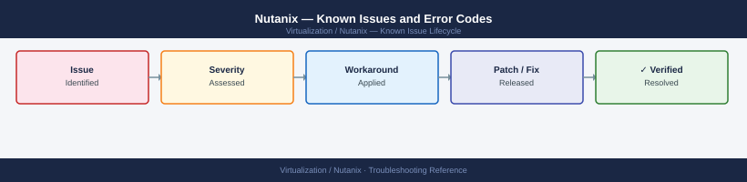

---
tags:
  - troubleshooting
  - nutanix
  - known-issues
---
# Nutanix — Known Issues and Error Codes

<div class="kb-summary">
Catalog of known Nutanix AOS / AHV bugs, error codes, and workarounds covering CVM, storage, AHV networking, and Prism issues.

*Applies to: Nutanix AOS 6.x / AHV 20220304.x+*
</div>



```d2
direction: down

symptom: Identify Symptom {shape: diamond}
cvm_and_services: "CVM and Services" {shape: rectangle}
storage: "Storage" {shape: rectangle}
ahv_networking: "AHV Networking" {shape: rectangle}
prism: "Prism" {shape: rectangle}
resolution: Resolve or Escalate {shape: oval}

symptom -> cvm_and_services: investigate
symptom -> storage: investigate
symptom -> ahv_networking: investigate
symptom -> prism: investigate
cvm_and_services -> resolution
storage -> resolution
ahv_networking -> resolution
prism -> resolution
```

## Before you begin

- Run `cluster status` from any CVM to check all services.
- Nutanix NCC (Node Configuration Checker): `ncc health_checks run_all` from any CVM.
- CVM logs under `/home/nutanix/data/logs/` — key log is `stargate.out` for storage issues.

## CVM and Services

| Error / Symptom | Affected Versions | Cause | Workaround / Fix | Fixed In |
|---|---|---|---|---|
| CVM service `Stargate` in crash loop | AOS 6.x | Disk I/O error on SSD tier causing Stargate panic | Check `disk_operator.out` for SMART errors; replace failing disk | N/A |
| `Zookeeper not running` on single CVM | AOS 6.x | CVM network partition or CVM OOM | Restart CVM; check CVM memory allocation (min 20 GB reserved) | N/A |
| `Cassandra` ring not converging after node addition | AOS 6.x | New node NTP skew from cluster | Sync NTP on new node; run `nodetool status` from CVM to verify ring | N/A |

## Storage

| Error / Symptom | Affected Versions | Cause | Workaround / Fix | Fixed In |
|---|---|---|---|---|
| VM disk I/O latency spikes during dedup/compression | AOS 6.x | Background data transformation running during peak hours | Schedule data transformation during off-peak via Prism → Data Resiliency | N/A |
| Storage container full but cluster has free capacity | AOS 6.x | Container reservation set too high | Remove or reduce reservation on container; capacity redistributes automatically | N/A |
| vDisk stuck in `Under Replicated` state | AOS 6.x | Node in maintenance mode with insufficient data copies | Exit maintenance mode; or increase replication factor temporarily | N/A |

## AHV Networking

| Error / Symptom | Affected Versions | Cause | Workaround / Fix | Fixed In |
|---|---|---|---|---|
| VM loses connectivity after AHV host upgrade | AOS 6.x | OVS bridge reconfigured during upgrade; bond mode changed | Verify OVS bond mode matches upstream switch LACP settings post-upgrade | N/A |
| VLAN traffic not passing for guest VMs | AOS 6.x | VLAN not configured on Prism network; upstream trunk missing | Add VLAN in Prism → VM Network; verify upstream switch trunk includes VLAN ID | N/A |

## Prism

| Error / Symptom | Affected Versions | Cause | Workaround / Fix | Fixed In |
|---|---|---|---|---|
| Prism Central login fails: `SSO metadata error` | Prism Central 2022.x | IdP metadata URL unreachable | Verify Prism Central can reach IdP metadata URL on 443; or re-upload metadata manually | N/A |
| Prism alert `Disk I/O timeout` not clearing | AOS 6.x | Historical alert not auto-resolving | Manually resolve alert in Prism → Alerts after confirming disk is healthy | N/A |

## See also

- [Nutanix — Common Issues](common-issues/)
- [Nutanix — Diagnostics](diagnostics.md)
