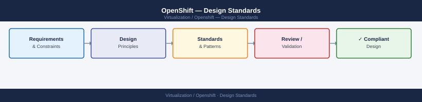
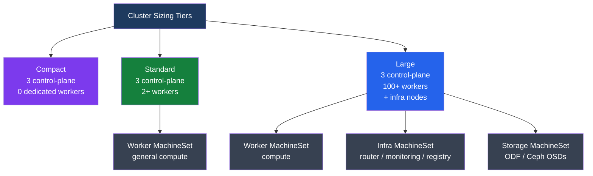

---
tags:
  - architecture
---
# OpenShift — Design Standards

<div class="kb-summary">
Node sizing guidelines, MachineSet design, storage class standards, network CIDR planning, and infrastructure node placement for production OpenShift clusters.

*Applies to: OpenShift 4.x*
</div>





## Cluster Sizing Tiers

| Tier | Control plane | Workers | Use case |
|---|---|---|---|
| Compact | 3 (masters run workloads) | 0 | Lab, CI, edge; masters schedulable |
| Standard | 3 | 2–10 | Small production; no dedicated infra nodes |
| Standard + Infra | 3 | 2–10 + 3 infra | Production; platform components isolated |
| Large | 3 | 100+ | Enterprise; separate storage, infra, compute pools |

## Node Sizing Reference

| Role | vCPU | RAM | Boot disk | Notes |
|---|---|---|---|---|
| Master (small) | 8 | 32 GB | 120 GB SSD | Minimum; supports ≤25 workers |
| Master (medium) | 12 | 48 GB | 120 GB SSD | Supports 25–100 workers |
| Master (large) | 16 | 64 GB | 120 GB SSD | Supports 100+ workers |
| Infra | 4–8 | 16–32 GB | 120 GB | Router, monitoring, registry |
| Worker (general) | 4–16 | 16–64 GB | 120 GB | Size per workload profile |
| Storage (ODF) | 10 | 24 GB | 120 GB + OSD disks | ODF minimum 3 nodes × 3 disks |

## Infrastructure Nodes

Infrastructure nodes run platform components (ingress router, image registry, cluster monitoring, logging) and keep those workloads off general worker nodes. This reduces licensing impact (infra nodes do not consume OpenShift worker entitlements in some scenarios).

**Workloads that belong on infra nodes:**

- OpenShift Router (`openshift-ingress`)
- Internal Image Registry (`openshift-image-registry`)
- Cluster Monitoring stack (`openshift-monitoring`)
- Cluster Logging / Loki (`openshift-logging`)
- OAuth server (`openshift-authentication`)

```yaml
# MachineSet spec for infra pool (vSphere example)
apiVersion: machine.openshift.io/v1beta1
kind: MachineSet
metadata:
  name: cluster-infra-0
  namespace: openshift-machine-api
spec:
  replicas: 3
  selector:
    matchLabels:
      machine.openshift.io/cluster-api-machineset: cluster-infra-0
  template:
    metadata:
      labels:
        machine.openshift.io/cluster-api-machineset: cluster-infra-0
    spec:
      taints:
      - key: node-role.kubernetes.io/infra
        effect: NoSchedule
      metadata:
        labels:
          node-role.kubernetes.io/infra: ""
          node-role.kubernetes.io/worker: ""
      providerSpec:
        value:
          numCPUs: 8
          memoryMiB: 32768
          diskGiB: 120
```

```bash
# Label and taint infra nodes (manual, non-MachineSet path)
oc label node <node> node-role.kubernetes.io/infra=""
oc adm taint node <node> node-role.kubernetes.io/infra=reserved:NoSchedule

# Move ingress controller to infra nodes
oc patch ingresscontroller default -n openshift-ingress-operator \
  --type=merge -p '{"spec":{"nodePlacement":{"nodeSelector":{"matchLabels":{"node-role.kubernetes.io/infra":""}},"tolerations":[{"key":"node-role.kubernetes.io/infra","effect":"NoSchedule"}]}}}'

# Move monitoring stack to infra nodes (cluster-monitoring-config ConfigMap)
oc -n openshift-monitoring apply -f - <<'EOF'
apiVersion: v1
kind: ConfigMap
metadata:
  name: cluster-monitoring-config
  namespace: openshift-monitoring
data:
  config.yaml: |
    prometheusOperator:
      nodeSelector:
        node-role.kubernetes.io/infra: ""
      tolerations:
      - key: node-role.kubernetes.io/infra
        effect: NoSchedule
    prometheusK8s:
      nodeSelector:
        node-role.kubernetes.io/infra: ""
      tolerations:
      - key: node-role.kubernetes.io/infra
        effect: NoSchedule
EOF
```

## etcd Disk Sizing and Validation

etcd is the most I/O-sensitive component. Slow disk causes fsync latency, leader elections, and cluster instability.

| Requirement | Value | Notes |
|---|---|---|
| Minimum IOPS | 500 sustained | For 4K random writes (fdatasync) |
| Recommended IOPS | 2,000+ | NVMe preferred |
| Minimum capacity | 10 GB | Practical baseline; 50 GB for large clusters |
| Recommended capacity | 50 GB | Handles compaction and defrag headroom |
| Max fsync latency | 10 ms | Above this threshold triggers leader re-elections |
| Disk type | SSD or NVMe | Spinning disk causes guaranteed instability |

```bash
# Validate etcd disk performance with fio (run on each master before install)
fio \
  --rw=write \
  --ioengine=sync \
  --fdatasync=1 \
  --directory=/var/lib/etcd \
  --size=22m \
  --bs=2300 \
  --name=etcd-fio

# Target: 99th-percentile fsync latency < 10ms
# Look for "fsync/fdatasync/sync_file_range" latency in output
# If p99 > 10ms — do not use that disk for etcd
```

## Network CIDR Planning

Set at install time — cannot change after cluster creation without reinstalling.

```yaml
# install-config.yaml networking section
networking:
  clusterNetwork:
  - cidr: 10.128.0.0/14       # Pod network; /14 = ~262,144 addresses
    hostPrefix: 23             # /23 per node = 510 pod IPs per node
  serviceNetwork:
  - 172.30.0.0/16             # Service ClusterIP range; ~65,534 services
  machineNetwork:
  - cidr: 192.168.100.0/24   # Node network — must match your infrastructure
  networkType: OVNKubernetes
```

| Network | Default CIDR | Purpose | Overlap risk |
|---|---|---|---|
| Pod (clusterNetwork) | `10.128.0.0/14` | Pod IP allocation across all nodes | Must not overlap node or service network |
| Service (serviceNetwork) | `172.30.0.0/16` | ClusterIP / headless service IPs | Must not overlap pod or node network |
| Node (machineNetwork) | site-specific | VM / bare-metal NIC addresses | Must be routable from your infrastructure |

**OVN-Kubernetes MTU considerations:**

OVN uses Geneve encapsulation for cross-node traffic. Geneve header overhead is ~100 bytes. Set cluster MTU to: `physical NIC MTU − 100`.

| Physical MTU | OVN cluster MTU to configure | Notes |
|---|---|---|
| 1500 (standard Ethernet) | 1400 | Default; works everywhere |
| 9000 (jumbo frames) | 8900 | Requires jumbo frames end-to-end |
| 1600 (cloud) | 1500 | Check cloud provider MTU |

```bash
# Check current network MTU setting
oc get network.operator cluster -o jsonpath='{.spec.defaultNetwork.ovnKubernetesConfig.mtu}'

# Verify pod interface MTU on a node
oc debug node/<node> -- ip link show eth0
```

**VLAN segmentation recommendation:**

Separate VLANs for: (1) machine/node network, (2) storage network (iSCSI/NFS/ODF replication), (3) cluster API/management. Avoids broadcast domain pollution and simplifies firewall rules.

## StorageClass Standards

```yaml
# Default StorageClass (must exist for dynamic PVC binding)
apiVersion: storage.k8s.io/v1
kind: StorageClass
metadata:
  name: thin-csi
  annotations:
    storageclass.kubernetes.io/is-default-class: "true"
provisioner: csi.vsphere.volume.vmware.com
parameters:
  datastoreurl: "ds:///vmfs/volumes/<uuid>/"
reclaimPolicy: Delete
volumeBindingMode: WaitForFirstConsumer
allowVolumeExpansion: true
```

| Storage Class | Provisioner | Access mode | Reclaim | Use case |
|---|---|---|---|---|
| `thin-csi` (default) | vSphere CSI | RWO | Delete | General workloads on vSphere |
| `thick-csi` | vSphere CSI | RWO | Retain | Databases, etcd snapshots |
| `ocs-storagecluster-ceph-rbd` | ODF / Ceph RBD | RWO | Delete | High-performance block storage |
| `ocs-storagecluster-cephfs` | ODF / CephFS | RWX | Delete | Shared filesystems, NFS replacement |
| `nfs-client` | NFS subdir | RWX | Delete | Simple shared storage, legacy workloads |

```bash
# Check StorageClasses and which is default
oc get sc
# NAME             PROVISIONER                    RECLAIMPOLICY   VOLUMEBINDINGMODE
# thin-csi (default) csi.vsphere.volume.vmware.com Delete         WaitForFirstConsumer

# Check PVC provisioning status
oc get pvc -A | grep -v Bound

# Test PVC creation
oc apply -f - <<'EOF'
apiVersion: v1
kind: PersistentVolumeClaim
metadata:
  name: test-pvc
  namespace: default
spec:
  accessModes: [ReadWriteOnce]
  resources:
    requests:
      storage: 1Gi
EOF
oc get pvc test-pvc
```

## MachineSet Design

```yaml
# MachineSet template (vSphere example)
apiVersion: machine.openshift.io/v1beta1
kind: MachineSet
metadata:
  name: cluster-worker-0
  namespace: openshift-machine-api
spec:
  replicas: 3
  selector:
    matchLabels:
      machine.openshift.io/cluster-api-machineset: cluster-worker-0
  template:
    spec:
      taints: []          # Add infra taint for infra nodes
      metadata:
        labels:
          node-role.kubernetes.io/worker: ""
```

```bash
# Scale MachineSet
oc scale machineset cluster-worker-0 -n openshift-machine-api --replicas=5

# List MachineSets and replica counts
oc get machineset -n openshift-machine-api

# Check machine provisioning status
oc get machine -n openshift-machine-api

# Add ClusterAutoscaler + MachineAutoscaler
oc apply -f clusterautoscaler.yaml        # Global autoscaler config
oc apply -f machineautoscaler.yaml        # References MachineSet + min/max replicas
```

## See also

- [OpenShift — How It Works](../how-it-works/)
- [OpenShift — Deploy](../../deploy/)
