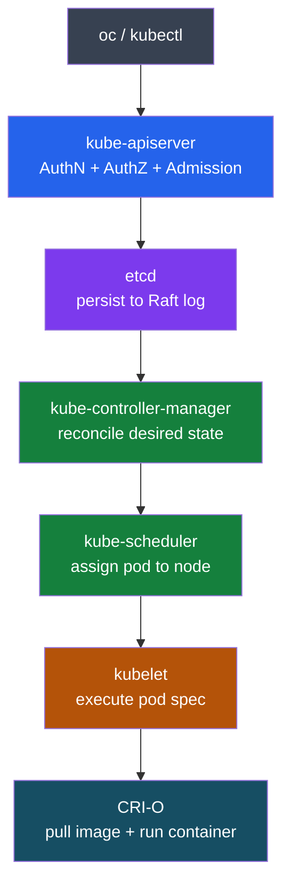

---
tags:
  - architecture
---
# OpenShift — How It Works

<div class="kb-summary">
Control plane components, etcd quorum, API server request flow, scheduler decisions, and how the operator pattern manages cluster resources.

*Applies to: OpenShift 4.x*
</div>



## Control Plane Components

| Component | Pod namespace | Restart behavior | Health check |
|---|---|---|---|
| `kube-apiserver` | `openshift-kube-apiserver` | Static pod — kubelet restarts on crash | `oc get co kube-apiserver` |
| `etcd` | `openshift-etcd` | Static pod on each master | `oc get co etcd` |
| `kube-scheduler` | `openshift-kube-scheduler` | Static pod — leader-elected across 3 masters | `oc get co kube-scheduler` |
| `kube-controller-manager` | `openshift-kube-controller-manager` | Static pod — leader-elected | `oc get co kube-controller-manager` |
| `openshift-apiserver` | `openshift-apiserver` | Deployment managed by CVO | `oc get co openshift-apiserver` |
| `cluster-version-operator` | `openshift-cluster-version` | Deployment; manages all other COs | `oc get clusterversion` |

```bash
# Verify all control plane static pods are running
oc get pods -n openshift-kube-apiserver
oc get pods -n openshift-etcd
oc get pods -n openshift-kube-scheduler
oc get pods -n openshift-kube-controller-manager

# Tail logs for a specific component
oc logs -n openshift-kube-apiserver -l app=kube-apiserver --tail=100
oc logs -n openshift-etcd -l app=etcd --tail=100
```

## etcd Quorum Rules

etcd uses the Raft consensus algorithm. A cluster requires a strict majority (quorum) of members to be alive before it accepts writes. In OpenShift, master nodes are the etcd members.

| Cluster size | Can tolerate failure of | Write quorum | Notes |
|---|---|---|---|
| 3 members | 1 member | 2 | Standard production minimum |
| 5 members | 2 members | 3 | Required for simultaneous AZ failure tolerance |
| 1 member | 0 members | 1 | Non-HA only; never use in production |

```text
# Raft quorum formula
quorum = floor(N/2) + 1

3-node: floor(3/2)+1 = 2   → tolerate 1 failure
5-node: floor(5/2)+1 = 3   → tolerate 2 failures

Never run 2 or 4 members — split-brain risk on exactly-half failure
```

### etcd Operational Maintenance

etcd accumulates revisions. By default it compacts at 10,000 revisions and defragments automatically, but high-churn clusters need manual defrag.

**Disk IOPS requirement:** etcd requires ≥500 IOPS sustained. Latency >10ms on fsync causes leader elections. Use NVMe or SSD — never spinning disk.

```bash
# Check etcd member health
ETCDCTL_API=3 etcdctl \
  --endpoints=https://127.0.0.1:2379 \
  --cacert=/etc/kubernetes/static-pod-resources/etcd-certs/configmaps/etcd-serving-ca/ca-bundle.crt \
  --cert=/etc/kubernetes/static-pod-resources/etcd-certs/secrets/etcd-all-certs/etcd-peer-master-0.crt \
  --key=/etc/kubernetes/static-pod-resources/etcd-certs/secrets/etcd-all-certs/etcd-peer-master-0.key \
  member list

# Defrag — run one member at a time; never all simultaneously
etcdctl defrag --endpoints=https://<member-ip>:2379 [--cacert --cert --key]

# Check DB size (fragmented vs allocated)
etcdctl endpoint status --write-out=table

# Compact manually if needed
ETCDCTL_API=3 etcdctl compact $(etcdctl endpoint status --write-out=json | jq '.[0].Status.header.revision')

# Snapshot backup
etcdctl snapshot save /var/home/core/etcd-backup-$(date +%F).db
etcdctl snapshot status /var/home/core/etcd-backup-$(date +%F).db
```

**Compaction defaults (OCP 4.x):**

| Parameter | Default | Notes |
|---|---|---|
| Auto-compaction mode | `periodic` | Compacts every 5 minutes |
| Auto-compaction retention | `1h` | Keeps 1 hour of revision history |
| Defrag interval | Not automatic | Must be triggered manually |
| Snapshot count | 10,000 | Revisions between snapshots |
| DB size warning threshold | 8 GB | Alert fires; defrag required |

## Operator Pattern

Every OpenShift platform component is managed by a Cluster Operator (CO). The reconciliation loop:

```text
1. CRD defines desired state (spec)
2. Operator watches CRD instances via informer cache
3. Operator reconciles actual → desired (idempotent)
4. Operator updates status.conditions
5. CVO aggregates CO conditions into ClusterVersion
```

### ClusterOperator CRD Conditions

| Condition | Meaning | Action required |
|---|---|---|
| `Available=True` | Component is functional | None |
| `Available=False` | Component is non-functional | Check operator pod logs immediately |
| `Progressing=True` | Upgrade or rollout in progress | Wait; monitor for completion |
| `Degraded=True` | Component degraded but not fully down | Investigate; may block upgrades |
| `Upgradeable=False` | Blocks cluster upgrade | Must resolve before upgrading |

```bash
# Check cluster operator health — all COs
oc get co
# NAME                    VERSION   AVAILABLE   PROGRESSING   DEGRADED
# authentication          4.14.5    True        False         False
# etcd                    4.14.5    True        False         False
# kube-apiserver          4.14.5    True        False         False

# Any DEGRADED=True requires investigation
oc describe co <operator-name>     # Full conditions with message and lastTransitionTime

# Find operator pod in its namespace (openshift-<name>)
oc get pods -n openshift-authentication
oc get pods -n openshift-dns
oc get pods -n openshift-ingress-operator

# Tail operator logs
oc logs -n openshift-<name> deployment/<operator-deployment> --tail=200 -f
```

## MachineConfig and MCO

The Machine Config Operator (MCO) manages OS-level configuration on RHCOS nodes. Configuration is expressed as `MachineConfig` objects that render into Ignition configs.

**Render order:** base config → layered configs → custom configs. Later configs win on key conflicts.

```bash
# List all MachineConfigPools
oc get mcp
# NAME     CONFIG                    UPDATED   UPDATING   DEGRADED
# master   rendered-master-abc123    True      False      False
# worker   rendered-worker-def456    True      False      False

# List all MachineConfig objects
oc get mc
# Shows: 00-master, 00-worker, 01-master-kubelet, 99-custom-chrony, rendered-master-abc123, ...

# Pool selectors determine which nodes receive which configs
oc get mcp worker -o yaml | grep -A5 machineConfigSelector

# Check MCO pod logs when a node fails to update
oc logs -n openshift-machine-config-operator -l k8s-app=machine-config-operator --tail=200

# Force a node to re-apply its config (drain first)
oc adm drain <node> --ignore-daemonsets --delete-emptydir-data
# MCO applies config then cordons/uncordons automatically during rolling update
```

**MachineConfig spec fields:**

| Field | Purpose | Example |
|---|---|---|
| `config.storage.files` | Drop files onto node filesystem | `/etc/chrony.conf` |
| `config.systemd.units` | Manage systemd units | `kubelet.service` drop-ins |
| `kernelArguments` | Append kernel command-line args | `processor.max_cstate=1` |
| `extensions` | Install RHCOS extensions (RPMs) | `usbguard`, `kerberos` |
| `osImageURL` | Pin node to specific RHCOS image | Used by CVO during upgrades |

## Networking — OVN-Kubernetes Internals

OVN-Kubernetes replaced OpenShift SDN as the default CNI in OCP 4.6+. It implements a two-database logical/physical separation:

```text
OVN Architecture:
  OVN Northbound DB (logical topology)
    → ovn-northd (translation daemon)
  OVN Southbound DB (physical topology / flow tables)
    → ovn-controller per node (programs OVS)
```

**Pod-to-pod same node:** packet stays in OVS on the host; no encapsulation; sub-microsecond latency.

**Pod-to-pod cross-node:** OVN programs Geneve tunnels (VXLAN-like, but with Geneve metadata). Packet: `pod NIC → OVS → Geneve tunnel → remote OVS → destination pod NIC`.

**North-south (pod → external):** Traffic exits via the node's gateway bridge (`br-ex`); masqueraded with node IP (or via LoadBalancer service using MetalLB/cloud LB).

```bash
# Inspect OVN-K components
oc get pods -n openshift-ovn-kubernetes
# ovnkube-master-*     (runs ovn-northd + nbdb + sbdb on control plane nodes)
# ovnkube-node-*       (runs ovn-controller + ovs-vswitchd on every node)

# View OVN logical switch topology
oc rsh -n openshift-ovn-kubernetes $(oc get pods -n openshift-ovn-kubernetes -l app=ovnkube-master -o name | head -1) \
  ovn-nbctl show

# View OVN flow table for a node
oc rsh -n openshift-ovn-kubernetes ovnkube-node-<id> \
  ovs-ofctl dump-flows br-int

# Check network operator config
oc get network.operator cluster -o yaml | grep -E "type:|clusterNetwork|serviceNetwork"
oc get network.config cluster -o yaml
```

## Node Types

| Type | Role | Typical labels | Schedulable |
|---|---|---|---|
| Master | Control plane (etcd + API + scheduler) | `node-role.kubernetes.io/master` | No (tainted by default) |
| Worker | General compute | `node-role.kubernetes.io/worker` | Yes |
| Infra | Monitoring, router, registry | `node-role.kubernetes.io/infra` | Infra workloads only |
| Storage | ODF/Ceph OSDs | `cluster.ocs.openshift.io/openshift-storage` | ODF pods only |

```bash
# View node roles and status
oc get nodes -o wide
oc get nodes --show-labels | grep node-role

# Check node conditions (MemoryPressure, DiskPressure, PIDPressure)
oc describe node <node-name> | grep -A10 Conditions

# Move infra workloads off worker nodes
oc label node <infra-node> node-role.kubernetes.io/infra=""
oc adm taint node <infra-node> node-role.kubernetes.io/infra=reserved:NoSchedule
```

## See also

- [OpenShift — Design Standards](../design-standards/)
- [OpenShift — Deploy](../../deploy/)
- [OpenShift — Integrations](../integrations/)
