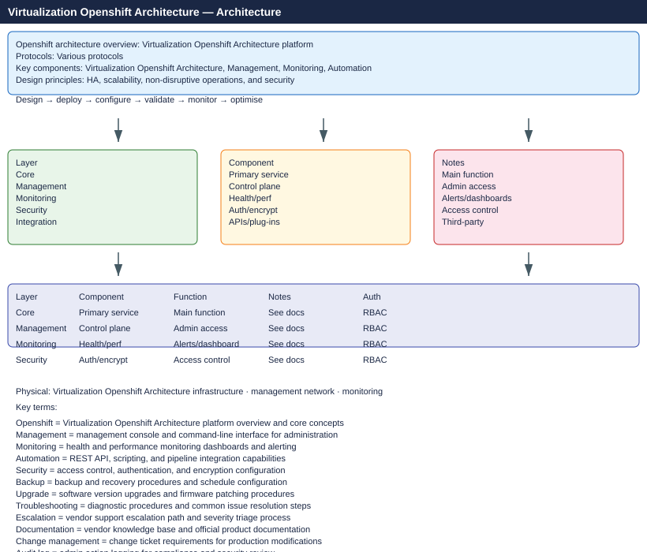

---
tags:
  - architecture
---
# OpenShift — Architecture

<div class="kb-summary">
OpenShift control plane, node types, networking model, and storage integration. Covers how etcd, API server, scheduler, and operators interact to manage cluster state.

*Applies to: OpenShift 4.x*
</div>




```d2
direction: right

A: "OpenShift Architecture" {shape: rectangle}
B: "How It Works" {shape: rectangle}
C: "Design Standards" {shape: rectangle}
D: "Integrations" {shape: rectangle}
B1: "API Request Flow" {shape: rectangle}
B2: "etcd Raft Quorum" {shape: rectangle}
B3: "Operator Pattern" {shape: rectangle}
B4: "OVN-Kubernetes CNI" {shape: rectangle}
B5: "MachineConfig MCO" {shape: rectangle}
C1: "Cluster Sizing Tiers" {shape: rectangle}
C2: "Node Sizing Table" {shape: rectangle}
C3: "Network CIDR Planning" {shape: rectangle}
C4: "StorageClass Standards" {shape: rectangle}
C5: "Infra Node Placement" {shape: rectangle}
D1: "vSphere CCM / CSI" {shape: rectangle}
D2: "LDAP / AD Identity" {shape: rectangle}
D3: "Harbor / Quay Registry" {shape: rectangle}
D4: "cert-manager / Vault" {shape: rectangle}
D5: "ArgoCD / GitOps" {shape: rectangle}

A -> B
A -> C
A -> D
B -> B1
B -> B2
B -> B3
B -> B4
B -> B5
C -> C1
C -> C2
C -> C3
C -> C4
C -> C5
D -> D1
D -> D2
D -> D3
D -> D4
D -> D5
```

<div class="kb-grid">
  <a class="kb-card" href="how-it-works/">
    <span class="kb-card-title">How It Works</span>
    <span class="kb-card-desc">Control plane topology, etcd, API server, scheduler, and operator pattern</span>
  </a>
  <a class="kb-card" href="design-standards/">
    <span class="kb-card-title">Design Standards</span>
    <span class="kb-card-desc">Node sizing, MachineSet design, storage class standards, and networking</span>
  </a>
  <a class="kb-card" href="integrations/">
    <span class="kb-card-title">Integrations</span>
    <span class="kb-card-desc">vSphere IPI, AWS IPI, LDAP/AD, Quay, ACM, and storage backends</span>
  </a>
</div>
