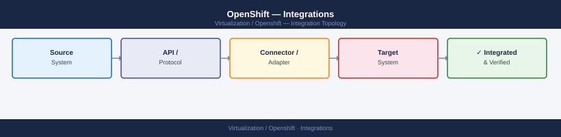
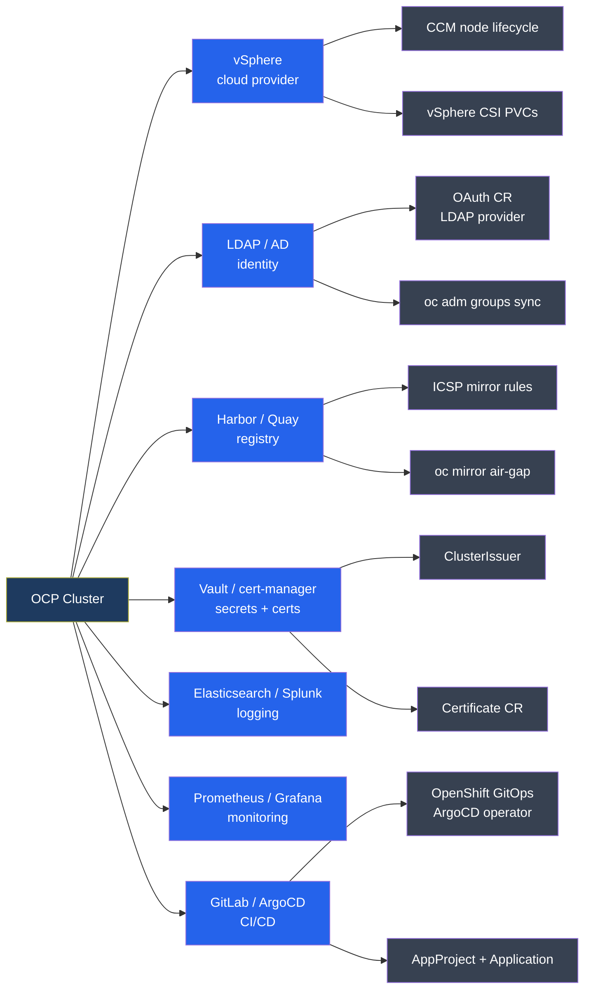

---
tags:
  - architecture
---
# OpenShift — Integrations

<div class="kb-summary">
vSphere IPI and UPI installation modes, LDAP/Active Directory identity, Quay image registry, Advanced Cluster Management (ACM), and ODF storage integration.

*Applies to: OpenShift 4.x*
</div>





## vSphere IPI Integration

```yaml
# install-config.yaml — vSphere platform section
platform:
  vsphere:
    vcenter: vcenter.example.com
    username: ocp-install@vsphere.local
    password: "<password>"
    datacenter: DC1
    defaultDatastore: vsanDatastore
    folder: /DC1/vm/openshift
    network: VM Network
    diskType: thin
    resourcePool: /DC1/host/Cluster/Resources/openshift
```

```bash
# Required vCenter permissions for IPI installer
# Minimum: create/delete VMs, manage networks/datastores in target folder
# Service account: ocp-install@vsphere.local with custom role

# Verify CSI driver post-install
oc get csidriver csi.vsphere.volume.vmware.com
oc get configmap cloud-provider-config -n openshift-config
```

### vSphere Cloud Controller Manager (CCM)

The CCM (`openshift-cloud-controller-manager` namespace) manages the node lifecycle: it provisions node objects when VMs come up, updates node addresses, and removes node objects when VMs are deleted. It also adds topology labels used by the scheduler.

**Node labels added by CCM:**

| Label | Example value | Source |
|---|---|---|
| `topology.kubernetes.io/zone` | `DC1-Cluster1` | vSphere cluster or host group |
| `topology.kubernetes.io/region` | `DC1` | vSphere datacenter |
| `node.kubernetes.io/instance-type` | `vsphere-vm` | Set by CCM |

```bash
# Check CCM pods
oc get pods -n openshift-cloud-controller-manager

# Verify topology labels on a node
oc get node <node> -o jsonpath='{.metadata.labels}' | jq 'with_entries(select(.key | startswith("topology")))'

# StorageClass using topology (zone-aware volume placement)
cat <<'EOF'
apiVersion: storage.k8s.io/v1
kind: StorageClass
metadata:
  name: thin-csi-zonal
provisioner: csi.vsphere.volume.vmware.com
parameters:
  storagePolicyName: "vSAN Default Storage Policy"
  datastoreURL: "ds:///vmfs/volumes/<uuid>/"
volumeBindingMode: WaitForFirstConsumer   # Waits for pod scheduling to pick zone
allowVolumeExpansion: true
EOF
```

## LDAP / Active Directory Identity Provider

```yaml
# OAuth CR — LDAP identity provider configuration
apiVersion: config.openshift.io/v1
kind: OAuth
metadata:
  name: cluster
spec:
  identityProviders:
  - name: ldap
    type: LDAP
    mappingMethod: claim
    ldap:
      url: "ldap://ad.example.com/CN=Users,DC=example,DC=com?sAMAccountName"
      bindDN: "CN=svc-ocp,OU=ServiceAccounts,DC=example,DC=com"
      bindPassword:
        name: ldap-bind-password    # Secret in openshift-config namespace
      insecure: false
      ca:
        name: ldap-ca-cert          # ConfigMap with CA bundle in openshift-config
      attributes:
        id: ["dn"]
        email: ["mail"]
        name: ["cn"]
        preferredUsername: ["sAMAccountName"]
```

```bash
# Create bindPassword secret
oc create secret generic ldap-bind-password \
  --from-literal=bindPassword='<password>' \
  -n openshift-config

# Create CA ConfigMap (if LDAPS / AD certificate)
oc create configmap ldap-ca-cert \
  --from-file=ca.crt=/path/to/ad-ca.crt \
  -n openshift-config

# Manual group sync — run interactively or via CronJob
oc adm groups sync --sync-config=ldap-sync.yaml --confirm

# Bind synced group to cluster-admin
oc adm policy add-cluster-role-to-group cluster-admin ocp-admins

# Disable kubeadmin after LDAP is confirmed working
oc delete secret kubeadmin -n kube-system
```

**Recommended:** Use the Red Hat `Group Sync Operator` from OperatorHub for scheduled automatic group synchronization. Install in `group-sync-operator` namespace; create a `GroupSync` CR pointing at your LDAP/AD server to run on a cron schedule (e.g. `*/30 * * * *`).

## Image Registry Integration

### Built-in OpenShift Registry

```bash
# Enable managed image registry with PVC backend
oc patch configs.imageregistry.operator.openshift.io cluster \
  --type merge -p '{"spec":{"managementState":"Managed","storage":{"pvc":{"claim":""}}}}'

# Enable with S3 backend (air-gap / on-prem MinIO)
oc patch configs.imageregistry.operator.openshift.io cluster \
  --type merge -p '{
    "spec":{
      "managementState":"Managed",
      "storage":{
        "s3":{
          "bucket":"openshift-registry",
          "region":"us-east-1",
          "regionEndpoint":"https://minio.example.com",
          "encrypt":false
        }
      }
    }
  }'

# Check registry operator status
oc get configs.imageregistry.operator.openshift.io cluster -o yaml | grep -A10 status
```

### Air-Gap Mirror with oc mirror

```bash
# Mirror OCP release images to internal registry (OCP 4.10+ oc-mirror plugin)
oc mirror --config=imageset-config.yaml docker://quay.local.example.com/ocp-mirror

# Apply generated ImageContentSourcePolicy
oc apply -f oc-mirror-workspace/results-*/imageContentSourcePolicy.yaml
oc get imagecontentsourcepolicy
```

## cert-manager Integration

cert-manager automates TLS certificate lifecycle. Install via OperatorHub (`cert-manager` operator in `cert-manager` namespace).

```yaml
# ClusterIssuer for internal CA (ACME/Let's Encrypt alternative)
apiVersion: cert-manager.io/v1
kind: ClusterIssuer
metadata:
  name: internal-ca
spec:
  ca:
    secretName: internal-ca-key-pair   # Secret containing tls.crt + tls.key

---
# Certificate CR — creates TLS Secret automatically
apiVersion: cert-manager.io/v1
kind: Certificate
metadata:
  name: apps-wildcard
  namespace: openshift-ingress
spec:
  secretName: apps-wildcard-tls
  issuerRef:
    name: internal-ca
    kind: ClusterIssuer
  dnsNames:
  - "*.apps.cluster.example.com"
  duration: 8760h    # 1 year
  renewBefore: 720h  # Renew 30 days before expiry
```

```bash
# Patch ingress controller to use custom wildcard cert
oc patch ingresscontroller default -n openshift-ingress-operator \
  --type=merge -p '{
    "spec":{
      "defaultCertificate":{
        "name":"apps-wildcard-tls"
      }
    }
  }'

# Check cert-manager certificate status
oc get certificate -A
```

## ArgoCD / OpenShift GitOps

OpenShift GitOps operator installs ArgoCD. Install from OperatorHub; the operator creates an `ArgoCD` CR in `openshift-gitops` namespace automatically.

```yaml
# AppProject — restricts what an ArgoCD project can deploy
apiVersion: argoproj.io/v1alpha1
kind: AppProject
metadata:
  name: platform-infra
  namespace: openshift-gitops
spec:
  sourceRepos:
  - https://gitlab.example.com/platform/*
  destinations:
  - namespace: "*"
    server: https://kubernetes.default.svc
  clusterResourceWhitelist:
  - group: "*"
    kind: "*"

---
# Application CR — syncs a Git repo path to a namespace
apiVersion: argoproj.io/v1alpha1
kind: Application
metadata:
  name: cluster-config
  namespace: openshift-gitops
spec:
  project: platform-infra
  source:
    repoURL: https://gitlab.example.com/platform/cluster-config
    targetRevision: main
    path: overlays/production
  destination:
    server: https://kubernetes.default.svc
    namespace: openshift-config
  syncPolicy:
    automated:
      prune: true
      selfHeal: true
    syncOptions:
    - CreateNamespace=true
```

```bash
# Check ArgoCD application sync status
oc get application -n openshift-gitops
oc get application cluster-config -n openshift-gitops -o yaml | grep -A10 status

# Sync an application manually
oc -n openshift-gitops exec deploy/openshift-gitops-server -- \
  argocd app sync cluster-config --auth-token <token>

# Get ArgoCD admin password
oc -n openshift-gitops get secret openshift-gitops-cluster -o jsonpath='{.data.admin\.password}' | base64 -d
```

## Advanced Cluster Management (ACM)

```bash
# Install ACM operator from OperatorHub, then create hub
oc apply -f multiclusterhub.yaml    # Creates MultiClusterHub in open-cluster-management ns

# Import existing cluster (generates klusterlet agent manifests for spoke)
oc apply -f import-cluster.yaml

# Check hub and managed cluster status
oc get multiclusterhub -n open-cluster-management
oc get managedclusters
oc get policy -n policies           # Governance policies applied to fleet
```

## ODF (OpenShift Data Foundation) Storage

```bash
# ODF operator install via OperatorHub, then deploy StorageCluster
oc apply -f storagecluster.yaml     # Defines OSD disks and replica count

# Verify ODF health
oc get storagecluster -n openshift-storage
oc get cephcluster -n openshift-storage
oc rsh -n openshift-storage $(oc get pod -n openshift-storage -l app=rook-ceph-tools -o name) \
  ceph status
```

## See also

- [OpenShift — How It Works](../how-it-works/)
- [OpenShift — Deploy](../../deploy/)
