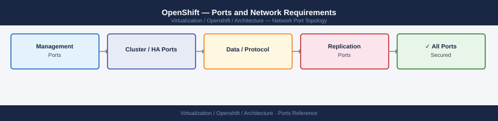

---
tags:
  - openshift
  - kubernetes
  - networking
  - firewall
  - ports
  - containers
---
# OpenShift — Ports and Network Requirements

<div class="kb-summary">
Firewall port reference for Red Hat OpenShift Container Platform (OCP). Covers the API server, web console, worker node communications, overlay network (OVN-Kubernetes), node ports, and infrastructure component ports.

*Applies to: OpenShift Container Platform 4.x*
</div>


## Before you begin

- OpenShift uses OVN-Kubernetes as the default CNI in OCP 4.x — overlay traffic uses Geneve (UDP 6081), not VXLAN
- The Kubernetes API server (6443) must be reachable from all nodes and admin clients
- Worker nodes must reach the API server and Machine Config Server during bootstrap
- NodePort services use the range 30000–32767 TCP/UDP — open this range from clients that need NodePort access

---

## Inbound — Admin and User Access

| Port | Protocol | Source | Purpose |
|---|---|---|---|
| 6443 | TCP | Admin workstations, CI/CD, Operators | OpenShift API server (Kubernetes API + OpenShift API) |
| 443 | TCP | End users, browsers | OpenShift web console and HTTPS application routes via Ingress router |
| 80 | TCP | End users | HTTP application routes via Ingress router (redirects to 443 for secure routes) |
| 22 | TCP | Jump hosts | SSH to cluster nodes (core user) |

---

## Control Plane Internal

| Port | Protocol | Between | Purpose |
|---|---|---|---|
| 2379 | TCP | API server → etcd | etcd client endpoint |
| 2380 | TCP | etcd members ↔ etcd members | etcd peer replication |
| 22623 | TCP | Worker/bootstrap nodes → Control plane | Machine Config Server — node bootstrapping |
| 6080 | TCP | Control plane nodes | OVN-Kubernetes northbound database |
| 6641 | TCP | Control plane nodes | OVN-Kubernetes southbound database |
| 6642 | TCP | Control plane nodes | OVN NB/SB inter-controller |

---

## Worker Node Communication

| Port | Protocol | Between | Purpose |
|---|---|---|---|
| 10250 | TCP | API server → Worker nodes | kubelet API (exec, logs, metrics) |
| 10255 | TCP | Monitoring → Worker nodes | kubelet read-only metrics (deprecated; prefer 10250) |
| 9000–9999 | TCP | Monitoring, infrastructure | Host-level services on worker nodes |

---

## OVN-Kubernetes Overlay Network

| Port | Protocol | Between | Purpose |
|---|---|---|---|
| 6081 | UDP | All cluster nodes (worker and control plane) | Geneve encapsulation — pod-to-pod overlay traffic |
| 500 | UDP | Nodes | IKE (when IPsec between nodes is enabled) |
| 4500 | UDP | Nodes | IPsec NAT-T (when IPsec is enabled) |
| 4789 | UDP | Nodes | VXLAN (used by OVN for some legacy traffic paths) |

---

## NodePort Services

| Port | Protocol | Source | Destination | Purpose |
|---|---|---|---|---|
| 30000–32767 | TCP/UDP | Application clients | Worker node IPs | Kubernetes NodePort services (application-specific) |

---

## Monitoring Stack (OpenShift Monitoring)

| Port | Protocol | Source | Destination | Purpose |
|---|---|---|---|---|
| 9091 | TCP | Prometheus | Alertmanager | Alert routing |
| 9093 | TCP | Applications | Alertmanager | Application alert ingestion |
| 3000 | TCP | Admin browsers | Grafana | Metrics dashboards (internal) |

---

## OpenShift Image Registry

| Port | Protocol | Between | Purpose |
|---|---|---|---|
| 5000 | TCP | Build pods, image pull from nodes | Internal image registry service |

---

## Firewall Zone Summary

| From | To | Ports | Notes |
|---|---|---|---|
| Admin clients | API server LB | 6443 | `oc` CLI, kubectl, CI/CD |
| End users | Ingress router | 443, 80 | Application traffic |
| All cluster nodes | API server | 6443 | Node → API (required always) |
| All cluster nodes | All cluster nodes | 6081 UDP | Geneve overlay — between all nodes |
| API server | Worker nodes | 10250 | kubelet API |
| etcd nodes | etcd nodes | 2380 | etcd peer replication |
| Bootstrap / workers | Control plane | 22623 | Machine Config Server |
| Application clients | Worker nodes | 30000-32767 | NodePort services |

---

## Verify

```bash
# From admin workstation — test API server
curl -sk -o /dev/null -w "%{http_code}" https://<api-server-lb>:6443/version

# From cluster node — test etcd
curl -sk https://localhost:2379/health -w "%{http_code}"

# From worker node — test Geneve overlay
nc -zu <peer-node-ip> 6081

# From admin workstation — OpenShift CLI check
oc cluster-info
oc get nodes -o wide

# From worker node — test kubelet
curl -sk -o /dev/null -w "%{http_code}" https://localhost:10250/healthz
```

---

## See also

- [OpenShift — Architecture](how-it-works/)
- [OpenShift — Deploy](../deploy/)
- [OpenShift — Operations](../operations/)
- [Tanzu — Ports](../../vmware/tanzu/architecture/ports.md)
