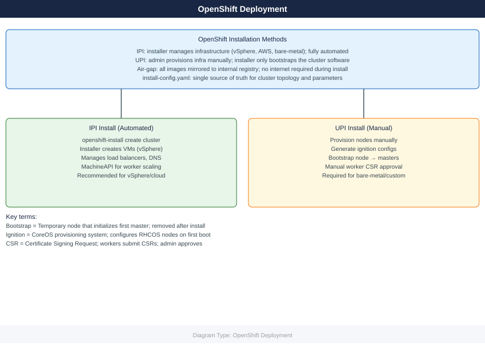

---
tags:
  - deployment
search:
  boost: 1.5
---
# OpenShift — Deploy

<div class="kb-summary">
IPI vs UPI vs agent-based installation methods, install-config.yaml structure for vSphere IPI, RHCOS bootstrap sequence, air-gap mirror setup with oc-mirror, DNS requirements, and post-install validation checklist.

*Applies to: OpenShift 4.x*
</div>



```d2
direction: right

plan: "Plan" {shape: oval}
ipi_install_sequence: "IPI Install Sequence" {shape: rectangle}
dns_requirements: "DNS Requirements" {shape: rectangle}
installconfigyaml_vsphere_ipi_full_e: "install-config.yaml (vSphere IPI — Full Example)" {shape: rectangle}
ipi_installation_procedure: "IPI Installation Procedure" {shape: rectangle}
upi_baremetal_procedure: "UPI Bare-Metal Procedure" {shape: rectangle}
agentbased_install: "Agent-Based Install" {shape: rectangle}
validate: "Validate" {shape: oval}

plan -> ipi_install_sequence
ipi_install_sequence -> dns_requirements
dns_requirements -> installconfigyaml_vsphere_ipi_full_e
installconfigyaml_vsphere_ipi_full_e -> ipi_installation_procedure
ipi_installation_procedure -> upi_baremetal_procedure
upi_baremetal_procedure -> agentbased_install
agentbased_install -> validate
```

## Before you begin

- **Access:** Admin credentials on all affected systems
- **Environment:** DNS, NTP, and network connectivity verified before starting
- **Change management:** change request approved; maintenance window scheduled
- **Rollback:** snapshot or backup taken immediately before deployment begins
- **Time estimate:** 30–90 minutes — do not start if less than 2 hours are available

---

## IPI Install Sequence

## DNS Requirements

Required DNS records must exist **before** running `openshift-install`. The installer validates DNS early and aborts if records are missing.

| Record | Type | Target | Port | Required By |
|--------|------|--------|------|-------------|
| `api.<cluster>.<base>` | A | Load balancer VIP | 6443 | All clients, workers |
| `api-int.<cluster>.<base>` | A | Load balancer VIP (internal) | 6443 | Nodes (internal) |
| `*.apps.<cluster>.<base>` | A (wildcard) | Ingress router VIP | 80/443 | All app routes |
| `etcd-0.<cluster>.<base>` | A | Master-0 IP | — | Bootstrap/etcd peer |
| `etcd-1.<cluster>.<base>` | A | Master-1 IP | — | Bootstrap/etcd peer |
| `etcd-2.<cluster>.<base>` | A | Master-2 IP | — | Bootstrap/etcd peer |
| `_etcd-server-ssl._tcp.<cluster>.<base>` | SRV | etcd-{0,1,2} | 2380 | etcd peer discovery |

```bash
# Validate DNS before install
nslookup api.ocp.example.com
nslookup test.apps.ocp.example.com
dig +short _etcd-server-ssl._tcp.ocp.example.com SRV

# NTP — etcd requires < 1 s clock drift between masters
chronyc tracking
timedatectl status

# Load balancer port requirements
# 6443   → kube-apiserver (masters + bootstrap)
# 22623  → machine-config server (nodes, bootstrap phase only)
# 80/443 → ingress router (infra or worker nodes)
```


```text title="Expected output"
Server:		10.0.0.53
Address:	10.0.0.53#53

Name:	api.ocp.example.com
Address: 192.168.1.10

Server:		10.0.0.53
Address:	10.0.0.53#53

Name:	test.apps.ocp.example.com
Address: 192.168.1.11

0 10 etcd-server-ssl 5 100 2380 etcd-0.ocp.example.com.
0 10 etcd-server-ssl 5 100 2380 etcd-1.ocp.example.com.
0 10 etcd-server-ssl 5 100 2380 etcd-2.ocp.example.com.

Reference time server: 192.168.1.1
Stratum           : 2
Ref time (UTC)    : Fri Jan 10 14:32:18 2025
System time       : 0.000234567 seconds slow of NTP time
Frequency offset  : -2.341 ppm
Residual freq dev : 0.042 ppm
Skew               : 0.089 ppm
Root delay        : 0.021345 seconds
Root dispersion   : 0.045678 seconds
Max error         : 0.089234 seconds
Leap status       : Normal

               Local time: Fri 2025-01-10 14:32:18 UTC
           Universal time: Fri 2025-01-10 14:32:18 UTC
                 RTC time: Fri 2025-01-10 14:32:18
                Time zone: UTC (UTC, +0000)
System clock synchronized: yes
              NTP service: active
          RTC in local TZ: no
```

!!! warning "Common errors"
    **`nslookup: can't resolve 'api.ocp.example.com': No address associated with hostname`** — Verify DNS A record exists for api.ocp.example.com and resolves to the load balancer VIP.
    **`dig: couldn't get address for '_etcd-server-ssl._tcp.ocp.example.com': not known`** — Create SRV records for etcd cluster members or ensure DNS is configured with proper etcd service discovery entries.
    **`System clock unsynchronized: no`** — Start and enable chrony/ntpd service with `systemctl start chronyd && systemctl enable chronyd`, then wait 1–2 minutes for clock synchronization.
## install-config.yaml (vSphere IPI — Full Example)

```yaml
apiVersion: v1
baseDomain: example.com
metadata:
  name: ocp                        # cluster name → ocp.example.com

compute:
- architecture: amd64
  hyperthreading: Enabled
  name: worker
  replicas: 3
  platform:
    vsphere:
      cpus: 4
      coresPerSocket: 2
      memoryMB: 16384
      osDisk:
        diskSizeGB: 120

controlPlane:
  architecture: amd64
  hyperthreading: Enabled
  name: master
  replicas: 3                      # Always 3 for production
  platform:
    vsphere:
      cpus: 4
      coresPerSocket: 2
      memoryMB: 16384
      osDisk:
        diskSizeGB: 120

platform:
  vsphere:
    vcenter: vcenter.example.com
    username: ocp-install@vsphere.local
    password: "VMware1!"
    datacenter: Datacenter
    defaultDatastore: vsanDatastore
    cluster: OCP-Cluster            # vSphere compute cluster
    folder: /Datacenter/vm/ocp      # VM folder for OCP VMs
    network: "OCP-VLAN-100"         # Port group name (exact match)
    diskType: thin

networking:
  networkType: OVNKubernetes
  clusterNetwork:
  - cidr: 10.128.0.0/14            # Pod network
    hostPrefix: 23                  # /23 per node = 512 pod IPs
  serviceNetwork:
  - 172.30.0.0/16                  # ClusterIP service range
  machineNetwork:
  - cidr: 192.168.100.0/24         # Node network (must match actual subnet)

fips: false                        # Set true for FIPS-compliant environments

pullSecret: '{"auths":{"cloud.redhat.com":{"auth":"<base64>"},"registry.redhat.io":{"auth":"<base64>"}}}'
sshKey: 'ssh-rsa AAAA... admin@example.com'

# For air-gap installs add:
# additionalTrustBundle: |
#   -----BEGIN CERTIFICATE-----
#   <mirror CA cert>
#   -----END CERTIFICATE-----
# imageContentSources: [...]
```

## IPI Installation Procedure

```bash
# 1. Download installer binary
wget https://mirror.openshift.com/pub/openshift-v4/clients/ocp/4.14.5/openshift-install-linux.tar.gz
tar xf openshift-install-linux.tar.gz

# 2. Create install directory (NEVER run install from same dir as install-config.yaml directly)
mkdir ocp-install
cp install-config.yaml ocp-install/

# 3. Run install (consumes install-config.yaml — keep a backup)
./openshift-install create cluster --dir ocp-install --log-level=info

# 4. Watch specific phases
./openshift-install wait-for bootstrap-complete --dir ocp-install --log-level=debug
./openshift-install wait-for install-complete --dir ocp-install

# 5. Credentials output
cat ocp-install/auth/kubeconfig          # Set as KUBECONFIG
cat ocp-install/auth/kubeadmin-password  # Rotate or remove post-install

# Installer log for troubleshooting
tail -f ocp-install/.openshift_install.log
```


```text title="Expected output"
--2024-01-15 14:32:18--  https://mirror.openshift.com/pub/openshift-v4/clients/ocp/4.14.5/openshift-install-linux.tar.gz
Resolving mirror.openshift.com (mirror.openshift.com)... 104.18.42.156
Connecting to mirror.openshift.com (mirror.openshift.com)|104.18.42.156|:443... connected.
HTTP request sent, awaiting response... 200 OK
Length: 487234567 (465M) [application/gzip]
Saving to: 'openshift-install-linux.tar.gz'
openshift-install-linux.tar.gz   100%[=====================================>] 465.00M  8.45MB/s    in 55s
2024-01-15 14:33:13 (8.45 MB/s) - 'openshift-install-linux.tar.gz' saved [487234567/465M]

INFO Waiting up to 20m0s for the Kubernetes API at https://api.ocp.example.com:6443...
INFO API v1.27.8+4fab27b is up
INFO Waiting up to 30m0s for bootstrapping to complete...
INFO It is now safe to remove the bootstrap resources
INFO Waiting up to 30m0s for the cluster to initialize...
INFO Waiting for CVO to report available status...
INFO Cluster initialization complete
INFO Install complete!
INFO To access the cluster as the system:admin user when using 'oc', run 'export KUBECONFIG=/root/ocp-install/auth/kubeconfig'
INFO Access the OpenShift web-console here: https://console-openshift-console.apps.ocp.example.com
INFO Login to the console with user "kubeadmin", and password "aBcD3-EfGhI-JkLmN-OpQrS"

apiVersion: v1
clusters:
- cluster:
    certificate-authority-data: LS0tLS1CRUdJTiBDRVJUSUZJQ0FURS0tLS0tCk1JSUN5RENDQWJRQ0NRRDZwVjBWVjBWVDAzREpCRkJnTlZIUk1CQWY4RkFEQXhNQjRHQTFVZEVRUVgKLS0tLS1FTkQgQ0VSVElGSUNBVEUtLS0tLQo=
    server: https://api.ocp.example.com:6443
  name: ocp-install
contexts:
- context:
    cluster: ocp-install
    user: system:admin
  name: admin
current-context: admin
kind: Config
preferences: {}
users:
- name: system:admin
  user:
    client-certificate-data: LS0tLS1CRUdJTiBDRVJUSUZJQ0FURS0tLS0tCk1JSUN5RENDQWJRQ0NRRDZwVjBWVjBWVDAzREpCRkJnTlZIUk1CQWY4Rk
```
## UPI Bare-Metal Procedure

Ordered steps — do not skip or reorder.

1. **Generate manifests** — review and optionally patch before ignition generation.
2. **Remove machines/machinesets** from manifests if not using MachineAPI (bare-metal UPI).
3. **Generate ignition configs** — produces `bootstrap.ign`, `master.ign`, `worker.ign`.
4. **Serve ignition via HTTP** — nodes fetch configs at first boot; URL must be reachable from nodes.
5. **Boot bootstrap** from RHCOS ISO/PXE; pass `coreos.inst.ignition_url=http://<server>/bootstrap.ign`.
6. **Boot masters** with `master.ign`; wait for API to become available.
7. **Monitor bootstrap** completion; remove bootstrap node from load balancer.
8. **Approve worker CSRs** in two rounds (node CSR then client CSR).
9. **Wait for install-complete**; validate all operators.

```bash
# Steps 1-3
./openshift-install create manifests --dir ocp-install
# Optional: set mastersSchedulable=false in cluster-scheduler-02-config.yml
./openshift-install create ignition-configs --dir ocp-install
# Files: bootstrap.ign  master.ign  worker.ign  auth/

# Step 4 — serve ignition (Python example)
cd ocp-install && python3 -m http.server 8080

# Step 5/6 — RHCOS kernel args (PXE)
# coreos.inst=yes
# coreos.inst.install_dev=/dev/sda
# coreos.inst.image_url=http://<server>/rhcos.raw.gz
# coreos.inst.ignition_url=http://<server>/bootstrap.ign

# Step 7 — monitor bootstrap
./openshift-install wait-for bootstrap-complete --dir ocp-install

# Step 8 — approve worker CSRs (run twice: node CSR then client CSR)
oc get csr | grep Pending
oc get csr -o name | xargs oc adm certificate approve
# Wait ~2 min; repeat for second CSR wave
oc get csr | grep Pending
oc get csr -o name | xargs oc adm certificate approve

# Step 9
./openshift-install wait-for install-complete --dir ocp-install
```


```text title="Expected output"
INFO Consuming Openshift Manifests from target directory
INFO Manifests created in: ocp-install/manifests and ocp-install/openshift
INFO Consuming Master Machines from target directory
INFO Consuming Worker Machines from target directory
INFO Consuming Common Manifests from target directory
INFO Ignition-configs created in: ocp-install and ocp-install/auth
Serving HTTP on 0.0.0.0 port 8080 (http://0.0.0.0:8080/) ...
INFO Waiting up to 20m0s (until 14:32:18 UTC) for the Kubernetes API at https://api.ocp.example.com:6443...
INFO API v1.27.3+6d4b3f7 up
INFO Waiting up to 10m0s (until 14:38:22 UTC) for bootstrapping to complete...
INFO It is now safe to remove the bootstrap resources
NAME                                       AGE     SIGNERNAME                                    REQUESTOR                   CONDITION
csr-8k4mj                                  2m13s   kubernetes.io/kube-apiserver-client-kubelet   system:serviceaccount:openshift-machine-config-operator:default   Pending
csr-9p2lx                                  2m10s   kubernetes.io/kubelet-serving                  system:node:worker-0.ocp.example.com   Pending
certificaterequest.certificates.k8s.io/csr-8k4mj approved
certificaterequest.certificates.k8s.io/csr-9p2lx approved
INFO Waiting up to 30m0s (until 15:02:18 UTC) for the cluster to initialize...
INFO Waiting for cluster operators to finish updating...
INFO All cluster operators available. Cluster initialization complete.
INFO Install complete!
INFO To access the cluster as the system:admin user when using 'oc', run 'export KUBECONFIG=ocp-install/auth/kubeconfig'
```

!!! warning "Common errors"
    **`error: open ocp-install/manifests/cluster-scheduler-02-config.yml: no such file or directory`** — Run `./openshift-install create manifests --dir ocp-install` first to generate the manifests directory.
    **`error: Unable to connect to the server: dial tcp: lookup api.ocp.example.com: no such host`** — Ensure DNS is resolving your API endpoint and the cluster network is reachable before running wait-for commands.
    **`error: http.server: Address already in use`** — Kill the existing process on port 8080 with `lsof -ti:8080 | xargs kill -9` or use a different port with `python3 -m http.server 8081`.
## Agent-Based Install

Agent-based install (`openshift-install agent create image`) generates a bootable ISO that combines ignition, networking config, and the install agent. Use when: bare-metal without PXE infrastructure, disconnected/air-gap environments, single-node OCP (SNO).

**Differences from IPI/UPI:**

| Aspect | IPI | UPI | Agent-Based |
|--------|-----|-----|-------------|
| Infrastructure provisioning | Installer | Operator | N/A (bare-metal only) |
| PXE/HTTP server needed | No | Yes | No |
| Disconnected support | Partial | Yes | Yes (full) |
| SNO support | No | Yes | Yes |
| MachineAPI post-install | Yes | Optional | Optional |

```yaml
# agent-config.yaml
apiVersion: v1alpha1
kind: AgentConfig
metadata:
  name: ocp
rendezvousIP: 192.168.100.10        # Bootstrap/rendezvous node IP
hosts:
- hostname: master-0
  role: master
  interfaces:
  - name: ens3
    macAddress: "AA:BB:CC:DD:EE:01"
  networkConfig:
    interfaces:
    - name: ens3
      type: ethernet
      state: up
      ipv4:
        enabled: true
        address:
        - ip: 192.168.100.10
          prefix-length: 24
        dhcp: false
    dns-resolver:
      config:
        server:
        - 192.168.100.1
    routes:
      config:
      - destination: 0.0.0.0/0
        next-hop-address: 192.168.100.1
        next-hop-interface: ens3
```

```bash
# Generate agent ISO (requires install-config.yaml + agent-config.yaml)
./openshift-install agent create image --dir ocp-install
# Outputs: ocp-install/agent.x86_64.iso

# Boot all nodes from ISO; agent coordinates rendezvous automatically
# Monitor
./openshift-install agent wait-for bootstrap-complete --dir ocp-install
./openshift-install agent wait-for install-complete --dir ocp-install
```


```text title="Expected output"
INFO Extracting base image from release payload
INFO Extracting agent ISO from release payload
INFO Agent ISO created successfully
INFO ISO available at: ocp-install/agent.x86_64.iso
INFO Waiting for bootstrap to complete...
INFO Discovered agent: host-1.example.com (192.168.1.101)
INFO Discovered agent: host-2.example.com (192.168.1.102)
INFO Discovered agent: host-3.example.com (192.168.1.103)
INFO Bootstrap complete
INFO Waiting for cluster operators to stabilize...
INFO Cluster version: 4.14.5
INFO Install complete!
INFO Cluster is available at: https://api.ocp-cluster.example.com:6443
INFO kubeconfig written to: ocp-install/auth/kubeconfig
```

!!! warning "Common errors"
    **`Error: install-config.yaml not found in ocp-install directory`** — Ensure install-config.yaml and agent-config.yaml are present in the ocp-install directory before running the create image command.
    **`Error: failed to discover agents: no agents joined the cluster within timeout`** — Verify all nodes have booted from the ISO, network connectivity is functional, and firewall rules allow agent communication on port 8090.
    **`Error: bootstrap did not complete: pending csr approvals`** — Manually approve pending certificate signing requests using `oc adm certificate approve <csr-name>` or ensure automatic CSR approval is configured.
## Air-Gap Mirror Setup

```yaml
# imageset-config.yaml (oc-mirror v2)
kind: ImageSetConfiguration
apiVersion: mirror.openshift.io/v2alpha1
mirror:
  platform:
    channels:
    - name: stable-4.14
      minVersion: 4.14.0
      maxVersion: 4.14.5
      type: ocp
    graph: true                      # Include Cincinnati graph for disconnected upgrades
  operators:
  - catalog: registry.redhat.io/redhat/redhat-operator-index:v4.14
    packages:
    - name: local-storage-operator
    - name: odf-operator
  additionalImages:
  - name: registry.redhat.io/ubi9/ubi:latest
```

```bash
# 1. Mirror to internal registry
oc mirror --config imageset-config.yaml docker://quay.local:8443/ocp4 --dest-skip-tls

# 2. After mirroring — apply generated CRs
ls oc-mirror-workspace/results-*/
# Contains: imageContentSourcePolicy.yaml, catalogSource.yaml, updateService.yaml

oc apply -f oc-mirror-workspace/results-*/imageContentSourcePolicy.yaml
oc apply -f oc-mirror-workspace/results-*/catalogSource.yaml

# 3. Validate ICSP applied and nodes are not degraded
oc get imagecontentsourcepolicy
oc get mcp                         # Nodes will reboot to apply ICSP

# 4. Verify image pull from mirror
oc debug node/<node> -- chroot /host crictl pull quay.local:8443/ocp4/openshift/release:4.14.5-x86_64
```


```text title="Expected output"
Mirroring image set from imageset-config.yaml to docker://quay.local:8443/ocp4
Wrote ICSP manifests to oc-mirror-workspace/results-1704067234/
Wrote CatalogSource manifests to oc-mirror-workspace/results-1704067234/
Processing complete. 847 images mirrored in 12m34s

imageContentSourcePolicy.yaml  catalogSource.yaml  updateService.yaml

imagecontentsourcepolicy.yaml created
catalogsource.yaml created

NAME                                    AGE
release-0                               2s

NAME                                    CONFIG                      UPDATED   UPDATING   DEGRADED   MACHINECOUNT   READYMACHINECOUNT   UPDATEDMACHINECOUNT   DEGRADEDMACHINECOUNT   AGE
master                                  rendered-master-a1b2c3d4    True      False      False      3               3                   3                     0                      45d
worker                                  rendered-worker-e5f6g7h8    True      True       False      2               1                   1                     0                      45d

Image pull from quay.local:8443/ocp4/openshift/release:4.14.5-x86_64 succeeded
sha256:a1b2c3d4e5f6g7h8i9j0k1l2m3n4o5p6q7r8s9t0u1v2w3x4y5z6a7b8c9d0e1f2
```

!!! warning "Common errors"
    **`error: unable to connect to quay.local:8443: x509: certificate signed by unknown authority`** — Add `--dest-skip-tls` flag to the mirror command or import the registry's CA certificate into the cluster's trusted store.
    **`Error from server (NotFound): imagecontentsourcepolicies.config.openshift.io "release-0" not found`** — Verify the ICSP YAML file path is correct and the `oc apply` command targeted the correct results directory with wildcard expansion.
    **`error: unable to pull image: rpc error: code = Unknown desc = failed to pull and unpack image: failed to resolve reference: name not found`** — Ensure the image was successfully mirrored by checking `oc-mirror-workspace/results-*/mapping.txt` and verify the mirror registry hostname is resolvable from the node.
## Post-Install Validation Checklist

| Check | Command | Expected Result |
|-------|---------|-----------------|
| Cluster version | `oc get clusterversion` | `True False False` on ClusterVersion |
| All operators healthy | `oc get co \| grep -v "True.*False.*False"` | No output (all healthy) |
| All nodes Ready | `oc get nodes` | All `Ready`, no `NotReady` |
| etcd cluster healthy | `oc rsh -n openshift-etcd etcd-<master> etcdctl endpoint health --cluster` | All endpoints healthy |
| No unhealthy pods | `oc get pods -A \| grep -vE "Running\|Completed\|Succeeded"` | Empty or expected only |
| Ingress reachable | `curl -k https://console-openshift-console.apps.<cluster>.<base>` | HTTP 200/302 |
| Image registry configured | `oc get configs.imageregistry.operator.openshift.io cluster -o jsonpath='{.spec.managementState}'` | `Managed` |
| Default StorageClass | `oc get sc` | At least one `(default)` |
| Machine API healthy | `oc get machines -A` | All `Running` phase |
| kubeadmin removed | `oc get secret kubeadmin -n kube-system` | `Error: not found` (after IDP configured) |

```bash
export KUBECONFIG=ocp-install/auth/kubeconfig

# Quick all-green check
oc get clusterversion
oc get co | grep -v "True.*False.*False" | grep -v "^NAME"
oc get nodes
oc get pods -A | grep -vE "Running|Completed|Succeeded" | grep -v "^NAMESPACE"

# Rotate kubeadmin after configuring identity provider
oc delete secret kubeadmin -n kube-system
```


```text title="Expected output"
NAME                                       VERSION   AVAILABLE   PROGRESSING   SINCE   STATUS
cluster-version                            4.14.12   True        False         2h      Cluster version is 4.14.12
authentication                             4.14.12   True        False         2h15m   
baremetal                                  4.14.12   True        False         2h14m   
cloud-credential                           4.14.12   True        False         2h16m   
...
NAME                 STATUS   ROLES           AGE   VERSION
master-0.ocp.local   Ready    control-plane   2h    v1.27.8+4fab27b
master-1.ocp.local   Ready    control-plane   2h    v1.27.8+4fab27b
master-2.ocp.local   Ready    control-plane   2h    v1.27.8+4fab27b
worker-0.ocp.local   Ready    worker          95m   v1.27.8+4fab27b
worker-1.ocp.local   Ready    worker          94m   v1.27.8+4fab27b
openshift-etcd       etcd-quorum-guard-0                    0/1     CrashLoopBackOff   3          45m
openshift-monitoring prometheus-operator-5d8c7f4b9-xyz12   0/2     Pending            0          12m
secret "kubeadmin" deleted
```

!!! warning "Common errors"
    **`error: unable to read the kubeconfig file "ocp-install/auth/kubeconfig": open ocp-install/auth/kubeconfig: no such file or directory`** — Verify the installation directory path is correct and run the command from the parent directory where `ocp-install/` exists.
    **`error: the server has asked for the client to provide credentials`** — Ensure the kubeconfig file has valid credentials and the API server is accessible; regenerate kubeconfig if corrupted.
    **`error: secrets "kubeadmin" not found`** — The kubeadmin secret may have already been deleted or the cluster uses a different identity provider; verify the secret exists before deletion with `oc get secret kubeadmin -n kube-system`.
---

## See also

- [OpenShift — How It Works](../architecture/how-it-works/)
- [OpenShift — Health Checks](../operations/health-checks/)
- [OpenShift — Common Issues](../troubleshooting/common-issues/)

## Verify

- Confirm the service or component is running and reachable
- Check management UI for any errors or warnings
- Run a basic functional test (login, read, write) to confirm end-to-end operation
