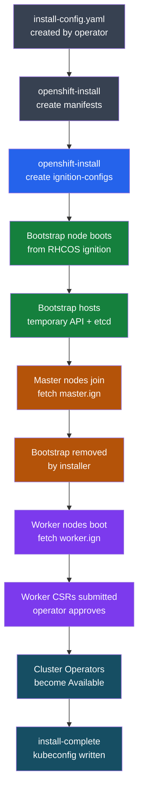

---
tags:
  - deployment
search:
  boost: 1.5
---
# OpenShift — Deploy

<div class="kb-summary">
IPI vs UPI vs agent-based installation methods, install-config.yaml structure for vSphere IPI, RHCOS bootstrap sequence, air-gap mirror setup with oc-mirror, DNS requirements, and post-install validation checklist.
</div>

```text
┌──────────────────────────────────────── OpenShift Deployment ─────────────────────────────────────────┐
│                                                                                                       │
│   ┌───────────────────────────────────────────────────────────────────────────────────────────────┐   │
│   │                                 OpenShift Installation Methods                                │   │
│   │       IPI: installer manages infrastructure (vSphere, AWS, bare-metal); fully automated       │   │
│   │      UPI: admin provisions infra manually; installer only bootstraps the cluster software     │   │
│   │     Air-gap: all images mirrored to internal registry; no internet required during install    │   │
│   │        install-config.yaml: single source of truth for cluster topology and parameters        │   │
│   └───────────────────────────────────────────────────────────────────────────────────────────────┘   │
│                                                                                                       │
│                          ▼                                                 ▼                          │
│                                                                                                       │
│   ┌──────────────────────────────────────────────┐  ┌─────────────────────────────────────────────┐   │
│   │           IPI Install (Automated)            │  │             UPI Install (Manual)            │   │
│   │        openshift-install create cluster      │  │            Provision nodes manually         │   │
│   │        Installer creates VMs (vSphere)       │  │           Generate ignition configs         │   │
│   │          Manages load balancers, DNS         │  │            Bootstrap node → masters         │   │
│   │         MachineAPI for worker scaling        │  │           Manual worker CSR approval        │   │
│   │         Recommended for vSphere/cloud        │  │         Required for bare-metal/custom      │   │
│   └──────────────────────────────────────────────┘  └─────────────────────────────────────────────┘   │
│                                                                                                       │
│    Key terms:                                                                                         │
│    Bootstrap  = Temporary node that initializes first master; removed after install                   │
│    Ignition   = CoreOS provisioning system; configures RHCOS nodes on first boot                      │
│    CSR        = Certificate Signing Request; workers submit CSRs; admin approves                      │
│                                                                                                       │
```

## Before you begin

- **Access:** Admin credentials on all affected systems
- **Environment:** DNS, NTP, and network connectivity verified before starting
- **Change management:** change request approved; maintenance window scheduled
- **Rollback:** snapshot or backup taken immediately before deployment begins
- **Time estimate:** 30–90 minutes — do not start if less than 2 hours are available

---

## IPI Install Sequence



## DNS Requirements

Required DNS records must exist **before** running `openshift-install`. The installer validates DNS early and aborts if records are missing.

| Record | Type | Target | Port | Required By |
|--------|------|--------|------|-------------|
| `api.<cluster>.<base>` | A | Load balancer VIP | 6443 | All clients, workers |
| `api-int.<cluster>.<base>` | A | Load balancer VIP (internal) | 6443 | Nodes (internal) |
| `*.apps.<cluster>.<base>` | A (wildcard) | Ingress router VIP | 80/443 | All app routes |
| `etcd-0.<cluster>.<base>` | A | Master-0 IP | — | Bootstrap/etcd peer |
| `etcd-1.<cluster>.<base>` | A | Master-1 IP | — | Bootstrap/etcd peer |
| `etcd-2.<cluster>.<base>` | A | Master-2 IP | — | Bootstrap/etcd peer |
| `_etcd-server-ssl._tcp.<cluster>.<base>` | SRV | etcd-{0,1,2} | 2380 | etcd peer discovery |

```bash
# Validate DNS before install
nslookup api.ocp.example.com
nslookup test.apps.ocp.example.com
dig +short _etcd-server-ssl._tcp.ocp.example.com SRV

# NTP — etcd requires < 1 s clock drift between masters
chronyc tracking
timedatectl status

# Load balancer port requirements
# 6443   → kube-apiserver (masters + bootstrap)
# 22623  → machine-config server (nodes, bootstrap phase only)
# 80/443 → ingress router (infra or worker nodes)
```

## install-config.yaml (vSphere IPI — Full Example)

```yaml
apiVersion: v1
baseDomain: example.com
metadata:
  name: ocp                        # cluster name → ocp.example.com

compute:
- architecture: amd64
  hyperthreading: Enabled
  name: worker
  replicas: 3
  platform:
    vsphere:
      cpus: 4
      coresPerSocket: 2
      memoryMB: 16384
      osDisk:
        diskSizeGB: 120

controlPlane:
  architecture: amd64
  hyperthreading: Enabled
  name: master
  replicas: 3                      # Always 3 for production
  platform:
    vsphere:
      cpus: 4
      coresPerSocket: 2
      memoryMB: 16384
      osDisk:
        diskSizeGB: 120

platform:
  vsphere:
    vcenter: vcenter.example.com
    username: ocp-install@vsphere.local
    password: "VMware1!"
    datacenter: Datacenter
    defaultDatastore: vsanDatastore
    cluster: OCP-Cluster            # vSphere compute cluster
    folder: /Datacenter/vm/ocp      # VM folder for OCP VMs
    network: "OCP-VLAN-100"         # Port group name (exact match)
    diskType: thin

networking:
  networkType: OVNKubernetes
  clusterNetwork:
  - cidr: 10.128.0.0/14            # Pod network
    hostPrefix: 23                  # /23 per node = 512 pod IPs
  serviceNetwork:
  - 172.30.0.0/16                  # ClusterIP service range
  machineNetwork:
  - cidr: 192.168.100.0/24         # Node network (must match actual subnet)

fips: false                        # Set true for FIPS-compliant environments

pullSecret: '{"auths":{"cloud.redhat.com":{"auth":"<base64>"},"registry.redhat.io":{"auth":"<base64>"}}}'
sshKey: 'ssh-rsa AAAA... admin@example.com'

# For air-gap installs add:
# additionalTrustBundle: |
#   -----BEGIN CERTIFICATE-----
#   <mirror CA cert>
#   -----END CERTIFICATE-----
# imageContentSources: [...]
```

## IPI Installation Procedure

```bash
# 1. Download installer binary
wget https://mirror.openshift.com/pub/openshift-v4/clients/ocp/4.14.5/openshift-install-linux.tar.gz
tar xf openshift-install-linux.tar.gz

# 2. Create install directory (NEVER run install from same dir as install-config.yaml directly)
mkdir ocp-install
cp install-config.yaml ocp-install/

# 3. Run install (consumes install-config.yaml — keep a backup)
./openshift-install create cluster --dir ocp-install --log-level=info

# 4. Watch specific phases
./openshift-install wait-for bootstrap-complete --dir ocp-install --log-level=debug
./openshift-install wait-for install-complete --dir ocp-install

# 5. Credentials output
cat ocp-install/auth/kubeconfig          # Set as KUBECONFIG
cat ocp-install/auth/kubeadmin-password  # Rotate or remove post-install

# Installer log for troubleshooting
tail -f ocp-install/.openshift_install.log
```

## UPI Bare-Metal Procedure

Ordered steps — do not skip or reorder.

1. **Generate manifests** — review and optionally patch before ignition generation.
2. **Remove machines/machinesets** from manifests if not using MachineAPI (bare-metal UPI).
3. **Generate ignition configs** — produces `bootstrap.ign`, `master.ign`, `worker.ign`.
4. **Serve ignition via HTTP** — nodes fetch configs at first boot; URL must be reachable from nodes.
5. **Boot bootstrap** from RHCOS ISO/PXE; pass `coreos.inst.ignition_url=http://<server>/bootstrap.ign`.
6. **Boot masters** with `master.ign`; wait for API to become available.
7. **Monitor bootstrap** completion; remove bootstrap node from load balancer.
8. **Approve worker CSRs** in two rounds (node CSR then client CSR).
9. **Wait for install-complete**; validate all operators.

```bash
# Steps 1-3
./openshift-install create manifests --dir ocp-install
# Optional: set mastersSchedulable=false in cluster-scheduler-02-config.yml
./openshift-install create ignition-configs --dir ocp-install
# Files: bootstrap.ign  master.ign  worker.ign  auth/

# Step 4 — serve ignition (Python example)
cd ocp-install && python3 -m http.server 8080

# Step 5/6 — RHCOS kernel args (PXE)
# coreos.inst=yes
# coreos.inst.install_dev=/dev/sda
# coreos.inst.image_url=http://<server>/rhcos.raw.gz
# coreos.inst.ignition_url=http://<server>/bootstrap.ign

# Step 7 — monitor bootstrap
./openshift-install wait-for bootstrap-complete --dir ocp-install

# Step 8 — approve worker CSRs (run twice: node CSR then client CSR)
oc get csr | grep Pending
oc get csr -o name | xargs oc adm certificate approve
# Wait ~2 min; repeat for second CSR wave
oc get csr | grep Pending
oc get csr -o name | xargs oc adm certificate approve

# Step 9
./openshift-install wait-for install-complete --dir ocp-install
```

## Agent-Based Install

Agent-based install (`openshift-install agent create image`) generates a bootable ISO that combines ignition, networking config, and the install agent. Use when: bare-metal without PXE infrastructure, disconnected/air-gap environments, single-node OCP (SNO).

**Differences from IPI/UPI:**

| Aspect | IPI | UPI | Agent-Based |
|--------|-----|-----|-------------|
| Infrastructure provisioning | Installer | Operator | N/A (bare-metal only) |
| PXE/HTTP server needed | No | Yes | No |
| Disconnected support | Partial | Yes | Yes (full) |
| SNO support | No | Yes | Yes |
| MachineAPI post-install | Yes | Optional | Optional |

```yaml
# agent-config.yaml
apiVersion: v1alpha1
kind: AgentConfig
metadata:
  name: ocp
rendezvousIP: 192.168.100.10        # Bootstrap/rendezvous node IP
hosts:
- hostname: master-0
  role: master
  interfaces:
  - name: ens3
    macAddress: "AA:BB:CC:DD:EE:01"
  networkConfig:
    interfaces:
    - name: ens3
      type: ethernet
      state: up
      ipv4:
        enabled: true
        address:
        - ip: 192.168.100.10
          prefix-length: 24
        dhcp: false
    dns-resolver:
      config:
        server:
        - 192.168.100.1
    routes:
      config:
      - destination: 0.0.0.0/0
        next-hop-address: 192.168.100.1
        next-hop-interface: ens3
```

```bash
# Generate agent ISO (requires install-config.yaml + agent-config.yaml)
./openshift-install agent create image --dir ocp-install
# Outputs: ocp-install/agent.x86_64.iso

# Boot all nodes from ISO; agent coordinates rendezvous automatically
# Monitor
./openshift-install agent wait-for bootstrap-complete --dir ocp-install
./openshift-install agent wait-for install-complete --dir ocp-install
```

## Air-Gap Mirror Setup

```yaml
# imageset-config.yaml (oc-mirror v2)
kind: ImageSetConfiguration
apiVersion: mirror.openshift.io/v2alpha1
mirror:
  platform:
    channels:
    - name: stable-4.14
      minVersion: 4.14.0
      maxVersion: 4.14.5
      type: ocp
    graph: true                      # Include Cincinnati graph for disconnected upgrades
  operators:
  - catalog: registry.redhat.io/redhat/redhat-operator-index:v4.14
    packages:
    - name: local-storage-operator
    - name: odf-operator
  additionalImages:
  - name: registry.redhat.io/ubi9/ubi:latest
```

```bash
# 1. Mirror to internal registry
oc mirror --config imageset-config.yaml docker://quay.local:8443/ocp4 --dest-skip-tls

# 2. After mirroring — apply generated CRs
ls oc-mirror-workspace/results-*/
# Contains: imageContentSourcePolicy.yaml, catalogSource.yaml, updateService.yaml

oc apply -f oc-mirror-workspace/results-*/imageContentSourcePolicy.yaml
oc apply -f oc-mirror-workspace/results-*/catalogSource.yaml

# 3. Validate ICSP applied and nodes are not degraded
oc get imagecontentsourcepolicy
oc get mcp                         # Nodes will reboot to apply ICSP

# 4. Verify image pull from mirror
oc debug node/<node> -- chroot /host crictl pull quay.local:8443/ocp4/openshift/release:4.14.5-x86_64
```

## Post-Install Validation Checklist

| Check | Command | Expected Result |
|-------|---------|-----------------|
| Cluster version | `oc get clusterversion` | `True False False` on ClusterVersion |
| All operators healthy | `oc get co \| grep -v "True.*False.*False"` | No output (all healthy) |
| All nodes Ready | `oc get nodes` | All `Ready`, no `NotReady` |
| etcd cluster healthy | `oc rsh -n openshift-etcd etcd-<master> etcdctl endpoint health --cluster` | All endpoints healthy |
| No unhealthy pods | `oc get pods -A \| grep -vE "Running\|Completed\|Succeeded"` | Empty or expected only |
| Ingress reachable | `curl -k https://console-openshift-console.apps.<cluster>.<base>` | HTTP 200/302 |
| Image registry configured | `oc get configs.imageregistry.operator.openshift.io cluster -o jsonpath='{.spec.managementState}'` | `Managed` |
| Default StorageClass | `oc get sc` | At least one `(default)` |
| Machine API healthy | `oc get machines -A` | All `Running` phase |
| kubeadmin removed | `oc get secret kubeadmin -n kube-system` | `Error: not found` (after IDP configured) |

```bash
export KUBECONFIG=ocp-install/auth/kubeconfig

# Quick all-green check
oc get clusterversion
oc get co | grep -v "True.*False.*False" | grep -v "^NAME"
oc get nodes
oc get pods -A | grep -vE "Running|Completed|Succeeded" | grep -v "^NAMESPACE"

# Rotate kubeadmin after configuring identity provider
oc delete secret kubeadmin -n kube-system
```

---

## Verify

- Confirm the service or component is running and reachable
- Check management UI for any errors or warnings
- Run a basic functional test (login, read, write) to confirm end-to-end operation
