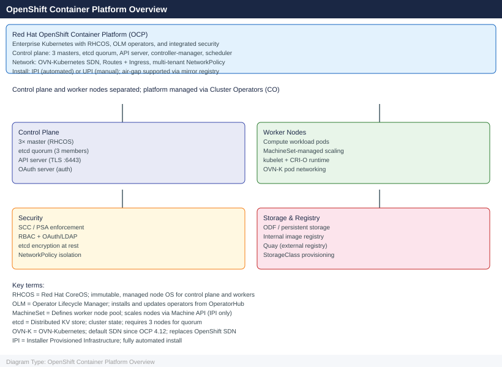

# OpenShift

Red Hat OpenShift Container Platform — Kubernetes-based container orchestration with enterprise security, multi-tenancy, and integrated CI/CD. Runs on vSphere (IPI/UPI), bare metal, AWS, and Azure.

*Applies to: OpenShift 4.x*

  <a class="kb-card" href="architecture/">
    Architecture
    Control plane topology, design standards, and integrations
  </a>
  <a class="kb-card" href="deploy/">
    Deploy
    IPI and UPI installation, RHCOS, air-gap, and post-install validation
  </a>
  <a class="kb-card" href="operations/">
    Operations
    oc CLI, health checks, procedures, scripts, upgrades, and backup
  </a>
  <a class="kb-card" href="security/">
    Security
    RBAC, OAuth identity providers, etcd encryption, and hardening
  </a>
  <a class="kb-card" href="troubleshooting/">
    Troubleshooting
    CrashLoopBackOff, node NotReady, must-gather, and escalation
  </a>

