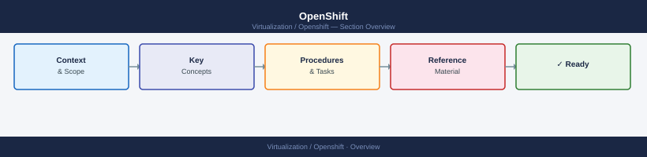

# OpenShift

<div class="kb-summary">
Red Hat OpenShift Container Platform — Kubernetes-based container orchestration with enterprise security, multi-tenancy, and integrated CI/CD. Runs on vSphere (IPI/UPI), bare metal, AWS, and Azure.

*Applies to: OpenShift 4.x*
</div>



```text
┌──────────────────────────────── OpenShift Container Platform Overview ────────────────────────────────┐
│                                                                                                       │
│   ┌───────────────────────────────────────────────────────────────────────────────────────────────┐   │
│   │                           Red Hat OpenShift Container Platform (OCP)                          │   │
│   │            Enterprise Kubernetes with RHCOS, OLM operators, and integrated security           │   │
│   │        Control plane: 3 masters, etcd quorum, API server, controller-manager, scheduler       │   │
│   │           Network: OVN-Kubernetes SDN, Routes + Ingress, multi-tenant NetworkPolicy           │   │
│   │        Install: IPI (automated) or UPI (manual); air-gap supported via mirror registry        │   │
│   └───────────────────────────────────────────────────────────────────────────────────────────────┘   │
│                                                                                                       │
│    Control plane and worker nodes separated; platform managed via Cluster Operators (CO)              │
│                                                                                                       │
│                          ▼                                                 ▼                          │
│                                                                                                       │
│   ┌──────────────────────────────────────────────┐  ┌─────────────────────────────────────────────┐   │
│   │                Control Plane                 │  │                 Worker Nodes                │   │
│   │               3× master (RHCOS)              │  │             Compute workload pods           │   │
│   │            etcd quorum (3 members)           │  │           MachineSet-managed scaling        │   │
│   │             API server (TLS :6443)           │  │            kubelet + CRI-O runtime          │   │
│   │              OAuth server (auth)             │  │              OVN-K pod networking           │   │
│   └──────────────────────────────────────────────┘  └─────────────────────────────────────────────┘   │
│                                                                                                       │
│                      │                  │                   │                  │                      │
│                                                                                                       │
│   ┌──────────────────────────────────────────────┐  ┌─────────────────────────────────────────────┐   │
│   │                   Security                   │  │              Storage & Registry             │   │
│   │             SCC / PSA enforcement            │  │            ODF / persistent storage         │   │
│   │               RBAC + OAuth/LDAP              │  │            Internal image registry          │   │
│   │            etcd encryption at rest           │  │            Quay (external registry)         │   │
│   │            NetworkPolicy isolation           │  │           StorageClass provisioning         │   │
│   └──────────────────────────────────────────────┘  └─────────────────────────────────────────────┘   │
│                                                                                                       │
│    Key terms:                                                                                         │
│    RHCOS    = Red Hat CoreOS; immutable, managed node OS for control plane and workers                │
│    OLM      = Operator Lifecycle Manager; installs and updates operators from OperatorHub             │
│    MachineSet= Defines worker node pool; scales nodes via Machine API (IPI only)                      │
│    etcd     = Distributed KV store; cluster state; requires 3 nodes for quorum                        │
│    OVN-K    = OVN-Kubernetes; default SDN since OCP 4.12; replaces OpenShift SDN                      │
│    IPI      = Installer Provisioned Infrastructure; fully automated install                           │
│                                                                                                       │
```

<div class="kb-grid">
  <a class="kb-card" href="architecture/">
    <span class="kb-card-title">Architecture</span>
    <span class="kb-card-desc">Control plane topology, design standards, and integrations</span>
  </a>
  <a class="kb-card" href="deploy/">
    <span class="kb-card-title">Deploy</span>
    <span class="kb-card-desc">IPI and UPI installation, RHCOS, air-gap, and post-install validation</span>
  </a>
  <a class="kb-card" href="operations/">
    <span class="kb-card-title">Operations</span>
    <span class="kb-card-desc">oc CLI, health checks, procedures, scripts, upgrades, and backup</span>
  </a>
  <a class="kb-card" href="security/">
    <span class="kb-card-title">Security</span>
    <span class="kb-card-desc">RBAC, OAuth identity providers, etcd encryption, and hardening</span>
  </a>
  <a class="kb-card" href="troubleshooting/">
    <span class="kb-card-title">Troubleshooting</span>
    <span class="kb-card-desc">CrashLoopBackOff, node NotReady, must-gather, and escalation</span>
  </a>
</div>
