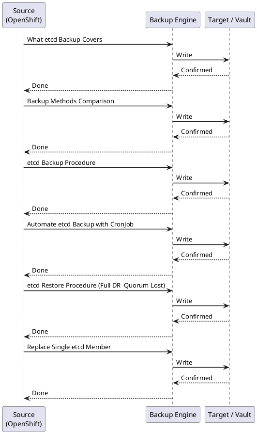

---
tags:
  - operations
description: "etcd backup and restore procedure, OADP (OpenShift API for Data Protection) for application workloads, PV snapshot backup, and recovery from common..."
---
# OpenShift — Backup & Restore

<div class="kb-summary">
etcd backup and restore procedure, OADP (OpenShift API for Data Protection) for application workloads, PV snapshot backup, and recovery from common failure scenarios.

*Applies to: OpenShift 4.x*
</div>

```d2
direction: right

E: "etcd Backup · (daily" {shape: rectangle}
R: "Restore etcd · cluster-restore.sh" {shape: rectangle}
P: "PV Snapshots · (app-level, CSI" {shape: rectangle}
RP: "Restore PVs · PVC from snapshot" {shape: rectangle}
M: "Manifest Export · (git / oc get -o yaml" {shape: rectangle}
RA: "Redeploy Apps · oc apply -f" {shape: rectangle}
H: "Healthy · Control Plane" {shape: rectangle}

E -> R
P -> RP
M -> RA
R -> H
RP -> H
RA -> H
```



## Before you begin

- **Access:** Admin credentials on all affected systems
- **Timing:** safe to run during business hours unless a step is marked ⚠ (causes interruption)
- **Dependencies:** no active upgrades or migrations on the same infrastructure
- **Logging:** capture command output — paste into the change record on completion

---

## What etcd Backup Covers

| Covered | NOT Covered |
|---|---|
| All Kubernetes resources (Deployments, ConfigMaps, Secrets, CRDs) | Persistent volume data |
| RBAC policies, ServiceAccounts | Container images in registry |
| Custom Resource instances (MachineConfigs, ClusterOperators) | Node OS state (RHCOS filesystem) |
| etcd cluster membership state | Application-level databases inside PVs |
| Static pod manifests | External secrets (Vault, AWS SSM) |

## Backup Methods Comparison

| Method | Scope | RPO | RTO | Tooling |
|---|---|---|---|---|
| etcd snapshot | Cluster state (all K8s objects) | Daily / pre-change | 1–2 hours | cluster-backup.sh |
| OADP / Velero | Namespaces, PVCs, resources | Hourly (scheduled) | 30–60 min | OADP operator |
| PV CSI snapshot | Persistent volume data | Per schedule | Minutes | VolumeSnapshot CR |
| GitOps manifest export | Resource definitions only | Continuous | Redeploy time | oc get -o yaml / git |

## etcd Backup Procedure

Full numbered procedure. Run before every upgrade and weekly at minimum.

```bash
# 1. SSH to a master node
ssh core@<master-node-ip>

# 2. Become root
sudo -i

# 3. Run the backup script (included with OCP, ships on every master)
/usr/local/bin/cluster-backup.sh /home/core/assets/backup

# Output produced:
#   /home/core/assets/backup/snapshot_<timestamp>.db            (etcd snapshot)
#   /home/core/assets/backup/static_kuberesources_<timestamp>.tar.gz  (static pod manifests)

# 4. Verify the snapshot was created and is non-trivially sized
ls -lh /home/core/assets/backup/
# snapshot file should be several hundred MB on a healthy cluster

# 5. Copy off-node to durable storage (run from your workstation)
scp core@<master-ip>:/home/core/assets/backup/snapshot_*.db /backup/etcd/
scp core@<master-ip>:/home/core/assets/backup/static_kuberesources_*.tar.gz /backup/etcd/

# Alternative: oc rsync (if oc debug was used to run the backup)
oc rsync <master-pod>:/home/core/assets/backup/ ./etcd-backup-$(date +%F)/
```


```text title="Expected output"
core@master-0.example.com:~$ sudo -i
root@master-0.example.com:~# /usr/local/bin/cluster-backup.sh /home/core/assets/backup
Backing up etcd data...
Backup complete. Files written to /home/core/assets/backup
root@master-0.example.com:~# ls -lh /home/core/assets/backup/
total 892M
-rw-r--r-- 1 core core 847M Nov 14 10:23 snapshot_2024-11-14_102345.db
-rw-r--r-- 1 core core  12M Nov 14 10:23 static_kuberesources_2024-11-14_102345.tar.gz
root@master-0.example.com:~# exit
logout
$ scp core@192.168.1.45:/home/core/assets/backup/snapshot_*.db /backup/etcd/
snapshot_2024-11-14_102345.db                    100%  847MB   18.2MB/s   00:47
$ scp core@192.168.1.45:/home/core/assets/backup/static_kuberesources_*.tar.gz /backup/etcd/
static_kuberesources_2024-11-14_102345.tar.gz    100%   12MB    8.4MB/s   00:01
```

!!! warning "Common errors"
    **`/usr/local/bin/cluster-backup.sh: No such file or directory`** — Verify the OCP version includes the backup script; on older versions use `oc debug node/<master-node>` to access the script or manually back up etcd using `etcdctl`.
    **`scp: /backup/etcd/: No such file or directory`** — Create the destination directory on your workstation with `mkdir -p /backup/etcd/` before running the scp command.
    **`Permission denied (publickey,gssapi-keyexchange)`** — Ensure your SSH key is added to the ssh-agent (`ssh-add ~/.ssh/id_rsa`) and the core user's authorized_keys includes your public key.
## Automate etcd Backup with CronJob

```yaml
apiVersion: batch/v1
kind: CronJob
metadata:
  name: etcd-backup
  namespace: openshift-etcd
spec:
  schedule: "0 2 * * *"
  jobTemplate:
    spec:
      template:
        spec:
          hostPID: true
          hostNetwork: true
          serviceAccountName: etcd-backup
          restartPolicy: OnFailure
          containers:
          - name: etcd-backup
            image: registry.redhat.io/openshift4/ose-cli:latest
            command:
            - /bin/bash
            - -c
            - |
              oc debug node/$(oc get nodes -l node-role.kubernetes.io/master \
                -o name | head -1 | cut -d/ -f2) -- \
                chroot /host /usr/local/bin/cluster-backup.sh /home/core/backup
```

## etcd Restore Procedure (Full DR — Quorum Lost)

**Warning:** Only use when etcd quorum is lost and the cluster API is inaccessible. This procedure is destructive — all three masters are involved.

```bash
# 1. Stop the static API server pods on ALL masters
#    SSH to each master and move the manifests out of the static pod directory
ssh core@master-0
sudo mv /etc/kubernetes/manifests/kube-apiserver.yaml /tmp/
sudo mv /etc/kubernetes/manifests/kube-controller-manager.yaml /tmp/
sudo mv /etc/kubernetes/manifests/kube-scheduler.yaml /tmp/

# Repeat on master-1 and master-2

# 2. On the recovery master (master-0), place the backup files
sudo mkdir -p /home/core/assets/backup
sudo cp /backup/etcd/snapshot_*.db /home/core/assets/backup/
sudo cp /backup/etcd/static_kuberesources_*.tar.gz /home/core/assets/backup/

# 3. Run the restore script on the recovery master only
sudo /usr/local/bin/cluster-restore.sh /home/core/assets/backup

# 4. Restore static pod manifests on the recovery master
sudo mv /tmp/kube-apiserver.yaml /etc/kubernetes/manifests/
sudo mv /tmp/kube-controller-manager.yaml /etc/kubernetes/manifests/
sudo mv /tmp/kube-scheduler.yaml /etc/kubernetes/manifests/

# 5. Wait for API server to come up on master-0
until oc get nodes; do sleep 10; done

# 6. Restart remaining masters — move manifests back on master-1 and master-2
# They will rejoin the restored etcd automatically

# 7. Delete stale etcd pods to force re-sync
oc delete pod -n openshift-etcd --selector=app=etcd

# 8. Approve CSRs for any nodes that need re-joining
oc get csr | grep Pending
oc get csr -o name | xargs oc adm certificate approve

# 9. Verify cluster health
oc get nodes
oc get co
```


```text title="Expected output"
core@master-0:~$ sudo mv /etc/kubernetes/manifests/kube-apiserver.yaml /tmp/
core@master-0:~$ sudo mv /etc/kubernetes/manifests/kube-controller-manager.yaml /tmp/
core@master-0:~$ sudo mv /etc/kubernetes/manifests/kube-scheduler.yaml /tmp/
core@master-0:~$ sudo mkdir -p /home/core/assets/backup
core@master-0:~$ sudo cp /backup/etcd/snapshot_*.db /home/core/assets/backup/
core@master-0:~$ sudo cp /backup/etcd/static_kuberesources_*.tar.gz /home/core/assets/backup/
core@master-0:~$ sudo /usr/local/bin/cluster-restore.sh /home/core/assets/backup
Restoring etcd snapshot from /home/core/assets/backup/snapshot_20240115-143022.db
Restoring static resources from /home/core/assets/backup/static_kuberesources_20240115-143022.tar.gz
Restore completed successfully
core@master-0:~$ sudo mv /tmp/kube-apiserver.yaml /etc/kubernetes/manifests/
core@master-0:~$ sudo mv /tmp/kube-controller-manager.yaml /etc/kubernetes/manifests/
core@master-0:~$ sudo mv /tmp/kube-scheduler.yaml /etc/kubernetes/manifests/
core@master-0:~$ until oc get nodes; do sleep 10; done
NAME       STATUS   ROLES    AGE    VERSION
master-0   Ready    master   45d    v1.27.8
master-1   Ready    master   45d    v1.27.8
master-2   Ready    master   45d    v1.27.8
worker-0   Ready    worker   42d    v1.27.8
worker-1   Ready    worker   42d    v1.27.8
core@master-0:~$ oc delete pod -n openshift-etcd --selector=app=etcd
pod "etcd-master-0" deleted
pod "etcd-master-1" deleted
pod "etcd-master-2" deleted
core@master-0:~$ oc get csr | grep Pending
node-bootstrapper-csr-abc123def456   47m   kubernetes.io/kubelet-serving   system:serviceaccount:openshift-machine-config-operator:node-bootstrapper   Pending
core@master-0:~$ oc get csr -o name | xargs oc adm certificate approve
certificatesigningrequest.certificates.k8s.io/node-bootstrapper-csr-abc123def456 approved
core@master-0:~$ oc get nodes
NAME       STATUS   ROLES    AGE    VERSION
master-0   Ready    master   45d    v1.27.8
master-1   Ready    master   45d    v1.27.8
master-2   Ready    master   45d    v1.27.8
worker-0   Ready    worker   42d    v1.27.8
worker-1   Ready    worker   42d    v1.27.8
core@master-0:~$ oc get co
NAME                                       READY
```
## Replace Single etcd Member

```bash
# For: one master node failed, other two are healthy (quorum maintained)

# 1. Remove failed member from etcd
oc rsh -n openshift-etcd etcd-<healthy-master> \
  etcdctl member list
oc rsh -n openshift-etcd etcd-<healthy-master> \
  etcdctl member remove <member-id>

# 2. Delete the failed Machine object
oc get machine -n openshift-machine-api | grep <failed-node>
oc delete machine <machine-name> -n openshift-machine-api

# 3. Scale MachineSet or add new machine — new master joins via ignition
# 4. Approve CSR for new master
oc get csr | grep Pending
oc adm certificate approve <csr>

# 5. Verify etcd member joined
oc rsh -n openshift-etcd etcd-<master> etcdctl member list
```


```text title="Expected output"
member 2891874932c66141: name=etcd-master-0 peerURLs=http://10.0.1.45:2380 clientURLs=http://10.0.1.45:2379
member 6a4c8b1f9e2d5c73: name=etcd-master-1 peerURLs=http://10.0.1.46:2380 clientURLs=http://10.0.1.46:2379
member 8f3d2e9c1a7b4f56: name=etcd-master-2 peerURLs=http://10.0.1.47:2380 clientURLs=http://10.0.1.47:2379
Member 8f3d2e9c1a7b4f56 removed
NAME                                    STATE     TYPE    REPLICAS   UPDATED   READY   AVAILABLE   AGE
master-us-east-1a                       Running   Master  3          3         2       2           45d
master-us-east-1b                       Running   Master  3          3         3       3           45d
master-us-east-1c                       Unhealthy Master  3          3         2       2           12m
machine-master-us-east-1c-xyz9q deleted
NAME                                      PENDING   CERTIFICATE REQUEST AGE
system:serviceaccount:openshift-machine-config-operator:default  5s
csr-8x9kl approved
member 2891874932c66141: name=etcd-master-0 peerURLs=http://10.0.1.45:2380 clientURLs=http://10.0.1.45:2379
member 6a4c8b1f9e2d5c73: name=etcd-master-1 peerURLs=http://10.0.1.46:2380 clientURLs=http://10.0.1.46:2379
member 9c2f5e8a3d1b7g64: name=etcd-master-2 peerURLs=http://10.0.1.48:2380 clientURLs=http://10.0.1.48:2379
```

!!! warning "Common errors"
    **`error: unable to connect to etcd: context deadline exceeded`** — Verify the healthy master pod is running with `oc get pod -n openshift-etcd` and use the correct pod name in the rsh command.
    **`Error from server (NotFound): machines.machine.openshift.io "<machine-name>" not found`** — Confirm the exact machine name with `oc get machine -n openshift-machine-api -o wide` before deletion.
    **`error: certificate request csr-xxxx is not pending`** — Wait for the CSR to appear in Pending state (may take 1-2 minutes after machine creation) before attempting approval.
## OADP Application Backup

```bash
# 1. Install OADP operator from OperatorHub

# 2. Create BackupStorageLocation
cat <<EOF | oc apply -f -
apiVersion: velero.io/v1
kind: BackupStorageLocation
metadata:
  name: s3-backup
  namespace: openshift-adp
spec:
  provider: aws
  objectStorage:
    bucket: ocp-backups
    prefix: velero
  config:
    region: us-east-1
    s3ForcePathStyle: "false"
  credential:
    name: cloud-credentials
    key: cloud
EOF

# 3. Create on-demand backup
oc create -f - <<EOF
apiVersion: velero.io/v1
kind: Backup
metadata:
  name: my-app-backup
  namespace: openshift-adp
spec:
  includedNamespaces:
  - my-app
  storageLocation: s3-backup
  ttl: 720h
EOF

# 4. Schedule automatic backups
cat <<EOF | oc apply -f -
apiVersion: velero.io/v1
kind: Schedule
metadata:
  name: daily-backup
  namespace: openshift-adp
spec:
  schedule: "0 2 * * *"
  template:
    includedNamespaces: ["*"]
    excludedNamespaces: ["openshift-*","kube-*"]
    storageLocation: s3-backup
EOF

# 5. Restore from backup
oc create -f - <<EOF
apiVersion: velero.io/v1
kind: Restore
metadata:
  name: my-app-restore
  namespace: openshift-adp
spec:
  backupName: my-app-backup
  includedNamespaces:
  - my-app
EOF

# Monitor backup and restore status
oc get backup -n openshift-adp
oc get restore -n openshift-adp
velero backup logs my-app-backup -n openshift-adp
```


```text title="Expected output"
backupstoragelocation.velero.io/s3-backup created
backup.velero.io/my-app-backup created
schedule.velero.io/daily-backup created
restore.velero.io/my-app-restore created
NAME              STATUS      ERRORS   WARNINGS   CREATED                         EXPIRES   STORAGE LOCATION   SELECTOR
my-app-backup     Completed   0        2          2024-01-15T14:32:18Z            29d       s3-backup          <none>
daily-backup-20240115-020001  Completed   0        0          2024-01-15T02:00:15Z            29d       s3-backup          <none>

NAME               STATUS      ERRORS   WARNINGS   CREATED                         SELECTOR
my-app-restore     Completed   0        1          2024-01-15T14:35:42Z            <none>

time="2024-01-15T14:32:18Z" level=info msg="Starting backup" backup=openshift-adp/my-app-backup
time="2024-01-15T14:32:22Z" level=info msg="Backing up resource" logSource="pkg/backup/backup.go:431" resource=deployments.apps
time="2024-01-15T14:32:25Z" level=info msg="Backup completed successfully" backup=openshift-adp/my-app-backup duration=7.234s
```

!!! warning "Common errors"
    **`error: unable to recognize "STDIN": no matches for kind "BackupStorageLocation" in version "velero.io/v1"`** — Verify the OADP operator is fully installed and the velero.io API is registered with `oc api-resources | grep velero`.
    **`error validating data: data[spec.credential.name]: Invalid value: "cloud-credentials": secret not found`** — Create the AWS credentials secret in the openshift-adp namespace using `oc create secret generic cloud-credentials --from-file=cloud=<path-to-aws-creds> -n openshift-adp`.
    **`backup.velero.io "my-app-backup" is invalid: spec.storageLocation: Invalid value: "s3-backup": BackupStorageLocation not found`** — Ensure the BackupStorageLocation resource is created and in Completed phase before creating backups with `oc get bsl -n openshift-adp`.
## PV Snapshot Backup (CSI)

CSI-based snapshots are independent of OADP and operate at the storage driver level. Use alongside OADP for complete application protection.

```bash
# 1. Create a VolumeSnapshotClass for your CSI driver
cat <<EOF | oc apply -f -
apiVersion: snapshot.storage.k8s.io/v1
kind: VolumeSnapshotClass
metadata:
  name: csi-snapclass
driver: ebs.csi.aws.com        # replace with your CSI driver
deletionPolicy: Retain
EOF

# 2. Take a snapshot of a PVC
cat <<EOF | oc apply -f -
apiVersion: snapshot.storage.k8s.io/v1
kind: VolumeSnapshot
metadata:
  name: myapp-data-snap-$(date +%F)
  namespace: my-app
spec:
  volumeSnapshotClassName: csi-snapclass
  source:
    persistentVolumeClaimName: myapp-data
EOF

# 3. Verify snapshot is ready
oc get volumesnapshot -n my-app

# 4. Restore: create PVC from snapshot
cat <<EOF | oc apply -f -
apiVersion: v1
kind: PersistentVolumeClaim
metadata:
  name: myapp-data-restored
  namespace: my-app
spec:
  storageClassName: gp3-csi
  dataSource:
    name: myapp-data-snap-<date>
    kind: VolumeSnapshot
    apiGroup: snapshot.storage.k8s.io
  accessModes:
  - ReadWriteOnce
  resources:
    requests:
      storage: 50Gi
EOF
```


```text title="Expected output"
volumesnapshotclass.snapshot.storage.k8s.io/csi-snapclass created
volumesnapshot.snapshot.storage.k8s.io/myapp-data-snap-2024-01-15 created
NAME                          READYTOUSE   SOURCEPVC      SOURCESNAPSHOTCONTENT   RESTORESIZE   SNAPSHOTCLASS   SNAPSHOTCONTENT                              CREATIONTIME   AGE
myapp-data-snap-2024-01-15    true         myapp-data     <unset>                 50Gi          csi-snapclass   snapshotcontent-a7f2c9e1-4b8d-11ee-9c2a   2024-01-15T14:32:18Z   45s
persistentvolumeclaim/myapp-data-restored created
```

!!! warning "Common errors"
    **`error: resource mapping not found for "snapshot.storage.k8s.io/v1/VolumeSnapshot"`** — Install the snapshot controller with `oc apply -f https://raw.githubusercontent.com/kubernetes-csi/external-snapshotter/master/deploy/kubernetes/snapshot-controller/setup-snapshot-controller.yaml`.
    **`VolumeSnapshot "myapp-data-snap-2024-01-15" is not ready for use`** — Wait for the snapshot to reach `READYTOUSE: true` status before attempting restore, or check CSI driver logs with `oc logs -n openshift-cluster-csi-drivers -l app=ebs-csi-controller`.
    **`error: PersistentVolumeClaim in version "v1" cannot be handled as a PersistentVolumeClaim: no kind "PersistentVolumeClaim" is registered for version "snapshot.storage.k8s.io/v1"`** — Replace `<date>` placeholder with actual snapshot name (e.g., `myapp-data-snap-2024-01-15`) in the restore PVC manifest.
---

## See also

- [OpenShift — Procedures](../procedures/)
- [OpenShift — Common Issues](../../troubleshooting/common-issues/)
- [OpenShift — Health Checks](../health-checks/)

## Verify

- Confirm the operation completed without errors in the log or management UI
- Verify the expected state change is visible (service running, object created, config applied)
- Document the outcome in the change record
