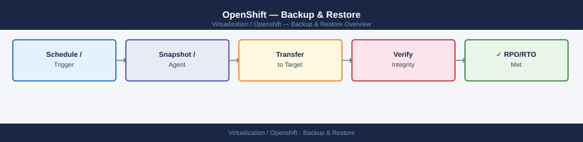
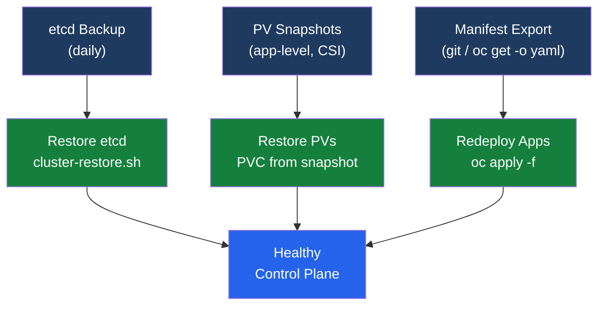
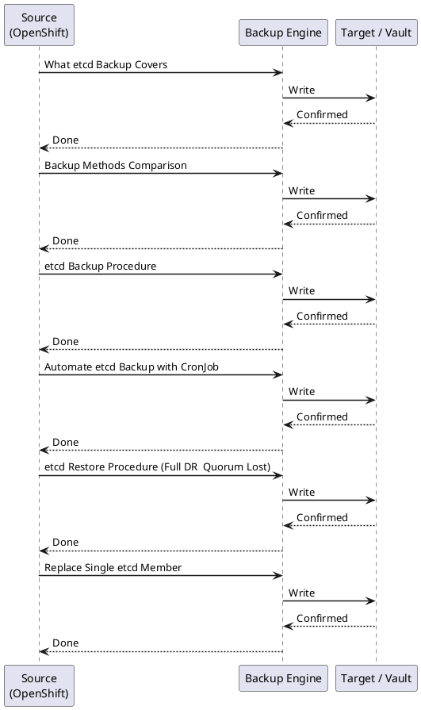

---
tags:
  - operations
---
# OpenShift — Backup & Restore

<div class="kb-summary">
etcd backup and restore procedure, OADP (OpenShift API for Data Protection) for application workloads, PV snapshot backup, and recovery from common failure scenarios.

*Applies to: OpenShift 4.x*
</div>







## Before you begin

- **Access:** Admin credentials on all affected systems
- **Timing:** safe to run during business hours unless a step is marked ⚠ (causes interruption)
- **Dependencies:** no active upgrades or migrations on the same infrastructure
- **Logging:** capture command output — paste into the change record on completion

---

## What etcd Backup Covers

| Covered | NOT Covered |
|---|---|
| All Kubernetes resources (Deployments, ConfigMaps, Secrets, CRDs) | Persistent volume data |
| RBAC policies, ServiceAccounts | Container images in registry |
| Custom Resource instances (MachineConfigs, ClusterOperators) | Node OS state (RHCOS filesystem) |
| etcd cluster membership state | Application-level databases inside PVs |
| Static pod manifests | External secrets (Vault, AWS SSM) |

## Backup Methods Comparison

| Method | Scope | RPO | RTO | Tooling |
|---|---|---|---|---|
| etcd snapshot | Cluster state (all K8s objects) | Daily / pre-change | 1–2 hours | cluster-backup.sh |
| OADP / Velero | Namespaces, PVCs, resources | Hourly (scheduled) | 30–60 min | OADP operator |
| PV CSI snapshot | Persistent volume data | Per schedule | Minutes | VolumeSnapshot CR |
| GitOps manifest export | Resource definitions only | Continuous | Redeploy time | oc get -o yaml / git |

## etcd Backup Procedure

Full numbered procedure. Run before every upgrade and weekly at minimum.

```bash
# 1. SSH to a master node
ssh core@<master-node-ip>

# 2. Become root
sudo -i

# 3. Run the backup script (included with OCP, ships on every master)
/usr/local/bin/cluster-backup.sh /home/core/assets/backup

# Output produced:
#   /home/core/assets/backup/snapshot_<timestamp>.db            (etcd snapshot)
#   /home/core/assets/backup/static_kuberesources_<timestamp>.tar.gz  (static pod manifests)

# 4. Verify the snapshot was created and is non-trivially sized
ls -lh /home/core/assets/backup/
# snapshot file should be several hundred MB on a healthy cluster

# 5. Copy off-node to durable storage (run from your workstation)
scp core@<master-ip>:/home/core/assets/backup/snapshot_*.db /backup/etcd/
scp core@<master-ip>:/home/core/assets/backup/static_kuberesources_*.tar.gz /backup/etcd/

# Alternative: oc rsync (if oc debug was used to run the backup)
oc rsync <master-pod>:/home/core/assets/backup/ ./etcd-backup-$(date +%F)/
```

## Automate etcd Backup with CronJob

```yaml
apiVersion: batch/v1
kind: CronJob
metadata:
  name: etcd-backup
  namespace: openshift-etcd
spec:
  schedule: "0 2 * * *"
  jobTemplate:
    spec:
      template:
        spec:
          hostPID: true
          hostNetwork: true
          serviceAccountName: etcd-backup
          restartPolicy: OnFailure
          containers:
          - name: etcd-backup
            image: registry.redhat.io/openshift4/ose-cli:latest
            command:
            - /bin/bash
            - -c
            - |
              oc debug node/$(oc get nodes -l node-role.kubernetes.io/master \
                -o name | head -1 | cut -d/ -f2) -- \
                chroot /host /usr/local/bin/cluster-backup.sh /home/core/backup
```

## etcd Restore Procedure (Full DR — Quorum Lost)

**Warning:** Only use when etcd quorum is lost and the cluster API is inaccessible. This procedure is destructive — all three masters are involved.

```bash
# 1. Stop the static API server pods on ALL masters
#    SSH to each master and move the manifests out of the static pod directory
ssh core@master-0
sudo mv /etc/kubernetes/manifests/kube-apiserver.yaml /tmp/
sudo mv /etc/kubernetes/manifests/kube-controller-manager.yaml /tmp/
sudo mv /etc/kubernetes/manifests/kube-scheduler.yaml /tmp/

# Repeat on master-1 and master-2

# 2. On the recovery master (master-0), place the backup files
sudo mkdir -p /home/core/assets/backup
sudo cp /backup/etcd/snapshot_*.db /home/core/assets/backup/
sudo cp /backup/etcd/static_kuberesources_*.tar.gz /home/core/assets/backup/

# 3. Run the restore script on the recovery master only
sudo /usr/local/bin/cluster-restore.sh /home/core/assets/backup

# 4. Restore static pod manifests on the recovery master
sudo mv /tmp/kube-apiserver.yaml /etc/kubernetes/manifests/
sudo mv /tmp/kube-controller-manager.yaml /etc/kubernetes/manifests/
sudo mv /tmp/kube-scheduler.yaml /etc/kubernetes/manifests/

# 5. Wait for API server to come up on master-0
until oc get nodes; do sleep 10; done

# 6. Restart remaining masters — move manifests back on master-1 and master-2
# They will rejoin the restored etcd automatically

# 7. Delete stale etcd pods to force re-sync
oc delete pod -n openshift-etcd --selector=app=etcd

# 8. Approve CSRs for any nodes that need re-joining
oc get csr | grep Pending
oc get csr -o name | xargs oc adm certificate approve

# 9. Verify cluster health
oc get nodes
oc get co
```

## Replace Single etcd Member

```bash
# For: one master node failed, other two are healthy (quorum maintained)

# 1. Remove failed member from etcd
oc rsh -n openshift-etcd etcd-<healthy-master> \
  etcdctl member list
oc rsh -n openshift-etcd etcd-<healthy-master> \
  etcdctl member remove <member-id>

# 2. Delete the failed Machine object
oc get machine -n openshift-machine-api | grep <failed-node>
oc delete machine <machine-name> -n openshift-machine-api

# 3. Scale MachineSet or add new machine — new master joins via ignition
# 4. Approve CSR for new master
oc get csr | grep Pending
oc adm certificate approve <csr>

# 5. Verify etcd member joined
oc rsh -n openshift-etcd etcd-<master> etcdctl member list
```

## OADP Application Backup

```bash
# 1. Install OADP operator from OperatorHub

# 2. Create BackupStorageLocation
cat <<EOF | oc apply -f -
apiVersion: velero.io/v1
kind: BackupStorageLocation
metadata:
  name: s3-backup
  namespace: openshift-adp
spec:
  provider: aws
  objectStorage:
    bucket: ocp-backups
    prefix: velero
  config:
    region: us-east-1
    s3ForcePathStyle: "false"
  credential:
    name: cloud-credentials
    key: cloud
EOF

# 3. Create on-demand backup
oc create -f - <<EOF
apiVersion: velero.io/v1
kind: Backup
metadata:
  name: my-app-backup
  namespace: openshift-adp
spec:
  includedNamespaces:
  - my-app
  storageLocation: s3-backup
  ttl: 720h
EOF

# 4. Schedule automatic backups
cat <<EOF | oc apply -f -
apiVersion: velero.io/v1
kind: Schedule
metadata:
  name: daily-backup
  namespace: openshift-adp
spec:
  schedule: "0 2 * * *"
  template:
    includedNamespaces: ["*"]
    excludedNamespaces: ["openshift-*","kube-*"]
    storageLocation: s3-backup
EOF

# 5. Restore from backup
oc create -f - <<EOF
apiVersion: velero.io/v1
kind: Restore
metadata:
  name: my-app-restore
  namespace: openshift-adp
spec:
  backupName: my-app-backup
  includedNamespaces:
  - my-app
EOF

# Monitor backup and restore status
oc get backup -n openshift-adp
oc get restore -n openshift-adp
velero backup logs my-app-backup -n openshift-adp
```

## PV Snapshot Backup (CSI)

CSI-based snapshots are independent of OADP and operate at the storage driver level. Use alongside OADP for complete application protection.

```bash
# 1. Create a VolumeSnapshotClass for your CSI driver
cat <<EOF | oc apply -f -
apiVersion: snapshot.storage.k8s.io/v1
kind: VolumeSnapshotClass
metadata:
  name: csi-snapclass
driver: ebs.csi.aws.com        # replace with your CSI driver
deletionPolicy: Retain
EOF

# 2. Take a snapshot of a PVC
cat <<EOF | oc apply -f -
apiVersion: snapshot.storage.k8s.io/v1
kind: VolumeSnapshot
metadata:
  name: myapp-data-snap-$(date +%F)
  namespace: my-app
spec:
  volumeSnapshotClassName: csi-snapclass
  source:
    persistentVolumeClaimName: myapp-data
EOF

# 3. Verify snapshot is ready
oc get volumesnapshot -n my-app

# 4. Restore: create PVC from snapshot
cat <<EOF | oc apply -f -
apiVersion: v1
kind: PersistentVolumeClaim
metadata:
  name: myapp-data-restored
  namespace: my-app
spec:
  storageClassName: gp3-csi
  dataSource:
    name: myapp-data-snap-<date>
    kind: VolumeSnapshot
    apiGroup: snapshot.storage.k8s.io
  accessModes:
  - ReadWriteOnce
  resources:
    requests:
      storage: 50Gi
EOF
```

---

## See also

- [OpenShift — Procedures](../procedures/)
- [OpenShift — Common Issues](../../troubleshooting/common-issues/)
- [OpenShift — Health Checks](../health-checks/)

## Verify

- Confirm the operation completed without errors in the log or management UI
- Verify the expected state change is visible (service running, object created, config applied)
- Document the outcome in the change record
