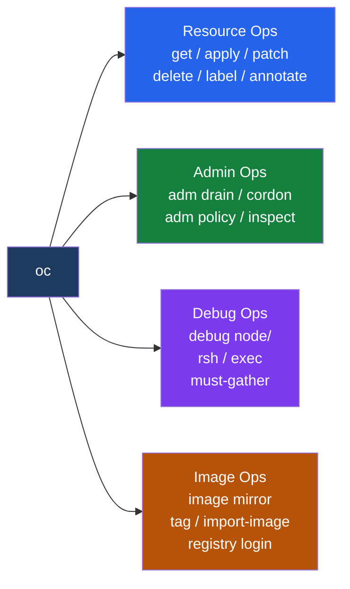

---
tags:
  - operations
---
# OpenShift — CLI Reference

<div class="kb-summary">
oc command reference: resource management, log collection, exec, adm commands, debugging, and context management. oc extends kubectl with OpenShift-specific resources and shortcuts.
</div>

```text
┌───────────────────────────────────── OpenShift oc CLI Reference ──────────────────────────────────────┐
│                                                                                                       │
│   ┌───────────────────────────────────────────────────────────────────────────────────────────────┐   │
│   │   oc is a superset of kubectl — all kubectl commands work; oc adds OCP-specific shortcuts     │   │
│   │   Context: set KUBECONFIG or use oc login; switch projects with oc project <name>             │   │
│   └───────────────────────────────────────────────────────────────────────────────────────────────┘   │
│                                                                                                       │
│                  ▼                                ▼                                ▼                  │
│                                                                                                       │
│   ┌─────────────────────────────┐  ┌─────────────────────────────┐  ┌─────────────────────────────┐   │
│   │       Core Commands         │  │       Admin Commands         │  │     Debug Commands          │  │
│   │      ─────────────          │  │      ─────────────           │  │      ─────────────          │  │
│   │  oc get / describe / edit   │  │  oc adm node-logs            │  │  oc debug node/<name>       │  │
│   │  oc logs / exec / rsh       │  │  oc adm certificate approve  │  │  oc debug deployment/<name> │  │
│   │  oc apply / delete / patch  │  │  oc adm drain / cordon       │  │  oc adm inspect             │  │
│   │  oc project / new-project   │  │  oc adm policy               │  │  must-gather collection     │  │
│   └─────────────────────────────┘  └─────────────────────────────┘  └─────────────────────────────┘   │
│                                                                                                       │
│    Key terms:                                                                                         │
│                                                                                                       │
│    Project      = OpenShift namespace with additional metadata; oc project switches context           │
│    oc adm       = Administrative subcommand; node management, certificate ops, policy                 │
│    oc debug     = Spawns a debug pod from a node/deployment image for interactive troubleshooting     │
│    must-gather  = Collects full cluster state (logs, configs, events) into a tarball for Red Hat      │
│                                                                                                       │
└───────────────────────────────────────────────────────────────────────────────────────────────────────┘
```



## Authentication & Context

```bash
# Login
oc login https://api.ocp.example.com:6443 -u admin -p password
oc login --token=<token> --server=https://api.ocp.example.com:6443

# Who am I / current context
oc whoami
oc whoami --show-token
oc config current-context

# Switch project (namespace)
oc project openshift-monitoring
oc new-project my-app
oc projects          # list all accessible projects
```

## Resource Management

```bash
# Get resources
oc get nodes -o wide
oc get pods -n openshift-etcd
oc get pods --all-namespaces | grep -v "Running\|Completed"
oc get co            # cluster operators
oc get csr           # certificate signing requests

# Get all resources in a namespace
oc get all -n my-app

# Describe and inspect
oc describe node <node-name>
oc describe pod <pod> -n <ns>
oc get events -n <ns> --sort-by='.lastTimestamp'

# Apply / delete
oc apply -f manifest.yaml
oc delete pod <pod> -n <ns>
oc delete pod <pod> -n <ns> --grace-period=0 --force
```

## Resource Watching

```bash
# Watch pod state changes in real time
oc get pods -n <ns> -w

# Watch events sorted by time (most useful for troubleshooting)
oc get events -n <ns> --sort-by=.lastTimestamp
oc get events --all-namespaces --sort-by=.lastTimestamp | tail -40

# Watch nodes during a drain or upgrade
oc get nodes -w

# Watch cluster operators settling after an upgrade
oc get co -w
```

## Patching Resources

```bash
# Strategic merge patch (simple key overwrite)
oc patch deployment/myapp -p '{"spec":{"replicas":3}}'
oc patch node <node> -p '{"spec":{"unschedulable":true}}'

# JSON patch (precise path operations)
oc patch deployment/myapp --type=json \
  -p '[{"op":"replace","path":"/spec/replicas","value":3}]'

# Add a toleration via JSON patch
oc patch deployment/myapp --type=json \
  -p '[{"op":"add","path":"/spec/template/spec/tolerations","value":[{"key":"node-role.kubernetes.io/infra","effect":"NoSchedule"}]}]'

# Remove a field
oc patch deployment/myapp --type=json \
  -p '[{"op":"remove","path":"/spec/template/spec/affinity"}]'
```

## Output Formats

```bash
# JSON / YAML for full spec
oc get pod <pod> -n <ns> -o json
oc get pod <pod> -n <ns> -o yaml

# jsonpath — extract a single field
oc get pod <pod> -n <ns> -o jsonpath='{.status.phase}'
oc get node <node> -o jsonpath='{.status.conditions[?(@.type=="Ready")].status}'

# custom-columns — tabular output
oc get pods -n <ns> \
  -o custom-columns=NAME:.metadata.name,STATUS:.status.phase,NODE:.spec.nodeName

# Get all pod images across namespaces
oc get pods --all-namespaces \
  -o custom-columns=NS:.metadata.namespace,NAME:.metadata.name,IMAGE:.spec.containers[0].image

# Output names only (for piping)
oc get pods -n <ns> -o name
oc get csr -o name | xargs oc adm certificate approve
```

## Labels & Selectors

```bash
# Filter by label selector
oc get pods -l app=myapp -n <ns>
oc get pods -l app=myapp,tier=frontend -n <ns>
oc get pods -l 'app in (frontend,backend)' -n <ns>

# Label a node
oc label node <node> node-role.kubernetes.io/infra=
oc label node <node> zone=east --overwrite

# Remove a label
oc label node <node> zone-

# Annotate a pod
oc annotate pod <pod> -n <ns> key=value
oc annotate pod <pod> -n <ns> key-       # remove annotation
```

## Logs

```bash
# Pod logs
oc logs <pod> -n <ns>
oc logs <pod> -n <ns> -c <container>    # specific container
oc logs <pod> -n <ns> --previous        # previous container instance
oc logs <pod> -n <ns> --follow          # stream (alias: -f)
oc logs <pod> -n <ns> --tail=100        # last 100 lines
oc logs <pod> -n <ns> --since=1h        # last hour only

# Stream logs from a deployment (any pod matching)
oc logs -f deploy/<name> -n <ns>

# Node logs (systemd journal via oc adm)
oc adm node-logs <node> -u crio         # CRI-O container runtime
oc adm node-logs <node> -u kubelet      # kubelet service
oc adm node-logs <node> -u NetworkManager
oc adm node-logs <node> --path=/var/log/messages
oc adm node-logs <node> --path=/var/log/audit/audit.log
```

## Exec and Remote Shell

```bash
# Execute a one-off command in a pod
oc exec <pod> -n <ns> -- ls /var/log
oc exec <pod> -n <ns> -c <container> -- cat /etc/config.yaml

# Interactive shell (exec with TTY)
oc exec -it <pod> -n <ns> -- bash
oc exec -it <pod> -n <ns> -- sh        # if bash not available

# Remote shell shorthand (oc-specific)
oc rsh <pod>
oc rsh -n <ns> <pod>

# Debug node (spawns privileged pod on host network/PID/IPC)
oc debug node/<node-name>
# Inside the debug pod:
chroot /host                          # access node filesystem as root
systemctl status kubelet
crictl ps                             # list running containers
crictl logs <container-id>
journalctl -u crio --since "10 min ago"

# Debug a deployment using its image (runs as root by default in debug)
oc debug deployment/<name> -n <ns> --as-root
# Override the command
oc debug deployment/<name> -n <ns> -- /bin/sh -c "env | grep SECRET"
```

## Administrative Commands

```bash
# Node management
oc adm cordon <node>                  # mark unschedulable
oc adm uncordon <node>
oc adm drain <node> \
  --ignore-daemonsets \
  --delete-emptydir-data \
  --grace-period=60 \
  --timeout=300s

# Certificate management
oc get csr | grep Pending
oc adm certificate approve <csr-name>
oc get csr -o name | xargs oc adm certificate approve  # approve all pending

# RBAC
oc adm policy add-role-to-user admin <username> -n <project>
oc adm policy add-cluster-role-to-user cluster-admin <username>
oc adm policy remove-cluster-role-from-user cluster-admin <username>
oc adm policy who-can get pods -n <ns>

# Resource usage
oc adm top nodes
oc adm top pods --all-namespaces
oc adm top pods -n <ns> --containers   # per-container breakdown
```

## oc adm inspect

`oc adm inspect` dumps all resources associated with an operator or namespace into a local directory. More targeted than must-gather for a single component.

```bash
# Dump all resources for the etcd operator
oc adm inspect clusteroperator/etcd --dest-dir=/tmp/etcd-inspect

# Dump a namespace (all objects, logs, events)
oc adm inspect namespace/openshift-monitoring --dest-dir=/tmp/mon-inspect

# Dump a specific deployment
oc adm inspect deployment/prometheus-operator -n openshift-monitoring --dest-dir=/tmp/prom-inspect

# The output directory contains:
#   cluster-scoped-resources/  — CRDs, nodes, cluster operators
#   namespaces/<ns>/           — pods, configmaps, secrets (redacted), events, logs
```

## must-gather

```bash
# Collect full cluster state (takes 5-10 minutes)
oc adm must-gather                    # default collection
oc adm must-gather --image=<custom>   # product-specific (ODF, ACM, Logging)
oc adm must-gather --dest-dir=/tmp/mg

# ODF-specific must-gather
oc adm must-gather --image=registry.redhat.io/odf4/odf-must-gather-rhel9:latest

# Networking must-gather
oc adm must-gather --image=registry.redhat.io/openshift4/network-tools-rhel8

# Quick cluster state snapshot
oc adm top nodes
oc adm top pods --all-namespaces
```

## Useful Aliases

```bash
alias k=kubectl
alias oc-all='oc get pods --all-namespaces | grep -v "Running\|Completed"'
alias oc-co='oc get co | grep -E "False|True.*True|True.*False.*True"'
alias oc-events='oc get events --all-namespaces --sort-by=.lastTimestamp | tail -30'
alias oc-notready='oc get nodes --no-headers | grep -v " Ready"'
alias oc-csr='oc get csr | grep Pending'
```
