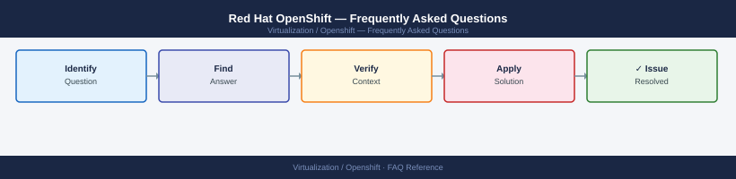

---
tags:
  - openshift
  - faq
  - operations
---
# Red Hat OpenShift — Frequently Asked Questions

Common questions about Red Hat OpenShift operations, configuration, and troubleshooting. For step-by-step procedures, see the <a href="index.md">Operations</a> section.

## General

**Q: What OpenShift version is recommended for new deployments?**
A: OpenShift 4.15.x or the latest EUS (Extended Update Support) release. Check: `oc version`. Red Hat supports N and N-1 minor versions. Plan upgrades to stay within the support window.

**Q: How do I check the current Red Hat OpenShift version?**
A: `oc version`

## Configuration

**Q: What is the default node autoscaling configuration?**
A: Autoscaling is disabled by default. Enable with a MachineAutoscaler: `oc apply -f machine-autoscaler.yaml`. Set `minReplicas` and `maxReplicas` per MachineSet. ClusterAutoscaler must also be enabled.

**Q: How do I enable OpenShift GitOps (ArgoCD) for application delivery?**
A: Install the OpenShift GitOps operator from OperatorHub. After installation, ArgoCD is deployed in the `openshift-gitops` namespace. Access the ArgoCD UI via the Route: `oc get route -n openshift-gitops`.

## Operations

**Q: How do I upgrade OpenShift without disrupting workloads?**
A: Upgrades are rolling and managed by the Cluster Version Operator (CVO). Initiate via `oc adm upgrade --to=<version>`. Control plane upgrades first, then worker nodes one at a time. Monitor: `oc get clusterversion`.

**Q: What is the correct procedure to add a new worker node?**
A: Scale the MachineSet: `oc scale machineset <name> -n openshift-machine-api --replicas=<n>`. For bare-metal, use the Assisted Installer or add the host manually via the BMC/IPMI and approve the CSR: `oc get csr | grep Pending`.

## Troubleshooting

**Q: OpenShift shows 'ClusterOperator degraded'. What does it mean?**
A: A core cluster operator is not healthy. Check: `oc get co` and `oc describe co <name>` for the degraded operator. Common causes: network connectivity issues, etcd quorum loss, or resource exhaustion. Address immediately.

**Q: Pod scheduling latency is high — where do I start?**
A: Check scheduler logs: `oc logs -n openshift-kube-scheduler`. Review node resource pressure: `oc describe nodes | grep -A5 Conditions`. Check for pending PVCs blocking pod start. Review resource quotas and limit ranges.

## Backup and Recovery

**Q: How often should I back up OpenShift etcd?**
A: Daily etcd snapshots via the OpenShift etcd backup procedure: `oc exec -n openshift-etcd etcd-<master> -- /usr/local/bin/cluster-backup.sh /home/core/`. Backup includes all cluster state. Test restore quarterly.

**Q: Can I restore a single namespace from an etcd backup?**
A: Not directly — etcd restores are full cluster restores. For namespace-level recovery, use Velero (OADP operator) which supports namespace-scoped backup and restore. Always test Velero restores before incidents occur.

## See Also

- [Red Hat OpenShift Operations](index.md)
- [Red Hat OpenShift Troubleshooting](../../troubleshooting/index.md)
