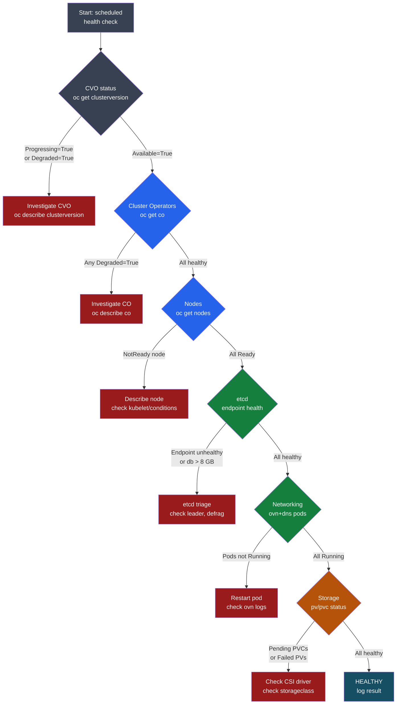

# OpenShift — Health Checks

<div class="kb-summary">
Daily cluster health routine: cluster operators, node status, etcd health, monitoring stack, networking, storage, certificate expiry, and resource pressure. Run before and after every change.
</div>

```text
┌──────────────────────────────────── OpenShift Daily Health Check ─────────────────────────────────────┐
│                                                                                                       │
│   ┌───────────────────────────────────────────────────────────────────────────────────────────────┐   │
│   │   Run each morning; any DEGRADED operator or NotReady node = investigate before changes       │   │
│   │   etcd: check latency and member count; cert expiry: alert > 30 days warning                  │   │
│   └───────────────────────────────────────────────────────────────────────────────────────────────┘   │
│                                                                                                       │
│                  ▼                                ▼                                ▼                  │
│                                                                                                       │
│   ┌─────────────────────────────┐  ┌─────────────────────────────┐  ┌─────────────────────────────┐   │
│   │    Cluster Operators        │  │      Nodes & Workloads       │  │   etcd & Certificates       │  │
│   │      ─────────────          │  │      ─────────────           │  │      ─────────────          │  │
│   │  All Available=True         │  │  All nodes Ready             │  │  3 members healthy          │  │
│   │  None Degraded=True         │  │  No pods CrashLoopBackOff    │  │  db size < 8 GB             │  │
│   │  None Progressing long      │  │  Resource pressure checked   │  │  Certs > 30 days remaining  │  │
│   │  Version matches expected   │  │  Pending PVCs = 0            │  │  etcd latency < 10ms P99    │  │
│   └─────────────────────────────┘  └─────────────────────────────┘  └─────────────────────────────┘   │
│                                                                                                       │
│    Alert thresholds:                                                                                  │
│    DEGRADED operator → investigate immediately; any NotReady node > 5 min → page on-call              │
│    etcd P99 commit latency > 10ms → investigate disk IOPS; db > 8 GB → compact immediately            │
│    Certificate < 30 days → schedule rotation; < 7 days → emergency rotation                           │
│                                                                                                       │
│  Key terms:                                                                                           │
│                                                                                                       │
│  Cluster Operator  = OCP component controller; Available=True + Degraded=False = healthy              │
│  DEGRADED          = Cluster Operator condition: component has a configuration or runtime error       │
│  NotReady node     = Node not accepting workloads; check kubelet, disk, and network on that node      │
│  CrashLoopBackOff  = Pod restart loop; check logs with oc logs <pod> --previous for root cause        │
│  etcd              = Distributed KV store; OCP control plane database; must have 3 healthy members    │
│  etcd db size      = etcd on-disk database size; compact and defrag if exceeds 8 GB                   │
│  P99 commit latency= 99th percentile etcd write latency; above 10ms indicates storage I/O issue       │
│  certificate expiry= TLS cert validity; OCP auto-rotates most; monitor for < 30 days remaining        │
│  MachineConfigPool = Groups nodes by config profile; Degraded MCP means a node failed to apply        │
│  PVC               = PersistentVolumeClaim; Pending PVCs indicate storage provisioner failure         │
│  oc adm top nodes  = Shows per-node CPU and memory usage; identify resource pressure early            │
│  Prometheus        = OCP built-in monitoring stack; verify its pods are Running before trusting alerts│
│                                                                                                       │
└───────────────────────────────────────────────────────────────────────────────────────────────────────┘
```

## Health Check Triage Flow



## Cluster Operator Health

`oc get co` output columns: `NAME  VERSION  AVAILABLE  PROGRESSING  DEGRADED  SINCE  MESSAGE`

Healthy state: `AVAILABLE=True  PROGRESSING=False  DEGRADED=False`

| Column value | Meaning | Action |
|---|---|---|
| `AVAILABLE=False` | Operator not serving its function | Describe CO; check pods in operator namespace |
| `PROGRESSING=True` (> 30 min) | Stuck update or rollout | Describe CO; check operator pod logs |
| `DEGRADED=True` | Config or runtime error | Describe CO; read `message` field for root cause |
| `SINCE` > expected upgrade window | Operator took unusually long | Compare to previous upgrade history |

```bash
# Full CO status — healthy cluster shows no output from this command
oc get co | grep -v "True.*False.*False" | grep -v "^NAME"

# Investigate specific degraded operator
oc describe co authentication
# Read the "Conditions:" block; "message:" field explains the failure

# Check operator pod logs (namespace varies by operator)
oc get pods -n openshift-authentication
oc logs -n openshift-authentication deployment/oauth-openshift --tail=100

# Key operators and their namespaces
# authentication    → openshift-authentication
# dns               → openshift-dns
# etcd              → openshift-etcd
# ingress           → openshift-ingress
# kube-apiserver    → openshift-kube-apiserver
# machine-config    → openshift-machine-config-operator
# monitoring        → openshift-monitoring
# network           → openshift-ovn-kubernetes
# storage           → openshift-cluster-csi-drivers
```

## Node Health

```bash
# Overview: STATUS, ROLES, AGE, VERSION
oc get nodes -o wide

# Healthy output: all STATUS=Ready, VERSION identical across nodes
# Unhealthy indicators: NotReady, SchedulingDisabled (cordoned)

# Detailed node conditions
oc describe node <node-name>
# Watch for in "Conditions:" section:
#   MemoryPressure=True   → node running low on memory; pods may be evicted
#   DiskPressure=True     → disk usage > eviction threshold; clear logs/images
#   PIDPressure=True      → too many processes; check for runaway workloads
#   Ready=False           → kubelet not communicating; check kubelet service

# Resource usage per node
oc adm top nodes
# Alert if CPU or MEMORY% > 85% sustained

# Top pods across cluster
oc adm top pods --all-namespaces --sort-by=cpu | head -20
oc adm top pods --all-namespaces --sort-by=memory | head -20

# Check MachineConfigPool — MCO-driven node config status
oc get mcp
# UPDATED=False or DEGRADED=True: node failed to apply MachineConfig
oc describe mcp worker     # See which node is blocking
```

## etcd Health

etcd is the cluster database. A degraded etcd member or high write latency can cause API instability and failed writes across the cluster.

```bash
# Get an etcd pod name
ETCD_POD=$(oc get pod -n openshift-etcd -l etcd=true -o name | head -1)

# Endpoint health (all 3 members must be healthy)
oc rsh -n openshift-etcd $ETCD_POD \
  etcdctl endpoint health \
  --endpoints=https://localhost:2379 \
  --cacert=/etc/kubernetes/static-pod-certs/configmaps/etcd-serving-ca/ca-bundle.crt \
  --cert=/etc/kubernetes/static-pod-certs/secrets/etcd-all-certs/etcd-peer-$(hostname).crt \
  --key=/etc/kubernetes/static-pod-certs/secrets/etcd-all-certs/etcd-peer-$(hostname).key

# Expected output per member:
# https://192.168.100.10:2379 is healthy: successfully committed proposal

# Endpoint status — DB size, leader, raft index
oc rsh -n openshift-etcd $ETCD_POD \
  etcdctl endpoint status --cluster -w table \
  --endpoints=https://localhost:2379 \
  --cacert=/etc/kubernetes/static-pod-certs/configmaps/etcd-serving-ca/ca-bundle.crt \
  --cert=/etc/kubernetes/static-pod-certs/secrets/etcd-all-certs/etcd-peer-$(hostname).crt \
  --key=/etc/kubernetes/static-pod-certs/secrets/etcd-all-certs/etcd-peer-$(hostname).key
# Columns: ENDPOINT | ID | VERSION | DB SIZE | IS LEADER | IS LEARNER | RAFT TERM | RAFT INDEX
# DB SIZE: alert if > 8 GB; defrag if so

# Defrag etcd (do on non-leader members first, then leader last)
oc rsh -n openshift-etcd $ETCD_POD \
  etcdctl defrag \
  --endpoints=https://<member-ip>:2379 \
  --cacert=... --cert=... --key=...

# P99 commit latency via Prometheus
# histogram_quantile(0.99, rate(etcd_disk_backend_commit_duration_seconds_bucket[5m]))
# Alert threshold: > 0.01 (10 ms)
```

## Networking Health

```bash
# OVN-Kubernetes pods (SDN data plane)
oc get pods -n openshift-ovn-kubernetes
# Expected: ovnkube-master-* and ovnkube-node-* all Running
# ovnkube-node runs as DaemonSet — one pod per node

# CoreDNS (service DNS)
oc get pods -n openshift-dns
# Expected: dns-default-* Running on every node (DaemonSet)

# Test DNS resolution from inside a pod
oc debug deployment/myapp -n mynamespace -- nslookup kubernetes.default.svc.cluster.local
# Expected: Server: 172.30.0.10 / Address: <ClusterIP of kubernetes service>

# Test external DNS from pod
oc debug deployment/myapp -n mynamespace -- nslookup registry.redhat.io

# Ingress (router) health
oc get pods -n openshift-ingress
# Expected: router-default-* Running

# Test ingress route
curl -k -o /dev/null -w "%{http_code}" https://console-openshift-console.apps.<cluster>.<base>
# Expected: 200 or 302

# Check ingress operator
oc describe co ingress
```

## Storage Health

```bash
# PersistentVolume status
oc get pv
# STATUS column: Bound=in use, Available=free, Released=PVC deleted (data retained), Failed=error
# Any Released or Failed PVs → investigate; Released PVs with retain policy need manual cleanup

# PersistentVolumeClaim status across all namespaces
oc get pvc -A
# STATUS: Bound=OK, Pending=provisioner cannot fulfill request → check CSI driver and StorageClass

# CSI driver pods
oc get pods -n openshift-cluster-csi-drivers
# All pods Running; operator pods and node-level driver pods

# Check default StorageClass
oc get sc
# At least one (default) StorageClass required for dynamic provisioning

# Storage operator status
oc describe co storage
```

## Run This Routine

Run in order — each check gates the next.

```bash
#!/bin/bash
# OpenShift Cluster Health Check
# Usage: KUBECONFIG=/path/to/kubeconfig bash ocp-health.sh

PASS=0
FAIL=0

check() {
  local label="$1"
  local result="$2"
  if [[ -z "$result" ]]; then
    echo "PASS  $label"
    ((PASS++))
  else
    echo "FAIL  $label"
    echo "      $result"
    ((FAIL++))
  fi
}

echo "===== OpenShift Health Check $(date) ====="

# 1. Cluster Version
CV=$(oc get clusterversion -o jsonpath='{.items[0].status.conditions[?(@.type=="Degraded")].status}')
check "ClusterVersion not Degraded" "$([ "$CV" = "True" ] && echo "ClusterVersion Degraded=True")"

# 2. Cluster Operators
CO_BAD=$(oc get co --no-headers | grep -v "True\s*False\s*False" | awk '{print $1}')
check "All ClusterOperators healthy" "$CO_BAD"

# 3. Nodes Ready
NODES_BAD=$(oc get nodes --no-headers | grep -v " Ready " | awk '{print $1}')
check "All nodes Ready" "$NODES_BAD"

# 4. MachineConfigPools not Degraded
MCP_BAD=$(oc get mcp --no-headers | awk '$4=="True"{print $1}')
check "MachineConfigPools not Degraded" "$MCP_BAD"

# 5. Unhealthy pods (excluding Completed/Succeeded)
PODS_BAD=$(oc get pods -A --no-headers | grep -vE "Running|Completed|Succeeded" | awk '{print $1"/"$2}' | head -10)
check "No unhealthy pods" "$PODS_BAD"

# 6. etcd endpoint health
ETCD_POD=$(oc get pod -n openshift-etcd -l etcd=true -o name | head -1)
ETCD_OUT=$(oc rsh -n openshift-etcd $ETCD_POD \
  etcdctl endpoint health --cluster \
  --endpoints=https://localhost:2379 \
  --cacert=/etc/kubernetes/static-pod-certs/configmaps/etcd-serving-ca/ca-bundle.crt \
  --cert=/etc/kubernetes/static-pod-certs/secrets/etcd-all-certs/etcd-peer-$(hostname).crt \
  --key=/etc/kubernetes/static-pod-certs/secrets/etcd-all-certs/etcd-peer-$(hostname).key \
  2>&1 | grep -v "is healthy")
check "etcd all endpoints healthy" "$ETCD_OUT"

# 7. OVN-Kubernetes pods Running
OVN_BAD=$(oc get pods -n openshift-ovn-kubernetes --no-headers | grep -v Running | awk '{print $1}')
check "OVN-Kubernetes pods Running" "$OVN_BAD"

# 8. CoreDNS pods Running
DNS_BAD=$(oc get pods -n openshift-dns --no-headers | grep -v Running | awk '{print $1}')
check "CoreDNS pods Running" "$DNS_BAD"

# 9. No Pending PVCs
PVC_PEND=$(oc get pvc -A --no-headers | grep Pending | awk '{print $1"/"$2}')
check "No Pending PVCs" "$PVC_PEND"

# 10. Monitoring stack Running
MON_BAD=$(oc get pods -n openshift-monitoring --no-headers | grep -v Running | grep -v Completed | awk '{print $1}')
check "Monitoring stack Running" "$MON_BAD"

echo ""
echo "===== Result: $PASS PASS / $FAIL FAIL ====="
[ $FAIL -gt 0 ] && exit 1 || exit 0
```

## etcd Performance Check

```bash
# Check P99 commit latency (should be < 10ms = 0.010 s)
# Via Prometheus (preferred):
# histogram_quantile(0.99, rate(etcd_disk_backend_commit_duration_seconds_bucket[5m]))

# Via etcdctl check perf (generates load — do not run on production during peak)
oc rsh -n openshift-etcd $ETCD_POD \
  etcdctl check perf \
  --endpoints=https://localhost:2379 \
  --cacert=/etc/kubernetes/static-pod-certs/configmaps/etcd-serving-ca/ca-bundle.crt \
  --cert=/etc/kubernetes/static-pod-certs/secrets/etcd-all-certs/etcd-peer-$(hostname).crt \
  --key=/etc/kubernetes/static-pod-certs/secrets/etcd-all-certs/etcd-peer-$(hostname).key

# If latency is high: check disk IOPS on master nodes
# etcd requires SSD with > 500 IOPS sustained write performance
# VMware: ensure vSAN or NVMe-backed datastore; avoid spinning disk
```

## Node Resource Check

```bash
# Resource usage per node
oc adm top nodes
oc adm top pods --all-namespaces --sort-by=cpu | head -20
oc adm top pods --all-namespaces --sort-by=memory | head -20

# Check node conditions (Pressure states)
oc describe nodes | grep -A5 "Conditions:"
# Watch for: MemoryPressure, DiskPressure, PIDPressure = True

# Check kubelet log on a specific node
oc debug node/<node-name> -- chroot /host journalctl -u kubelet --since "1 hour ago" | tail -50

# Image disk usage on a node (can cause DiskPressure)
oc debug node/<node-name> -- chroot /host crictl images | sort -k4 -h | tail -20
# Remove unused images: crictl rmi --prune
```
