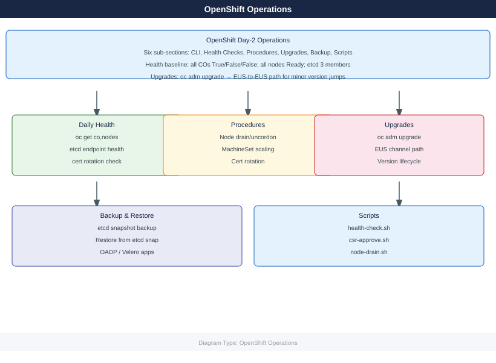

---
tags:
  - operations
description: "Day-2 operations: oc CLI, health checks, node management, upgrade procedures, etcd backup, and runnable health-check routines."
---
# OpenShift — Operations

Day-2 operations: oc CLI, health checks, node management, upgrade procedures, etcd backup, and runnable health-check routines.

*Applies to: OpenShift 4.x*

  <a class="kb-card" href="cli-reference/">
    CLI Reference
    oc get, describe, logs, exec, adm, debug, and common flags
  </a>
  <a class="kb-card" href="health-checks/">
    Health Checks
    Run This Routine — cluster operators, nodes, etcd, and monitoring
  </a>
  <a class="kb-card" href="procedures/">
    Procedures
    Scale nodes, drain, add MachineSet, rotate certs, label nodes
  </a>
  <a class="kb-card" href="scripts/">
    Scripts
    Health snapshot, node drain, etcd backup, CSR auto-approve
  </a>
  <a class="kb-card" href="install-upgrade/">
    Install & Upgrade
    EUS upgrade path, channel selection, and OCP version lifecycle
  </a>
  <a class="kb-card" href="backup-restore/">
    Backup & Restore
    etcd backup/restore, OADP for application workloads
  </a>
  <a class="kb-card" href="faq/">
    FAQ
    Frequently asked questions, common issues, and quick answers for day-to-day operations.
  </a>

