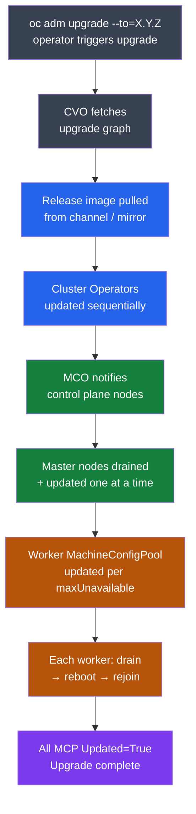

# OpenShift — Install & Upgrade

<div class="kb-summary">
OCP upgrade channels, EUS (Extended Update Support) path, version lifecycle, upgrade prerequisites, pause-worker pattern, multi-hop upgrades, and rollback considerations.
</div>

```text
┌─────────────────────────────────────── OpenShift Upgrade Path ────────────────────────────────────────┐
│                                                                                                       │
│   ┌───────────────────────────────────────────────────────────────────────────────────────────────┐   │
│   │   CVO manages upgrades: downloads release image, updates operators, drains+reboots nodes      │   │
│   │   EUS path: 4.10 → 4.12 → 4.14 (skip minor); requires pause at intermediate EUS version      │    │
│   │   Always: check upgrade paths at access.redhat.com/labs/ocpupgradegraph before proceeding    │    │
│   └───────────────────────────────────────────────────────────────────────────────────────────────┘   │
│                                                                                                       │
│    Stable channel → patch → minor version; EUS channel → even minor versions only (4.10, 4.12, 4.14)  │
│                                                                                                       │
│                  ▼                                ▼                                ▼                  │
│                                                                                                       │
│   ┌─────────────────────────────┐  ┌─────────────────────────────┐  ┌─────────────────────────────┐   │
│   │        Channels             │  │      Upgrade Steps           │  │       EUS Path              │  │
│   │      ─────────────          │  │      ─────────────           │  │      ─────────────          │  │
│   │  stable-4.x: production     │  │  1. Set channel + version    │  │  4.y.z → 4.y+2.z upgrade    │  │
│   │  fast-4.x: early access     │  │  2. Drain workers (MCO)      │  │  Pause workers at 4.y+1.z  │   │
│   │  candidate-4.x: pre-release │  │  3. Upgrade control plane    │  │  EUS: skip intervening vers │  │
│   │  eus-4.x: even versions     │  │  4. Upgrade workers          │  │  Use eus-4.x channel        │  │
│   └─────────────────────────────┘  └─────────────────────────────┘  └─────────────────────────────┘   │
│                                                                                                       │
│    Key terms:                                                                                         │
│                                                                                                       │
│    CVO          = Cluster Version Operator; manages OCP version and drives upgrades                   │
│    EUS          = Extended Update Support; even minor versions (4.10, 4.12) with longer support       │
│    MachineConfigPool= Groups nodes by role; workers upgrade node by node within their pool            │
│    Channel      = Release stream; set in ClusterVersion; determines available upgrades                │
│                                                                                                       │
└───────────────────────────────────────────────────────────────────────────────────────────────────────┘
```

## Upgrade Flow



## Channel Selection

| Channel | Purpose | Release cadence | Recommended for |
|---------|---------|-----------------|-----------------|
| `stable-4.x` | Production; errata-qualified | ~1–2 weeks after fast | All production clusters |
| `fast-4.x` | Early access; GA but less soak | Days after GA | Dev/staging; risk-tolerant prod |
| `candidate-4.x` | Pre-release RC builds | Continuous | Testing only; not supported in prod |
| `eus-4.x` | Extended Update Support (even minors) | ~18-month support window | Clusters requiring long upgrade windows |

```bash
# Check current channel
oc get clusterversion -o jsonpath='{.items[0].spec.channel}'

# Switch channel
oc adm upgrade channel stable-4.14

# Or via patch
oc patch clusterversion version --type=json \
  -p '[{"op":"add","path":"/spec/channel","value":"stable-4.14"}]'

# List available versions after channel switch
oc adm upgrade
```

**EUS channels** apply only to even-numbered minor versions (4.10, 4.12, 4.14, 4.16). Subscriptions to an EUS channel unlock the EUS-to-EUS upgrade path; odd-version intermediate releases are not available in EUS channels.

## Upgrade Prerequisites Checklist

All conditions must be true before triggering an upgrade. A single degraded operator blocks the upgrade from completing.

| Check | Command | Pass Condition |
|-------|---------|----------------|
| No degraded operators | `oc get co \| grep -v "True.*False.*False"` | No output |
| All nodes Ready | `oc get nodes \| grep -v " Ready"` | No NotReady nodes |
| MCPs not degraded | `oc get mcp` | All `DEGRADED=False` |
| etcd healthy | `oc rsh -n openshift-etcd etcd-<m0> etcdctl endpoint health --cluster` | All healthy |
| CSVs succeeded | `oc get csv -A \| grep -v Succeeded` | No non-Succeeded CSVs |
| Sufficient PDB budget | `oc get pdb -A` | No PDBs blocking drain |
| etcd backup taken | See backup-restore page | Backup file confirmed |

```bash
# Single-liner health pre-check
oc get co | grep -v "True.*False.*False" | grep -v "^NAME" && \
oc get nodes | grep -v " Ready" | grep -v "^NAME" && \
oc get mcp | grep -v "^NAME" && \
echo "Pre-checks PASSED"
```

## Standard Upgrade Procedure

```bash
# 1. Set channel
oc adm upgrade channel stable-4.14

# 2. Review available versions and recommended path
oc adm upgrade

# 3. Trigger upgrade to specific version (recommended — never use --to-latest in prod)
oc adm upgrade --to=4.14.5

# 4. Monitor ClusterVersion
oc get clusterversion -w
# Progressing=True while upgrading; Progressing=False + version updated = done

# 5. Monitor cluster operators (update sequentially, ~30-60 min total)
oc get co -w

# 6. Monitor node upgrades (MCO drains and reboots)
oc get nodes -w
oc get mcp -w
# MachineConfigPool: UPDATED=True, DEGRADED=False = done

# 7. Confirm completion
oc get clusterversion
# STATUS field: "Cluster version is 4.14.5"
```

## Upgrade Command Reference

| Command | Description |
|---------|-------------|
| `oc adm upgrade` | Show current version, channel, and available upgrades |
| `oc adm upgrade channel <channel>` | Set upgrade channel |
| `oc adm upgrade --to=<version>` | Trigger upgrade to specific version |
| `oc adm upgrade --to-image=<digest>` | Upgrade to specific image hash (multi-hop, disconnected) |
| `oc get clusterversion` | Show version, channel, Progressing/Degraded conditions |
| `oc describe clusterversion` | Full conditions, history, and error messages |
| `oc get co` | All cluster operators with Available/Progressing/Degraded columns |
| `oc get mcp` | MachineConfigPool status — node count, updated count, degraded |
| `oc get nodes -w` | Watch node STATUS during MCO-driven reboots |

## Pause Worker MachineConfigPool

Pausing the worker MCP prevents worker nodes from rebooting during control plane upgrade. Required for EUS-to-EUS; optional for standard upgrades to reduce disruption window.

```bash
# Pause workers before upgrade
oc patch mcp worker --type merge -p '{"spec":{"paused":true}}'

# Verify paused
oc get mcp worker -o jsonpath='{.spec.paused}'    # → true

# Trigger upgrade (only control plane reboots)
oc adm upgrade --to=4.14.5
oc get co -w                          # Wait for all operators to complete

# After control plane done — resume workers
oc patch mcp worker --type merge -p '{"spec":{"paused":false}}'
oc get mcp -w                         # Watch worker pool drain+reboot
```

> **Warning:** Do not leave worker MCP paused after upgrade completes. Nodes will be out of sync with the cluster config until resumed.

## EUS-to-EUS Upgrade (e.g. 4.12 → 4.14)

```bash
# 1. Switch to EUS channel for source version
oc patch clusterversion version --type=json \
  -p '[{"op":"add","path":"/spec/channel","value":"eus-4.12"}]'

# 2. Pause worker MachineConfigPool
oc patch mcp worker --type=merge -p '{"spec":{"paused":true}}'

# 3. Upgrade to intermediate version (4.13.z) — required even for EUS skip
oc adm upgrade --to=4.13.27          # Check oc adm upgrade for correct z-stream
oc get co -w                          # Wait for operators to complete

# 4. Switch to EUS channel for intermediate
oc patch clusterversion version --type=json \
  -p '[{"op":"add","path":"/spec/channel","value":"eus-4.14"}]'

# 5. Upgrade to 4.14 target
oc adm upgrade --to=4.14.5
oc get co -w

# 6. Unpause workers (they upgrade from 4.12 config directly to 4.14)
oc patch mcp worker --type=merge -p '{"spec":{"paused":false}}'
oc get mcp -w
```

## Multi-Hop Upgrade

OCP upgrade graph enforces version adjacency. Some versions require traversing an intermediate release. The upgrade graph at `access.redhat.com/labs/ocpupgradegraph` shows valid paths.

```bash
# Check if direct path exists
oc adm upgrade
# If desired version not listed, an intermediate hop is required

# Upgrade to intermediate first
oc adm upgrade --to=4.13.27
# Wait for completion, then:
oc adm upgrade --to=4.14.5

# For disconnected (specific image digest)
oc adm upgrade --to-image=quay.local:8443/ocp4/openshift/release:4.14.5-x86_64 \
  --allow-explicit-upgrade
```

## OCP Version Lifecycle

| Version | Type | GA | Full support end | Maintenance end |
|---------|------|----|------------------|-----------------|
| 4.12 | EUS | Jan 2023 | Jan 2024 | Jan 2025 |
| 4.13 | Standard | May 2023 | Nov 2023 | May 2024 |
| 4.14 | EUS | Oct 2023 | Oct 2024 | Oct 2025 |
| 4.15 | Standard | Feb 2024 | Aug 2024 | Feb 2025 |
| 4.16 | EUS | Jun 2024 | Jun 2025 | Jun 2026 |
| 4.17 | Standard | Oct 2024 | Apr 2025 | Oct 2025 |
| 4.18 | EUS | Feb 2025 | Feb 2026 | Feb 2027 |

Current lifecycle: https://access.redhat.com/support/policy/updates/openshift

## Rollback Considerations

OpenShift **does not support automatic rollback** after an upgrade completes. Once the control plane is updated, there is no supported downgrade path.

| Scenario | Recovery Option | Notes |
|----------|----------------|-------|
| Upgrade stalled on degraded CO | Fix CO condition; upgrade resumes automatically | Most common scenario |
| Upgrade stalled on node drain | Fix pod preventing drain (PDB, stuck finalizer) | `oc drain <node> --delete-emptydir-data --ignore-daemonsets` |
| Control plane updated, workers failing | Open RH support; consider etcd restore | Partial upgrade state |
| Catastrophic failure, data loss acceptable | Restore from etcd backup | Loses all post-backup state |
| Catastrophic failure, fresh start | Re-install cluster | Requires full workload re-deploy |

```bash
# Investigate stalled upgrade
oc get clusterversion -o yaml | grep -A30 "conditions:"
oc describe co <degraded-operator>

# Force-resume a stuck operator (use only on RH guidance)
oc patch co <operator> --type=json \
  -p '[{"op":"remove","path":"/status/conditions"}]'

# Check what's blocking a node drain
oc get pods -A --field-selector=spec.nodeName=<node>
oc get pdb -A

# etcd backup restore — see backup-restore page
# etcdctl snapshot restore → re-bootstrap control plane
```
