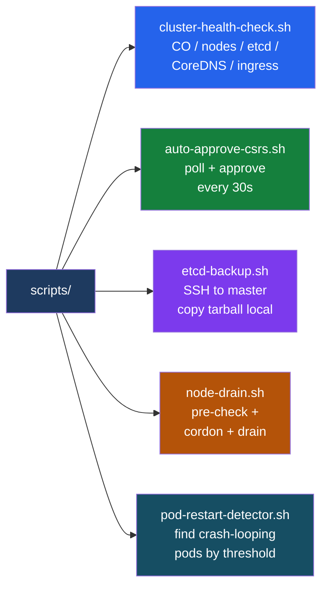

---
tags:
  - operations
---
# OpenShift — Scripts

<div class="kb-summary">
Operational scripts: daily health snapshot, CSR auto-approval, node drain wrapper, etcd backup automation, pod restart loop detection, and namespace resource summary.

*Applies to: OpenShift 4.x*
</div>



## Before you begin

- **Access:** Admin credentials on all affected systems
- **Timing:** safe to run during business hours unless a step is marked ⚠ (causes interruption)
- **Dependencies:** no active upgrades or migrations on the same infrastructure
- **Logging:** capture command output — paste into the change record on completion

---

## cluster-health-check.sh

Checks cluster operators, node readiness, etcd pod count, CoreDNS, and ingress pods. Outputs PASS/FAIL per check. Exits 1 if any check fails.

```bash
#!/bin/bash
KUBECONFIG=${1:-$KUBECONFIG}
TS=$(date '+%Y-%m-%d %H:%M')
FAIL=0

pass() { echo "  PASS: $1"; }
fail() { echo "  FAIL: $1"; FAIL=$((FAIL+1)); }

echo "=== OpenShift Cluster Health Check: $TS ==="
echo ""

echo "--- Cluster Version ---"
oc get clusterversion version --no-headers | awk '{print "  Version:", $2, "Available:", $3, "Progressing:", $4, "Degraded:", $5}'

echo ""
echo "--- Cluster Operators ---"
DEGRADED=$(oc get co --no-headers | awk '$4=="True" {print $1}')
PROGRESSING=$(oc get co --no-headers | awk '$3=="True" {print $1}')
[ -z "$DEGRADED" ] && pass "no degraded operators" || fail "DEGRADED: $DEGRADED"
[ -z "$PROGRESSING" ] && pass "no progressing operators" || echo "  INFO  PROGRESSING: $PROGRESSING"

echo ""
echo "--- Nodes ---"
NOT_READY=$(oc get nodes --no-headers | grep -v " Ready" | awk '{print $1}')
[ -z "$NOT_READY" ] && pass "all nodes Ready" || fail "NOT READY: $NOT_READY"

echo ""
echo "--- etcd Pods ---"
ETCD_COUNT=$(oc get pods -n openshift-etcd --no-headers | grep -c "^etcd-")
[ "$ETCD_COUNT" -eq 3 ] && pass "etcd pod count = 3" || fail "etcd pod count = $ETCD_COUNT (expected 3)"

echo ""
echo "--- CoreDNS ---"
DNS_NOT_RUNNING=$(oc get pods -n openshift-dns --no-headers | grep dns | grep -vc "Running")
[ "$DNS_NOT_RUNNING" -eq 0 ] && pass "all CoreDNS pods Running" || fail "$DNS_NOT_RUNNING CoreDNS pods not Running"

echo ""
echo "--- Ingress Controller ---"
INGRESS_NOT_RUNNING=$(oc get pods -n openshift-ingress --no-headers | grep -vc "Running")
[ "$INGRESS_NOT_RUNNING" -eq 0 ] && pass "all ingress pods Running" || fail "$INGRESS_NOT_RUNNING ingress pods not Running"

echo ""
echo "--- Unhealthy Pods (cluster-wide) ---"
UNHEALTHY=$(oc get pods --all-namespaces --no-headers | grep -cvE "Running|Completed|Succeeded")
[ "$UNHEALTHY" -eq 0 ] && pass "all pods Running/Completed" || { fail "unhealthy pod count = $UNHEALTHY"; oc get pods --all-namespaces | grep -vE "Running|Completed|Succeeded|NAMESPACE"; }

echo ""
echo "=== Result: $( [ $FAIL -eq 0 ] && echo PASS || echo "FAIL ($FAIL checks failed)" ) ==="
exit $FAIL
```

## auto-approve-csrs.sh

Polls `oc get csr` every 30 seconds and approves all Pending CSRs. Useful during UPI installs or node replacement operations. Runs until Ctrl-C.

```bash
#!/bin/bash
INTERVAL=30

echo "[$(date '+%H:%M:%S')] CSR auto-approver started — polling every ${INTERVAL}s (Ctrl+C to stop)"

while true; do
  TS="[$(date '+%H:%M:%S')]"
  PENDING=$(oc get csr --no-headers 2>/dev/null | awk '/Pending/ {print $1}')
  if [ -n "$PENDING" ]; then
    COUNT=$(echo "$PENDING" | wc -l | tr -d ' ')
    echo "$TS Approving $COUNT pending CSR(s): $(echo $PENDING | tr '\n' ' ')"
    echo "$PENDING" | xargs oc adm certificate approve
    echo "$TS Approved."
  else
    echo "$TS No pending CSRs."
  fi
  sleep "$INTERVAL"
done
```

## etcd-backup.sh

SSHes to master-0 (auto-detected or supplied), runs `cluster-backup.sh`, copies the tarball to a local path, and verifies the backup file is larger than 100 KB.

```bash
#!/bin/bash
MASTER=${1:-$(oc get nodes -l node-role.kubernetes.io/master -o name 2>/dev/null | head -1 | cut -d/ -f2)}
LOCAL_DIR=${2:-/tmp/etcd-backup-$(date +%F)}

[ -z "$MASTER" ] && { echo "ERROR: no master node found or supplied"; exit 1; }

echo "Master node : $MASTER"
echo "Local backup: $LOCAL_DIR"
mkdir -p "$LOCAL_DIR"

REMOTE_DIR="/home/core/assets/backup"

echo "Running cluster-backup.sh on $MASTER via SSH..."
ssh -o StrictHostKeyChecking=no "core@$MASTER" \
  "sudo /usr/local/bin/cluster-backup.sh $REMOTE_DIR"

echo "Copying backup files to $LOCAL_DIR..."
scp -o StrictHostKeyChecking=no \
  "core@$MASTER:$REMOTE_DIR/snapshot_*.db" \
  "core@$MASTER:$REMOTE_DIR/static_kuberesources_*.tar.gz" \
  "$LOCAL_DIR/"

SNAPSHOT=$(ls "$LOCAL_DIR"/snapshot_*.db 2>/dev/null | head -1)
[ -z "$SNAPSHOT" ] && { echo "ERROR: snapshot file not found in $LOCAL_DIR"; exit 1; }

SIZE=$(stat -f%z "$SNAPSHOT" 2>/dev/null || stat -c%s "$SNAPSHOT")
MIN_SIZE=$((100 * 1024))
if [ "$SIZE" -lt "$MIN_SIZE" ]; then
  echo "ERROR: snapshot file too small (${SIZE} bytes) — backup may be corrupt"
  exit 1
fi

echo "Backup verified: $(ls -lh "$SNAPSHOT")"
echo "Backup path   : $LOCAL_DIR"
```

## node-drain.sh

```bash
#!/bin/bash
NODE=$1
[ -z "$NODE" ] && { echo "Usage: $0 <node-name>"; exit 1; }

echo "=== Pre-drain health check ==="
DEGRADED=$(oc get co --no-headers | awk '$4=="True" {print $1}')
[ -n "$DEGRADED" ] && { echo "ABORT: degraded operators: $DEGRADED"; exit 1; }

echo "Cordoning $NODE..."
oc adm cordon "$NODE"

echo "Draining $NODE..."
oc adm drain "$NODE" \
  --ignore-daemonsets \
  --delete-emptydir-data \
  --grace-period=60 \
  --timeout=300s

echo ""
echo "$NODE drained successfully."
echo "After maintenance, run:"
echo "  oc adm uncordon $NODE"
echo "  oc get node $NODE"
```

## pod-restart-detector.sh

```bash
#!/bin/bash
THRESHOLD=${1:-5}

echo "Pods with > $THRESHOLD restarts:"
oc get pods --all-namespaces -o json | \
  jq -r '.items[] | select(.status.containerStatuses != null) |
    .metadata.namespace + "/" + .metadata.name + " restarts=" +
    (.status.containerStatuses[0].restartCount | tostring)' | \
  awk -F'restarts=' -v t="$THRESHOLD" '$2+0 > t {print}' | \
  sort -t= -k2 -rn
```

## csr-approve.sh

```bash
#!/bin/bash
WATCH=${1:-""}

approve_pending() {
  PENDING=$(oc get csr --no-headers | grep Pending | awk '{print $1}')
  if [ -n "$PENDING" ]; then
    echo "Approving CSRs: $PENDING"
    echo "$PENDING" | xargs oc adm certificate approve
  else
    echo "No pending CSRs"
  fi
}

if [ "$WATCH" = "--watch" ]; then
  echo "Watching for CSRs every 10s (Ctrl+C to stop)..."
  while true; do approve_pending; sleep 10; done
else
  approve_pending
fi
```

## health-check.sh

Legacy version — minimal output, good for cron + email alerting.

```bash
#!/bin/bash
KUBECONFIG=${1:-$KUBECONFIG}
TS=$(date '+%Y-%m-%d %H:%M')
FAIL=0

check() { local label=$1; shift; echo -n "[$label] "; "$@" && echo "OK" || { echo "FAIL"; FAIL=$((FAIL+1)); }; }

echo "=== OpenShift Health Check: $TS ==="
echo ""

echo "--- Cluster Operators ---"
DEGRADED=$(oc get co --no-headers | awk '$4=="True" {print $1}')
PROGRESSING=$(oc get co --no-headers | awk '$3=="True" {print $1}')
[ -z "$DEGRADED" ] && echo "  OK: no degraded operators" || { echo "  DEGRADED: $DEGRADED"; FAIL=$((FAIL+1)); }
[ -z "$PROGRESSING" ] && echo "  OK: no progressing operators" || echo "  PROGRESSING: $PROGRESSING"

echo ""
echo "--- Nodes ---"
NOTREADY=$(oc get nodes --no-headers | grep -v " Ready" | awk '{print $1}')
[ -z "$NOTREADY" ] && echo "  OK: all nodes Ready" || { echo "  NOT READY: $NOTREADY"; FAIL=$((FAIL+1)); }

echo ""
echo "--- Unhealthy Pods ---"
UNHEALTHY=$(oc get pods --all-namespaces --no-headers | grep -cvE "Running|Completed|Succeeded")
[ "$UNHEALTHY" -eq 0 ] && echo "  OK: all pods running" || { echo "  UNHEALTHY POD COUNT: $UNHEALTHY"; oc get pods --all-namespaces | grep -vE "Running|Completed|Succeeded|NAMESPACE"; FAIL=$((FAIL+1)); }

echo ""
echo "--- Resource Pressure ---"
oc adm top nodes 2>/dev/null || echo "  metrics-server not available"

echo ""
echo "=== Result: $( [ $FAIL -eq 0 ] && echo PASS || echo "FAIL ($FAIL issues)" ) ==="
exit $FAIL
```

---

## See also

- [OpenShift — CLI Reference](../cli-reference/)
- [OpenShift — Procedures](../procedures/)

## Verify

- Confirm the operation completed without errors in the log or management UI
- Verify the expected state change is visible (service running, object created, config applied)
- Document the outcome in the change record
