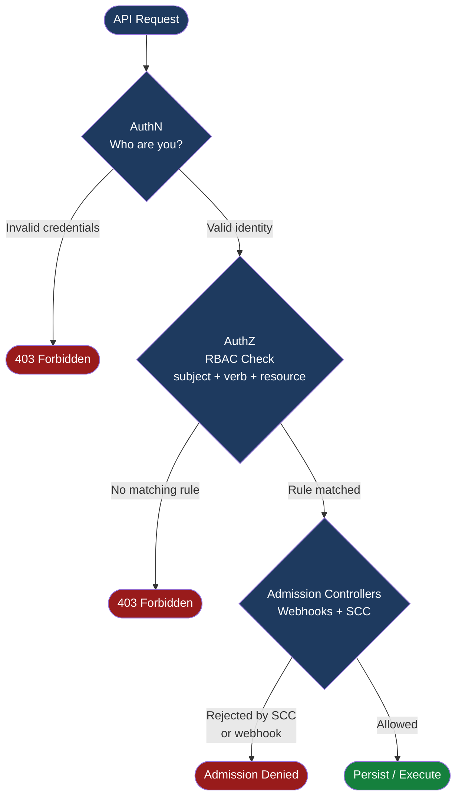

---
tags:
  - security
---
# OpenShift — Access Control

<div class="kb-summary">
Kubernetes RBAC in OpenShift: roles, cluster roles, role bindings, service accounts, SCCs, namespace isolation, project request templates, and API audit logging.

*Applies to: OpenShift 4.x*
</div>



## Before you begin

- **Access:** Admin credentials on all affected systems
- **Change management:** security changes require CAB approval in most environments
- **Rollback plan:** document current state before any security control change
- **Testing:** validate in a non-production environment first where possible

---

## Built-in ClusterRoles

| ClusterRole | Scope | Typical Use Case |
|---|---|---|
| `cluster-admin` | Cluster | Break-glass admin; never use for day-to-day ops |
| `admin` | Namespace | Full namespace control; can grant up to admin rights |
| `edit` | Namespace | Developer access; create/update/delete workloads; no RBAC changes |
| `view` | Namespace | Read-only; for monitoring accounts or CI inspection |
| `cluster-reader` | Cluster | Read-only across all namespaces; for audit tooling |
| `self-provisioner` | Cluster | Allows users to create new projects; remove from `system:authenticated:oauth` in hardened environments |
| `system:node` | Cluster | Assigned to kubelets; grants node-specific API permissions |
| `system:image-puller` | Namespace | Allows service accounts in other namespaces to pull images from this namespace's registry |

## Role Bindings

```bash
# Grant namespace-level admin to a user
oc adm policy add-role-to-user admin alice -n my-project

# Grant cluster-admin to a user
oc adm policy add-cluster-role-to-user cluster-admin alice

# Grant role to a group
oc adm policy add-role-to-group edit dev-team -n my-project

# Grant cluster role to a group
oc adm policy add-cluster-role-to-group view monitoring-team

# Remove role
oc adm policy remove-role-from-user admin alice -n my-project

# Who can perform an action?
oc adm policy who-can get secrets -n my-project
oc adm policy who-can create pods --all-namespaces
```

## Custom Role Creation

```bash
# Imperative: create role with specific verbs and resources
oc create role pod-reader \
  --verb=get,list,watch \
  --resource=pods,pods/log \
  -n my-project

# Bind to a user
oc create rolebinding read-pods \
  --role=pod-reader \
  --user=alice \
  -n my-project

# Bind to a group
oc create rolebinding read-pods-group \
  --role=pod-reader \
  --group=dev-team \
  -n my-project
```

## Security Context Constraints (SCC)

SCCs are an OpenShift-specific admission controller that enforces pod security configuration before a pod is created. Every pod must match at least one SCC granted to its service account.

| SCC | Allows Root | Privileged | Use Case |
|---|---|---|---|
| `restricted-v2` | No | No | Default for new workloads; drop all capabilities, read-only root FS |
| `restricted` | No | No | Legacy default (OCP < 4.11); prefer restricted-v2 |
| `nonroot` | No | No | Runs as any UID ≥ 1 but not 0 |
| `anyuid` | Yes | No | Legacy images that hardcode UID 0; avoid where possible |
| `privileged` | Yes | Yes | Node-level daemons (CNI, CSI drivers); never for application workloads |
| `hostnetwork` | No | No | Pods needing host network namespace (e.g. node exporters) |
| `hostmount-anyuid` | Yes | No | NFS client provisioners needing host mounts |

```bash
# List all SCCs (ordered from least to most permissive)
oc get scc

# Which SCC did a running pod receive?
oc get pod <pod> -n <ns> \
  -o jsonpath='{.metadata.annotations.openshift\.io/scc}'

# Which SCC would a pod YAML use (dry-run check)?
oc adm policy scc-subject-review -f pod.yaml

# Grant SCC to service account (always prefer -z over user)
oc adm policy add-scc-to-serviceaccount anyuid -z myapp-sa -n my-project

# Remove SCC from service account
oc adm policy remove-scc-from-user anyuid -z myapp-sa -n my-project

# List who has permission to use a specific SCC
oc adm policy who-can use scc/anyuid
```

## Service Accounts

```bash
# Create service account
oc create serviceaccount myapp-sa -n my-project

# Bind role to service account
oc adm policy add-role-to-user view -z myapp-sa -n my-project

# Grant SCC to service account (if pod needs elevated permissions)
oc adm policy add-scc-to-user anyuid -z myapp-sa -n my-project

# Create short-lived bound token (OCP 4.11+ preferred over legacy token secrets)
oc create token myapp-sa -n my-project --expiration=3600

# List service account tokens (shows legacy secret-based tokens)
oc get serviceaccount myapp-sa -n my-project -o yaml

# Reference in pod spec
# spec.serviceAccountName: myapp-sa
```

## Namespace Isolation with NetworkPolicy

```bash
# Label namespaces for network policy targeting
oc label namespace my-project network.openshift.io/policy-group=ingress

# Apply deny-all + allow-from-router pattern
oc apply -f - <<EOF
apiVersion: networking.k8s.io/v1
kind: NetworkPolicy
metadata:
  name: deny-all
  namespace: my-project
spec:
  podSelector: {}
  policyTypes:
  - Ingress
  - Egress
---
apiVersion: networking.k8s.io/v1
kind: NetworkPolicy
metadata:
  name: allow-same-namespace
  namespace: my-project
spec:
  podSelector: {}
  ingress:
  - from:
    - podSelector: {}
---
apiVersion: networking.k8s.io/v1
kind: NetworkPolicy
metadata:
  name: allow-from-router
  namespace: my-project
spec:
  podSelector: {}
  ingress:
  - from:
    - namespaceSelector:
        matchLabels:
          network.openshift.io/policy-group: ingress
EOF
```

## Project Request Template

A project request template auto-applies NetworkPolicies, LimitRanges, and ResourceQuotas to every new project created in the cluster.

```yaml
# project-request.yaml — applied once, referenced in OAuth/cluster config
apiVersion: template.openshift.io/v1
kind: Template
metadata:
  name: project-request
  namespace: openshift-config
objects:
- apiVersion: project.openshift.io/v1
  kind: Project
  metadata:
    name: ${PROJECT_NAME}
    annotations:
      openshift.io/description: ${PROJECT_DESCRIPTION}
      openshift.io/requester: ${PROJECT_REQUESTING_USER}
- apiVersion: networking.k8s.io/v1
  kind: NetworkPolicy
  metadata:
    name: deny-all
    namespace: ${PROJECT_NAME}
  spec:
    podSelector: {}
    policyTypes: [Ingress, Egress]
- apiVersion: v1
  kind: LimitRange
  metadata:
    name: default-limits
    namespace: ${PROJECT_NAME}
  spec:
    limits:
    - type: Container
      default:
        cpu: 500m
        memory: 256Mi
      defaultRequest:
        cpu: 100m
        memory: 64Mi
- apiVersion: v1
  kind: ResourceQuota
  metadata:
    name: default-quota
    namespace: ${PROJECT_NAME}
  spec:
    hard:
      pods: "50"
      requests.cpu: "4"
      requests.memory: 8Gi
      limits.cpu: "8"
      limits.memory: 16Gi
parameters:
- name: PROJECT_NAME
- name: PROJECT_DISPLAYNAME
- name: PROJECT_DESCRIPTION
- name: PROJECT_ADMIN_USER
- name: PROJECT_REQUESTING_USER
```

```bash
# Create the template
oc create -f project-request.yaml -n openshift-config

# Configure cluster to use this template for new projects
oc patch project.config.openshift.io/cluster --type=merge \
  -p '{"spec":{"projectRequestTemplate":{"name":"project-request"}}}'
```

## Audit Logging

API server audit logs record every request with user identity, verb, resource, and response code.

```bash
# Set audit policy profile on APIServer CR
# Profiles: Default (metadata), WriteRequestBodies, AllRequestBodies, None
oc patch apiserver cluster --type=merge \
  -p '{"spec":{"audit":{"profile":"WriteRequestBodies"}}}'

# Verify config is applied
oc get apiserver cluster -o jsonpath='{.spec.audit}'

# View audit logs on master node (rotate daily)
oc debug node/<master-node>
chroot /host
ls /var/log/kube-apiserver/
tail -f /var/log/kube-apiserver/audit.log | python3 -m json.tool

# Filter for a specific user
grep '"user":{"username":"alice"' /var/log/kube-apiserver/audit.log | jq .

# Filter for secrets access
grep '"resource":"secrets"' /var/log/kube-apiserver/audit.log | \
  jq '{user: .user.username, verb: .verb, ns: .objectRef.namespace, name: .objectRef.name}'
```

| Audit Level | What Is Logged | Use Case |
|---|---|---|
| `None` | Nothing | Disable auditing (not recommended in production) |
| `Metadata` | Request metadata only (user, verb, resource) — no body | Low-overhead baseline |
| `Request` | Metadata + request body | Capture what was submitted |
| `RequestResponse` | Metadata + request + response bodies | Full audit; highest storage cost |

## Audit: Who Has Access

```bash
# List all RoleBindings in a namespace
oc get rolebindings -n my-project -o wide

# List ClusterRoleBindings for cluster-admin
oc get clusterrolebindings | grep cluster-admin

# Check a user's permissions
oc auth can-i --list --as=alice -n my-project
oc auth can-i delete pods --as=alice -n my-project

# Check service account permissions
oc auth can-i --list \
  --as=system:serviceaccount:my-project:myapp-sa \
  -n my-project

# List all users with cluster-admin
oc get clusterrolebindings -o json | \
  jq '.items[] | select(.roleRef.name=="cluster-admin") | .subjects[].name'

# Find all RoleBindings that reference a specific user across all namespaces
oc get rolebindings -A -o json | \
  jq '.items[] | select(.subjects[]?.name=="alice") | {ns: .metadata.namespace, role: .roleRef.name}'
```

## See also

- [OpenShift — Authentication](../authentication/)
- [OpenShift — Hardening](../hardening/)
