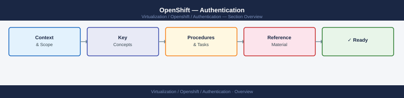
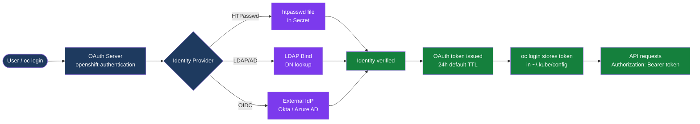

---
tags:
  - security
---
# OpenShift — Authentication

<div class="kb-summary">
OpenShift OAuth server, identity providers (LDAP, HTPasswd, OIDC/GitHub), token management, certificate auth, session revocation, and disabling the default kubeadmin account after production setup.

*Applies to: OpenShift 4.x*
</div>





## Before you begin

- **Access:** Admin credentials on all affected systems
- **Change management:** security changes require CAB approval in most environments
- **Rollback plan:** document current state before any security control change
- **Testing:** validate in a non-production environment first where possible

---

## HTPasswd Identity Provider

```bash
# Create htpasswd file with bcrypt hashing (-B flag)
htpasswd -c -B htpasswd.file alice
htpasswd -B htpasswd.file bob

# Create OCP Secret from htpasswd file
oc create secret generic htpass-secret \
  --from-file=htpasswd=htpasswd.file \
  -n openshift-config

# Configure OAuth CR to use HTPasswd provider
oc apply -f - <<EOF
apiVersion: config.openshift.io/v1
kind: OAuth
metadata:
  name: cluster
spec:
  identityProviders:
  - name: htpasswd
    type: HTPasswd
    htpasswd:
      fileData:
        name: htpass-secret
EOF
```

### HTPasswd Update Procedure

Adding or removing users requires updating the Secret in-place — the OAuth server watches for changes.

```bash
# 1. Extract current htpasswd file from the Secret
oc get secret htpass-secret -n openshift-config \
  -o jsonpath='{.data.htpasswd}' | base64 -d > /tmp/users.htpasswd

# 2. Add a new user
htpasswd -bB /tmp/users.htpasswd newuser MyP@ssw0rd

# 3. Delete an existing user
htpasswd -D /tmp/users.htpasswd olduser

# 4. Update the Secret (OAuth pods reload automatically)
oc set data secret/htpass-secret \
  --from-file=htpasswd=/tmp/users.htpasswd \
  -n openshift-config

# 5. Confirm OAuth pods restarted
oc rollout status deployment/oauth-openshift -n openshift-authentication
```

## LDAP Identity Provider

```bash
# Create bind password secret
oc create secret generic ldap-bind-password \
  --from-literal=bindPassword='<password>' \
  -n openshift-config

# Create CA cert configmap (required for LDAPS)
oc create configmap ldap-ca \
  --from-file=ca.crt=ldap-ca.crt \
  -n openshift-config

# Configure LDAP OAuth
oc apply -f - <<EOF
apiVersion: config.openshift.io/v1
kind: OAuth
metadata:
  name: cluster
spec:
  identityProviders:
  - name: ldap
    type: LDAP
    ldap:
      url: "ldaps://ad.example.com/CN=Users,DC=example,DC=com?sAMAccountName"
      bindDN: "CN=svc-ocp,OU=ServiceAccounts,DC=example,DC=com"
      bindPassword:
        name: ldap-bind-password
      insecure: false
      ca:
        name: ldap-ca
      attributes:
        id: ["dn"]
        email: ["mail"]
        name: ["cn"]
        preferredUsername: ["sAMAccountName"]
EOF
```

## OpenID Connect (OIDC)

OIDC providers (Okta, Azure AD, Keycloak, Dex) issue JWTs verified by the OAuth server. MFA is handled entirely by the external IdP.

```bash
# Create client secret
oc create secret generic oidc-client-secret \
  --from-literal=clientSecret='<oidc-client-secret>' \
  -n openshift-config

oc apply -f - <<EOF
apiVersion: config.openshift.io/v1
kind: OAuth
metadata:
  name: cluster
spec:
  identityProviders:
  - name: okta
    type: OpenID
    openID:
      clientID: "0oa1b2c3d4e5"
      clientSecret:
        name: oidc-client-secret
      issuer: "https://dev-12345.okta.com"
      claims:
        preferredUsername: ["email"]
        name: ["name"]
        email: ["email"]
        groups: ["groups"]
EOF
```

### OIDC Token Refresh Behavior

OCP issues its own OAuth tokens (not the OIDC JWT). The OAuth token defaults to 24 h TTL. The OIDC session at the external IdP is separate — on token expiry, the user must re-authenticate through the OIDC flow. Refresh tokens are issued by OCP with a 30-day TTL (configurable via `tokenConfig`).

```bash
# View token TTL configuration
oc get oauth cluster -o yaml | grep -A10 tokenConfig

# Extend access token TTL (example: 48h)
oc patch oauth cluster --type=merge \
  -p '{"spec":{"tokenConfig":{"accessTokenMaxAgeSeconds":172800}}}'
```

## Certificate-Based Authentication

Client certificates signed by the cluster CA are used by system components (scheduler, controller-manager, kubelets). Also useful for scripted automation that cannot interactively authenticate.

```bash
# Generate client cert config for a scripting user (uses cluster CA)
oc adm create-api-client-config \
  --certificate-authority=/etc/kubernetes/pki/ca.crt \
  --client-dir=/tmp/robot-certs \
  --user=robot-user \
  --groups=system:masters

# The resulting kubeconfig can be used without interactive login
export KUBECONFIG=/tmp/robot-certs/kubeconfig
oc get nodes

# Check which cert a component is using
oc get secret -n openshift-kube-controller-manager \
  kube-controller-manager-client-cert-key -o yaml
```

## Token Management

### Checking and Rotating Tokens

```bash
# View current token stored in kubeconfig
oc config view --minify -o jsonpath='{.users[0].user.token}'

# Show token for the current session
oc whoami --show-token

# Create a short-lived bound service account token
oc create token myapp-sa -n my-project --expiration=3600    # 1 hour
oc create token myapp-sa -n my-project --expiration=86400   # 24 hours

# Legacy secret-based tokens (no expiry — avoid for new workloads)
oc get secret -n my-project | grep myapp-sa-token
```

### Service Account Token Types

| Type | Expiry | Audience | Created by |
|---|---|---|---|
| Legacy secret token | Never | Any | `kubernetes.io/service-account-token` Secret |
| Bound projected token | Configurable (default 1h) | Specific audience | `oc create token` or `volumes.projected.serviceAccountToken` |
| OCP OAuth token | 24h default | API server | `oc login` / OAuth flow |

### Listing and Revoking Tokens

```bash
# List all active OAuth access tokens (cluster-admin only)
oc get oauthaccesstokens

# Filter by user
oc get oauthaccesstokens -o json | \
  jq '.items[] | select(.userName=="alice") | {name: .metadata.name, expires: .expiresIn}'

# Revoke a specific token (immediate effect)
oc delete oauthaccesstoken <token-name>

# Revoke all tokens for a user (force re-login)
oc get oauthaccesstokens -o json | \
  jq -r '.items[] | select(.userName=="alice") | .metadata.name' | \
  xargs oc delete oauthaccesstoken

# Invalidate current session (client-side)
oc logout
```

## Post-Setup: Disable kubeadmin

```bash
# Only after: at least one admin user confirmed working via LDAP/OIDC/HTPasswd
# Verify you can log in as cluster-admin via new IDP
oc login -u alice -p password

# Grant cluster-admin to the new admin
oc adm policy add-cluster-role-to-user cluster-admin alice

# Confirm alice can perform admin operations
oc get nodes
oc get co

# Remove kubeadmin secret (irreversible without full etcd restore)
oc delete secret kubeadmin -n kube-system
```

## OAuth Configuration Reference

| Field | Description |
|---|---|
| `spec.tokenConfig.accessTokenMaxAgeSeconds` | OAuth token lifetime (default: 86400 = 24h) |
| `spec.tokenConfig.accessTokenInactivityTimeoutSeconds` | Idle timeout; token invalidated if unused |
| `spec.identityProviders[].mappingMethod` | `claim` (default) or `lookup`; controls user auto-provisioning |
| `spec.identityProviders[].name` | Display name shown on login page |

```bash
# Check OAuth server pod health
oc get pods -n openshift-authentication
oc logs -n openshift-authentication deployment/oauth-openshift | tail -50

# Check OAuth CR for all configured providers
oc get oauth cluster -o yaml

# List all identity objects created by login events
oc get identity

# List OCP user objects (auto-created on first login)
oc get users
```

## See also

- [OpenShift — Access Control](../access-control/)
- [OpenShift — Hardening](../hardening/)
