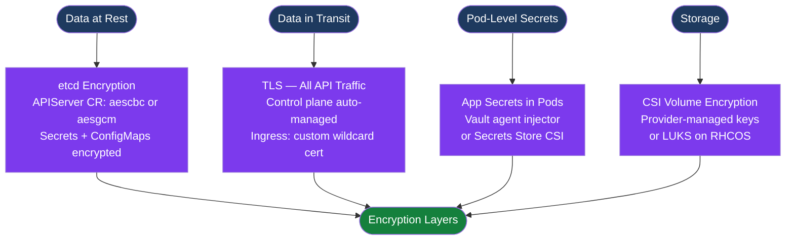

---
tags:
  - security
---
# OpenShift — Encryption

<div class="kb-summary">
etcd encryption at rest, Kubernetes secret encryption, TLS configuration, certificate management, Vault integration, image signature verification, and custom PKI for OpenShift clusters.
</div>

```text
┌──────────────────────────────────────── OpenShift Encryption ─────────────────────────────────────────┐
│                                                                                                       │
│   ┌───────────────────────────────────────────────────────────────────────────────────────────────┐   │
│   │   etcd encryption: enable on APIServer CR; AES-GCM or AES-CBC; applies to secrets/configmaps  │   │
│   │   All control plane TLS: auto-managed by cluster-operators; certs rotate automatically        │   │
│   │   Custom ingress cert: replace default wildcard *.apps cert with signed cert from enterprise CA│  │
│   └───────────────────────────────────────────────────────────────────────────────────────────────┘   │
│                                                                                                       │
│                  ▼                                ▼                                ▼                  │
│                                                                                                       │
│   ┌─────────────────────────────┐  ┌─────────────────────────────┐  ┌─────────────────────────────┐   │
│   │    etcd Encryption at Rest  │  │     TLS Certificates         │  │     Secret Management       │  │
│   │      ─────────────          │  │      ─────────────           │  │      ─────────────          │  │
│   │  APIServer.spec.encryption  │  │  Ingress: custom wildcard    │  │  External: Vault / AWS KMS  │  │
│   │  AES-GCM (recommended)      │  │  API server: custom SAN cert │  │  Sealed Secrets operator    │  │
│   │  Keys auto-rotated          │  │  CA trust bundle per cluster │  │  OCP Secrets encrypted post │  │
│   │  Applies to secrets, CMs    │  │  cert-manager operator avail │  │  etcd encryption enable     │  │
│   └─────────────────────────────┘  └─────────────────────────────┘  └─────────────────────────────┘   │
│                                                                                                       │
│    Key terms:                                                                                         │
│                                                                                                       │
│    AES-GCM      = Authenticated encryption; recommended over AES-CBC for etcd at-rest encryption      │
│    IngressController= OCP resource managing the router; references TLS secret for wildcard cert       │
│    APIServer CR = cluster.config.openshift.io/v1 APIServer; controls encryption and API TLS           │
│    cert-manager = Kubernetes operator that automates cert issuance and renewal via Let's Encrypt etc. │
│                                                                                                       │
└───────────────────────────────────────────────────────────────────────────────────────────────────────┘
```



## Encryption Options Reference

| Layer | Mechanism | Key Management | Configuration Location |
|---|---|---|---|
| etcd at rest | AES-GCM or AES-CBC | Auto-rotated by OCP | `APIServer` CR `spec.encryption.type` |
| API traffic | TLS 1.2/1.3 | Auto-managed by cluster-operators | Automatic; custom certs via `APIServer` CR |
| Ingress traffic | TLS wildcard cert | Manual rotation or cert-manager | `IngressController` CR `spec.defaultCertificate` |
| Pod secrets | Vault sidecar / CSI | Vault or external KMS | Vault policy + ServiceAccount annotation |
| Persistent volumes | CSI encryption or LUKS | Cloud KMS or RHCOS dm-crypt | StorageClass parameters |
| Image content | Signature verification | Sigstore / cosign keypairs | `ClusterImagePolicy` CR (OCP 4.13+) |

## Enable etcd Encryption at Rest

```bash
# Enable etcd encryption (encrypts Secrets and ConfigMaps in etcd)
# aesgcm: authenticated encryption — recommended
# aescbc: CBC mode — legacy; use only if aesgcm unsupported in your version
oc patch apiserver cluster --type merge \
  -p '{"spec":{"encryption":{"type":"aesgcm"}}}'

# Monitor progress (10-30 minutes on large clusters)
oc get apiserver cluster -o yaml | grep -A5 encryption

# Verify encryption is complete — check openshiftapiserver and kubeapiserver
oc get openshiftapiserver cluster -o yaml | grep -A10 encryption
oc get kubeapiserver cluster -o yaml | grep -A10 encryption
# Look for: Encrypted = true in conditions

# Confirm individual secret is encrypted in etcd
# Encrypted secrets carry this annotation:
oc get secret <name> -n <ns> -o yaml | \
  grep "etcd.encryption.kubernetes.io/hash"
# If the annotation is present → secret is stored encrypted in etcd

# Check encryption key status
oc get apiserver cluster -o jsonpath='{.status.conditions}' | python3 -m json.tool
```

### etcd Encryption Key Rotation

Key rotation is automatic once encryption is enabled. OCP generates new keys periodically and re-encrypts all existing data. There is no manual rotation step required unless you are transitioning between algorithm types.

```bash
# Transition from aescbc to aesgcm (or to identity to disable)
oc patch apiserver cluster --type merge \
  -p '{"spec":{"encryption":{"type":"aesgcm"}}}'
# OCP will re-encrypt all data with new keys; monitor conditions
```

## Custom Ingress (Wildcard) Certificate

```bash
# 1. Create TLS secret with wildcard cert for *.apps.ocp.example.com
oc create secret tls custom-ingress-cert \
  --cert=wildcard.crt \
  --key=wildcard.key \
  -n openshift-ingress

# 2. Patch IngressController to use custom cert
oc patch ingresscontroller default -n openshift-ingress-operator \
  --type=merge \
  -p '{"spec":{"defaultCertificate":{"name":"custom-ingress-cert"}}}'

# 3. Verify router redeployed with new cert
oc get pods -n openshift-ingress -w

# 4. Verify cert served to clients
openssl s_client -connect console-openshift-console.apps.ocp.example.com:443 \
  </dev/null 2>/dev/null | openssl x509 -noout -subject -enddate
```

## Custom API Server Certificate

```bash
# 1. Create TLS secret for api.ocp.example.com
oc create secret tls api-server-cert \
  --cert=api-server.crt \
  --key=api-server.key \
  -n openshift-config

# 2. Patch APIServer CR
oc patch apiserver cluster --type merge -p \
  '{"spec":{"servingCerts":{"namedCertificates":[{"names":["api.ocp.example.com"],"servingCertificate":{"name":"api-server-cert"}}]}}}'

# 3. Update kubeconfig after cert change
oc login https://api.ocp.example.com:6443

# 4. Update CA bundle in clients that verify the API cert
oc get cm kube-root-ca.crt -n openshift-config-managed -o yaml
```

## Add Custom CA Trust Bundle

```bash
# Add enterprise CA certificate for cluster-wide trust
oc create configmap custom-ca \
  --from-file=ca-bundle.crt=enterprise-ca.crt \
  -n openshift-config

oc patch proxy/cluster --type=merge \
  -p '{"spec":{"trustedCA":{"name":"custom-ca"}}}'

# CA propagates to all cluster components automatically
# Verify on a node:
oc debug node/<node> -- chroot /host -- \
  openssl verify -CAfile /etc/pki/tls/certs/ca-bundle.crt enterprise-ca.crt
```

## Secret Management with Vault

Two integration patterns: sidecar injector (annotation-driven, no app changes) and CSI driver (projected volume, works with any workload).

### Vault Agent Sidecar Injector

```yaml
# Pod/Deployment annotation-based injection
# Prerequisites: Vault Agent Injector operator installed and Vault accessible
apiVersion: apps/v1
kind: Deployment
metadata:
  name: myapp
spec:
  template:
    metadata:
      annotations:
        vault.hashicorp.com/agent-inject: "true"
        vault.hashicorp.com/role: "myapp"
        vault.hashicorp.com/agent-inject-secret-config: "secret/data/myapp/config"
        vault.hashicorp.com/agent-inject-template-config: |
          {{- with secret "secret/data/myapp/config" -}}
          DB_PASSWORD={{ .Data.data.password }}
          {{- end }}
```

```bash
# Configure Vault Kubernetes auth method
vault auth enable kubernetes
vault write auth/kubernetes/config \
  token_reviewer_jwt="$(oc exec -n vault vault-0 -- cat /var/run/secrets/kubernetes.io/serviceaccount/token)" \
  kubernetes_host="https://kubernetes.default.svc:443" \
  kubernetes_ca_cert=@/tmp/cluster-ca.crt

# Create Vault role binding OCP service account
vault write auth/kubernetes/role/myapp \
  bound_service_account_names=myapp-sa \
  bound_service_account_namespaces=my-project \
  policies=myapp-policy \
  ttl=1h
```

### Secrets Store CSI Driver

```yaml
# SecretProviderClass pointing to Vault
apiVersion: secrets-store.csi.x-k8s.io/v1
kind: SecretProviderClass
metadata:
  name: vault-db-creds
  namespace: my-project
spec:
  provider: vault
  parameters:
    vaultAddress: "https://vault.example.com"
    roleName: "myapp"
    objects: |
      - objectName: "db-password"
        secretPath: "secret/data/myapp/config"
        secretKey: "password"
```

## Image Signature Verification

OCP 4.13+ supports `ClusterImagePolicy` CRs backed by cosign/sigstore for verifying image provenance before scheduling.

```bash
# Create a ClusterImagePolicy that requires cosign signatures
oc apply -f - <<EOF
apiVersion: config.openshift.io/v1alpha1
kind: ClusterImagePolicy
metadata:
  name: require-signed-images
spec:
  scopes:
  - quay.io/myorg
  policy:
    rootOfTrust:
      policyType: PublicKey
      publicKey:
        keyData: <base64-encoded-public-key>
        rekorKeyData: <base64-encoded-rekor-key>
EOF

# Verify policy is active
oc get clusterimagepolicy

# ImageContentSourcePolicy: redirect image pulls to internal mirror
oc apply -f - <<EOF
apiVersion: operator.openshift.io/v1alpha1
kind: ImageContentSourcePolicy
metadata:
  name: mirror-config
spec:
  repositoryDigestMirrors:
  - source: registry.redhat.io
    mirrors:
    - mirror.example.com/redhat
  - source: quay.io
    mirrors:
    - mirror.example.com/quay
EOF
```

## cert-manager Operator

```bash
# Install cert-manager from OperatorHub, then:

# Let's Encrypt ClusterIssuer
cat <<EOF | oc apply -f -
apiVersion: cert-manager.io/v1
kind: ClusterIssuer
metadata:
  name: letsencrypt-prod
spec:
  acme:
    server: https://acme-v02.api.letsencrypt.org/directory
    email: admin@example.com
    privateKeySecretRef:
      name: letsencrypt-prod-key
    solvers:
    - http01:
        ingress:
          class: openshift-default
EOF

# Request certificate
cat <<EOF | oc apply -f -
apiVersion: cert-manager.io/v1
kind: Certificate
metadata:
  name: my-app-cert
  namespace: my-app
spec:
  secretName: my-app-tls
  dnsNames:
  - myapp.apps.ocp.example.com
  issuerRef:
    name: letsencrypt-prod
    kind: ClusterIssuer
EOF

# Check certificate status
oc get certificate my-app-cert -n my-app
oc get certificaterequest -n my-app
oc describe certificate my-app-cert -n my-app | grep -A5 "Conditions"
```

## Certificate Lifecycle Reference

```bash
# List all cluster-internal TLS secrets managed by operators
oc get secret -A | grep "kubernetes.io/tls"

# Check expiry of a specific certificate
oc get secret <secret-name> -n <ns> -o jsonpath='{.data.tls\.crt}' | \
  base64 -d | openssl x509 -noout -enddate

# Force rotation of auto-managed control plane certs (use only if certs expired)
oc patch secret kube-apiserver-to-kubelet-signer \
  -n openshift-kube-apiserver-operator \
  -p '{"metadata":{"annotations":{"auth.openshift.io/certificate-not-after":null}}}'
# This triggers the cert operator to issue new certs; monitor with:
oc get co kube-apiserver -w
```
