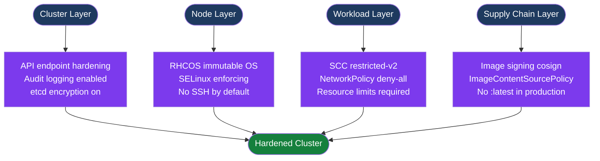

---
tags:
  - security
---
# OpenShift — Hardening

<div class="kb-summary">
OpenShift hardening: Security Context Constraints (SCC), Pod Security Admission, RHCOS node hardening, Compliance Operator, audit logging, network policies, image security, and CIS benchmark controls.

*Applies to: OpenShift 4.x*
</div>

```text
┌──────────────────────────────────── OpenShift Hardening Controls ─────────────────────────────────────┐
│                                                                                                       │
│   ┌───────────────────────────────────────────────────────────────────────────────────────────────┐   │
│   │   SCCs: OpenShift's admission controller for pod security (superset of K8s PSA)               │   │
│   │   PSA: Kubernetes Pod Security Admission (warn/audit/enforce); use restricted profile         │   │
│   │   NetworkPolicy: default deny + explicit allow; isolate namespaces by default                 │   │
│   └───────────────────────────────────────────────────────────────────────────────────────────────┘   │
│                                                                                                       │
│                  ▼                                ▼                                ▼                  │
│                                                                                                       │
│   ┌─────────────────────────────┐  ┌─────────────────────────────┐  ┌─────────────────────────────┐   │
│   │       SCCs                  │  │    Pod Security Admission     │  │    Audit & Network          │ │
│   │      ─────────────          │  │      ─────────────           │  │      ─────────────          │  │
│   │  restricted-v2 (default)    │  │  Labels on namespace         │  │  Audit log via APIServer    │  │
│   │  anyuid: run as any UID     │  │  privileged/baseline/restrict│  │  Default network isolation  │  │
│   │  privileged: full access    │  │  enforce/warn/audit modes    │  │  Egress firewall (NP)       │  │
│   │  Grant per SA not user      │  │  OCP 4.12+: PSA enforced     │  │  No default deny in OCP    │   │
│   └─────────────────────────────┘  └─────────────────────────────┘  └─────────────────────────────┘   │
│                                                                                                       │
│    Key terms:                                                                                         │
│                                                                                                       │
│    SCC         = Security Context Constraint; OCP admission controller for pod security configuration │
│    PSA         = Pod Security Admission; Kubernetes built-in; enforces profiles at namespace level    │
│    restricted-v2= Least-privilege SCC; no root, read-only root FS, drop all capabilities              │
│    anyuid      = Allows pod to run as any UID; needed for legacy images; avoid where possible         │
│                                                                                                       │
└───────────────────────────────────────────────────────────────────────────────────────────────────────┘
```



## Before you begin

- **Access:** Admin credentials on all affected systems
- **Change management:** security changes require CAB approval in most environments
- **Rollback plan:** document current state before any security control change
- **Testing:** validate in a non-production environment first where possible

---

## Security Context Constraints

```bash
# List SCCs (ordered from least to most permissive)
oc get scc | awk '{print $1, $2, $3}'

# Check which SCC a running pod used
oc get pod <pod> -n <ns> \
  -o jsonpath='{.metadata.annotations.openshift\.io/scc}'

# Which SCC will a pod use (dry run)?
oc adm policy scc-subject-review -f pod.yaml

# Grant SCC to service account (prefer this over granting to user)
oc adm policy add-scc-to-user anyuid -z myapp-sa -n my-project

# Remove SCC
oc adm policy remove-scc-from-user anyuid -z myapp-sa -n my-project

# List who uses a specific SCC
oc adm policy who-can use scc/anyuid
```

```yaml
# Pod spec that works with restricted-v2
spec:
  securityContext:
    runAsNonRoot: true
    seccompProfile:
      type: RuntimeDefault
  containers:
  - name: app
    image: myapp:latest
    securityContext:
      allowPrivilegeEscalation: false
      capabilities:
        drop: ["ALL"]
      runAsNonRoot: true
```

## RHCOS Node Hardening

RHCOS is a purpose-built immutable OS. Standard package management (yum/dnf) is disabled in the normal runtime. Changes are applied via MachineConfig objects managed by the Machine Config Operator (MCO).

```bash
# Inspect RHCOS node without modifying it
oc debug node/<node-name>
chroot /host
# / is read-only; writes go to /var or temporary paths

# Check SELinux status on node
oc debug node/<node> -- chroot /host sestatus

# Check which MachineConfig a node currently uses
oc get node <node> -o jsonpath='{.metadata.annotations.machineconfiguration\.openshift\.io/currentConfig}'

# Apply kernel sysctl settings via MachineConfig
oc apply -f - <<EOF
apiVersion: machineconfiguration.openshift.io/v1
kind: MachineConfig
metadata:
  name: 99-worker-sysctl
  labels:
    machineconfiguration.openshift.io/role: worker
spec:
  config:
    ignition:
      version: 3.4.0
    storage:
      files:
      - path: /etc/sysctl.d/99-custom.conf
        mode: 0644
        contents:
          source: "data:,net.ipv4.ip_forward%3D1%0Akernel.dmesg_restrict%3D1%0Anet.ipv4.conf.all.log_martians%3D1"
EOF

# Monitor MachineConfig rollout (nodes drain and reboot sequentially)
oc get mcp worker -w
oc get nodes -w
```

## Compliance Operator

The Compliance Operator runs OpenSCAP-based scans against CIS, PCI-DSS, FedRAMP, and STIG profiles.

```bash
# Install via OperatorHub (namespace: openshift-compliance)
# After install, create a scan binding:

oc apply -f - <<EOF
apiVersion: compliance.openshift.io/v1alpha1
kind: ScanSettingBinding
metadata:
  name: cis-compliance
  namespace: openshift-compliance
spec:
  profiles:
  - name: ocp4-cis
    kind: Profile
    apiGroup: compliance.openshift.io/v1alpha1
  - name: ocp4-cis-node
    kind: Profile
    apiGroup: compliance.openshift.io/v1alpha1
  settingsRef:
    name: default
    kind: ScanSetting
    apiGroup: compliance.openshift.io/v1alpha1
EOF

# Monitor scan progress
oc get compliancesuite -n openshift-compliance -w
oc get compliancescan -n openshift-compliance

# View results
oc get compliancecheckresult -n openshift-compliance | grep FAIL

# View available remediations
oc get complianceremediations -n openshift-compliance

# Apply a specific remediation
oc patch complianceremediation <name> -n openshift-compliance \
  --type=merge \
  -p '{"spec":{"apply":true}}'

# Apply all remediations for a scan (bulk apply — test in non-prod first)
oc get complianceremediations -n openshift-compliance -o name | \
  xargs -I{} oc patch {} -n openshift-compliance \
  --type=merge -p '{"spec":{"apply":true}}'
```

## Pod Security Admission Labels

```bash
# Levels: privileged | baseline | restricted
# Modes: enforce (reject) | audit (log) | warn (user warning)

# Production: enforce restricted
oc label namespace my-project \
  pod-security.kubernetes.io/enforce=restricted \
  pod-security.kubernetes.io/enforce-version=latest \
  pod-security.kubernetes.io/warn=restricted \
  pod-security.kubernetes.io/warn-version=latest

# Legacy app namespace (needs anyuid): use baseline enforce
oc label namespace legacy-app \
  pod-security.kubernetes.io/enforce=baseline

# Check namespace PSA labels
oc get namespace my-project -o yaml | grep pod-security

# Verify which pods would fail restricted enforcement (dry-run audit)
oc label namespace my-project \
  pod-security.kubernetes.io/audit=restricted --overwrite
# Then check events:
oc get events -n my-project | grep PodSecurity
```

## NetworkPolicy Defaults

```yaml
# deny-all-ingress-egress.yaml — apply to every application namespace
apiVersion: networking.k8s.io/v1
kind: NetworkPolicy
metadata:
  name: deny-all
  namespace: my-project
spec:
  podSelector: {}
  policyTypes:
  - Ingress
  - Egress
---
# allow-same-namespace ingress
apiVersion: networking.k8s.io/v1
kind: NetworkPolicy
metadata:
  name: allow-same-namespace
  namespace: my-project
spec:
  podSelector: {}
  ingress:
  - from:
    - podSelector: {}
---
# allow-from-router — required for Routes/Ingress to reach pods
apiVersion: networking.k8s.io/v1
kind: NetworkPolicy
metadata:
  name: allow-from-router
  namespace: my-project
spec:
  podSelector: {}
  ingress:
  - from:
    - namespaceSelector:
        matchLabels:
          network.openshift.io/policy-group: ingress
---
# allow DNS egress (required for pods to resolve names)
apiVersion: networking.k8s.io/v1
kind: NetworkPolicy
metadata:
  name: allow-dns-egress
  namespace: my-project
spec:
  podSelector: {}
  egress:
  - ports:
    - port: 53
      protocol: UDP
    - port: 53
      protocol: TCP
```

```bash
# Apply and verify
oc apply -f deny-all-ingress-egress.yaml -n my-project
oc get networkpolicy -n my-project

# Label namespace for router access policy
oc label namespace openshift-ingress network.openshift.io/policy-group=ingress
```

## Image Security

```bash
# Schedule periodic re-import to pick up patched base images
oc import-image myapp:latest \
  --from=quay.io/myorg/myapp:latest \
  --confirm \
  --scheduled \
  -n my-project

# ImagePruner CR: automatic cleanup of old image layers
oc apply -f - <<EOF
apiVersion: imageregistry.operator.openshift.io/v1
kind: ImagePruner
metadata:
  name: cluster
spec:
  schedule: "0 0 * * *"
  suspend: false
  keepTagRevisions: 3
  keepYoungerThan: 604800   # 7 days in seconds
  resources: {}
EOF

# Pin images by digest to prevent supply chain tampering
# BAD: image: myapp:latest
# GOOD: image: quay.io/myorg/myapp@sha256:abc123...

# Check image streams for untagged/stale images
oc get imagestream -A | grep -v "<none>"
oc adm top images
```

## Audit Logging

```bash
# Enable API audit logging
oc patch apiserver cluster --type merge \
  -p '{"spec":{"audit":{"profile":"WriteRequestBodies"}}}'

# Available profiles:
#   Default (metadata only): minimal logging
#   WriteRequestBodies: logs request bodies for write ops
#   AllRequestBodies: logs all request and response bodies
#   None: disable audit

# View audit logs on master node
oc debug node/<master> -- chroot /host
journalctl -u kube-apiserver | grep audit
# Or: /var/log/kube-apiserver/audit.log
```

## CIS OCP 4 Benchmark — Key Controls

| Category | Control | Command / Action |
|---|---|---|
| API Server | Disable anonymous auth | Enforced by default; verify with `oc get apiserver cluster -o yaml` |
| API Server | Enable audit logging | `oc patch apiserver cluster --type merge -p '{"spec":{"audit":{"profile":"WriteRequestBodies"}}}'` |
| etcd | Encrypt data at rest | `oc patch apiserver cluster --type merge -p '{"spec":{"encryption":{"type":"aesgcm"}}}'` |
| Authentication | Disable kubeadmin | `oc delete secret kubeadmin -n kube-system` (after IDP configured) |
| RBAC | Remove self-provisioner from all | `oc adm policy remove-cluster-role-from-group self-provisioner system:authenticated:oauth` |
| RBAC | Avoid cluster-admin for humans | Use `admin` role in namespace; `cluster-admin` only for break-glass SAs |
| Networking | Default deny NetworkPolicy | Apply deny-all NetworkPolicy to every application namespace |
| Networking | Restrict egress | Add egress NetworkPolicy rules; deny external by default |
| Workloads | Use restricted SCC | Default for new namespaces; audit with `oc get pod -o jsonpath='{.items[*].metadata.annotations.openshift\.io/scc}'` |
| Workloads | Enforce PSA restricted | `oc label namespace <ns> pod-security.kubernetes.io/enforce=restricted` |
| Images | No `:latest` tags in production | Use digest references; configure ImagePruner |
| Images | Require signed images | Deploy `ClusterImagePolicy` with cosign public key |
| Nodes | SELinux enforcing | Enforced by default on RHCOS; verify with `sestatus` via node debug |
| Nodes | No SSH access | Default RHCOS; enable only via MachineConfig for break-glass |

## See also

- [OpenShift — Access Control](../access-control/)
- [OpenShift — Authentication](../authentication/)
- [OpenShift — Health Checks](../../operations/health-checks/)
