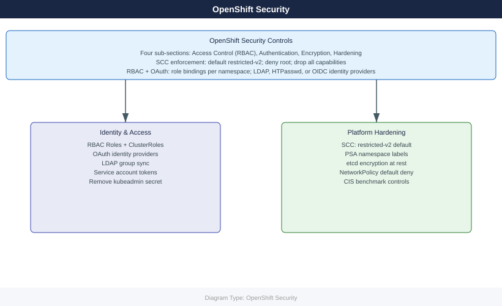

---
tags:
  - security
description: "OpenShift security: RBAC, OAuth identity providers, etcd encryption, pod security admission, SCC, and CIS hardening. Enterprise security controls built..."
---
# OpenShift — Security

OpenShift security: RBAC, OAuth identity providers, etcd encryption, pod security admission, SCC, and CIS hardening. Enterprise security controls built into the platform.

*Applies to: OpenShift 4.x*

  <a class="kb-card" href="access-control/">
    Access Control
    RBAC, groups, service accounts, and project isolation
  </a>
  <a class="kb-card" href="authentication/">
    Authentication
    OAuth server, LDAP, HTPasswd, and OpenID Connect identity providers
  </a>
  <a class="kb-card" href="encryption/">
    Encryption
    etcd encryption at rest, secret management, and TLS certificate rotation
  </a>
  <a class="kb-card" href="hardening/">
    Hardening
    SCC, pod security admission, CIS benchmark, and audit logging
  </a>

