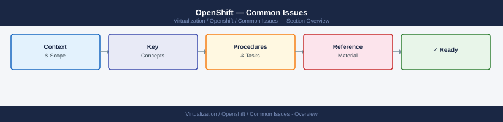
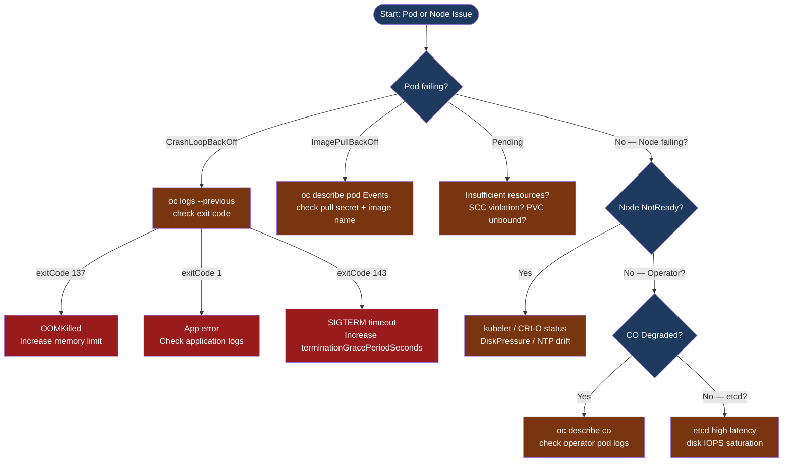
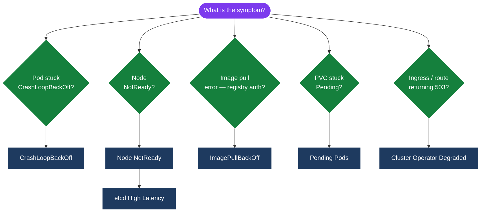

---
tags:
  - troubleshooting
search:
  boost: 1.5
---
# OpenShift — Common Issues

<div class="kb-summary">
Troubleshooting guide for frequent OpenShift failures: CrashLoopBackOff, ImagePullBackOff, node NotReady, Pending pods, OOMKilled, etcd high latency, DNS failures, and degraded cluster operators.

*Applies to: OpenShift 4.x*
</div>





```d2
direction: down

symptom: Identify Symptom {shape: diamond}
diagnostic_flow: "Diagnostic Flow" {shape: rectangle}
crashloopbackoff: "CrashLoopBackOff" {shape: rectangle}
imagepullbackoff: "ImagePullBackOff" {shape: rectangle}
pending_pods_not_scheduling: "Pending Pods (Not Scheduling)" {shape: rectangle}
oomkilled: "OOMKilled" {shape: rectangle}
node_notready: "Node NotReady" {shape: rectangle}
resolution: Resolve or Escalate {shape: oval}

symptom -> diagnostic_flow: investigate
symptom -> crashloopbackoff: investigate
symptom -> imagepullbackoff: investigate
symptom -> pending_pods_not_scheduling: investigate
symptom -> oomkilled: investigate
symptom -> node_notready: investigate
diagnostic_flow -> resolution
crashloopbackoff -> resolution
imagepullbackoff -> resolution
pending_pods_not_scheduling -> resolution
oomkilled -> resolution
node_notready -> resolution
```

## Diagnostic Flow



---

## Before you begin

- **Access:** Admin credentials on all affected systems
- **Gather first:** recent error message text, event timestamps, and affected object names
- **Scope:** confirm whether the issue affects a single object, host, cluster, or site
- **Escalation:** open a vendor support ticket before running any destructive step
- **Logging:** document each command and output — required if escalation is needed

---

## CrashLoopBackOff

```bash
# 1. Check current logs
oc logs <pod> -n <ns>

# 2. Check previous container instance (the one that crashed)
oc logs <pod> -n <ns> --previous

# 3. Describe for events and last state
oc describe pod <pod> -n <ns>
# Look at: Events section → reason, message
# Look at: Last State → exitCode

# 4. Common exit codes:
#    exitCode 137 → OOMKilled: container killed by kernel OOM; see OOMKilled section
#    exitCode 1   → Application error; check app logs for exception/traceback
#    exitCode 127 → Command not found (CMD path wrong inside image)
#    exitCode 139 → Segmentation fault (SIGSEGV) — memory corruption or arch mismatch
#    exitCode 143 → SIGTERM not handled; terminationGracePeriodSeconds exceeded
#    "exec format error" → Image built for wrong CPU architecture (e.g. arm64 on x86 node)

# 5. Debug the image interactively (overrides entrypoint)
oc debug deployment/<name> -n <ns>

# 6. Check if a ConfigMap or Secret the pod depends on is missing
oc describe pod <pod> -n <ns> | grep -A5 "Reason\|Error\|Warning"
```

## ImagePullBackOff

```bash
# 1. Check which image and exact error
oc describe pod <pod> -n <ns>
# Events: Failed to pull image "quay.io/myapp:latest": ...

# 2. Common causes and fixes:
# a) Wrong image name/tag → fix image reference in deployment
# b) No pull secret for private registry:
oc create secret docker-registry registry-creds \
  --docker-server=quay.io \
  --docker-username=<user> \
  --docker-password=<token> \
  -n <ns>
oc secrets link default registry-creds --for=pull -n <ns>

# c) Registry unreachable → check network, proxy env vars, firewall
# d) Air-gapped: image not mirrored → mirror to internal registry and add ImageContentSourcePolicy
# e) Auth expired → re-create or rotate pull secret

# 3. Test pull manually on a node
oc debug node/<node> -- crictl pull <image>

# 4. Check global pull secret (applies to all namespaces)
oc get secret pull-secret -n openshift-config \
  -o jsonpath='{.data.\.dockerconfigjson}' | base64 -d | jq .

# 5. Check ImageContentSourcePolicy for air-gapped mirror config
oc get imagecontentsourcepolicy
oc get imagecontentsourcepolicy -o yaml | grep -A5 mirrors
```

## Pending Pods (Not Scheduling)

```bash
# 1. Check events — scheduling failure reason is always in events
oc describe pod <pod> -n <ns>

# a) Insufficient resources: "0/6 nodes are available: Insufficient cpu"
oc adm top nodes
oc get nodes -o json | \
  jq '.items[] | {name: .metadata.name, cpu: .status.allocatable.cpu, mem: .status.allocatable.memory}'

# b) SCC violation: "unable to validate against any security context constraint"
oc adm policy scc-subject-review -f pod.yaml
oc adm policy add-scc-to-user anyuid -z <sa> -n <ns>

# c) Taint/toleration mismatch: "node(s) had untolerated taint"
oc describe node <node> | grep Taint
# Add toleration to pod spec if intentional; otherwise investigate node taints

# d) NodeAffinity mismatch: "node(s) didn't match nodeAffinity"
oc get nodes --show-labels | grep <required-label>

# e) PVC not bound: pod stays Pending until PVC is Bound
oc get pvc -n <ns>
oc describe pvc <name> -n <ns>
# Common: wrong StorageClass or no provisioner available

# f) Topology constraint: PodTopologySpreadConstraints too strict
oc get pod <pod> -n <ns> -o jsonpath='{.spec.topologySpreadConstraints}'
```

## OOMKilled

```bash
# 1. Identify which container OOMKilled
oc describe pod <pod> -n <ns>
# Last State: Terminated  Reason: OOMKilled

# 2. Check memory usage vs limit
oc adm top pods <pod> -n <ns> --containers

# 3. Check Prometheus for historical memory usage
# Query: container_memory_working_set_bytes{pod="<pod>", namespace="<ns>"}

# 4. Increase memory limit
oc set resources deployment <name> -n <ns> \
  --containers=<container> \
  --limits=memory=2Gi \
  --requests=memory=512Mi

# 5. If limit is already generous: profile the app for memory leak
#    Look for unbounded caches, connection leaks, recursive structures
```

## Node NotReady

```bash
# 1. Check node conditions
oc describe node <node>
# Conditions section: MemoryPressure, DiskPressure, PIDPressure, Ready

# 2. Check kubelet and CRI-O on the node
oc debug node/<node>
chroot /host
systemctl status kubelet
systemctl status crio
journalctl -u kubelet -n 50 --no-pager
journalctl -u crio -n 50 --no-pager

# 3. Check disk usage (DiskPressure threshold default: 85%)
df -h /
df -h /var

# 4. Check OVN-K network pods on the node
oc get pods -n openshift-ovn-kubernetes \
  --field-selector=spec.nodeName=<node>

# 5. Check NTP (etcd elections require < 1s time skew between masters)
chroot /host chronyc tracking
chronyc sources -v

# 6. If node stuck NotReady after reboot:
oc get machineconfigpool -w
# MCO may be applying a MachineConfig — wait for it to complete
```

## etcd High Latency

High disk I/O latency causes etcd to miss heartbeat deadlines, leading to leader elections, slow API responses, and cascading CrashLoopBackOff on etcd pods.

```bash
# Get etcd pod name
ETCD_POD=$(oc get pod -n openshift-etcd -l etcd=true -o name | head -1)

# Check endpoint status: DB SIZE and RAFT_APPLIED_INDEX
oc rsh -n openshift-etcd "$ETCD_POD" \
  etcdctl endpoint status --cluster --write-out=table \
  --endpoints=https://localhost:2379 \
  --cacert=/etc/kubernetes/static-pod-certs/configmaps/etcd-serving-ca/ca-bundle.crt \
  --cert=/etc/kubernetes/static-pod-certs/secrets/etcd-all-certs/etcd-peer-$(hostname).crt \
  --key=/etc/kubernetes/static-pod-certs/secrets/etcd-all-certs/etcd-peer-$(hostname).key

# Check P99 WAL fsync latency via Prometheus
# Alert threshold: > 10ms P99
# Query: etcd_disk_wal_fsync_duration_seconds{quantile="0.99"}

# Check disk latency on the etcd node
oc debug node/<master-node>
chroot /host
# Use iostat to identify disk saturation:
iostat -x 1 5 | grep -E "Device|sd|nvme"

# Defrag etcd if DB size > 8 GB
oc rsh -n openshift-etcd "$ETCD_POD" \
  etcdctl defrag --cluster \
  --endpoints=https://localhost:2379 \
  --cacert=... --cert=... --key=...
```

## DNS Failures

```bash
# 1. Check CoreDNS pods (one per node via DaemonSet)
oc get pods -n openshift-dns -o wide
# All should be Running; any Pending or Error needs investigation

# 2. Test DNS from within a pod
oc debug -n <ns> -- nslookup <service>.<ns>.svc.cluster.local
oc debug -n <ns> -- nslookup kubernetes.default.svc.cluster.local

# 3. Check CoreDNS logs for forwarding errors
oc logs -n openshift-dns \
  -l dns.operator.openshift.io/daemonset-dns --tail=50

# 4. Verify DNS ConfigMap (Corefile)
oc get configmap dns-default -n openshift-dns -o yaml
# Check upstream forwarder configuration

# 5. Check /etc/resolv.conf inside a pod
oc exec -n <ns> <pod> -- cat /etc/resolv.conf
# Should show: nameserver 172.30.0.10 (cluster DNS service IP)

# 6. Verify DNS service is running
oc get svc -n openshift-dns
# dns-default ClusterIP should be the IP in /etc/resolv.conf
```

## Cluster Operator Degraded

```bash
# 1. Get detailed status
oc describe co <operator-name>
# Conditions section → message field has root cause

# 2. Check operator pod logs
oc get pods -n openshift-<operator-name>
oc logs -n openshift-<operator-name> -l app=<operator-pod> --tail=100

# 3. Common operator degraded scenarios:
# dns degraded → check coredns pods in openshift-dns; check upstream DNS reachability
# ingress degraded → check router pods in openshift-ingress; check wildcard cert expiry
# monitoring degraded → check prometheus pods; likely PVC full or OOM
# authentication degraded → OAuth pods failing; check LDAP/OIDC connectivity
# storage degraded → CSI driver pods; check underlying storage system

# 4. Check if Progressing is stuck (often indicates upgrade issue)
oc get co | grep -v "True.*False.*False"
# Any CO with Available=False, Degraded=True, or Progressing=True for > 15 min

# 5. Force operator to reconcile (redeploy its managed pods)
oc rollout restart deployment/<operator-pod> -n openshift-<operator-ns>
```

---

## See also

- [OpenShift — Diagnostics](../diagnostics/)
- [OpenShift — Escalation](../escalation/)
- [OpenShift — Health Checks](../../operations/health-checks/)

## Verify resolution

- Confirm the original symptom no longer occurs
- Check logs for any residual errors related to the issue
- Monitor for 10–15 minutes to confirm the fix is stable
