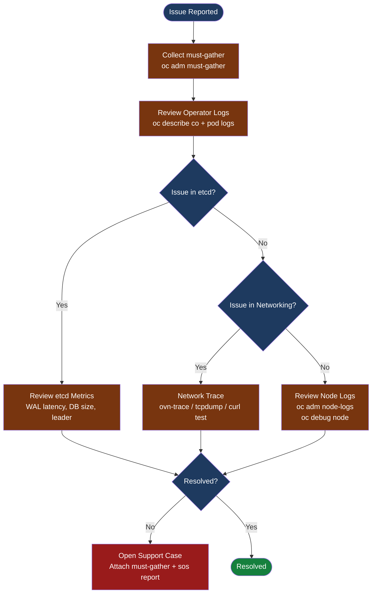

---
tags:
  - troubleshooting
search:
  boost: 1.5
---
# OpenShift — Diagnostics

<div class="kb-summary">
Diagnostic tools and techniques: must-gather collection, oc adm inspect, Prometheus-based diagnostics, OVN network tracing, log aggregation, and etcd health assessment.

*Applies to: OpenShift 4.x*
</div>

```text
┌──────────────────────────────────────── OpenShift Diagnostics ────────────────────────────────────────┐
│                                                                                                       │
│   ┌───────────────────────────────────────────────────────────────────────────────────────────────┐   │
│   │   must-gather: full cluster state in one command; attach to every Red Hat support case        │   │
│   │   oc adm inspect: targeted collection for one operator/namespace; faster than must-gather    │    │
│   │   etcd: health endpoints + Prometheus metrics; latency > 10ms P99 = disk IOPS problem        │    │
│   └───────────────────────────────────────────────────────────────────────────────────────────────┘   │
│                                                                                                       │
│                  ▼                                ▼                                ▼                  │
│                                                                                                       │
│   ┌─────────────────────────────┐  ┌─────────────────────────────┐  ┌─────────────────────────────┐   │
│   │      must-gather            │  │      etcd Diagnostics        │  │     Network Diagnostics     │  │
│   │      ─────────────          │  │      ─────────────           │  │      ─────────────          │  │
│   │  Full cluster state         │  │  endpoint health/status      │  │  oc exec curl between pods  │  │
│   │  Pod logs, events, configs  │  │  member list + latency       │  │  OVN-K pod status           │  │
│   │  ~10-20 min to collect      │  │  db size, compaction         │  │  DNS resolution test        │  │
│   │  Attach to support case     │  │  Prometheus metrics          │  │  NetworkPolicy debug        │  │
│   └─────────────────────────────┘  └─────────────────────────────┘  └─────────────────────────────┘   │
│                                                                                                       │
│    Key terms:                                                                                         │
│                                                                                                       │
│    must-gather  = Runs image that collects logs, configs, CRDs, and events from all namespaces        │
│    oc adm inspect= Collects resources from a specific operator or namespace; faster/targeted          │
│    etcdctl     = etcd CLI; available inside etcd pods via oc rsh or oc debug node                     │
│                                                                                                       │
└───────────────────────────────────────────────────────────────────────────────────────────────────────┘
```



## Before you begin

- **Access:** Admin credentials on all affected systems
- **Gather first:** recent error message text, event timestamps, and affected object names
- **Scope:** confirm whether the issue affects a single object, host, cluster, or site
- **Escalation:** open a vendor support ticket before running any destructive step
- **Logging:** document each command and output — required if escalation is needed

---

## must-gather

```bash
# Full cluster collection (required for Red Hat support cases)
oc adm must-gather --dest-dir=/tmp/must-gather

# Output location: /tmp/must-gather/must-gather.local.<timestamp>/
# Key directories:
#   cluster-info/        — cluster version, node info, co status
#   namespaces/<ns>/     — pod logs, events, resource YAML per namespace
#   etcd/                — etcd member list, endpoint status, DB info
#   network/             — OVN-K flows, NetworkPolicy state
#   audit_logs/          — API server audit logs

# Product-specific must-gather images
oc adm must-gather \
  --image=registry.redhat.io/ocs4/ocs-must-gather-rhel8         # ODF/OCS
oc adm must-gather \
  --image=registry.redhat.io/rhacm2/acm-must-gather-rhel8       # ACM
oc adm must-gather \
  --image=registry.redhat.io/openshift4/ose-network-tools-rhel9  # Network

# Restrict to specific namespace (faster for targeted issues)
oc adm must-gather --dest-dir=/tmp/mg \
  -- /usr/bin/gather_namespaces openshift-etcd

# Compress for upload to Red Hat support portal
tar czf must-gather-$(date +%F-%H%M).tar.gz /tmp/must-gather/

# Review top-level summary
ls /tmp/must-gather/must-gather.local.*/
cat /tmp/must-gather/must-gather.local.*/cluster-info/clusterversion
```

## oc adm inspect (Targeted)

```bash
# Collect specific cluster operator state
oc adm inspect clusteroperator/etcd --dest-dir=/tmp/etcd-inspect
oc adm inspect clusteroperator/ingress --dest-dir=/tmp/ingress-inspect
oc adm inspect clusteroperator/authentication --dest-dir=/tmp/auth-inspect
oc adm inspect clusteroperator/kube-apiserver --dest-dir=/tmp/apiserver-inspect

# Collect full namespace (faster than must-gather for single namespace issues)
oc adm inspect namespace/openshift-monitoring --dest-dir=/tmp/monitoring
oc adm inspect namespace/openshift-dns --dest-dir=/tmp/dns

# Collect a specific resource
oc adm inspect deployment/prometheus-operator -n openshift-monitoring

# Inspect all failure events cluster-wide
oc get events --field-selector reason=Failed -A \
  --sort-by='.lastTimestamp'
```

## Metrics-Based Diagnostics

```bash
# Node resource usage
oc adm top nodes

# Pod memory usage across all namespaces sorted by highest memory
oc adm top pods -A --sort-by=memory | head -20

# Pod CPU usage across all namespaces sorted by highest CPU
oc adm top pods -A --sort-by=cpu | head -20

# Run a Prometheus instant query directly against the in-cluster Prometheus
oc exec -n openshift-monitoring prometheus-k8s-0 -- \
  promtool query instant http://localhost:9090 \
  'etcd_disk_wal_fsync_duration_seconds{quantile="0.99"}'

# etcd backend commit latency (should be < 25ms P99)
oc exec -n openshift-monitoring prometheus-k8s-0 -- \
  promtool query instant http://localhost:9090 \
  'histogram_quantile(0.99, rate(etcd_disk_backend_commit_duration_seconds_bucket[5m]))'

# OOM events on nodes (node-level memory pressure)
oc exec -n openshift-monitoring prometheus-k8s-0 -- \
  promtool query instant http://localhost:9090 \
  'kube_pod_container_status_last_terminated_reason{reason="OOMKilled"}'

# API server error rate
oc exec -n openshift-monitoring prometheus-k8s-0 -- \
  promtool query instant http://localhost:9090 \
  'sum(rate(apiserver_request_total{code=~"5.."}[5m])) by (resource, verb)'
```

## etcd Diagnostics

```bash
# Get etcd pod
ETCD_POD=$(oc get pod -n openshift-etcd -l etcd=true -o name | head -1)

# Helper function for etcdctl inside the etcd pod
etcdctl_cmd() {
  oc rsh -n openshift-etcd "$ETCD_POD" \
    etcdctl "$@" \
    --endpoints=https://localhost:2379 \
    --cacert=/etc/kubernetes/static-pod-certs/configmaps/etcd-serving-ca/ca-bundle.crt \
    --cert=/etc/kubernetes/static-pod-certs/secrets/etcd-all-certs/etcd-peer-$(oc rsh -n openshift-etcd "$ETCD_POD" hostname).crt \
    --key=/etc/kubernetes/static-pod-certs/secrets/etcd-all-certs/etcd-peer-$(oc rsh -n openshift-etcd "$ETCD_POD" hostname).key
}

# Member list — verify all 3 masters are members
etcdctl_cmd member list -w table

# Endpoint health — all endpoints should be healthy
etcdctl_cmd endpoint health --cluster -w table

# Endpoint status — DB SIZE, IS LEADER, RAFT_TERM
etcdctl_cmd endpoint status --cluster -w table

# Compact and defrag if DB > 8 GB
REV=$(etcdctl_cmd endpoint status --write-out="json" | \
  python3 -c "import sys,json; print(json.load(sys.stdin)[0]['Status']['header']['revision'])")
etcdctl_cmd compact "$REV"
etcdctl_cmd defrag --cluster
```

## Network Diagnostics

```bash
# Test pod-to-service connectivity
oc exec -n source-ns source-pod -- \
  curl -v http://target-service.target-ns.svc.cluster.local

# Test DNS resolution from a pod
oc exec -n <ns> <pod> -- nslookup kubernetes.default.svc.cluster.local
oc exec -n <ns> <pod> -- cat /etc/resolv.conf

# Debug CoreDNS
oc get pods -n openshift-dns
oc logs -n openshift-dns -l dns.operator.openshift.io/daemonset-dns --tail=30

# OVN-Kubernetes diagnostics
oc get pods -n openshift-ovn-kubernetes -o wide
oc logs -n openshift-ovn-kubernetes <ovnkube-master-pod> -c nbdb --tail=50
oc logs -n openshift-ovn-kubernetes <ovnkube-node-pod> -c ovnkube-node --tail=50

# OVN flow trace — determine why traffic is dropped
oc exec -n openshift-ovn-kubernetes ovnkube-node-<hash> -- \
  ovn-trace --ovs "inport=<logical-port>" \
  "eth.dst == <mac>, ip4.src == <src-ip>, ip4.dst == <dst-ip>, tcp.dst == 80"

# Capture packets on a node for offline analysis
oc debug node/<node>
chroot /host
tcpdump -i ens192 -w /host/tmp/capture.pcap host <target-ip> and port 443
# Copy pcap off node:
oc cp <debug-pod>:/host/tmp/capture.pcap /tmp/capture.pcap

# Check NetworkPolicy is not blocking traffic
oc get networkpolicy -n <ns>
oc describe networkpolicy <np> -n <ns>
```

## Log Aggregation

```bash
# Node journal logs via oc adm (no SSH required)
oc adm node-logs <node> -u crio --since=1h
oc adm node-logs <node> -u kubelet --since=2h

# All nodes at once for a specific service
oc adm node-logs --role=master -u etcd | tail -200

# Platform component logs
oc logs -n openshift-monitoring alertmanager-main-0 --tail=100
oc logs -n openshift-monitoring prometheus-k8s-0 --tail=100 -c prometheus

# Cluster Logging Operator (if deployed): query Loki
oc get pods -n openshift-logging
oc logs -n openshift-logging -l component=collector --tail=50

# Get all failure events across all namespaces sorted by time
oc get events -A \
  --field-selector reason=Failed \
  --sort-by='.lastTimestamp' | tail -30

# Get all Warning events cluster-wide
oc get events -A \
  --field-selector type=Warning \
  --sort-by='.lastTimestamp' | tail -50
```

## Node-Level Diagnostics

```bash
# Access node as root via debug pod
oc debug node/<node-name>
chroot /host

# Check container runtime
crictl ps                          # running containers
crictl pods                        # pod sandboxes
crictl info                        # CRI-O runtime info
crictl logs <container-id>         # container logs via CRI-O

# Check kubelet
systemctl status kubelet
journalctl -u kubelet -n 100 --no-pager

# Check disk usage (high disk → DiskPressure → pod evictions)
df -h /
df -h /var
du -sh /var/lib/containers/*       # container image layers
du -sh /var/log/pods/*             # pod logs on disk

# Check current MachineConfig state
rpm-ostree status                  # RHCOS OS version + pending changes
systemctl --failed                 # any failed systemd units
```

---

## See also

- [OpenShift — Common Issues](../common-issues/)
- [OpenShift — Escalation](../escalation/)

## Verify resolution

- Confirm the original symptom no longer occurs
- Check logs for any residual errors related to the issue
- Monitor for 10–15 minutes to confirm the fix is stable
