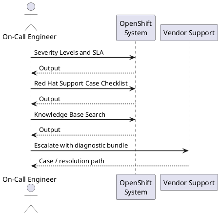

---
tags:
  - troubleshooting
search:
  boost: 1.5
description: "Red Hat support escalation process: severity levels, required data for support cases, SOS report generation, KCS knowledge base, escalation path, and what..."
---
# OpenShift — Escalation

<div class="kb-summary">
Red Hat support escalation process: severity levels, required data for support cases, SOS report generation, KCS knowledge base, escalation path, and what not to include in support bundles.

*Applies to: OpenShift 4.x*
</div>

```d2
direction: right

A: "Issue Not Resolved" {shape: rectangle}
B: "Collect must-gather\noc adm must-gather" {shape: rectangle}
C: "Search KCS\naccess.redhat.com/solutions" {shape: rectangle}
D: "Apply KCS Fix\nResolve Internally" {shape: rectangle}
E: "Open Support Case\naccess.redhat.com\nSev 1 or 2" {shape: rectangle}
F: "F" {shape: rectangle}
G: "Call Red Hat immediately\nphone on access.redhat.com" {shape: rectangle}
H: "Wait for CEE assignment\nAttach must-gather + sos" {shape: rectangle}
I: "I" {shape: rectangle}
J: "CEE Working\nMonitor case" {shape: rectangle}
K: "Request escalation\nAsk for L3 or Eng" {shape: rectangle}
L: "L" {shape: rectangle}
M: "Contact TAM\nExpedite internally" {shape: rectangle}
N: "Request CritSit team\nFor data loss or security" {shape: rectangle}

A -> B
B -> C
C -> D
C -> E
F -> G
F -> H
H -> I
I -> J
I -> K
L -> M
L -> N
```



## Before you begin

- **Access:** Admin credentials on all affected systems
- **Gather first:** recent error message text, event timestamps, and affected object names
- **Scope:** confirm whether the issue affects a single object, host, cluster, or site
- **Escalation:** open a vendor support ticket before running any destructive step
- **Logging:** document each command and output — required if escalation is needed

---

## Severity Levels and SLA

| Severity | Definition | Response SLA | Availability |
|---|---|---|---|
| Sev 1 | Production system completely down; no workaround | 1 hour | 24×7 |
| Sev 2 | Major function lost; significant performance degradation in production; workaround exists | 4 business hours | Business hours + on-call |
| Sev 3 | Non-critical failure; limited functionality impacted; workaround available | 1 business day | Business hours |
| Sev 4 | General question, documentation request, or feature request | 2 business days | Business hours |

## Red Hat Support Case Checklist

Provide all of the following in the initial case description to avoid round-trips with the CEE.

```bash
# 1. Cluster version and update history
oc get clusterversion -o yaml > /tmp/clusterversion.yaml
oc get clusterversion -o jsonpath='{.status.history[*].version}' | tr ' ' '\n'

# 2. All cluster operator statuses
oc get co > /tmp/co-status.txt

# 3. Node status
oc get nodes -o wide > /tmp/nodes.txt
oc describe nodes > /tmp/nodes-describe.txt

# 4. Recent events across cluster sorted by time
oc get events -A --sort-by='.lastTimestamp' > /tmp/events.txt

# 5. Infrastructure details
oc version
oc get infrastructure cluster -o jsonpath='{.status.platformStatus.type}'
oc get network cluster -o jsonpath='{.spec.networkType}'

# 6. Collect must-gather (always required)
oc adm must-gather --dest-dir=/tmp/must-gather
tar czf must-gather-$(date +%F-%H%M).tar.gz /tmp/must-gather/
```


```text title="Expected output"
apiVersion: config.openshift.io/v4
kind: ClusterVersion
metadata:
  name: version
  namespace: openshift-cluster-version
status:
  desired:
    image: quay.io/openshift-release-dev/ocp-release@sha256:a1b2c3d4e5f6g7h8i9j0k1l2m3n4o5p6q7r8s9t0
    version: 4.14.8
  history:
  - completionTime: "2024-01-15T14:32:00Z"
    image: quay.io/openshift-release-dev/ocp-release@sha256:a1b2c3d4e5f6g7h8i9j0k1l2m3n4o5p6q7r8s9t0
    startedTime: "2024-01-15T13:45:00Z"
    state: Completed
    version: 4.14.8
4.14.8
4.14.7
4.14.6
4.14.5

NAME                                       VERSION   AVAILABLE   PROGRESSING   DEGRADED   SINCE   MESSAGE
authentication                             4.14.8    True        False         False      2d
baremetal                                  4.14.8    True        False         False      2d
cloud-credential                           4.14.8    True        False         False      2d
cluster-autoscaler                         4.14.8    True        False         False      2d
...

NAME                STATUS   ROLES           AGE   VERSION   INTERNAL-IP    EXTERNAL-IP   OS-IMAGE
master-0            Ready    master,worker   45d   v1.27.8   10.0.1.10      203.0.113.45  Red Hat Enterprise Linux CoreOS 414.92.202401151234-0
master-1            Ready    master,worker   45d   v1.27.8   10.0.1.11      203.0.113.46  Red Hat Enterprise Linux CoreOS 414.92.202401151234-0
worker-0            Ready    worker          42d   v1.27.8   10.0.2.20      203.0.113.50  Red Hat Enterprise Linux CoreOS 414.92.202401151234-0
worker-1            Ready    worker          42d   v1.27.8   10.0.2.21      203.0.113.51  Red Hat Enterprise Linux CoreOS 414.92.202401151234-0

Client Version: 4.14.8
Server Version: 4.14.8
Kubernetes Version: v1.27.8+4fab27b
AWS
OpenShiftSDN

Gathering data for cluster...
Wrote must-gather to /tmp/must-gather
must-gather-2024-01-16-1430.tar.gz
```

!!! warning "Common errors"
    | Error | Fix |
    |---|---|
    | `error: the server doesn't have a resource type "clusterversion"` | Verify you are connected to an OpenShift cluster (not vanilla Kubernetes) with `oc cluster-info`. |
    | `error: Unable to connect to the server: dial tcp: lookup api.cluster.example.com on 8.8.8.8:53: no such host` | Check your kubeconfig context with `oc config current |
Case description must include:
1. **OpenShift version**: exact version from `oc get clusterversion`
2. **Infrastructure**: IPI/UPI, cloud/bare-metal/vSphere, network plugin (OVN-K/SDN)
3. **Node count**: control plane + worker; any infra/storage nodes
4. **Timeline**: when the issue started and what changed immediately before
5. **Symptoms**: exact error messages, affected components, blast radius
6. **Steps taken**: what you have already tried and the result
7. **Attachments**: must-gather tarball, sos reports, relevant YAML/logs

## Knowledge Base Search

Access `access.redhat.com/solutions` before opening a case. The KCS (Knowledge Centered Service) base contains solutions for most common issues.

| Common Issue | KCS Search Term |
|---|---|
| etcd high latency / slow API | `etcd disk latency openshift` |
| ImagePullBackOff in air-gapped env | `ImagePullBackOff disconnected openshift` |
| Node NotReady after reboot | `node NotReady kubelet openshift 4` |
| OAuth pods CrashLoopBackOff | `oauth-openshift CrashLoopBackOff` |
| Upgrade stuck Progressing | `upgrade stuck Progressing clusteroperator` |
| Certificate expiry issues | `certificate expired openshift kube-apiserver` |
| etcd member unhealthy | `etcd member unhealthy openshift` |

## SOS Report (Per Node)

SOS reports capture node-level OS state: kernel, systemd services, package versions, hardware, and storage. Run on every affected node separately.

```bash
# Method 1: via oc debug + sos in toolbox (recommended for RHCOS)
oc debug node/<node-name>
chroot /host
toolbox

# Inside toolbox container:
sos report --batch \
  -k crio.all \
  -k crio.logs \
  --label openshift-node

# Method 2: direct sos without toolbox (if sos available on node)
oc debug node/<node-name> -- \
  chroot /host sos report \
    -k crio.all \
    -k crio.logs \
    --batch

# Copy sos report from node to workstation
NODE_DEBUG_POD=$(oc get pods -n openshift-debug -o name | grep <node-name> | head -1)
oc cp ${NODE_DEBUG_POD#pod/}:/host/var/tmp/sosreport*.tar.xz /tmp/

# Run sos on multiple nodes in parallel
for node in master-0 master-1 master-2; do
  echo "Starting sosreport on $node"
  oc debug node/$node -- \
    chroot /host bash -c 'toolbox sos report --batch -k crio.all --label escalation' &
done
wait
echo "All sos reports complete"
```


```text title="Expected output"
Starting debug container on node master-0...
Spawning a debug container with image "quay.io/openshift-release-dev/ocp-v4.14.0-linux:latest".
Root filesystem is mounted at /host.
Removing debug pod "node-debug-7k9mz" ...
Toolbox initialized. Type 'exit' to return to the host.
Running 'sosreport' setup for openshift-node...
Loaded plugins: crio, crio.logs, networking, kubernetes
Collecting data and creating archive...
sosreport (version 4.4.1)
  Running plugins. Completing % |████████████████████████| Time: 0:02:15
  Your sosreport has been packaged and saved in:
    /var/tmp/sosreport-master-0-20240315-kxvj2.tar.xz
  Size: 287M
  MD5: 8f4e2c9d1a6b5e3f2c7d9a1b4e6f8c0d

Starting sosreport on master-0
Starting sosreport on master-1
Starting sosreport on master-2
All sos reports complete
```

!!! warning "Common errors"
    | Error | Fix |
    |---|---|
    | `error: unable to find a match for "node/<node-name>"` | Replace `<node-name>` with an actual node name from `oc get nodes`. |
    | `tar: /host/var/tmp/sosreport*.tar.xz: No such file or directory` | The sosreport may still be running; wait a few seconds and verify the file exists with `oc debug node/<node-name> -- ls -lh /host/var/tmp/sosreport*.tar.xz`. |
    | `command not found: toolbox` | Install toolbox on the node with `oc debug node/<node-name> -- chroot /host dnf install -y toolbox` or use Method 2 if sos is already available. |
## Escalation Path

```text
1. Open support case at access.redhat.com with appropriate severity
   ↓
2. For Sev 1: call Red Hat support phone immediately
   (number on access.redhat.com — varies by region: NA, EMEA, APAC)
   ↓
3. Attach must-gather, sos reports, and full case description in first update
   ↓
4. If no meaningful progress in 2–4 hours: request case escalation
   → Ask CEE to escalate to team lead or L3 engineering
   ↓
5. If still blocked: contact TAM (Technical Account Manager)
   → TAM can expedite internally and coordinate engineering resources
   ↓
6. For data corruption, security incidents, or catastrophic failure:
   → Request Critical Situation (CritSit) team engagement via TAM or account team
```

## What NOT to Send

Before uploading must-gather or sos reports to Red Hat, verify they do not contain sensitive data. The `oc adm inspect` output is generally safe; raw etcd snapshots are not.

| Do NOT Include | Why | Alternative |
|---|---|---|
| Cloud provider credentials (AWS keys, Azure SP secrets) | Credential exposure | Redact from YAML before uploading |
| Private keys (TLS `.key` files) | Key compromise | Share cert without key; describe cert details textually |
| Passwords in ConfigMaps or Secrets | Credential exposure | Describe Secret names; omit values |
| Raw etcd snapshots | Contains all cluster Secrets in plaintext | Use `etcdctl endpoint status` output only |
| Customer PII in application logs | Privacy / compliance | Redact application log sections |

```bash
# Verify must-gather does not contain raw secret values before uploading
# must-gather scrubs Secret .data fields automatically, but verify:
grep -r "password\|token\|key" /tmp/must-gather/must-gather.local.*/ | \
  grep -v "\.metadata\." | grep -v "type:" | head -20

# oc adm inspect output is safe — scrubs Secret values
oc adm inspect namespace/my-project --dest-dir=/tmp/inspect-ns
```


```text title="Expected output"
/tmp/must-gather/must-gather.local.5678/namespaces/openshift-monitoring/secrets.yaml:    - key: prometheus-k8s-tls-assets-ca-bundle
/tmp/must-gather/must-gather.local.5678/namespaces/openshift-monitoring/secrets.yaml:    - key: alertmanager-main-tls-assets-ca-bundle
/tmp/must-gather/must-gather.local.5678/namespaces/openshift-apiserver/configmaps.yaml:      password_database: "postgresql"
/tmp/must-gather/must-gather.local.5678/namespaces/kube-system/configmaps.yaml:      token_endpoint: "https://oauth.example.com"
/tmp/must-gather/must-gather.local.5678/cluster-scoped-resources/core/secrets.yaml:    - key: tls.key
/tmp/must-gather/must-gather.local.5678/cluster-scoped-resources/core/secrets.yaml:    - key: tls.crt

Inspecting namespace my-project...
Wrote inspect data to /tmp/inspect-ns
```

!!! warning "Common errors"
    | Error | Fix |
    |---|---|
    | `grep: /tmp/must-gather/must-gather.local.*/: No such file or directory` | Run `oc adm must-gather` first to generate the must-gather bundle in /tmp/must-gather/. |
    | `error: the server doesn't have a resource type "namespace"` | Use `oc adm inspect namespace/my-project` (with lowercase "namespace") or specify the full resource path like `oc adm inspect ns/my-project`. |
## Pre-Escalation Triage Checklist

Run through this checklist before opening a case to rule out self-resolvable issues.

| Check | Command | Expected Result |
|---|---|---|
| All COs healthy | `oc get co` | All: Available=True, Progressing=False, Degraded=False |
| All nodes Ready | `oc get nodes` | All nodes show `Ready` |
| No pod restarts > 5 | `oc get pods -A --sort-by='.status.containerStatuses[0].restartCount'` | No pods with high restart counts |
| etcd members healthy | `etcdctl endpoint health --cluster` | All endpoints healthy |
| Recent events reviewed | `oc get events -A --sort-by=.lastTimestamp` | No unexpected Warning events |
| Cluster version reconciled | `oc get clusterversion` | No `Progressing=True` on CVO |
| Disk not full on masters | `oc debug node/<master> -- df -h /var` | < 80% used on `/var` |
| NTP sync OK | `oc debug node/<master> -- chroot /host chronyc tracking` | System time offset < 50ms |

## Useful Commands for Case Updates

```bash
# Snapshot current state with timestamp before each case update
oc get co,nodes,pods -A 2>&1 | tee /tmp/state-$(date +%F-%H%M).txt

# Verify issue persists (run before each update to Red Hat)
oc get co | grep -v "True.*False.*False"   # operators not fully healthy
oc get nodes | grep -v " Ready "           # nodes not ready

# etcd health for etcd-related cases
oc get etcd cluster -o yaml | grep -A30 conditions

# Check if any nodes have high resource pressure
oc adm top nodes
oc adm top pods -A --sort-by=memory | head -20

# API server audit logs for authentication or authorization issues
oc adm inspect clusteroperator/kube-apiserver --dest-dir=/tmp/apiserver-inspect
# Audit logs are included in the inspect bundle under audit_logs/

# Cluster version history — useful to correlate with when issue started
oc get clusterversion -o jsonpath='{range .status.history[*]}{.version}{"\t"}{.completionTime}{"\n"}{end}'

# List all recent MachineConfig changes (node reboots correlate with these)
oc get machineconfigpool -o wide
oc get machineconfig --sort-by=.metadata.creationTimestamp | tail -10
```


```text title="Expected output"
NAME                                                  READY   UP-TO-DATE   AVAILABLE   AGE
clusteroperator/authentication                        True    False        False       45d
clusteroperator/baremetal                             True    False        False       45d
clusteroperator/cloud-credential                      True    False        False       45d
clusteroperator/cluster-autoscaler                    True    False        False       45d
clusteroperator/console                               True    False        False       45d
NAME     STATUS   ROLES    AGE   VERSION
node-0   Ready    master   45d   v1.27.6+f67aeb3
node-1   Ready    master   45d   v1.27.6+f67aeb3
node-2   Ready    worker   45d   v1.27.6+f67aeb3
node-3   NotReady worker   45d   v1.27.6+f67aeb3
...
NAME                                    READY   STATUS    RESTARTS   AGE
openshift-apiserver/apiserver-0         1/1     Running   0          2d
openshift-etcd/etcd-node-0              1/1     Running   1          45d
openshift-monitoring/prometheus-0       2/2     Running   0          3h
...
state-2024-01-15-1430.txt

conditions:
- lastTransitionTime: "2024-01-15T14:28:33Z"
  message: "etcd cluster is healthy"
  reason: EtcdClusterHealthy
  status: "True"
  type: Available
- lastTransitionTime: "2024-01-15T14:28:33Z"
  message: ""
  reason: ""
  status: "False"
  type: Progressing

NAME       CPU(cores)   CPU%   MEMORY(bytes)   MEMORY%
node-0     2847m        71%    18432Mi         58%
node-1     1923m        48%    12288Mi         39%
node-2     892m         22%    8192Mi         26%
node-3     3456m        86%    24576Mi        78%

POD                                                    CPU(cores)   MEMORY(bytes)
openshift-monitoring/prometheus-operator-6d8f5c4b9d   156m         512Mi
openshift-etcd/etcd-node-0                            234m         1024Mi
openshift-apiserver/apiserver-0                       189m         768Mi
openshift-monitoring/alertmanager-main-0              98m          256Mi
openshift-kube-scheduler/scheduler-node-0             67m          128Mi
...

Inspecting clusteroperator/kube-apiserver...
Wrote results to /tmp/apiserver-inspect

4.13.0-rc.1	2024-01-10T08:45:22Z
4.12.15	2024-01-05T16:22:15Z
4.12.14	2023-12-28T09:11:44Z

NAME                    CONFIG                                        UPDATED   UPDATING   DEGRADED   MACHINECOUNT   READYMACHINECOUNT   UPDATEDMACHINECOUNT   DEGRADEDMACHINECOUNT   AGE
master                  rendered-master-a1b2c3d4e
```
---

## See also

- [OpenShift — Diagnostics](../diagnostics/)
- [OpenShift — Common Issues](../common-issues/)

## Verify resolution

- Confirm the original symptom no longer occurs
- Check logs for any residual errors related to the issue
- Monitor for 10–15 minutes to confirm the fix is stable
