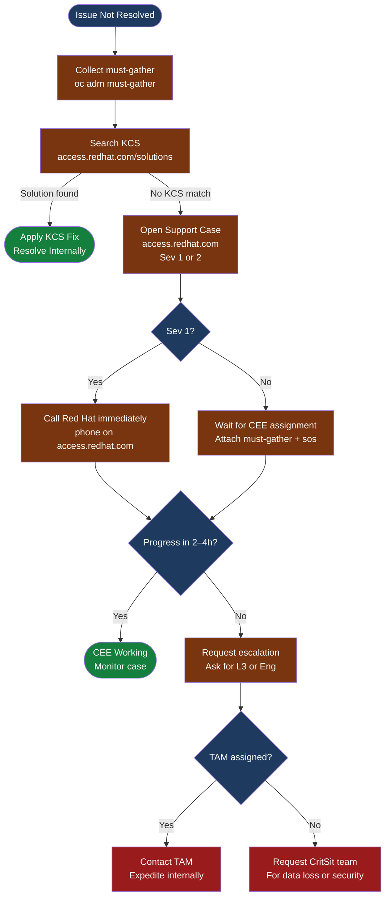

# OpenShift — Escalation

<div class="kb-summary">
Red Hat support escalation process: severity levels, required data for support cases, SOS report generation, KCS knowledge base, escalation path, and what not to include in support bundles.
</div>

```text
┌──────────────────────────────────── OpenShift Support Escalation ─────────────────────────────────────┐
│                                                                                                       │
│   ┌───────────────────────────────────────────────────────────────────────────────────────────────┐   │
│   │   Always attach must-gather to every support case; it is required for Red Hat to assist        │  │
│   │   Severity 1: production down — call Red Hat support immediately after opening case online        │
│   │   If stuck in a loop, request case escalation or a Technical Account Manager (TAM) review      │  │
│   └───────────────────────────────────────────────────────────────────────────────────────────────┘   │
│                                                                                                       │
│                  ▼                                ▼                                ▼                  │
│                                                                                                       │
│   ┌─────────────────────────────┐  ┌─────────────────────────────┐  ┌─────────────────────────────┐   │
│   │       Severity Levels        │  │      Required Data           │  │      Escalation Path        │ │
│   │      ─────────────          │  │      ─────────────           │  │      ─────────────          │  │
│   │  Sev 1: production down     │  │  must-gather bundle          │  │  Open case online           │  │
│   │  Sev 2: major function lost │  │  SOS report from each node   │  │  Sev 1: call immediately   │   │
│   │  Sev 3: non-critical issues │  │  oc get clusterversion -o y  │  │  Escalate if no progress   │   │
│   │  Sev 4: general questions   │  │  Steps to reproduce timeline │  │  Request TAM for critical  │   │
│   └─────────────────────────────┘  └─────────────────────────────┘  └─────────────────────────────┘   │
│                                                                                                       │
│    Key terms:                                                                                         │
│                                                                                                       │
│    must-gather  = Required cluster state bundle; run before opening any support case                  │
│    SOS report   = Node-level diagnostic (sosreport via toolbox); separate per affected node           │
│    TAM          = Technical Account Manager; assigned Red Hat contact for premium subscriptions       │
│    CEE          = Customer Engagement Engineer; the Red Hat support engineer assigned to your case    │
│                                                                                                       │
└───────────────────────────────────────────────────────────────────────────────────────────────────────┘
```



## Severity Levels and SLA

| Severity | Definition | Response SLA | Availability |
|---|---|---|---|
| Sev 1 | Production system completely down; no workaround | 1 hour | 24×7 |
| Sev 2 | Major function lost; significant performance degradation in production; workaround exists | 4 business hours | Business hours + on-call |
| Sev 3 | Non-critical failure; limited functionality impacted; workaround available | 1 business day | Business hours |
| Sev 4 | General question, documentation request, or feature request | 2 business days | Business hours |

## Red Hat Support Case Checklist

Provide all of the following in the initial case description to avoid round-trips with the CEE.

```bash
# 1. Cluster version and update history
oc get clusterversion -o yaml > /tmp/clusterversion.yaml
oc get clusterversion -o jsonpath='{.status.history[*].version}' | tr ' ' '\n'

# 2. All cluster operator statuses
oc get co > /tmp/co-status.txt

# 3. Node status
oc get nodes -o wide > /tmp/nodes.txt
oc describe nodes > /tmp/nodes-describe.txt

# 4. Recent events across cluster sorted by time
oc get events -A --sort-by='.lastTimestamp' > /tmp/events.txt

# 5. Infrastructure details
oc version
oc get infrastructure cluster -o jsonpath='{.status.platformStatus.type}'
oc get network cluster -o jsonpath='{.spec.networkType}'

# 6. Collect must-gather (always required)
oc adm must-gather --dest-dir=/tmp/must-gather
tar czf must-gather-$(date +%F-%H%M).tar.gz /tmp/must-gather/
```

Case description must include:
1. **OpenShift version**: exact version from `oc get clusterversion`
2. **Infrastructure**: IPI/UPI, cloud/bare-metal/vSphere, network plugin (OVN-K/SDN)
3. **Node count**: control plane + worker; any infra/storage nodes
4. **Timeline**: when the issue started and what changed immediately before
5. **Symptoms**: exact error messages, affected components, blast radius
6. **Steps taken**: what you have already tried and the result
7. **Attachments**: must-gather tarball, sos reports, relevant YAML/logs

## Knowledge Base Search

Access `access.redhat.com/solutions` before opening a case. The KCS (Knowledge Centered Service) base contains solutions for most common issues.

| Common Issue | KCS Search Term |
|---|---|
| etcd high latency / slow API | `etcd disk latency openshift` |
| ImagePullBackOff in air-gapped env | `ImagePullBackOff disconnected openshift` |
| Node NotReady after reboot | `node NotReady kubelet openshift 4` |
| OAuth pods CrashLoopBackOff | `oauth-openshift CrashLoopBackOff` |
| Upgrade stuck Progressing | `upgrade stuck Progressing clusteroperator` |
| Certificate expiry issues | `certificate expired openshift kube-apiserver` |
| etcd member unhealthy | `etcd member unhealthy openshift` |

## SOS Report (Per Node)

SOS reports capture node-level OS state: kernel, systemd services, package versions, hardware, and storage. Run on every affected node separately.

```bash
# Method 1: via oc debug + sos in toolbox (recommended for RHCOS)
oc debug node/<node-name>
chroot /host
toolbox

# Inside toolbox container:
sos report --batch \
  -k crio.all \
  -k crio.logs \
  --label openshift-node

# Method 2: direct sos without toolbox (if sos available on node)
oc debug node/<node-name> -- \
  chroot /host sos report \
    -k crio.all \
    -k crio.logs \
    --batch

# Copy sos report from node to workstation
NODE_DEBUG_POD=$(oc get pods -n openshift-debug -o name | grep <node-name> | head -1)
oc cp ${NODE_DEBUG_POD#pod/}:/host/var/tmp/sosreport*.tar.xz /tmp/

# Run sos on multiple nodes in parallel
for node in master-0 master-1 master-2; do
  echo "Starting sosreport on $node"
  oc debug node/$node -- \
    chroot /host bash -c 'toolbox sos report --batch -k crio.all --label escalation' &
done
wait
echo "All sos reports complete"
```

## Escalation Path

```text
1. Open support case at access.redhat.com with appropriate severity
   ↓
2. For Sev 1: call Red Hat support phone immediately
   (number on access.redhat.com — varies by region: NA, EMEA, APAC)
   ↓
3. Attach must-gather, sos reports, and full case description in first update
   ↓
4. If no meaningful progress in 2–4 hours: request case escalation
   → Ask CEE to escalate to team lead or L3 engineering
   ↓
5. If still blocked: contact TAM (Technical Account Manager)
   → TAM can expedite internally and coordinate engineering resources
   ↓
6. For data corruption, security incidents, or catastrophic failure:
   → Request Critical Situation (CritSit) team engagement via TAM or account team
```

## What NOT to Send

Before uploading must-gather or sos reports to Red Hat, verify they do not contain sensitive data. The `oc adm inspect` output is generally safe; raw etcd snapshots are not.

| Do NOT Include | Why | Alternative |
|---|---|---|
| Cloud provider credentials (AWS keys, Azure SP secrets) | Credential exposure | Redact from YAML before uploading |
| Private keys (TLS `.key` files) | Key compromise | Share cert without key; describe cert details textually |
| Passwords in ConfigMaps or Secrets | Credential exposure | Describe Secret names; omit values |
| Raw etcd snapshots | Contains all cluster Secrets in plaintext | Use `etcdctl endpoint status` output only |
| Customer PII in application logs | Privacy / compliance | Redact application log sections |

```bash
# Verify must-gather does not contain raw secret values before uploading
# must-gather scrubs Secret .data fields automatically, but verify:
grep -r "password\|token\|key" /tmp/must-gather/must-gather.local.*/ | \
  grep -v "\.metadata\." | grep -v "type:" | head -20

# oc adm inspect output is safe — scrubs Secret values
oc adm inspect namespace/my-project --dest-dir=/tmp/inspect-ns
```

## Pre-Escalation Triage Checklist

Run through this checklist before opening a case to rule out self-resolvable issues.

| Check | Command | Expected Result |
|---|---|---|
| All COs healthy | `oc get co` | All: Available=True, Progressing=False, Degraded=False |
| All nodes Ready | `oc get nodes` | All nodes show `Ready` |
| No pod restarts > 5 | `oc get pods -A --sort-by='.status.containerStatuses[0].restartCount'` | No pods with high restart counts |
| etcd members healthy | `etcdctl endpoint health --cluster` | All endpoints healthy |
| Recent events reviewed | `oc get events -A --sort-by=.lastTimestamp` | No unexpected Warning events |
| Cluster version reconciled | `oc get clusterversion` | No `Progressing=True` on CVO |
| Disk not full on masters | `oc debug node/<master> -- df -h /var` | < 80% used on `/var` |
| NTP sync OK | `oc debug node/<master> -- chroot /host chronyc tracking` | System time offset < 50ms |

## Useful Commands for Case Updates

```bash
# Snapshot current state with timestamp before each case update
oc get co,nodes,pods -A 2>&1 | tee /tmp/state-$(date +%F-%H%M).txt

# Verify issue persists (run before each update to Red Hat)
oc get co | grep -v "True.*False.*False"   # operators not fully healthy
oc get nodes | grep -v " Ready "           # nodes not ready

# etcd health for etcd-related cases
oc get etcd cluster -o yaml | grep -A30 conditions

# Check if any nodes have high resource pressure
oc adm top nodes
oc adm top pods -A --sort-by=memory | head -20

# API server audit logs for authentication or authorization issues
oc adm inspect clusteroperator/kube-apiserver --dest-dir=/tmp/apiserver-inspect
# Audit logs are included in the inspect bundle under audit_logs/

# Cluster version history — useful to correlate with when issue started
oc get clusterversion -o jsonpath='{range .status.history[*]}{.version}{"\t"}{.completionTime}{"\n"}{end}'

# List all recent MachineConfig changes (node reboots correlate with these)
oc get machineconfigpool -o wide
oc get machineconfig --sort-by=.metadata.creationTimestamp | tail -10
```
