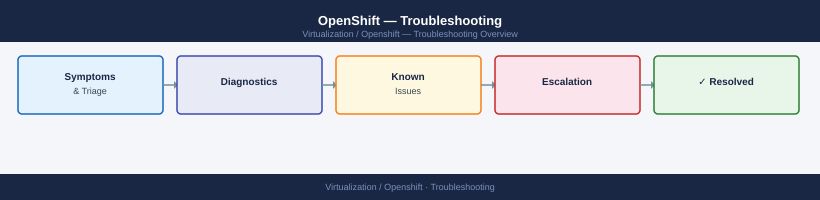
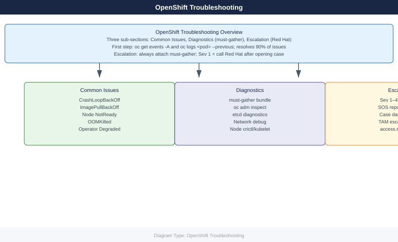
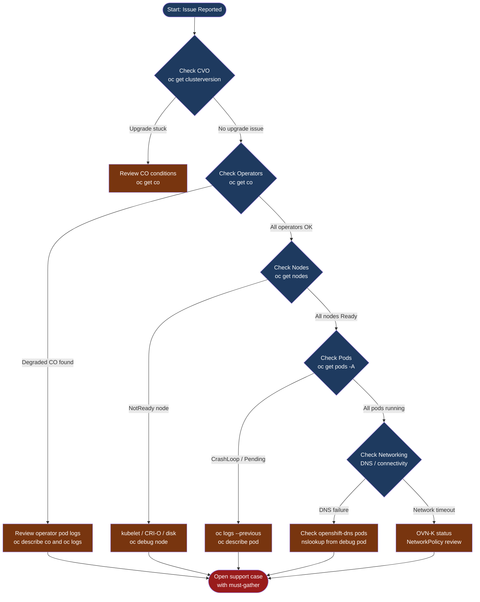

---
tags:
  - troubleshooting
search:
  boost: 1.5
---
# OpenShift — Troubleshooting

<div class="kb-summary">
OpenShift troubleshooting: pod failures, node issues, cluster operator problems, must-gather collection, and Red Hat support escalation.

*Applies to: OpenShift 4.x*
</div>







```d2
direction: down

symptom: Identify Symptom {shape: diamond}
subpage_index: "Sub-Page Index" {shape: rectangle}
resolution: Resolve or Escalate {shape: oval}

symptom -> subpage_index: investigate
subpage_index -> resolution
```

## Sub-Page Index

| Symptom | Go To |
|---|---|
| CrashLoopBackOff, ImagePullBackOff, Pending, OOMKilled, node NotReady, operator Degraded | [Common Issues](common-issues/) |
| Collecting must-gather, etcd diagnostics, network traces, node-level logs | [Diagnostics](diagnostics/) |
| Opening a Red Hat support case, SOS report, severity levels, escalation path | [Escalation](escalation/) |

<div class="kb-grid">
  <a class="kb-card" href="common-issues/">
    <span class="kb-card-title">Common Issues</span>
    <span class="kb-card-desc">CrashLoopBackOff, ImagePullBackOff, node NotReady, pending pods, OOMKilled, etcd latency, DNS failures</span>
  </a>
  <a class="kb-card" href="diagnostics/">
    <span class="kb-card-title">Diagnostics</span>
    <span class="kb-card-desc">must-gather, oc adm inspect, Prometheus queries, OVN flow trace, log collection, etcd diagnostics</span>
  </a>
  <a class="kb-card" href="escalation/">
    <span class="kb-card-title">Escalation</span>
    <span class="kb-card-desc">Red Hat support case process, SOS report, severity levels, KCS solutions, escalation path</span>
  </a>
</div>
