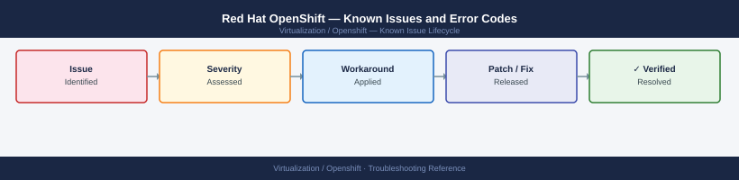

---
tags:
  - troubleshooting
  - openshift
  - kubernetes
  - known-issues
---
# Red Hat OpenShift — Known Issues and Error Codes

<div class="kb-summary">
Catalog of known OpenShift bugs, error codes, and workarounds covering cluster operators, OVN-Kubernetes networking, image registry, and upgrade issues.

*Applies to: OpenShift Container Platform 4.12–4.16*
</div>



```d2
direction: down

symptom: Identify Symptom {shape: diamond}
cluster_operators: "Cluster Operators" {shape: rectangle}
networking_ovnkubernetes: "Networking (OVN-Kubernetes)" {shape: rectangle}
image_registry_and_builds: "Image Registry and Builds" {shape: rectangle}
upgrades: "Upgrades" {shape: rectangle}
resolution: Resolve or Escalate {shape: oval}

symptom -> cluster_operators: investigate
symptom -> networking_ovnkubernetes: investigate
symptom -> image_registry_and_builds: investigate
symptom -> upgrades: investigate
cluster_operators -> resolution
networking_ovnkubernetes -> resolution
image_registry_and_builds -> resolution
upgrades -> resolution
```

## Before you begin

- Check all cluster operator status: `oc get co` — any `Degraded=True` blocks upgrades.
- `oc adm must-gather` collects all diagnostic data for Red Hat support.
- Cluster upgrade fails are almost always due to a degraded operator or certificate issue.

## Cluster Operators

| Error / Symptom | Affected Versions | Cause | Workaround / Fix | Fixed In |
|---|---|---|---|---|
| `authentication` operator degraded after certificate rotation | OCP 4.12+ | OAuth server certificate not trusted after rotation | Re-approve CSRs: `oc get csr | grep Pending | oc certificate approve` | N/A |
| `kube-apiserver` operator degraded: `revision stuck` | OCP 4.12+ | API server rollout blocked by unhealthy etcd pod | Check etcd pod health: `oc get pods -n openshift-etcd`; restart failed etcd pod | N/A |
| `machine-config` operator degraded after node change | OCP 4.x | MachineConfig pool not rendered cleanly | Check MCO: `oc describe mcp worker`; look for config render errors | N/A |

## Networking (OVN-Kubernetes)

| Error / Symptom | Affected Versions | Cause | Workaround / Fix | Fixed In |
|---|---|---|---|---|
| Pod-to-pod traffic fails across nodes | OCP 4.12+ | OVN-Kubernetes Geneve (UDP 6081) blocked between nodes | Verify UDP 6081 open on all node NICs and any intermediate firewalls | N/A |
| Service ClusterIP unreachable from pods | OCP 4.x | OVN flow tables out of sync | Restart `ovnkube-node` DaemonSet on affected node: `oc delete pod -n openshift-ovn-kubernetes -l app=ovnkube-node --field-selector=spec.nodeName=<node>` | N/A |

## Image Registry and Builds

| Error / Symptom | Affected Versions | Cause | Workaround / Fix | Fixed In |
|---|---|---|---|---|
| `image-registry` operator degraded — storage not available | OCP 4.x | No persistent storage configured for internal registry | Configure PVC or S3 storage for registry: `oc patch configs.imageregistry.operator.openshift.io/cluster --patch '{"spec":{"storage":{"pvc":{"claim":""}}}}' --type=merge` | N/A |
| Build fails: `ImagePullBackOff` from internal registry | OCP 4.x | Registry service cert not trusted by node | Approve pending node CSRs; verify cluster CA trust bundle | N/A |

## Upgrades

| Error / Symptom | Affected Versions | Cause | Workaround / Fix | Fixed In |
|---|---|---|---|---|
| Upgrade stuck at 10% — `machine-config` not applied | OCP 4.x | Worker node reboot loop during MCO config application | Check node: `oc debug node/<node>`; inspect `/var/log/messages` for boot failure | N/A |
| `oc adm upgrade` blocked: `Upgradeable=False` | OCP 4.x | Cluster operator reporting blocker condition | `oc get co`; investigate the Degraded operator; resolve before proceeding | N/A |

## See also

- [OpenShift — Common Issues](../common-issues/)
