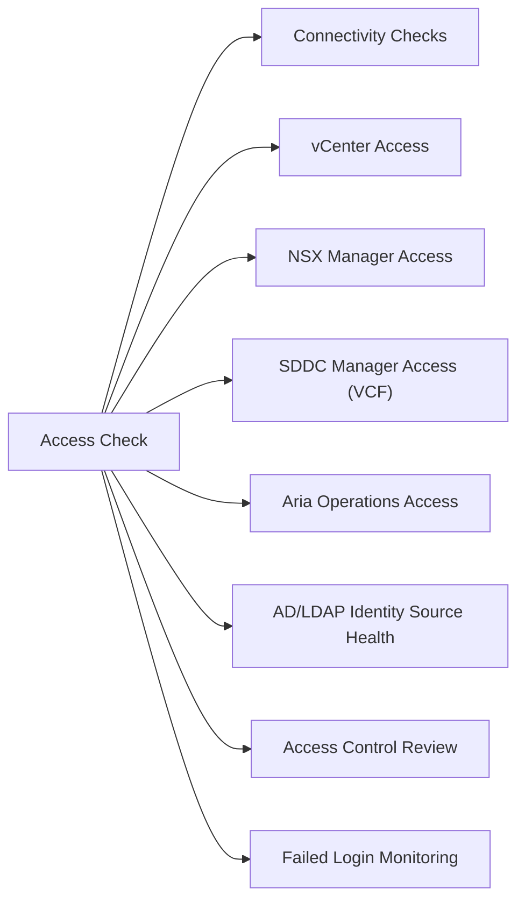

# Management Access Check

Run this check weekly to confirm all management endpoints are reachable and access controls are healthy.



## Connectivity Checks

```bash
# Verify DNS resolution for management FQDNs
for fqdn in vcenter.corp.local nsx.corp.local sddc-manager.corp.local aria-ops.corp.local; do
    result=$(nslookup $fqdn 2>/dev/null | grep "Address:" | tail -1)
    echo "$fqdn → $result"
done

# Verify HTTPS reachability
for url in https://vcenter.corp.local https://nsx.corp.local; do
    code=$(curl -sk -o /dev/null -w "%{http_code}" "$url")
    echo "$url → HTTP $code"
done
```

## vCenter Access

```powershell
# Verify vCenter login (PowerCLI)
Connect-VIServer -Server vcenter.corp.local -Credential $cred
if ($?) { Write-Host "vCenter: OK" } else { Write-Host "vCenter: FAIL" }

# Check vCenter certificate validity
$cert = [System.Net.ServicePointManager]::ServerCertificateValidationCallback
$expiry = (Invoke-WebRequest -Uri "https://vcenter.corp.local" -UseBasicParsing).Headers
```

Checks to perform in vCenter UI:
- [ ] vCenter SSO Health: Administration → Single Sign On → Diagnostics → Diagnostic Site Connectivity
- [ ] Identity sources: Administration → Single Sign On → Configuration → Identity Sources — all should show Connected
- [ ] System health: Administration → Deployments → System Configuration — all services green

## NSX Manager Access

```bash
# Verify NSX Manager cluster health (SSH to NSX Manager)
get cluster status   # Should show: STABLE
get services         # All critical services should show: running
```

## SDDC Manager Access (VCF)

```bash
# SDDC Manager API health check
curl -k -u admin@local:password https://sddc-manager.corp.local/v1/health-summary | python3 -m json.tool
```

## Aria Operations Access

Confirm Aria Ops is receiving telemetry:
1. Log in to `https://aria-ops.corp.local`
2. Environment → Object Browser → confirm vCenter adapter shows `Collection State: OK`
3. Check last collection time — should be within the last 5 minutes

## AD/LDAP Identity Source Health

```bash
# Test LDAP connectivity (run from a Linux admin host)
ldapsearch -H ldaps://dc1.corp.local:636 -D "cn=svc_vcenter,ou=service_accounts,dc=corp,dc=local" \
    -w '<password>' -b "dc=corp,dc=local" "(sAMAccountName=admin)" sAMAccountName
# Should return at least one result
```

## Access Control Review

Run monthly (in addition to weekly connectivity checks):

- [ ] Review stale user accounts: Administration → Users and Groups — remove leavers
- [ ] Review service account usage: confirm all service accounts still needed
- [ ] Verify MFA is enforced for admin console access (via SSO policy or Workspace ONE Access)
- [ ] Review vCenter role assignments: Administration → Access Control → Roles
- [ ] Confirm no direct permission grants to individual users (should be via group memberships)
- [ ] Check break-glass accounts: password still in vault; access log reviewed

## Failed Login Monitoring

```bash
# Check vCenter SSO audit log for failed logins
# /storage/log/vmware/sso/vmware-sts-idmd.log on vCenter appliance
grep "AuthenticationException\|failed.*login\|InvalidCredentials" /var/log/vmware/sso/vmware-sts-idmd.log | tail -20
```

Alert on > 5 failed logins for any account in a 15-minute window.
