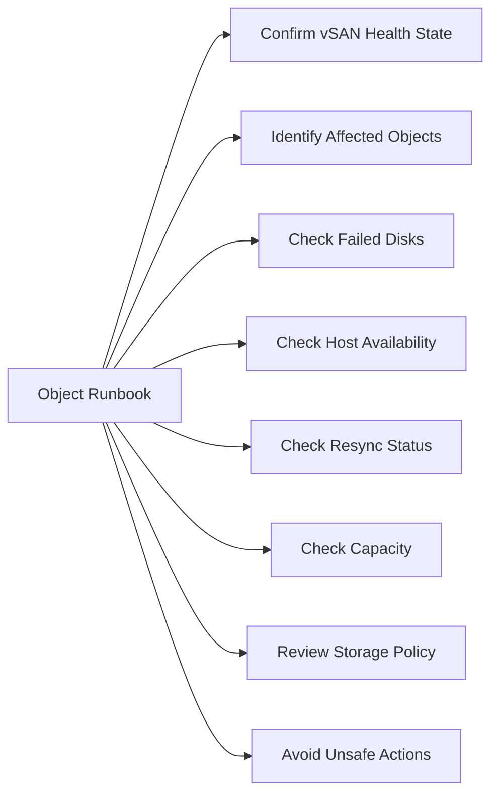

# vSAN Degraded Object Runbook



## Confirm vSAN Health State

- Open vCenter → Cluster → vSAN → Skyline Health
- Identify which health checks are failing
- Open Virtual Objects view and filter by Degraded, Non-compliant, or Absent

## Identify Affected Objects

- Note the VM name, object type, and storage policy for each affected object
- Check if the VM is still running or if it has failed

## Check Failed Disks

- Review Skyline Health → Physical Disk section
- Check iDRAC for disk health on all VxRail nodes

## Check Host Availability

- Confirm all hosts are Connected in vCenter
- Check if any host is in maintenance mode unexpectedly

## Check Resync Status

```bash
esxcli vsan debug resync summary get
```

Active resync is expected after a host returns from maintenance — wait for it to complete before taking further action.

## Check Capacity

- Confirm vSAN usable capacity is within safe limits
- If capacity is the cause of non-compliance, expansion may be needed

## Review Storage Policy

- Confirm the storage policy assigned to affected objects is achievable with current cluster state
- If FTT=1 and only one host or disk is available, the policy cannot be met

## Avoid Unsafe Actions

- Do not take additional hosts into maintenance mode while objects are degraded
- Do not delete VMs or disks without VMware support guidance

## Engage VMware Support

- Collect a vSAN support bundle if objects remain degraded after the expected recovery period
- Open a VMware support case and provide the bundle, timeline, and Skyline Health screenshots

## Validate Object Compliance After Recovery

- Return to Virtual Objects view and confirm all objects are Healthy
- Run Skyline Health and confirm no remaining failures
