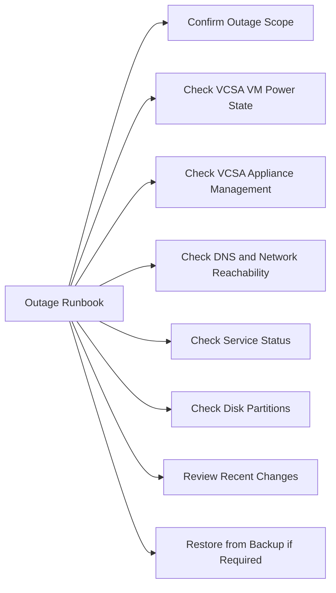

# vCenter Outage Runbook



## Confirm Outage Scope

- Can you access the vSphere Client?
- Can you ping the vCenter FQDN and IP?
- Are ESXi hosts still visible and running workloads independently?

## Check VCSA VM Power State

- Confirm the VCSA VM is powered on in vCenter (if a secondary vCenter is available)
- Or verify via iDRAC/IPMI if the VCSA is running on a known host

## Check VCSA Appliance Management

- Access `https://<vcenter>:5480`
- Review service health, disk partitions, and CPU/memory

## Check DNS and Network Reachability

```bash
ping <vcenter-ip>
nslookup <vcenter-fqdn>
```

## Check Service Status

```bash
# SSH to vCenter appliance
service-control --status
```

## Check Disk Partitions

```bash
df -h
```

Partitions that commonly cause failures when full:
- `/storage/log`
- `/storage/db`

## Review Recent Changes

- Was a certificate recently replaced?
- Was a patch or upgrade recently applied?
- Was a snapshot taken or deleted on the VCSA VM?

## Restore from Backup if Required

- Use the vCenter file-based backup (VAMI → Backup)
- Confirm the backup date and restore target
- Follow VMware restore documentation

## Validate Services After Recovery

- Confirm all services are running: `service-control --status`
- Confirm vSphere Client is accessible
- Confirm all hosts are reconnecting
- Confirm Aria and other integrations are working

## Communicate Impact

- Notify stakeholders of the outage and recovery status
- Note that ESXi hosts and VMs continue running without vCenter
- Update the incident ticket with timeline and resolution
