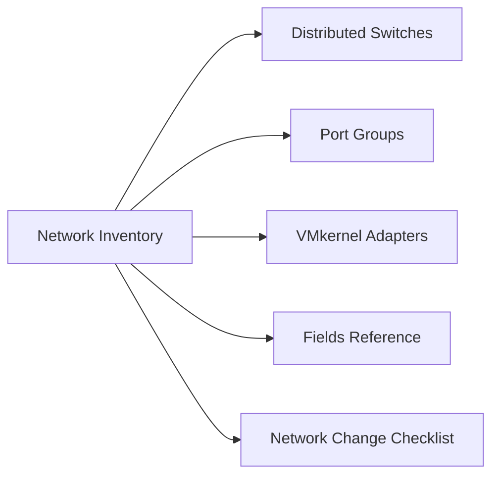

# Network Inventory

> Part of the [Inventory](../) reference.

---

## Overview

Document all virtual networking components in the vSphere environment — distributed switches, port groups, VLANs, MTU settings, and uplink assignments. Update after any network configuration change.

## Distributed Switches

| vDS Name | vCenter | Hosts | Version | MTU | Uplink Count | Uplink Speed | Notes |
|---|---|---|---|---|---|---|---|
| vds-prod-compute-01 | vcsa-prod-01 | 8 | 8.0 | 9000 | 4 | 25 GbE | Production compute vDS |
| vds-prod-edge-01 | vcsa-prod-01 | 4 | 8.0 | 1500 | 2 | 25 GbE | NSX edge cluster vDS |
| vds-prod-mgmt-01 | vcsa-prod-01 | 3 | 8.0 | 9000 | 2 | 25 GbE | Management cluster vDS |

## Port Groups

| Port Group Name | vDS | VLAN | MTU | Purpose | Hosts |
|---|---|---|---|---|---|
| pg-1001-prod-vm | vds-prod-compute-01 | 1001 | 1500 | Production VM traffic | All compute hosts |
| pg-1002-vmotion | vds-prod-compute-01 | 1002 | 9000 | vMotion VMkernel | All compute hosts |
| pg-1003-vsan | vds-prod-compute-01 | 1003 | 9000 | vSAN VMkernel | All compute hosts |
| pg-1004-mgmt | vds-prod-compute-01 | 1004 | 1500 | Host management VMkernel | All compute hosts |
| pg-1005-nsx-overlay | vds-prod-compute-01 | Trunk | 9000 | NSX overlay (GENEVE) | All compute hosts |
| pg-1010-iscsi-a | vds-prod-compute-01 | 1010 | 9000 | iSCSI path A VMkernel | Applicable hosts |
| pg-1011-iscsi-b | vds-prod-compute-01 | 1011 | 9000 | iSCSI path B VMkernel | Applicable hosts |

## VMkernel Adapters

| Host | Adapter | IP Address | Netmask | VLAN | Services |
|---|---|---|---|---|---|
| esx-prod-01 | vmk0 | 10.10.10.11 | 255.255.255.0 | 1004 | Management |
| esx-prod-01 | vmk1 | 10.10.11.11 | 255.255.255.0 | 1002 | vMotion |
| esx-prod-01 | vmk2 | 10.10.12.11 | 255.255.255.0 | 1003 | vSAN |
| esx-prod-01 | vmk3 | 10.10.13.11 | 255.255.255.0 | 1005 | NSX Overlay (TEP) |

## Fields Reference

| Field | Description |
|---|---|
| vDS Name | Distributed switch name — follows `vds-<site>-<cluster>-<##>` |
| Version | vSphere Distributed Switch version |
| MTU | Maximum transmission unit (1500 for VM traffic, 9000 for storage/vSAN/vMotion) |
| Uplink Count | Number of physical NICs per host connected to this vDS |
| VLAN | 802.1Q VLAN tag, or VLAN range for trunk port groups |
| Services | VMkernel service tags (Management, vMotion, vSAN, Provisioning, NFC) |

## Network Change Checklist

Before any vDS or port group change:

- [ ] Change approved in change management system
- [ ] Rollback plan documented (teaming and failover order captured)
- [ ] Test on one host before rolling out cluster-wide
- [ ] Verify vMotion and vSAN connectivity after change
- [ ] Verify VM network connectivity on representative VMs
- [ ] Inventory updated post-change
