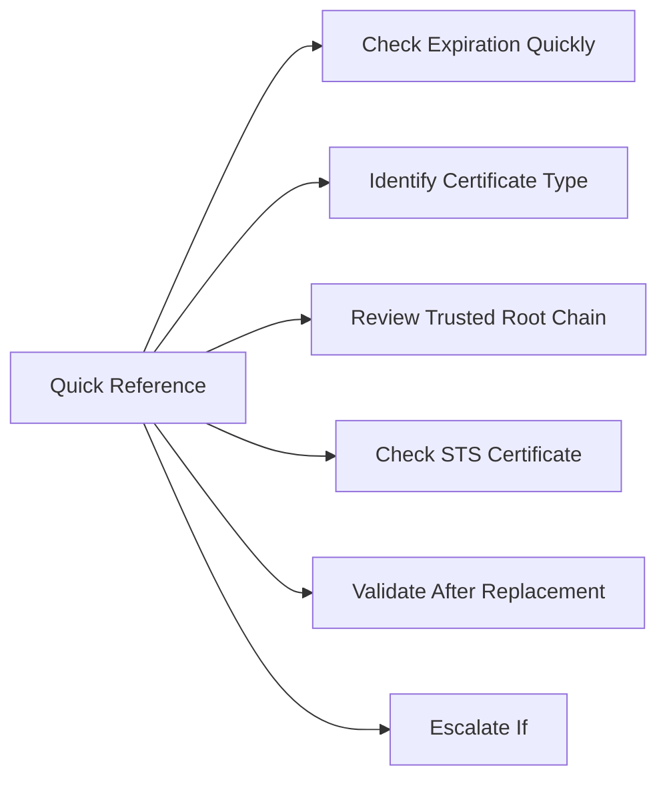

# VMware Certificate Quick Reference



## Check Expiration Quickly

In vCenter Appliance Management (VAMI) at `https://<vcenter>:5480`:
- Navigate to **Certificate Management**
- Review all certificate expiration dates

## Identify Certificate Type

| Symptom | Likely Certificate |
|---|---|
| Browser warning on vCenter | Machine SSL certificate |
| Login fails for all users | STS certificate |
| Product integration broken | Trusted root or endpoint cert |
| NSX UI unreachable | NSX Manager certificate |
| Aria product unreachable | Aria endpoint certificate |

## Review Trusted Root Chain

- Confirm the issuing CA root certificate is trusted by vCenter
- If a custom CA is used, confirm both root and intermediate are imported

## Check STS Certificate

```bash
# SSH to vCenter
/usr/lib/vmware-vmafd/bin/vecs-cli entry list --store TRUSTED_ROOTS
```

## Validate After Replacement

- Browser access to vCenter — no certificate warning
- SSO login working for local and AD accounts
- All hosts Connected
- Integrations working (Aria, NSX, backup)
- Document new expiration date

## Escalate If

- vCenter services fail after certificate replacement
- STS cannot be recovered in place
- Certificate replacement causes SSO token failures
