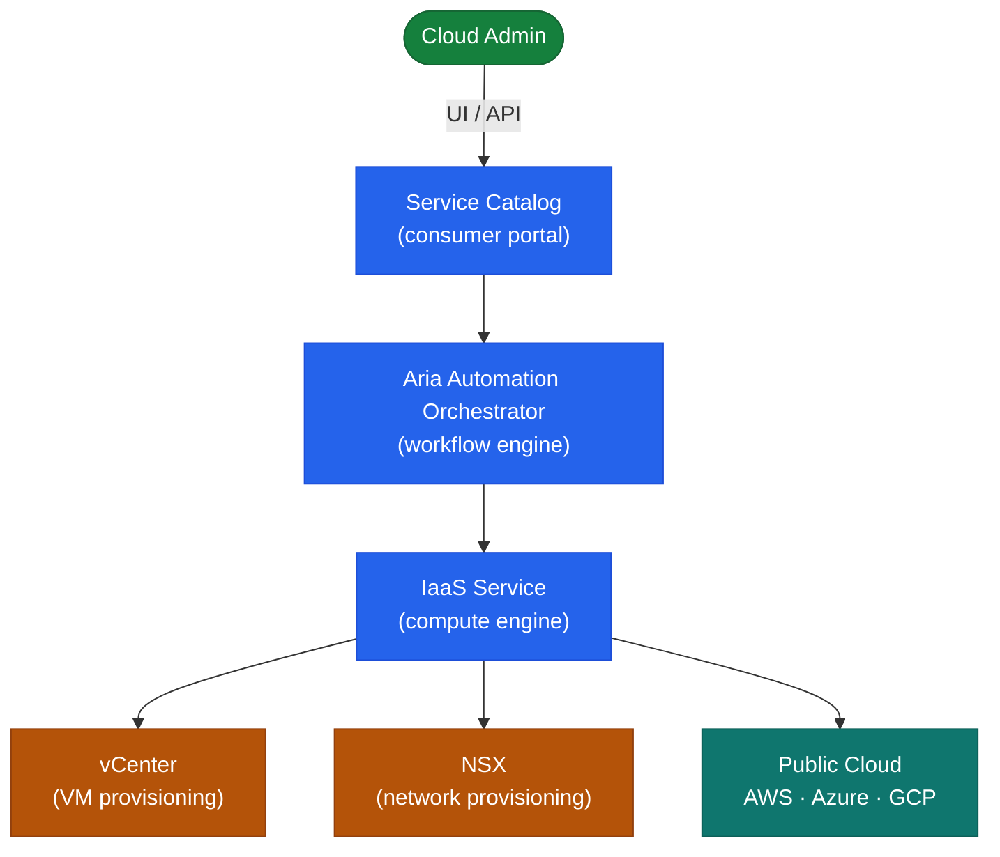

# Aria Automation — How It Works


<div class="kb-summary">
How It Works reference covering Overview, Deployment Models, Cluster Topology, Cloud Account Types, Appliance Sizing and 2 more sections.
</div>

## Overview

Aria Automation (formerly vRealize Automation) is available as a **SaaS offering** or an **on-premises appliance cluster**. The on-premises deployment is a Kubernetes-based microservices platform. All infrastructure provisioning flows through cloud templates (YAML IaC), projects, and cloud zones — Aria Automation resolves placement constraints and orchestrates provisioning without hardcoded infrastructure references.

## Deployment Models

| Model | Description |
|---|---|
| SaaS (Cloud) | VMware-hosted; no infrastructure to manage; connected via cloud extensibility proxy |
| On-Premises | 1 or 3 appliance cluster; self-managed; supports air-gap environments |

## Cluster Topology


```
┌─────────────────────────────────── Aria Automation — How It Works ────────────────────────────────────┐
│                                                                                                       │
│  Cloud-agnostic self-service automation via blueprints, cloud templates, and resource orchestration.  │
│                                                                                                       │
│   ┌──────────────────────────────────────────────┐  ┌─────────────────────────────────────────────┐   │
│   │       Service Portal (Consumer layer)        │  │            Designer / Admin layer           │   │
│   │     Self-service catalog of deployments      │  │       Cloud templates (YAML/drag-drop)      │   │
│   │      Request → approval → provisioning       │  │     Blueprints define topology + inputs     │   │
│   │    Day-2 actions: resize/snapshot/delete     │  │       Policies: cost, network, storage      │   │
│   │   Role: consumer sees only entitled items    │  │      Projects isolate teams and quotas      │   │
│   └──────────────────────────────────────────────┘  └─────────────────────────────────────────────┘   │
│                                                                                                       │
│  Approved requests flow to the orchestration engine which calls cloud account APIs.                   │
│                                                                                                       │
│                          ▼                                                 ▼                          │
│                                                                                                       │
│   ┌──────────────────────────────────────────────┐  ┌─────────────────────────────────────────────┐   │
│   │             Orchestration Engine             │  │          Cloud Accounts / Endpoints         │   │
│   │       Workflow runs: Aria Orchestrator       │  │      vSphere, AWS, Azure, GCP accounts      │   │
│   │       ABX extensibility actions (FaaS)       │  │        NSX-T for network provisioning       │   │
│   │       Resource lifecycle state machine       │  │       vCenter clusters and datastores       │   │
│   │        Event broker for async events         │  │        Terraform provider integration       │   │
│   └──────────────────────────────────────────────┘  └─────────────────────────────────────────────┘   │
│                                                                                                       │
│  Physical Infrastructure (the hardware everything above runs on):                                     │
│  Linux VMs (vRA appliances) · vCenter hosts · DNS · LDAP/AD · NTP · TLS certificates                  │
│                                                                                                       │
│  Key terms:                                                                                           │
│                                                                                                       │
│  Cloud template    = YAML descriptor defining resources, inputs, and conditions for a deployment      │
│  Blueprint         = Older term for cloud template; still used in vRA 8.x UI and docs                 │
│  Project           = Tenant boundary in vRA; owns cloud accounts, members, and quotas                 │
│  Catalog item      = Versioned cloud template published to the service catalog for consumers          │
│  ABX action        = Action-Based Extensibility; serverless function triggered by vRA events          │
│  Aria Orchestrator = Workflow engine embedded in vRA; executes complex multi-step automations         │
│  Day-2 action      = Post-deployment operation (resize, snapshot, decommission) on a resource         │
│  Cloud account     = vRA connection to an infrastructure endpoint (vCenter, AWS, Azure)               │
│  Deployment        = Running instance of a provisioned cloud template with tracked lifecycle          │
│  Approval policy   = Governance rule requiring human sign-off before provisioning proceeds            │
│  Terraform config  = HCL workspace managed by vRA IaaC integration for Terraform providers            │
│  Event subscription= vRA event broker rule mapping resource event to ABX action or workflow           │
│                                                                                                       │
└───────────────────────────────────────────────────────────────────────────────────────────────────────┘
```

## Cloud Account Types

| Cloud Account | Managed Resources |
|---|---|
| vCenter (vSphere) | VMs, networks, datastores, clusters |
| NSX-T | Overlay segments, security groups, load balancers |
| AWS | EC2, VPC, S3 |
| Azure | VMs, VNets, storage |
| GCP | Compute Engine, VPC |
| Kubernetes | Pod deployments, services |

## Appliance Sizing

| Size | vCPUs | RAM | Disk | Deployments/day |
|---|---|---|---|---|
| Small (1 node) | 8 | 32 GB | 100 GB | Up to 100 |
| Medium (3 nodes) | 16 per node | 48 GB per node | 100 GB per node | Up to 500 |
| Large (3 nodes) | 24 per node | 64 GB per node | 150 GB per node | 500+ |

## Network Ports

| Port | Protocol | Direction | Purpose |
|---|---|---|---|
| 443 | TCP | Inbound | Web UI and REST API |
| 22 | TCP | Inbound | SSH admin access |
| 5480 | TCP | Inbound | VAMI appliance management |
| 443 | TCP | Outbound | vCenter, NSX, Orchestrator, VIDM APIs |
| 5432 | TCP | Cluster-internal | PostgreSQL replication |
| 5671/5672 | TCP | Cluster-internal | RabbitMQ messaging |

## Event Broker Topics (ABX / Extensibility)

| Event Topic | When It Fires |
|---|---|
| `Deployment.Provision.Post` | After all resources provisioned successfully |
| `Deployment.Provision.Pre` | Before provisioning (use for validation) |
| `Deployment.Destroy.Post` | After deployment deleted |
| `Deployment.Resize.Post` | After a VM resize Day-2 action |
