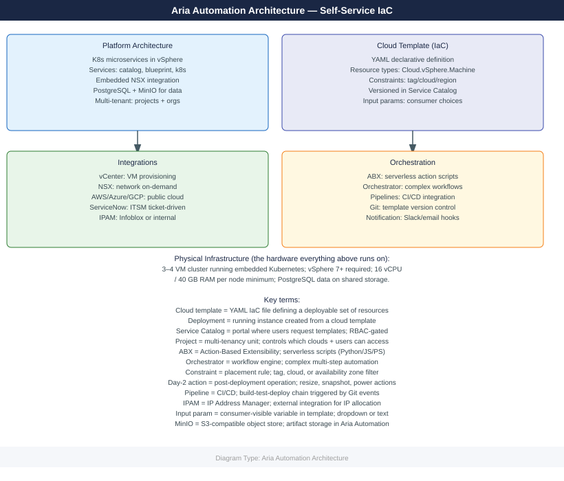
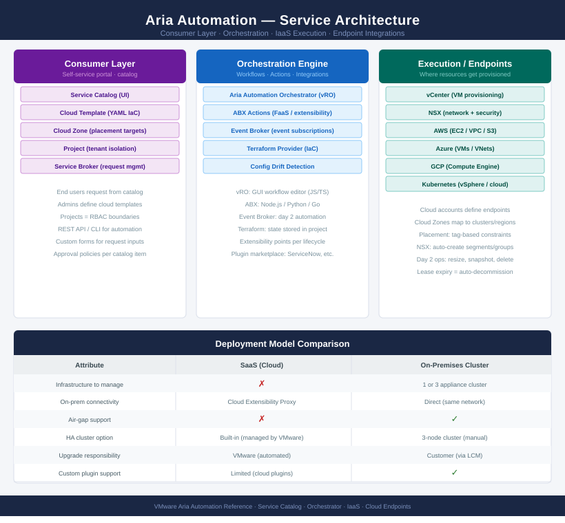

---
tags:
  - architecture
  - aria-automation
  - vmware
---
# Aria Automation — Architecture

<div class="kb-summary">
Kubernetes-based microservices platform for infrastructure self-service automation. Cloud templates (YAML IaC) define resources declaratively; Aria Automation resolves placement and orchestrates provisioning across vSphere, NSX, and public cloud.

*Applies to: Aria Automation 8.x*
</div>




<div class="kb-grid kb-grid-3">
<a class="kb-card" href="how-it-works/"><strong>How It Works</strong><span>How it works, integrations, and design standards.</span></a>
<a class="kb-card" href="integrations/"><strong>Integrations</strong><span>Integration with vCenter, NSX, cloud providers, and external tools.</span></a>
<a class="kb-card" href="design-standards/"><strong>Design Standards</strong><span>Sizing guidelines, HA design, and configuration best practices.</span></a>
</div>

```d2
direction: right

center: "Aria Automation" {shape: hexagon}
deployment_models: "Deployment Models" {shape: rectangle}

center -> deployment_models
```

## Deployment Models

| Model | Description |
|---|---|
| SaaS (Cloud) | VMware-hosted; no infrastructure to manage; connected via cloud extensibility proxy |
| On-Premises | 1 or 3 appliance cluster; self-managed; supports air-gap environments |

