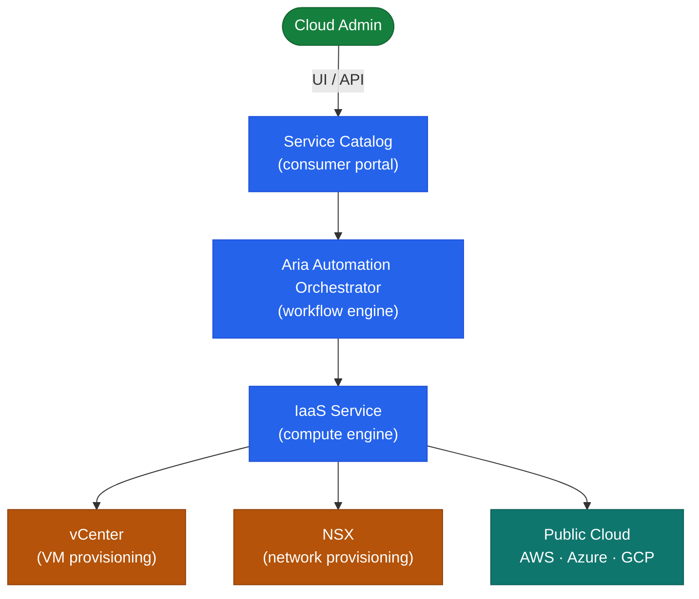

# Aria Automation — Architecture Overview

## Overview

Aria Automation (formerly vRealize Automation) is available as a **SaaS offering** or as an **on-premises appliance cluster**. The on-premises deployment is an appliance-based Kubernetes platform running microservices.

## Deployment Models

| Model | Description |
|-------|-------------|
| SaaS (Cloud) | VMware-hosted; no infrastructure to manage; connected via cloud extensibility proxy |
| On-Premises | One or three appliance cluster; self-managed; supports air-gap environments |

## On-Premises Cluster Topology



## Single-Node vs. Cluster

| Attribute | Single Node | 3-Node Cluster |
|-----------|-------------|----------------|
| HA | No — single point of failure | Yes — quorum-based HA |
| Use case | Lab / non-prod | Production |
| Load balancer | Not required | Required (VIP in front of 3 nodes) |

---

## Core Service Architecture

Aria Automation runs microservices inside a Kubernetes cluster embedded within the appliance. Each service is independently scalable and deployable, which is why the on-premises deployment behaves differently from a traditional monolithic appliance.

Key services and their roles:

| Service | Purpose |
|---|---|
| **Automation Assembler** | Cloud template (blueprint) authoring and resource provisioning — the IaC engine |
| **Service Broker** | Self-service catalog portal — exposes approved templates to end users via projects |
| **Event Broker** | Internal event bus — routes lifecycle events (VM created, deployment updated) to subscriptions |
| **Orchestrator (embedded vRO)** | Workflow engine for Day-2 operations, approval routing, and complex automation chains |
| **Automation Pipelines** | CI/CD pipeline engine — triggers deployments from Git events, runs tests, and promotes across environments |
| **PostgreSQL** | Relational database storing deployment state, catalog definitions, event log, and pipeline data |
| **RabbitMQ** | Internal async messaging between microservices |
| **Kubernetes** | Container orchestration — manages pod lifecycle, health, and restart for all microservices |
| **Nginx / Envoy** | Ingress proxy handling HTTPS routing and load balancing between microservice endpoints |

---

## Cloud Templates (Blueprints)

Cloud templates are the core IaC artifact in Aria Automation. They are written in YAML and define infrastructure resources declaratively. A template describes what to deploy — Aria Automation determines how to deploy it based on the cloud account, cloud zone, and network/storage profile configuration.

**Minimal template example:**

```yaml
formatVersion: 1
inputs:
  vmName:
    type: string
    title: VM Name
    default: web-server-01
  flavorSize:
    type: string
    title: Size
    enum: [small, medium, large]
    default: small

resources:
  Cloud_vSphere_Machine_1:
    type: Cloud.vSphere.Machine
    properties:
      name: ${input.vmName}
      image: rhel9-gold
      flavor: ${input.flavorSize}
      constraints:
        - tag: env:prod
      networks:
        - network: ${resource.Cloud_Network_1.id}
          assignment: static

  Cloud_Network_1:
    type: Cloud.vSphere.Network
    properties:
      networkType: existing
      constraints:
        - tag: net:server-vlan
```

Key template concepts:
- `inputs`: parameters presented to the user in the catalog request form
- `resources`: infrastructure objects to provision (VMs, networks, disks, NSX segments)
- `constraints`: tag-based selectors that control placement without hardcoding cloud zones or datastores
- `${resource.X.property}`: cross-resource references — Aria Automation resolves dependency order automatically

---

## Extensibility: ABX and Event Broker

**Action-Based Extensibility (ABX)** allows Python, Node.js, or PowerShell scripts to execute in response to deployment lifecycle events. ABX actions run in an isolated FaaS-style execution environment within the Aria Automation appliance (or optionally in AWS Lambda / Azure Functions for SaaS deployments).

**Event Broker subscriptions** wire lifecycle events (topics) to ABX actions or Orchestrator workflows:

| Event Topic | When It Fires |
|---|---|
| `Deployment.Provision.Post` | After all resources are provisioned successfully |
| `Deployment.Provision.Pre` | Before provisioning begins (use for validation) |
| `Deployment.Destroy.Post` | After a deployment is deleted |
| `Deployment.Resize.Post` | After a VM resize Day-2 action |

Example use cases:
- Notify a Slack channel when a production deployment succeeds
- Register the new VM in a CMDB (ServiceNow) after provisioning
- Run an Ansible playbook post-provisioning for OS hardening
- Validate input constraints before provisioning begins (pre-subscription with reject capability)

---

## Projects and Cloud Zones

**Projects** are the primary isolation and governance boundary:

- Each team or business unit maps to one or more projects
- Cloud zones (vCenter clusters/datastores/networks) are assigned per project — teams can only deploy to their allocated infrastructure
- CPU, memory, and VM count quotas are set per project to prevent runaway provisioning
- Catalog items are shared to specific projects — users only see what is approved for their project

**Cloud zones** define the physical infrastructure available for provisioning:

```
Infrastructure → Cloud Zones → New Cloud Zone
```

A cloud zone maps to:
- A cloud account (vCenter, NSX, AWS, Azure)
- A datacenter/region and optionally a cluster or resource pool
- Tag-based placement constraints for fine-grained control

A project can have multiple cloud zones with different priorities — Aria Automation selects the highest-priority zone that satisfies the template's placement constraints.

---

## Day-2 Actions

Day-2 actions are post-deployment operations that modify or interact with a provisioned deployment. They are defined by the template resources and exposed through the catalog to deployment owners.

Built-in Day-2 actions (vSphere):

| Action | What It Does |
|---|---|
| Power On / Off / Reset | VM power management |
| Snapshot | Create a vSphere snapshot of the deployment VMs |
| Resize | Change CPU and memory (may require reboot) |
| Scale Out | Add additional VMs to a multi-VM deployment |
| Delete | Destroy the deployment and all its resources |
| Change Lease | Extend or reduce the deployment lease expiry |

Custom Day-2 actions are implemented as Orchestrator workflows or ABX actions and surfaced in the catalog via resource action definitions.

---

## Load Balancer Requirement (3-Node Production)

A 3-node Aria Automation cluster requires an external load balancer (hardware appliance or NSX load balancer) presenting a single VIP to users and API clients. All three nodes are active — the load balancer distributes traffic across them.

Requirements:
- Layer 4 (TCP) or Layer 7 (HTTPS) load balancer
- VIP FQDN must be the primary FQDN for the Aria Automation certificate (SAN must include all node FQDNs and the VIP FQDN)
- Health check: `GET https://<node>:443/vco/api/health` — HTTP 200 indicates node is healthy
- Persistence: session persistence is not required — Aria Automation is stateless for API requests

```
Load Balancer VIP: vra-prod.corp.local (10.0.1.50)
  → vra-prod-01.corp.local (10.0.1.51)
  → vra-prod-02.corp.local (10.0.1.52)
  → vra-prod-03.corp.local (10.0.1.53)
```

---

## Terraform Integration

Aria Automation can orchestrate Terraform configurations as part of cloud templates. Terraform integration uses the **Terraform Cloud Template resource type**:

```yaml
resources:
  Terraform_1:
    type: Cloud.Terraform.Configuration
    properties:
      sourceDirectory: /infra/vpc-baseline
      variables:
        region: us-east-1
        vpc_cidr: 10.20.0.0/16
      tfVersion: 1.5.0
      backendConfig: s3://my-tf-state/<deployment-id>
```

Aria Automation manages the Terraform state file lifecycle and passes deployment-context variables (deployment ID, project, requester) to the Terraform configuration. Outputs from Terraform are captured and available as deployment properties for subsequent Day-2 actions.

Supported Terraform providers: any provider available to the Terraform runtime (vSphere, AWS, Azure, GCP, Kubernetes, etc.). The Terraform binary and providers are downloaded from the configured endpoint at deployment time.

---

## In this section

<div class="kb-grid kb-grid-3">
<a class="kb-card" href="components/"><strong>Components</strong><span>Core components, services, and technical specifications.</span></a>
<a class="kb-card" href="integrations/"><strong>Integrations</strong><span>Integration with other platforms and external systems.</span></a>
<a class="kb-card" href="standards/"><strong>Standards</strong><span>Sizing guidelines, design standards, and best practices.</span></a>
</div>
