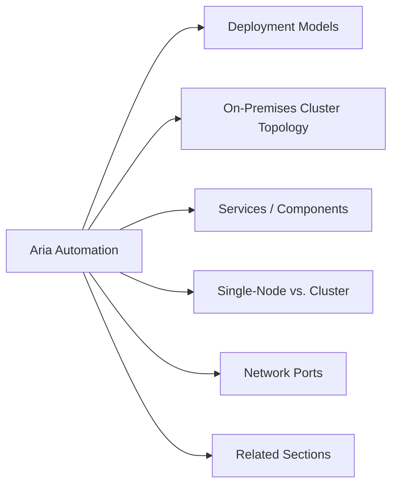

# Aria Automation — Architecture



## Overview

Aria Automation (formerly vRealize Automation) is available as a **SaaS offering** (VMware Aria Automation Cloud) or as an **on-premises appliance cluster**. The on-premises deployment is an appliance-based Kubernetes platform running microservices.

---

## Deployment Models

| Model | Description |
|-------|-------------|
| SaaS (Cloud) | VMware-hosted; no infrastructure to manage; connected via cloud extensibility proxy |
| On-Premises | One or three appliance cluster; self-managed; supports air-gap environments |

---

## On-Premises Cluster Topology

```
┌──────────────────────────────────────────────────────┐
│              Aria Automation Appliance Cluster        │
│                                                      │
│  Node 1 (Primary)  Node 2  Node 3                    │
│  ┌──────────────────────────────────────────────┐    │
│  │  Kubernetes (k8s) — Aria microservices       │    │
│  │  ┌──────────────┐  ┌──────────────────────┐  │    │
│  │  │  Assembler   │  │  Service Broker       │  │    │
│  │  ├──────────────┤  ├──────────────────────┤  │    │
│  │  │  Pipelines   │  │  Config (GitOps)      │  │    │
│  │  └──────────────┘  └──────────────────────┘  │    │
│  │  ┌──────────────┐  ┌──────────────────────┐  │    │
│  │  │  PostgreSQL  │  │  RabbitMQ Messaging   │  │    │
│  │  └──────────────┘  └──────────────────────┘  │    │
│  └──────────────────────────────────────────────┘    │
└──────────────────────────────────────────────────────┘
        │
        ├── vCenter Cloud Account
        ├── NSX Cloud Account
        ├── AWS / Azure / GCP Cloud Accounts
        └── External Git (GitHub / GitLab) — Pipelines SCM
```

---

## Services / Components

| Service | Purpose |
|---------|---------|
| Automation Assembler | Blueprint/template authoring and cloud-agnostic IaC |
| Service Broker | Self-service catalog; exposes content to end users |
| Automation Pipelines | CI/CD pipeline execution (formerly Code Stream) |
| Automation Config | GitOps-based configuration management (formerly SaltStack Config) |
| PostgreSQL | Backend relational database for deployment state |
| RabbitMQ | Internal messaging bus between microservices |

---

## Single-Node vs. Cluster

| Attribute | Single Node | 3-Node Cluster |
|-----------|-------------|----------------|
| HA | No — single point of failure | Yes — quorum-based HA |
| Use case | Lab / non-prod | Production |
| Load balancer | Not required | Required (VIP in front of 3 nodes) |

> A load balancer VIP is required for the 3-node cluster. NSX LB, HAProxy, or an external LB are all supported.

---

## Network Ports

| Port | Protocol | Direction | Purpose |
|------|----------|-----------|---------|
| 443 | TCP | Inbound | UI and API access |
| 443 | TCP | Outbound | vCenter, NSX, cloud accounts |
| 5432 | TCP | Internal | PostgreSQL (inter-node) |
| 5671/5672 | TCP | Internal | RabbitMQ AMQP (inter-node) |
| 8443 | TCP | Internal | Kubernetes API server |

---

## Related Sections

- [Standards](../standards/) — naming conventions and build baseline
- [Lifecycle](../lifecycle/) — upgrade paths
- [Operations](../operations/) — health monitoring
